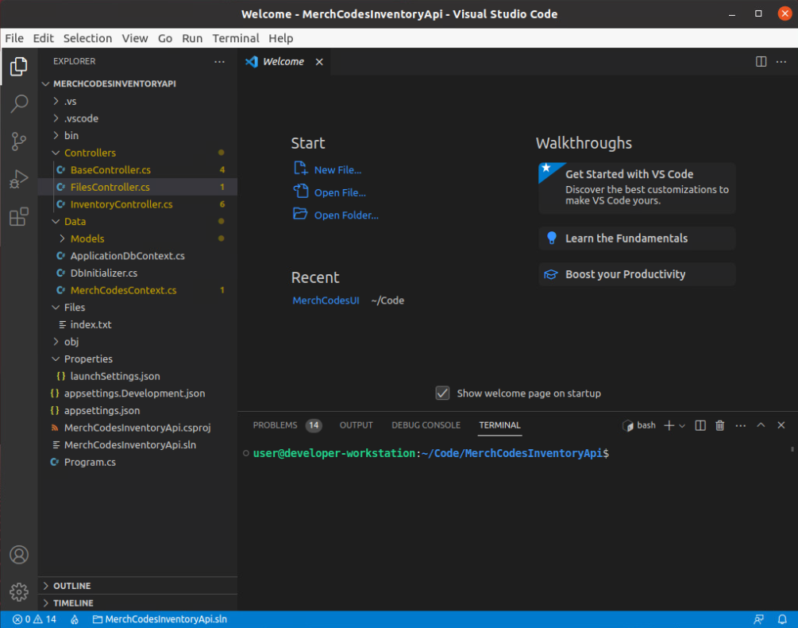

# So Little Code, So Many Problems

*Solution Guide*

## Overview

In this challenge, you need to update the code in a C# ASP.NET Core Web API application to fix the identified bugs and vulnerabilities. 

## Locating the code

1. Log into the `kali` VM.
2. Open Visual Studio Code.
3. Click **File**, **Open Folder**, and navigate to `/home/user/Code/MerchCodesInventoryApi`.
4. Click **Open**. You will now see the solution in the Explorer View.
5. Select the files you wish to view and edit in the code editor window.


## Question 1

*Enter the SQL injection vulnerability token:*

Prevent SQL injection at the `/api/inventory/searchinventory` API endpoint.

1. Open the `Controllers/InventoryController.cs` file.
2. Navigate to the `SearchInventory` method.
  
3. Replace this code...

```c#
List<Inventory> inventoryItems = new List<Inventory>();
            string constr = _configuration.GetConnectionString("DefaultConnection");

            using (NpgsqlConnection con = new NpgsqlConnection(constr))
            {
                string query = "select * from "Inventory" where "Name" like '%" + searchTerm + "%' or "Description" like '%" + searchTerm + "%'";
                using (NpgsqlCommand cmd = new NpgsqlCommand(query))
                {
                    cmd.Connection = con;
                    con.Open();

                    using (NpgsqlDataReader dr = cmd.ExecuteReader())
                    {
                        while (dr.Read())
                        {
                            inventoryItems.Add(new Inventory
                            {
                                Id = dr["Id"].ToString(),
                                Name = dr["Name"].ToString(),
                                Description = dr["Description"].ToString(),
                                Count = Convert.ToInt32(dr["Count"])
                            });
                        }
                    }
                }

                con.Close();
            }
```
...with this code.  

This new code removes the raw sql query, which is vulnerable to SQL injection attacks and replaces it with code utilizing Microsoft's Entity Framework and LINQ (language integrated query). These frameworks provide safe database interaction methods and provide protection against most known SQL injection vulnerabilities.

```c#
var inventoryItems = _context.InventoryItems.Where(i => i.Name.Contains(searchTerm) || i.Description.Contains(searchTerm)).ToList();
```

The new function will look like this:  
  

## Question 2

*Enter the authenticated access to files endpoint token:*

Require authenticated callers on the `/api/files/getfiles` API endpoint.

1. Open the `Controllers/FilesController.cs` file.
2. Navigate to the `GetFiles` method.  
<!--    -->  
3. Replace this code...  

```c#
var filePaths = Directory.GetFiles(Path.GetFullPath(Path.Combine(Environment.CurrentDirectory, "Files")));
List<string> fileNames = new List<string>();

foreach (string filePath in filePaths)
{
    fileNames.Add(Path.GetFileName(filePath));
}

return Json(fileNames.ToList());
```  

...with this code.  

```c#
if (IsUserAuthenticated())
{
    var filePaths = Directory.GetFiles(Path.GetFullPath(Path.Combine(Environment.CurrentDirectory, "Files")));
    List<string> fileNames = new List<string>();

    foreach (string filePath in filePaths)
    {
        fileNames.Add(Path.GetFileName(filePath));
    }

    return Json(fileNames.ToList());
}
else
{
    return Json(Unauthorized());
}
```  

The new function will look like this   


## Question 3

*Enter the file upload validation token:*

Add validation to file uploads at the `/api/files/uploadfile` API endpoint.  

1. Open the `Controllers/FilesController.cs` file.
2. Navigate to the `UploadFile` method.

3. Replace this code...

```c#
try
{
    string path = Path.GetFullPath(Path.Combine(Environment.CurrentDirectory, _configuration.GetValue<string>("FilePath")));

    if (!Directory.Exists(path))
    {
        Directory.CreateDirectory(path);
    }

    using (var fileStream = new FileStream(Path.Combine(path, file.FileName), FileMode.Create))
    {
        file.CopyTo(fileStream);
    }

    return Json(true);
}
catch (Exception exc)
{
    return Json(false);
}
```

...with this code.

```c#
try
{
    if (file.Length > 1000000)
    {
        return Json(false);
    }

    if (file.FileName.EndsWith("exe"))
    {
        return Json(false);
    }

    string path = Path.GetFullPath(Path.Combine(Environment.CurrentDirectory, _configuration.GetValue<string>("FilePath")));

    if (!Directory.Exists(path))
    {
        Directory.CreateDirectory(path);
    }

    using (var fileStream = new FileStream(Path.Combine(path, file.FileName), FileMode.Create))
    {
        file.CopyTo(fileStream);
    }

    return Json(true);
}
catch (Exception exc)
{
    return Json(false);
}
```  

The new function will look like this  


## Question 4

*Enter the XSS vulnerability token*

HTML encode data returned from the `/api/inventory/getinventoryitems` API endpoint.

1. Open the `Controllers/InventoryController.cs` file.
2. Navigate to the `GetInventoryItems` method.

3. Replace this code...

```c#
List<Inventory> inventoryItems = _context.InventoryItems.ToList();

return Json(inventoryItems);
```

...with this code.

```c#
List<Inventory> inventoryItems = _context.InventoryItems.ToList();

foreach (Inventory item in inventoryItems)
{
    item.Name = HtmlEncoder.Default.Encode(item.Name);
    item.Description = HtmlEncoder.Default.Encode(item.Description);
}

return Json(inventoryItems);
```  

The new function will look like this  


## Building the code

1. Open the `MerchCodesInventoryApi` solution in Visual Studio Code.
2. Make the required code changes.
3. Select **Terminal**, **New Terminal**.
4. In the Terminal window, type `dotnet clean` and press **Enter**.
5. In the Terminal window, type `dotnet build --configuration Release` and press **Enter**.
  
6. Assuming there are no errors, you will see results similar to the following:

```c#
┌──(user㉿kali)-[~/Code/MerchCodesInventoryApi]
└─$ dotnet build --configuration release
MSBuild version 17.6.8+c70978d4d for .NET
  Determining projects to restore...
  All projects are up-to-date for restore.
/home/user/Code/MerchCodesInventoryApi/Data/Models/Inventory.cs(9,23): warning CS8618: Non-nullable property 'Name' must contain a non-null value when exiting constructor. Consider declaring the property as nullable. [/home/user/Code/MerchCodesInventoryApi/MerchCodesInventoryApi.csproj]
/home/user/Code/MerchCodesInventoryApi/Data/Models/Inventory.cs(10,23): warning CS8618: Non-nullable property 'Description' must contain a non-null value when exiting constructor. Consider declaring the property as nullable. [/home/user/Code/MerchCodesInventoryApi/MerchCodesInventoryApi.csproj]
/home/user/Code/MerchCodesInventoryApi/Controllers/InventoryController.cs(32,38): warning CS8600: Converting null literal or possible null value to non-nullable type. [/home/user/Code/MerchCodesInventoryApi/MerchCodesInventoryApi.csproj]
/home/user/Code/MerchCodesInventoryApi/Controllers/InventoryController.cs(78,24): warning CS8603: Possible null reference return. [/home/user/Code/MerchCodesInventoryApi/MerchCodesInventoryApi.csproj]
/home/user/Code/MerchCodesInventoryApi/Controllers/FilesController.cs(88,30): warning CS0168: The variable 'exc' is declared but never used [/home/user/Code/MerchCodesInventoryApi/MerchCodesInventoryApi.csproj]
/home/user/Code/MerchCodesInventoryApi/Controllers/BaseController.cs(29,29): warning CS8600: Converting null literal or possible null value to non-nullable type. [/home/user/Code/MerchCodesInventoryApi/MerchCodesInventoryApi.csproj]
/home/user/Code/MerchCodesInventoryApi/Controllers/BaseController.cs(30,29): warning CS8600: Converting null literal or possible null value to non-nullable type. [/home/user/Code/MerchCodesInventoryApi/MerchCodesInventoryApi.csproj]
/home/user/Code/MerchCodesInventoryApi/Controllers/BaseController.cs(31,32): warning CS8600: Converting null literal or possible null value to non-nullable type. [/home/user/Code/MerchCodesInventoryApi/MerchCodesInventoryApi.csproj]
/home/user/Code/MerchCodesInventoryApi/Controllers/BaseController.cs(38,33): warning CS8600: Converting null literal or possible null value to non-nullable type. [/home/user/Code/MerchCodesInventoryApi/MerchCodesInventoryApi.csproj]
  MerchCodesInventoryApi -> /home/user/Code/MerchCodesInventoryApi/bin/Release/net6.0/MerchCodesInventoryApi.dll

Build succeeded.
```

7. To publish a release version of the code, in the Terminal, type `dotnet publish --configuration Release` and press **Enter**.


8. Assuming there are no errors, you will see results similar to the following:

```c#
┌──(user㉿kali)-[~/Code/MerchCodesInventoryApi]
└─$ dotnet publish --configuration release
MSBuild version 17.6.8+c70978d4d for .NET
  Determining projects to restore...
  All projects are up-to-date for restore.
  MerchCodesInventoryApi -> /home/user/Code/MerchCodesInventoryApi/bin/Release/net6.0/MerchCodesInventoryApi.dll
  MerchCodesInventoryApi -> /home/user/Code/MerchCodesInventoryApi/bin/Release/net6.0/publish/ 
```

## Deploying the code

You will need to deploy all of the files located in `/home/user/Code/MerchCodesInventoryApi/bin/Release/net6.0/publish/`.

1. Navigate to the `/home/user/Code/MerchCodesInventoryApi/bin/Release/net6.0/publish/` folder.
2. Select all files, then choose `File > Create Archive`.


3. Give the file a name such as `api.zip`. It is recommended that you create a new archive for each deployment to prevent caching issues when moving files between machines. For example, additional builds would be named something like `api2.zip`, `api3.zip`, etc.
4. Click **Create**.


5. Open a terminal window and navigate to: `/home/user/Code/MerchCodesInventoryApi/bin/Release/net6.0/publish`.
6. Move the code to the `api-db-server`: `scp api.zip user@10.1.1.201:/home/user/Code`
7. If you are prompted to continue connecting, type `yes` and hit `Enter`.
8. When prompted for a password, enter `tartans`.


9. Log into the `api-db-server`.
10. Navigate to `/home/user/Code`.
11. Extract the files from the **api.zip** folder.
12. Stop the running API application with the following command:  
`sudo service kestrel-api stop`.
13. Delete the existing files from the `/var/www/inventoryapi` directory.  
`cd /var/www/inventoryapi`  
`sudo rm -R *`
14. Deploy the files you extracted in the steps above and move them to: `/var/www/inventoryapi`. *If you deleted the **Files** directory in the `/var/www/inventoryapi` folder you will need to recreate it. Failure to do so will result in runtime errors when using the API.*  
`sudo cp -R /home/user/Code/api/* /var/www/inventoryapi/` 
15. Start the running API application with the following command:  
`sudo service kestrel-api start` .


15. You can view logs from the `kestrel-api` service and ensure it started correctly by using the command: `sudo service kestrel-api status` . 

## Grading the challenge

1. Log into the `kali` VM.
2. Open a web browser and navigate to `https://challenge.us`.
3. Click **Grade Challenge**.
4. Submit the four tokens you receive into the gameboard. 


