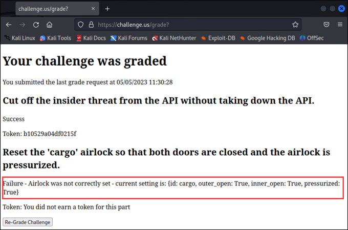

# Through the Airlock

*Solution Guide*

## Overview

*Through the Airlock* consists of two parts. In Part 1, you'll find a problem system and isolate it from the rest of the network. In Part 2, you'll analyze source code to understand how to fix the damage caused by the problem system.

## Question 1

*Isolate the rogue system.*

To solve Part 1, find the problem machine and block it with a firewall rule.

1. Log into the `app-server` system and run `ip a`. Note the IP associated with the `ens32` interface (`10.3.3.3/24`).
2. Log into the `vyos` system and run `tcpdump -i any dst 10.3.3.3`. The source IP  for the majority of the traffic will likely be `10.1.1.50`, but this address is configured via DHCP and may not always be the same. 
>For the rest of this solution guide, we will use `10.1.1.50` for the rogue machine's IP, but you will need to adjust if it's different for you.

3. Run `sudo iptables -I FORWARD -s 10.1.1.50 -j DROP`.
4. In the gamespace, browse to `https://challenge.us` and click **Grade Challenge**. 

The correct token submission for Part 1 is a randomly generated 16-character hex string.

## Question 2

*Fix the cargo airlock sensor.*

To solve Part 2, discover the problem with the airlock sensor and fix it. The **Grade Challenge** page (`https://challenge.us`) displays current fields of the airlock sensor. By default, all fields are set to `true`. See the screen capture below.



We need to get the API to return JSON equivalent to:

```json
{'id': 'cargo', 'outer_open': false, 'inner_open': false, 'pressurized': true}
```
(We know this, because in the `<timestamp>_initialize.sql` file we can see the `airlock_controls` table schema, in which `outer_open` and `inner_open` are `false`, and `pressurized` is true)

To do this, follow these steps.

1. Log into the `app-server` system and run `cd ~/api`. Spend some time familiarizing yourself with the code. There is no way to fix the airlock by calling endpoints. You need to edit the database entry for the `cargo` airlock. There are several ways to do this -- we'll create a new migration and apply it.
2. Run `sqlx migrate add fix_airlock`. This creates a new migration file with the name: `<timestamp>_fix_airlock.sql`.
3. Add a line to the new migration file (`nano migrations/<timestamp>_fix_airlock.sql`):

```sql
UPDATE airlock_controls SET outer_open = false, inner_open = false, pressurized = true WHERE id = 'cargo';
```
4. Save and exit the .sql file.
5. Run `sqlx migrate run`.
6. In the gamespace, browse to `https://challenge.us` and click **Grade Challenge**. 

The correct token submission for Part 2 is a randomly generated 16-character hex string.
