# Unravel Pit

*Solution Guide*

## Overview

Important sensitive data was stolen from the network of the Aurellian commercial spaceship, *Daunted*. Use the provided security tools and Security Onion data to investigate *Daunted*'s network and uncover the details of the data breach. 

The user machines are located on the `10.1.1.0/24` network. The online shop is located on the network DMZ at `10.7.7.7`.

## Question 1

*What is the root password retrieved by exploiting the vulnerability found in the Aurellian e-Shop website?*

There are several ways to solve *Unravel Pit* using the logging data on the Security Onion server. For the purposes of this solution guide, we will use the packet capture (**capture.pcapng**) provided in-game at: `challenge.us/files`. 

Question 1 contains an important clue about where to start looking. We know the perpetrator stole a password for a root account from the e-shop at `10.7.7.7`. Browsing to the e-shop from Kali shows:

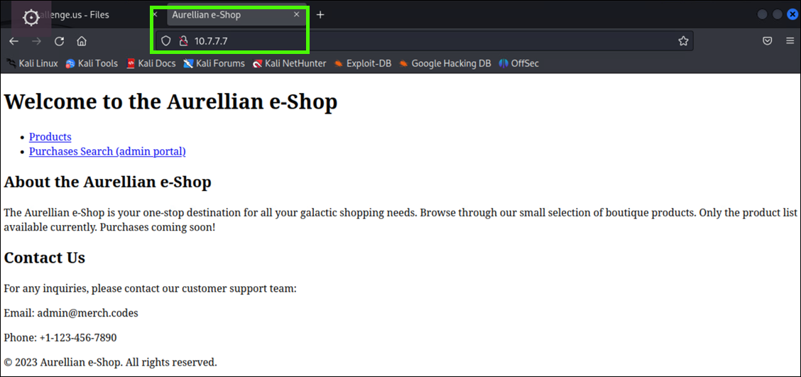

The e-shop looks like a barebones shop website still under construction. There is a link to an "admin portal" at: `/admin/purchases_query.php`. Browsing to the admin portal we see a prompt asking for a user ID number from the table.

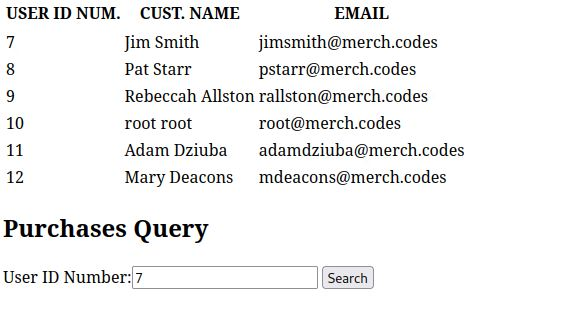

Submitting a valid user ID number redirects to a page showing that user's purchase history.

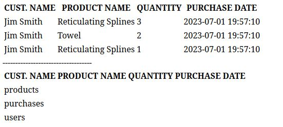

The crude formatting of the user and purchase history information looks like raw database query results. Perhaps this webserver is using MySQL to store data. We can check this by testing SQL injection attacks. Because this webpage isn't prompting for a password or checking for access privileges we can ignore those attacks based on `1=1 is true` or `""="" is true`. 

Instead, let's check to see if this php page is configured insecurely with batched SQL statements and non-parameterized SQL statements.

In the **User ID Number** field, enter `7; show tables;`. The results of the user ID 7 purchases and another table output showing the tables in the database (`users, products, purchases`) are displayed. 

In the **User ID Number** field, enter `7; desc users;`. Now we see the **users** table stores names, emails, and passwords. Perhaps they are not securely stored with hashes and salts... 

In the **User ID Number** field, enter `7; select * from users`.

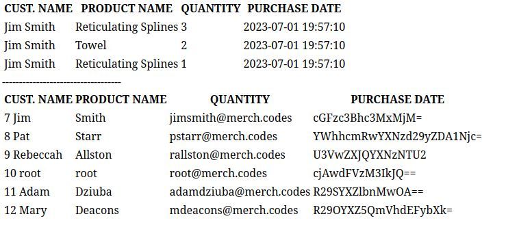

The **users** table is returned complete with the passwords. Notice the user `root@merch.codes` - we want this user's password to answer Question 1. Based on the format of the passwords, it appears they are base64 encoded. Check this from a terminal with the command:

```bash
echo "<base64 string>" | base64 -d
```
It returns the plaintext password for the root user. The correct submission for Question 1 is: `r00tUs3r$%`.

## Question 2

*Which internal IP address was responsible for the attack?*

Once you open the provided packet capture using Wireshark, you can filter the results by the known Aurellian e-Shop IP address (10.7.7.7) entering the following in Wireshark's filter bar: 

```bash
ip.addr == 10.7.7.7
```

This will show the following results: 

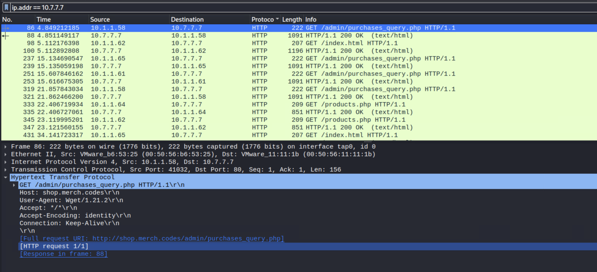

When solving Question 1, you may have noticed the website at `10.7.7.7` used insecure `http` and not `https`. This means the `http POST` requests were sent in plaintext. Let's check the packet capture file to see if any `http POST` requests were captured.

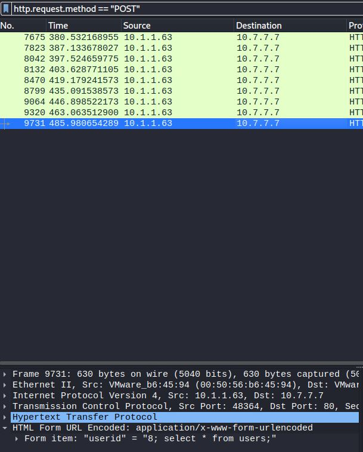

Sure enough, we can see POST requests appear from the user machine `10.1.1.63` to the e-shop server at `10.7.7.7`. Investigating the packets we can see a progression of attack from the user machine enumerating the server database until they issue the command `8; select * from users;`.

The correct submission for Question 2 is: `10.1.1.63`.

## Question 3

*What is the name of the file that was exfiltrated?*

We know the user at `10.1.1.63` has the password for the `root@merch.codes` account, but we don't know which service this account can access or what file they exfiltrated. You can use the packet capture to determine the other `merch.codes` subdomains by filtering DNS requests, or you can log into the pfSense firewall at `10.0.0.1` and check DNS entries in the configuration. Here's how we do this:

1. First head to 10.0.0.1 and log in using the provided credentials.
2. Click on Services -> DNS Resolver and scroll down. Make sure to NOT disable DNS resolver.

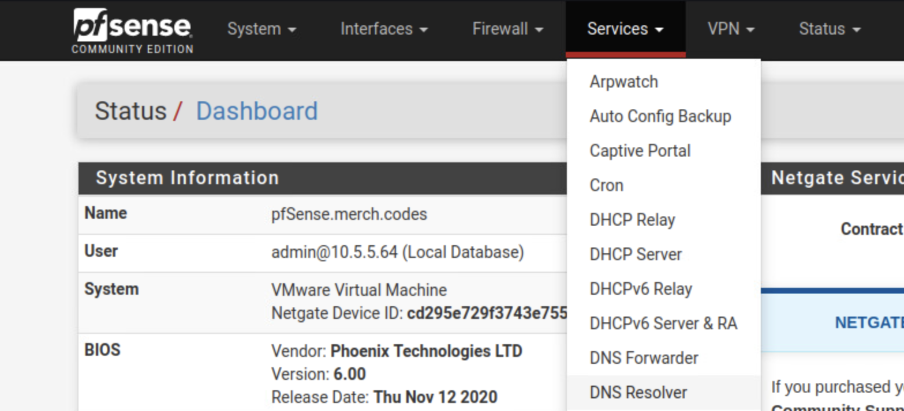

If we scroll down, we can see the following `merch.codes` subdomains: `chat`, `db`, `keycloak`, and `mail`.

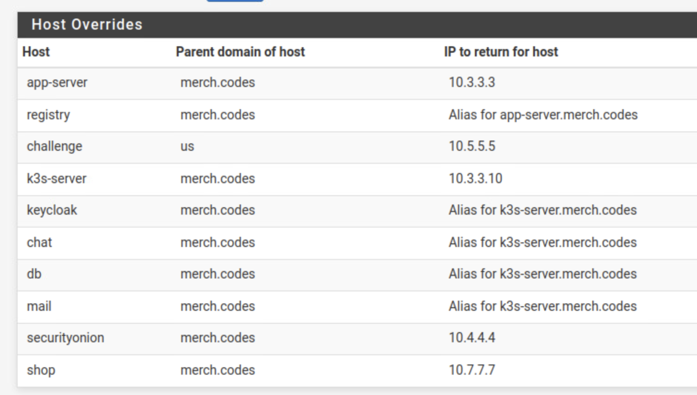


Browsing to **chat**, **db**, and **keycloak.merch.codes** yields little results -- even after logging in with the `root@merch.codes` account. Next, try logging into `mail.merch.codes` with the root account. We can see a number of emails sent to the root email account including one with the subject "eshop backup". 

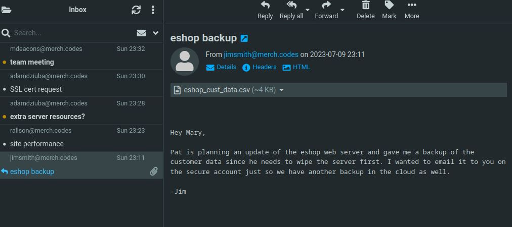

There is also a file attached called **eshop_cust_data.csv**. Download and open this file. It contains a list of customer names, credit card numbers, expiration dates, and CVV codes. This must be the data that was taken.

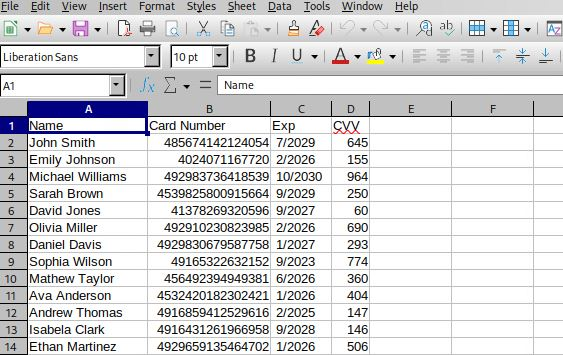

The correct submission for Question 3 is: `eshop_cust_data.csv`.

## Question 4

*To which IP address and port was the file exfiltrated? Use the format address:port in the answer*.

In Wireshark, filter the pcapng file for the offending IP address: `ip.addr == 10.1.1.63`.

There are 9307 packets to filter. Narrow down the search by analyzing the filtered packets for endpoints. In the menu, go to: **Statistics**, **Endpoints**, and **IPv4**. As you can see, there is an IP address external to the customer `10.0.0.0/8` network. Filter for: `ip.addr == 123.45.67.233`. You can see the traffic between it and the offending IP address.

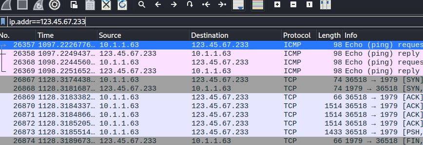

Right-click one of the TCP packets, then **Follow**, **TCP stream**.

What's shown is garbled data, though we can see from the TCP conversation that there was no SSL handshake. So this is not encrypted, but encoded.

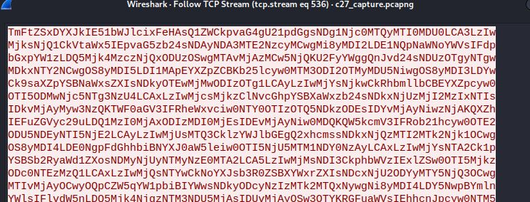

It also appears to be base64 encoded. Let's try decoding it. Copy the stream data and paste it into a file named **streamdata**. Decode the file with the following command:

```bash
cat streamdata | base64 -d
```

The resulting output shows the same data contained in the file downloaded from the mail server. This captured traffic shows the data exfiltration. In the Wireshark window, take note of the IP address and port it was sent to, and answer the challenge question.

The correct submission for Question 4 is: `123.45.67.233:1979`.