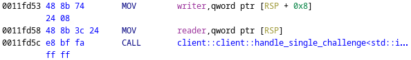
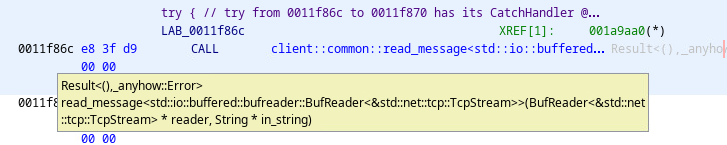

# I Do What I Want!

*Solution Guide*

## Question 1

*What is the user's password as a string?*

In the gamespace, open Firefox and navigate to `challenge.us/files` and download the `client` file.


The file should be in `/home/user/Downloads`.


Open **Ghidra** and create a new project.


Click the **Code Browser** button.


In the **CodeBrowser**, select **File**, **Import File**.


Navigate to `/home/user/Downloads` and import the `client` file you downloaded.


On the **Import File** dialog, click **OK**.


Double click on the **client** project in **Active Project window**

Click **Yes**.


On the **Analysis Options** screen, accept the defaults and click **Analyze** . It will take a few minutes to complete the analysis, and you can watch the current status in the bottom right of Ghidra.


Once the analysis completes, **Symbol Tree** is on the left. Find **Namespaces**, **c**, **client** and explore the subtrees to find various symbols associated with the client.


Once you've become acquainted with the  symbols in the Namespace, double-click the **main** function. 


Scrolling through the **main** function, you will see a call to `client::client::connect_read_loop_body`. Double-click it.


In this function's body, there is a call to `client::client::send_login_request`. Double-click it.


Scrolling  through this function, you will see a call to `client::common::get_username`, followed by a call to `client::common::write_message`. Following the first function call reveals the username is `chris_p_bacon`. Note the username for later use.

Remember that Rust does not use null-terminated strings because it tracks the length of the string separately. When you view the string in memory, don't look for a trailing `0` byte.


The second call is also important for later.


Further into the function is a call to `client::common::get_password`. The password is not plainly visible, so we'll need to run the program and put a breakpoint on the line after this call in order to see it.


Minimize the CodeBrowser for the moment and open a terminal window. Before we can run the debugger, make sure that `client` is executable. In a terminal window, run:

```bash
chmod +x /home/user/Downloads/client
```


Next, install `rust-gdb`. In the terminal, run:

```bash
sudo apt install rust-gdb
```


Now, run it with:

```bash
rust-gdb /home/user/Downloads/client
```

(*Or use the relative path `Downloads/client` if running from your home directory.*)


Set a breakpoint on `client::common::get_password` with `b client::common::get_password`. Just typing `b get_password` doesn't work.


Run the program with: `r`.


Run until the function exits. Observe that the return value is conveniently printed because we're using `rust-gdb`. This is the first token and also the password that the server expects.


A correct submission for Question 1 is a 16-character hex string.

## Question 2

*What did the "knock knock" command return?*

To solve Questions 2 and 3, we will either hijack the client program's control flow and insert our own logic, or write a script that implements the same message passing and encryption as the real client program. We'll write a Python script here. See [solution.py](./solution.py) for the full code.

We'll need to communicate with the server in the protocol that it expects. 

From where we left off in Question 1, we have the **username** and **password** used to log in with the server. We also have our next lead. Jump to the `write_message` function seen earlier and examine the calls it makes. The first call made is to the `client::common::aes` function; we will skip for now but return to shortly.

There is a call to `alloc::vec::Vec<u8,_alloc::alloc::Global>::len` and then another to `core::num::{impl#8}::to_be_bytes`. `to_be_bytes` that refers to the order, or endianness of the byte array produced. This suggests that the length of the message is converted to big-endian and sent to the receiving end. We'll need to figure out how many bytes it uses...


There is a call to `std::io::buffered:bufwriter::{impl#5}::write`, which is preceded by `MOV ECX,0x4`. This suggests the amount written to the buffer is four (4) bytes -- which is a solid guess for our message length field.


There is another call to the same function, but preceded by `MOV ECX,0xc` this time. Keep this in mind -- we'll come back to it when we look in the `aes` function.


Then, a third call to the same function; this time there is no `MOV` instruction preceding it. This means the amount of bytes written is variable -- another good guess here is -- the message is being written, and the byte value is the same as the length of the encrypted message.


Let's return to the `aes` function, knowing we're looking for an associated value that is 12 bytes (0xc) in length.


The analysis thinks the nonce field should be a `u8[12]`, indicating a 12-byte field. The *next* line indicates the cipher being used is `AesGcm`. Mousing over `AesGcm` reveals more information that isn't shown in the screenshot -- the specific cipher used is the 128-bit version of `AesGcm`. If we look at the [documentation](https://docs.rs/aes-gcm/latest/aes_gcm/#structs) for the `aes_gcm` crate, we can see both versions of `AesGcm` use 96-bit (12-byte) nonces. At this point, we're pretty sure the structure of messages written to the socket is in the format of (using Rust notation):

```rust
struct Message {
    // message_len is stored in big endian.
    message_len: [u8; 4],
    // Generated by the `aes` function.
    nonce: [u8; 12],
    // The length of encrypted_message varies.
    encrypted_message: Vec<u8>,
}
```

We can look through the `aes` function a little more, and find a suspicious ASCII string being loaded:


As mentioned in the challenge guide, the encryption key used in this challenge was intentionally an ASCII string that could be found more easily than an array of random bytes. It's a good assumption that this string is the key, but we need to be careful -- Rust strings do not need null termination because the length is stored with the object. The words in the string suggest that it's 16 bytes, but we also know that the cipher in use is the 128-bit (16-byte) key version of `AesGcm`. So, the encryption key is `hello this is 16`, and we will use this shortly.

Scrolling further in this function, we can see the call to `aead::AeadCore::generate_nonce`. We don't need to do much with it -- since we'll be writing a script to encrypt messages -- we could just set the nonce to all zeroes if we want.


Finally, we can see calls to `aead::{impl#1}::encrypt` and `aead::{impl#1}::decrypt`, indicating that the function we are examining handles both based on a toggle.


Now, we need to examine `read_message` in order to complete the message passing code and make our script. Scroll through the function until you find a call to `std::io::buffered::bufreader::{impl#3}::read_exact`. It looks like the value `0x4` is being passed to this call, indicating the first thing  read from the buffer is the message length -- as expected from our earlier findings. We expect this value to be converted from big-endian based on those earlier findings, and a little further down we can see a call to `core::num::{impl#8}::from_be_bytes`.


Next, should be the nonce. There is another call to `read_exact` further down, and it is given the value `0xc`. As expected, the nonce is read next.


Finally, we should be getting the encrypted message. On the third and final call to `read_exact`, we see it doesn't have a fixed value passed to it just before the call. It seems likely that this call is our message.


As expected, the next call is to `aes`. It's safe to assume that it's being called in decryption mode.


There is a call to `alloc::string::String::from_utf8`. Looking at the [documentation](https://doc.rust-lang.org/std/string/struct.String.html#method.from_utf8) for this function, it takes a vector of bytes and attempts to convert it a string. This suggests that the program only expects valid UTF-8 strings to be sent.


Then, a call to `alloc::string::String::clear`. Is it erasing the string it just made? No. This is a different string, and we'll see that next.


There's a call to `alloc::string::String::push_str`, meaning the string that was created with the call to `from_utf8` is concatenated with the string that was just `clear`ed. The reason is: the `read_message` function takes a `&mut String` as one of its arguments instead of returning a new `String`. This will be referred to again in Question 3.


There is a call to `core::str::{impl#0}::trim_end`. The [documentation](https://doc.rust-lang.org/core/primitive.str.html#method.trim_end) says that it removes trailing whitespace and returns a string slice. This is important to remember when we write the custom script in order to make sure the messages do not contain junk.


Shortly after the call to `trim_end` is a call to `core::str::{impl#0}::len`, which is being applied to the string slice returned from `trim_end`.


Then, a call to `alloc::string::String::truncate` with the value returned from `len` passed as its argument. As might be expected from the name, the [documentation](https://doc.rust-lang.org/std/string/struct.String.html#method.truncate) says that it shortens the `String` object to the new length (as an in-place modification). In summary, the end of `read_message` strips off whitespace from the returned string.


We have everything needed to write our script to solve this question. See [solution.py](./solution.py) for the code, skipping the `handle_single_challenge` and `handle_math_challenges` functions for now. The result of the `handle_knock_knock` function should print the second token.

A correct submission for Question 2 is a 16-character hex string.

## Question 3

*What was the result of sending "one more" after the arithmetic queries and then answering one final query?*

Back in the `connect_read_loop_body` function, scroll until after the login request. You should find a call to `client::client::handle_math_challenges`. Double-click that function to enter the `handle_math_challenges` function.


The important call is: `client::client::handle_single_challenge`. There is also a loop, and you can either read through the disassembly to determine how many iterations it has (30), or use trial and error when writing the script. Double-click `handle_single_challenge` to jump.



In the `handle_single_challenge` function, there should be a call to `String::new`, followed by a call to `read_message`. As mentioned in the solution for Question 2, `read_message` takes a `&mut String` parameter, meaning that the newly-constructed `String` is being passed mutably to that function. We can see the parameters listed in the tooltip from mousing over `read_message` in Ghidra.



After reading the message, the function splits the `String` on whitespace. `split_whitespace` [documentation](https://doc.rust-lang.org/std/string/struct.String.html#method.split_whitespace) which returns an iterator over the splits.


That means we can expect calls to `next`, and a few lines down from the call to `split_whitespace`, we do see a call to `next`. Further down, we see a call to `unwrap_or_else`. The `next` call returns an `Option<&'a str>` type -- disregarding the notation, this means it may or may not return a string slice. This is why `unwrap_or_else` is called on it. The `else` part of `unwrap_or_else` means the programmer can provide a default value. The default value is `""`, which should only occur if the server is misbehaving -- so we don't need to worry about that for the rest of this question. There are another two `next` and `unwrap_or_else` calls after.


Then we see a call to `client::client::parse_ops`. Double-click it to enter the function.


`parse_ops` is a simple function. There are three calls in it: `core::str::{impl#0}::parse<i32>`, `client::common::{impl#14}::from_str`, and another call to `parse<i32>`. The first and third ones aren't too hard to understand -- they're attempting to parse the first and third string slices into `i32` values. To understand the second call, look at the function analysis header where you first entered the function. There is an **Operation** type specified there. Knowing we are solving arithmetic challenges, we deduce the second string is expected to be math symbols like `+`, `-`, `*`, and `/`. We can confirm this either through the use of a debugger, or by trial and error when writing the script (just print out whatever the server sends and you can see the values).


In `handle_single_challenge`, the next call we see is to `client::common::Operation::perform_operation`. Without even looking at the function's code, we deduce it handles whichever operation was requested by the server.


There is a call to `to_string` -- remember that `read_message` and `write_message` work on string slices, so this makes sense.


Finally, a call to `write_message`.


Now, we have everything we need to write the rest of our script. As mentioned above, the server sends 30 math queries for the client to solve, and then it stops sending data. The challenge guide says to send the phrase "one more" after the server stops sending queries and then to answer one more query. See the `handle_math_challenges` and `handle_single_challenge` in [solution.py](./solution.py) to see the implementation.

A correct submission for Question 3 is a 16-character hex string.
