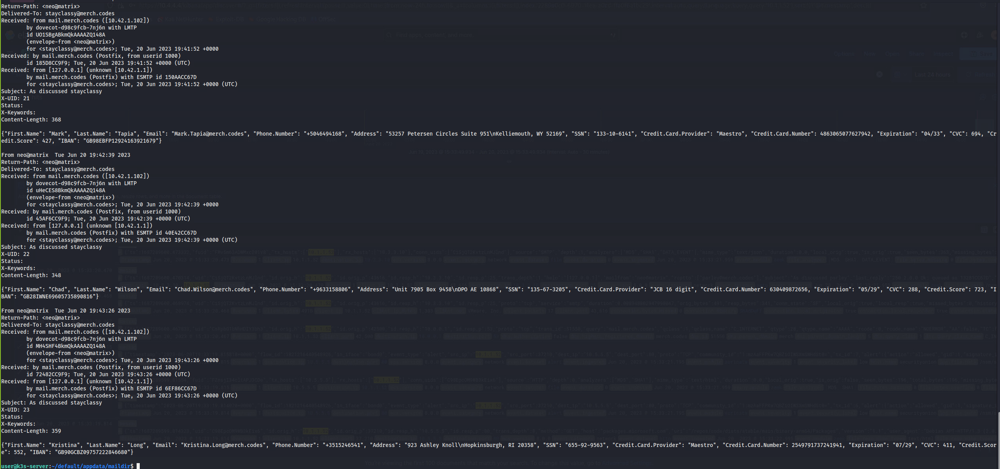
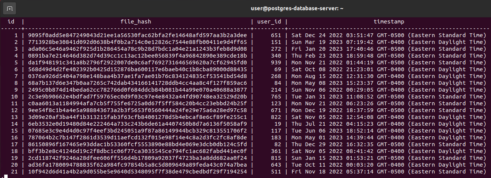
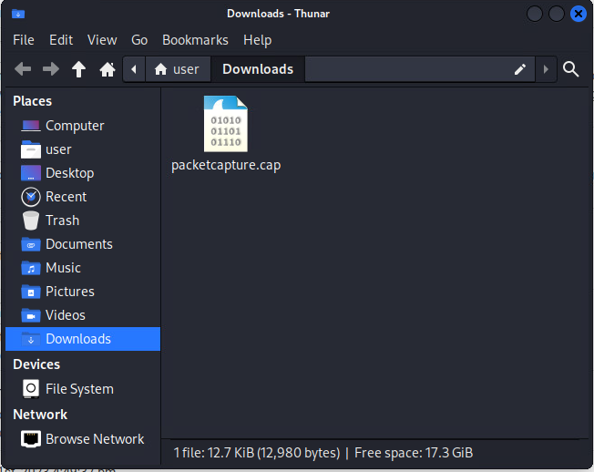
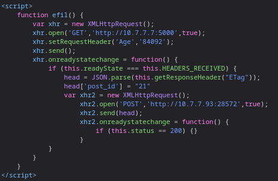

# Leak Hard with a Vengeance

*Solution Guide*

## Overview

Recently, a merchant was the victim of a cyber attack by an enemy guild. His spaceship's systems are up and running again, but he noticed some anomalous activity and believes he is still infected. Help the merchant find all occurrences of data exfiltration.

*Leak Hard with a Vengeance* is an infinity-style challenge. The answers to each of the questions are randomly generated for each challenge instance. All of the answers will have the same format, but will not match the values in this solution guide. 

## Question 1

*How many accounts is the financial data being exfiltrated to?*

1. Connect to the Security Onion console at `10.4.4.4`. Under **Tools**, click **Kibana**, and log in. 
2. Click the **menu (hamburger)** button, then click **Discover**. Once loaded, you can begin searching all network traffic. 
3. Search for any traffic associated with the host `10.1.1.52`. The results should be similar to the image below:


You can see most of the traffic is mail being sent out over `SMTP` and the recipient IP is `10.3.3.10` -- the K3s server. You could sift through all the traffic to determine how many different email accounts are receiving financial data. But, there is an easier way.

4. SSH into the recipient `10.3.3.10` using the given credentials.
5. Browse to the `/home/user/default/appdata/maildir/` and find folders for all email accounts present on the server.
6. Analyze the inbox of each account to determine who is receiving financial data. Below is an example of an account inbox that is receiving data.



The number of accounts receiving exfiltrated financial data is the answer to Question 1. 


## Question 2

*What is the value stored in the password_hash field of the users table for the user that is connected to the exfiltrated file data? You do not need to crack the password hash. Provide the value that is stored in the database.*

1. Start by connecting to and examining the **postgres-database-server** VM.
2. Open a terminal and enter: `sudo -i -u postgres`.
3. Run `ls`. Note the `startup.sh` script.
4. `Cat` the `startup.sh` script. We see it runs `pgagent`.


5. As `user`: confirm that `pgagent` is running using `sudo ps -aux | grep pgagent` command. 


6. Researching `pgagent` shows us there is a database schema that will provide us with more details.
7. As `postgres`: connect to the `postgres` database using the `psql` command.
8. Run the`\dt` command. This shows us `files` and `users` tables under the `public` schema.


9. Look at the other schemas using the following command: `\dt *.*` Now we see a few tables under the `pgagent` schema.


10. Query these tables to find out more about the `pgagent` jobs.

  

```sql
SELECT * FROM pgagent.pga_job;
```
There are two jobs, both listed as enabled and scheduled to run every minute.


11. Look at the job step details. They include commands to write query results to a file and `scp` them to an unknown remote machine.


12. Verify that the `/tmp/pgbkp/db.bak` file exists.


13. Open that file using: `cat db.bak`. Looking at the query from the maintenance job step, we see the query is selecting data from the `files` table.


14. Run this query against the files table. The third column is the `user_id` field.



15. Query the `users` table: `SELECT * FROM public.users WHERE id = 783;`.
16. Get the value of the `password_hash` field. This is the answer to question #2.


## Question 3

*Find and decode the token being exfiltrated via DNS.*

1. On the Kali VM, browse to `https://123.45.67.89`.
2. Log in with the following credentials: `Username:admin` | ` Password:tartans`.
3. From the navigation menu, go to **Diagnostics**, **Packet Capture**.


4. Make sure the interface is set to **WAN**.


5. Click **Start** and wait for about a minute.


6. Click **Stop**.


7. Click **Download Capture** button.


8. Open the packetcapture.cap file from the Kali Downloads folder.



9. Take note of the DNS records. 


10. Filter for DNS records by entering `dns` in the filter field and pressing **Enter**. For example: **start.exodus.codes** and **end.exodus**.


11. You will also notice other strange looking DNS requests. For example, look at this value: **VG9rZW46IGQwOWM0NGNl.exodus.codes**.


12. Try base64 decoding the beginning of the DNS query value:
```
echo "VG9rZW46IGQwOWM0NGNl" | base64 -d
```
The answer to Question 3 is here: `Token: d09c44ce`


## Question 4

*What is the hex string found with the data that is tracking and exfiltrating user data?*

Tracking user data should give a slight hint that the data being exfiltrated could be user interactions with a website. With that in mind, browse to  the website in the DMZ located at: `10.7.7.7:5000`.

The website is an anonymous message board, and that should hint even more that tracking user actions would be intended and malicious. 

Looking around the site, nothing stands out because the website is minimal. Start monitoring the traffic being sent when interacting with the site. Also monitor what happens when a post is created or when a comment is created (those are the only possible actions).

1. Because you don't have direct access to the machine hosting the website, open **Web Developer Tools** in the browser and begin analyzing what occurs as you interact with the site.
2. With the **Network** tab selected in the Developer Tools, browse to the **Create Post** page and make a new post. When done, you should see some interesting requests being made as that post is submitted. 


It looks like two POST requests were made which should tell you that something else is occurring.

3. Open the POST made to the IP `10.7.7.93` host. You can see in the **Response** section that something is listening and waiting for data.


4. Look at the **Request** section and attempt to see what data was sent. Unfortunately, the only information you see is the default serialization of an object that was sent.

5. Look at the **Stack Trace** section for the second POST request. Within it, you will see new function calls were made. The function called `efil` stands out.


6. Click the link. You are presented with a Javascript function that was executed. Here it is:



Analyzing the script tells us that the webpage is:

- doing a GET request to itself, then from that request
- parsing the data
- extracting the information within the `ETag` header
- sending a `POST` with that data

7. Analyze the headers in the `GET` request that the website made to itself. 

The token for Question 4 will be present in the `ETag` header in the request. It is found in the JSON text associated with the key `t`.


