# Operation Alien Annihilator

*Solution Guide*

## Overview

An enemy spaceship has announced its intention to attack your ship and steal your goods! You can prevent this by infiltrating the enemy spaceship’s network services and taking action. To solve *Operation Alien Annihilator* there are four tasks you need to complete.

### Task 1

Take over another user account to escalate your privileges within the management portal located at `10.7.7.172`.

### Task 2

Explore the management portal located at `10.7.7.172` and exploit it to access information located on other servers inside the network.

### Task 3

Within the network are two API's that handle requests to control the temperature of various server sensors. Intercept and prevent any related traffic sent to them so you can access the API's and cause six servers to overheat and go offline.

### Task 4

Find and gain access to a file hosted on an internal website containing information on future endeavors of a user.

## Question 1

*What is the value of Token #1 that was discovered in the management portal located at `http://10.7.7.172`?*

To answer this question, you'll take over a user account and escalate your privileges within the management portal (`http:10.7.7.172`). 

1. On the Kali VM, navigate to `http://10.7.7.172`.


2. Login with the credentials provided in the challenge document.
- Username: `lfisher`
- Password: `Ay(YIGHES!Y%SEG`

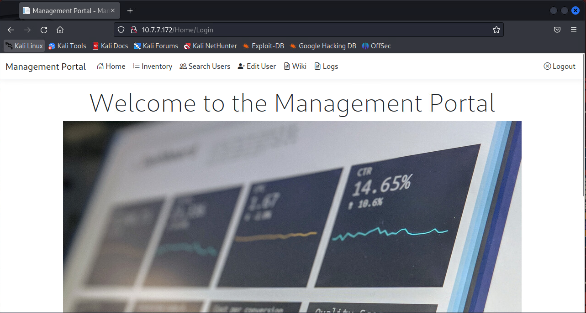

3. Click **Search Users** in the top navigation bar.

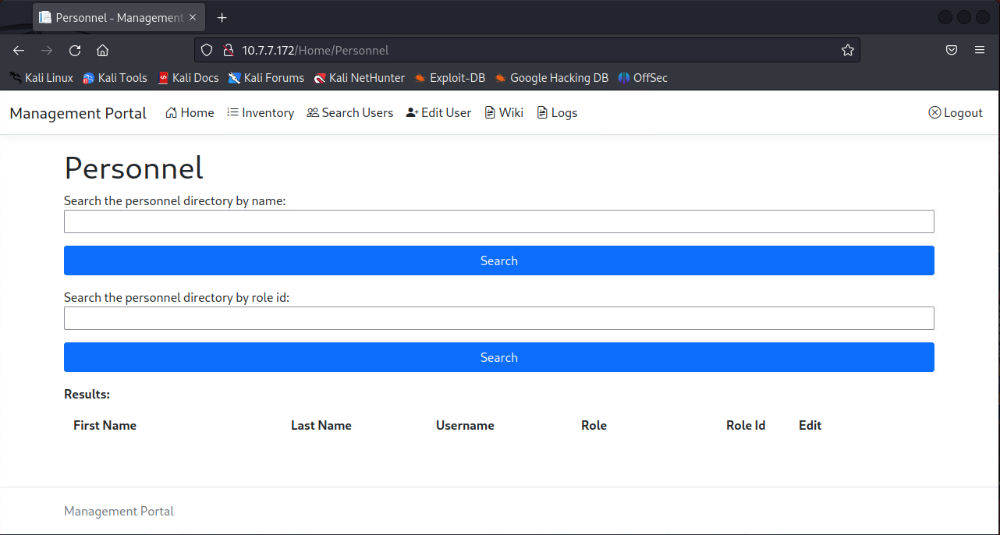

4. Search by current user's last name, `fisher`. Note that the user's Role Id is **2**.

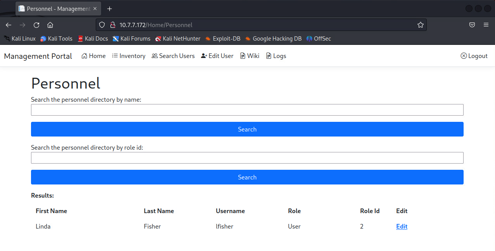

5. Try searching for other user's by Role Id: e.g., "2". We get a list of people who have a role of `User`.

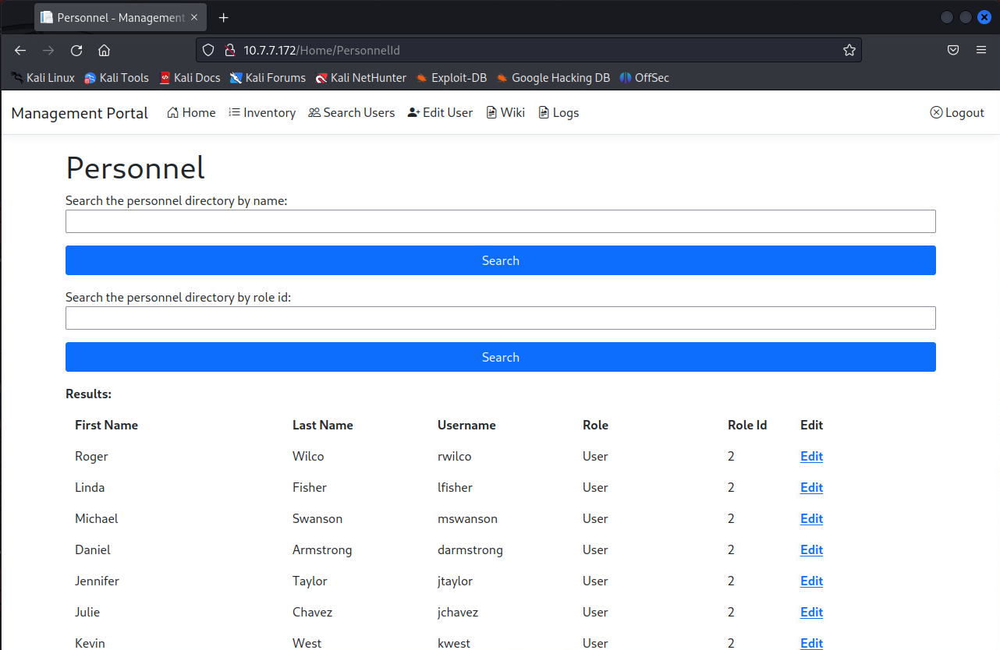

6. Search by a different Role Id: e.g., "1". No results are returned.
7. Try entering a string value. Given the error, it appears to be using MongoDB.

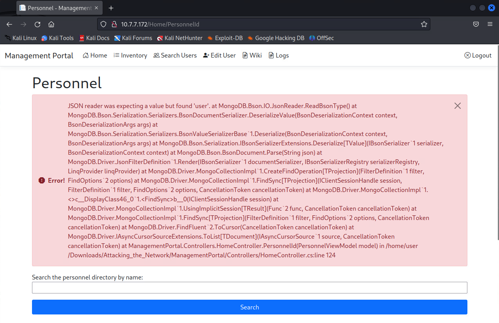

8. Let's try a NoSQL injection attack. Enter `{$gt:0}` in the **role id** field and click **Search**. Notice that we have discovered multiple accounts with a role of `Admin`. 

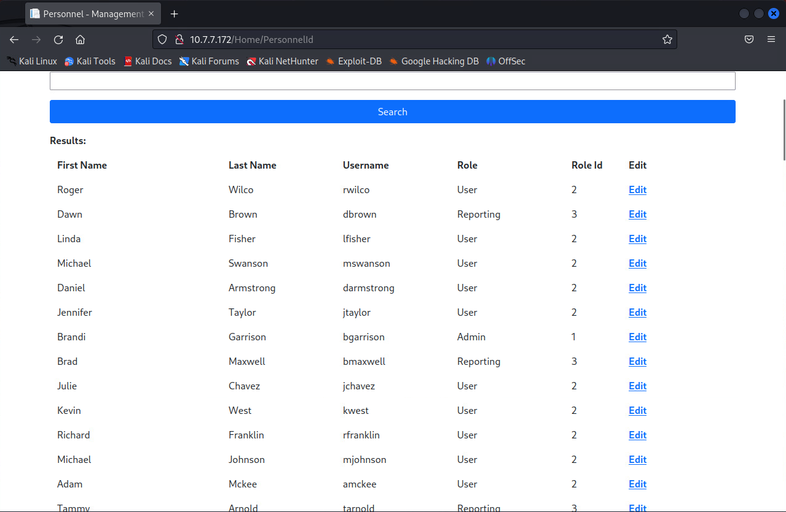

9. Next to an Admin account, click **Edit**.

10. In the **Edit User** page, right-click and select **Inspect**. Select the **Network** tab. Click the **Save Changes** button. Notice the success message in the browser and the successful `POST` in the **Network** tab.

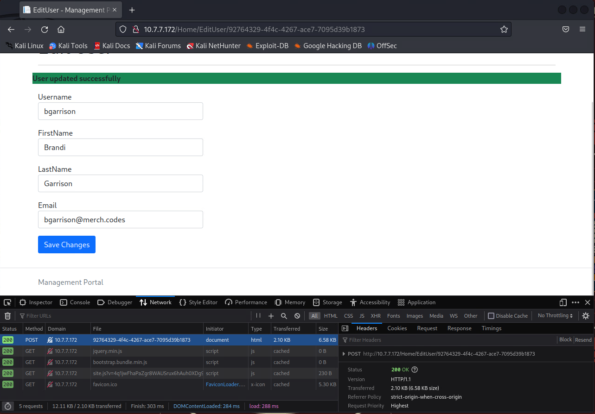

11. Look at the details of the HTTP Request Form data.

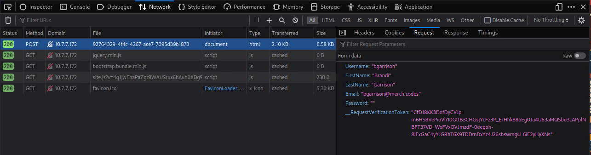

12. The `Password` field value is empty. Try building a custom POST with `curl` to update the password and take over the account.

```bash
curl -d 'Username=bgarrison&FirstName=Brandi&LastName=Garrison&Email=bgarrison@merch.codes&Password=tartans&__RequestVerificationToken=CfDJ8KK3DofDyCVJp-m6HSBVePioVh10GttB3CHGsjYcFz3P_ErHhk88oEg0Ju4U63aMQSbo3cAPplNBFT37VD_WxFVxOVJmzdF-0eegoh-8iFxGaC4yYJGRhT6X9TDDmDxYz4J26sbswmgU-6iE2yHyXNs' http://10.7.7.172/Home/EditUser/92764329-4f4c-4267-ace7-7095d39b1873
```

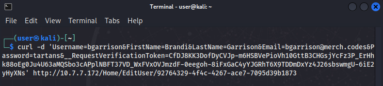

13. Check the results of the `curl` command. You will see a message indicating a successful update.

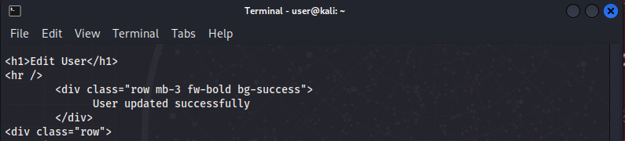

14. Logout of the Management Portal and login with the Admin account you just updated. Notice the token displayed at the top of the page.

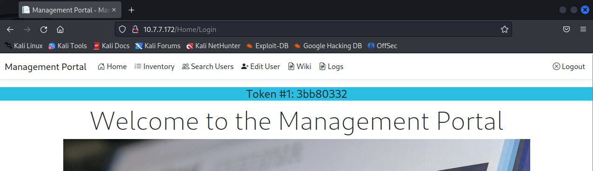

The correct submission for Question #1 is the value of the token displayed in your web browser.

## Question 2

*What is the value of Token #2 that was discovered in the management portal located at http://10.7.7.172?*

To answer this question, use server-side request forgery to access data stored on another server inside the network.

1. On the Kali VM, navigate to `http://10.7.7.172`.


2. Login with the credentials provided in the challenge document.
- Username: `lfisher`
- Password: `Ay(YIGHES!Y%SEG`


3. Click the **Wiki** link. There is a list of files. All of them have a download link except for the one in the **admin** folder.
    
    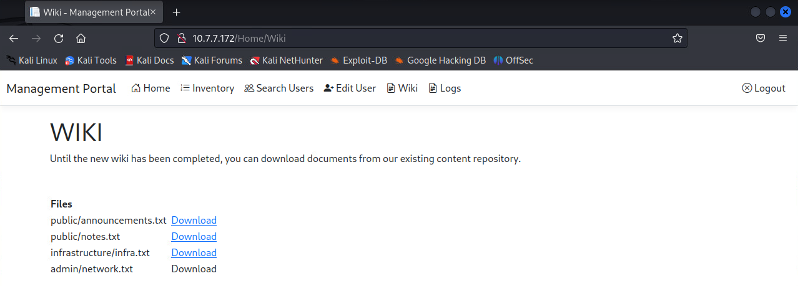

4. Click one of the download links. Note the path in the URL.
    
    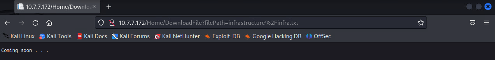

5. Change the path in the URL to the path that matches the file in the **admin** folder.
    `http://10.7.7.172/Home/DownloadFile?filePath=admin/network.txt`
    
    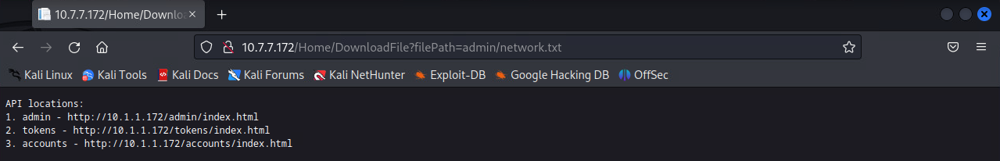

6. The URL for **tokens** could be useful. Try entering it into a browser. It doesn't look like we can get there from here.
    
    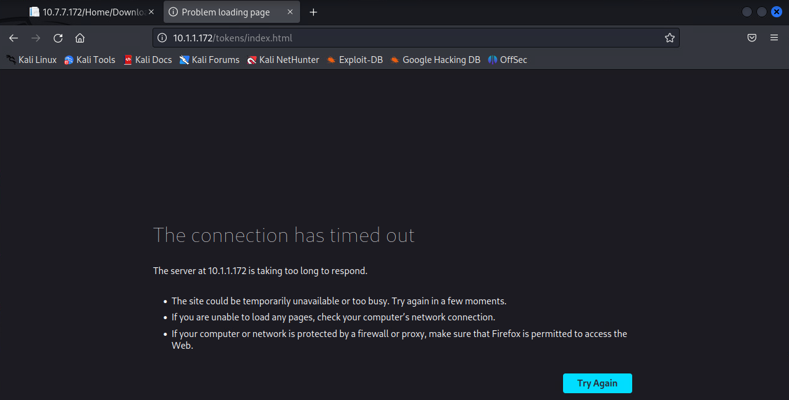

7. Click the **Logs** tab.
    
    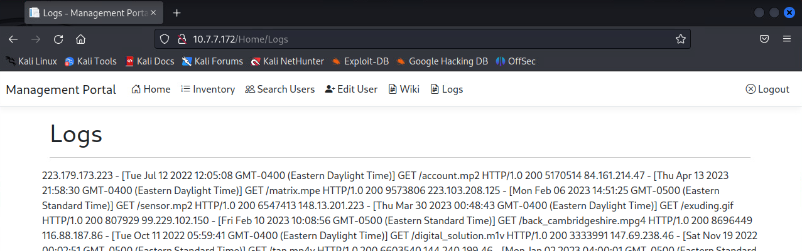

8. Notice the **Refresh Logs** button.
    
    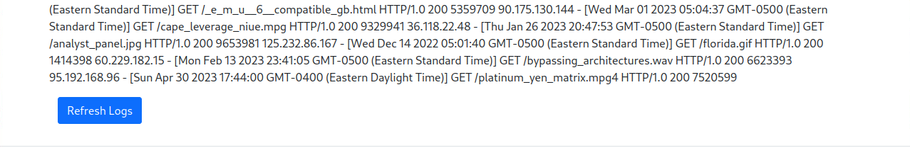

9. Right-click the Logs page and select **Inspect**. Select **Network**, then **Refresh Logs**. Notice `POST` in the **Network** tab.
    
    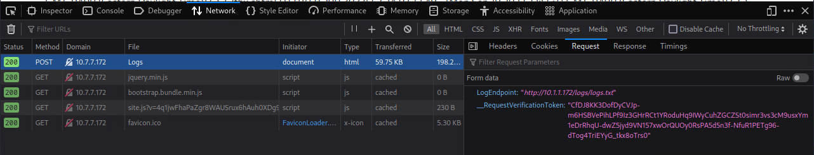

10. Right-click the POST entry and select **Use as Fetch in Console**.
    
    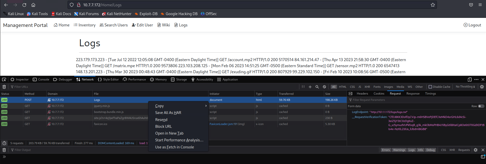
    
11. Modify the body of the `fetch` command in the development tools and press **Enter**.

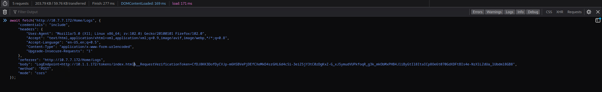

12. Notice that a new `POST` request shows up under the **Network** tab. Select it.

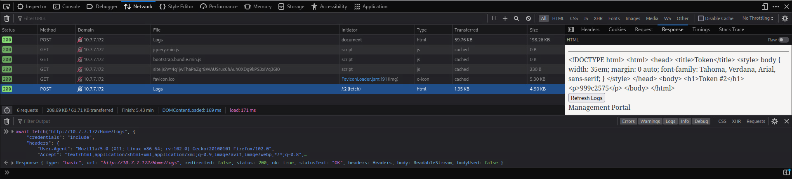

13. Make sure the latest `POST` is highlighted. Click the **Response** tab in the developer tools.

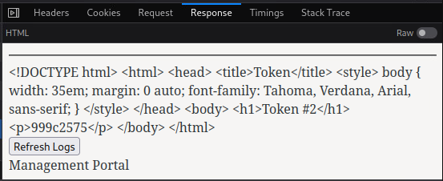

The Response HTML contains Token #2. The correct submission for Question 2 is the value of the token displayed in the HTML.

```html
<!DOCTYPE html> <html> <head> <title>Token</title> <style> body { width: 35em; margin: 0 auto; font-family: Tahoma, Verdana, Arial, sans-serif; } </style> </head> <body> <h1>Token #2</h1> <p>999c2575</p> </body> </html> 
```

## Question 3

*What is the token given from https://challenge.us grading after taking down 6 or more sensors?*

Start this task on the `kali-ext` machine by assigning an IP in the current subnet (`123.45.67.0/24`). You'll run a "Man in the Middle" attack; for the purposes of this guide, we used the tool Ettercap.

After enumerating the network, you should find there are two APIs used for retrieving and updating the sensors: the front-end API at `10.7.7.7:9832` and the back-end API storing the actual sensor data at `10.3.3.52:8374`. You should also see the back-end API only accepts connections/data from the front-end API.

1. Edit **/etc/ettercap/etter.conf**:
    - line 16:  `Ec_uid = 0`
    - line 17:  `Ec_gid = 0`
    - Uncomment the IPv4 and IPv6 iptable rules under the “Linux” section near the bottom (lines 179, 180, 183, 184)
2. Enable IP packet forwarding:    

```bash
sudo sysctl -w net.ipv4.ip_forward=1
```

3. Edit ipv6 settings to better allow Ettercap to work:

```bash
sudo sysctl net.ipv6.conf.eth0.use_tempaddr=0
```

4. Run Ettercap from terminal:

```bash
sudo ettercap -T -Q -i eth0 -A 123.45.67.21 -M arp /123.45.67.222// /123.45.67.89//
```

This will begin spoofing between the firewall and the other user on the network. When completed successfully, it should look similar to the command below:

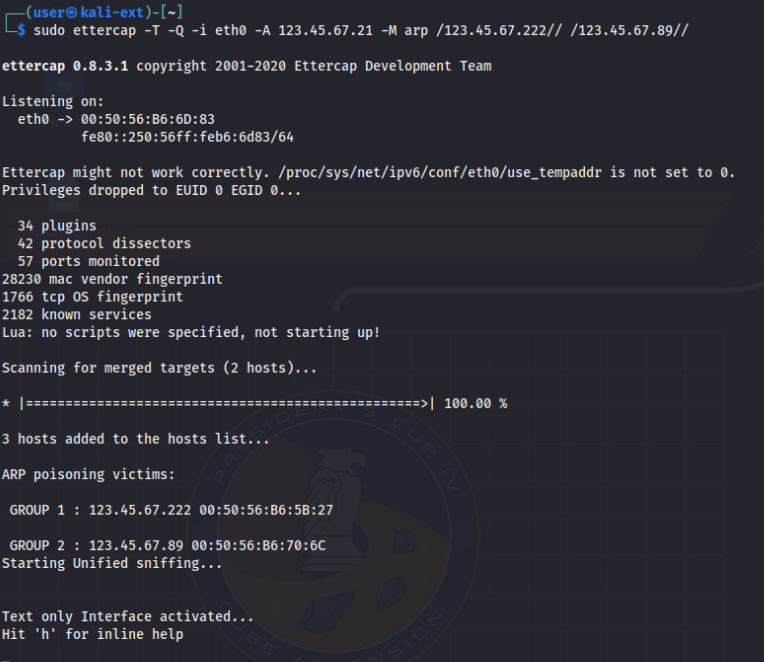

5. Open Wireshark and begin capturing traffic. You should see traffic coming and going from `10.7.7.7`. Look for `ICMP` traffic -- it will contain credentials to the firewall. It should look like this:

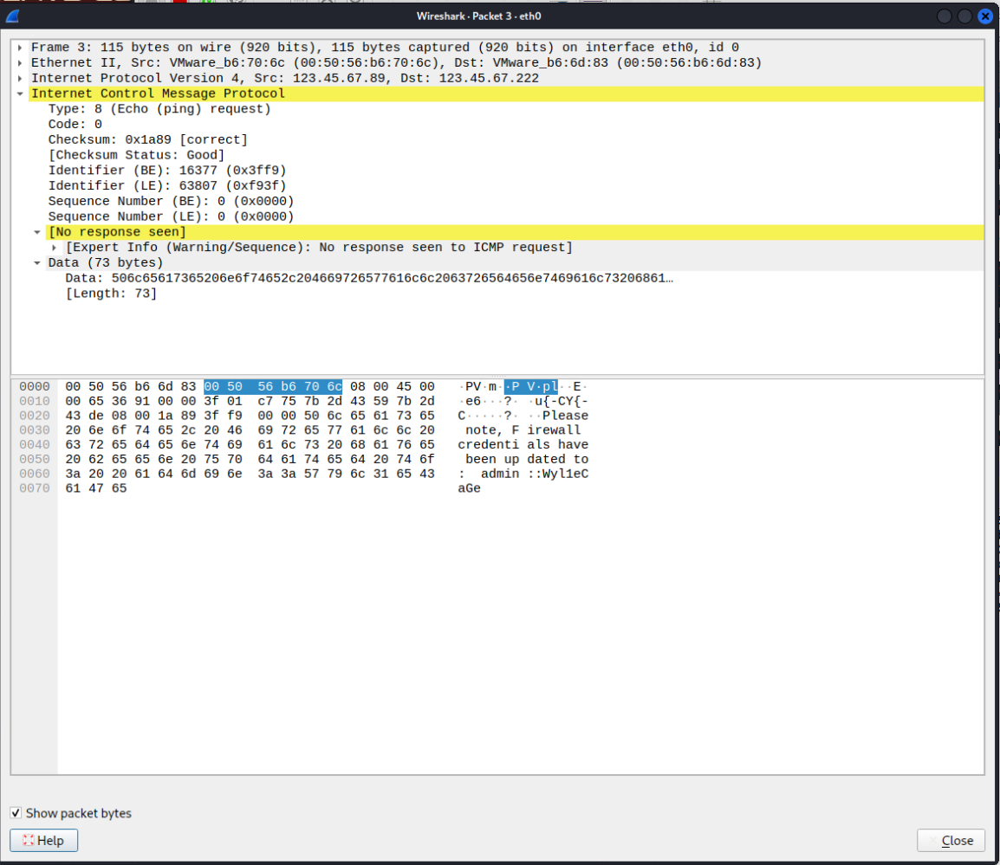

6. On the internal `kali` VM, browse to the firewall's website at `10.0.0.1`.
7. Log in using the credentials found (`admin` | `Wyl1eCaGe`), then use PFSense's built-in functionality to run a packet capture (under the **Diagnostics** tab). Use these settings for the capture:

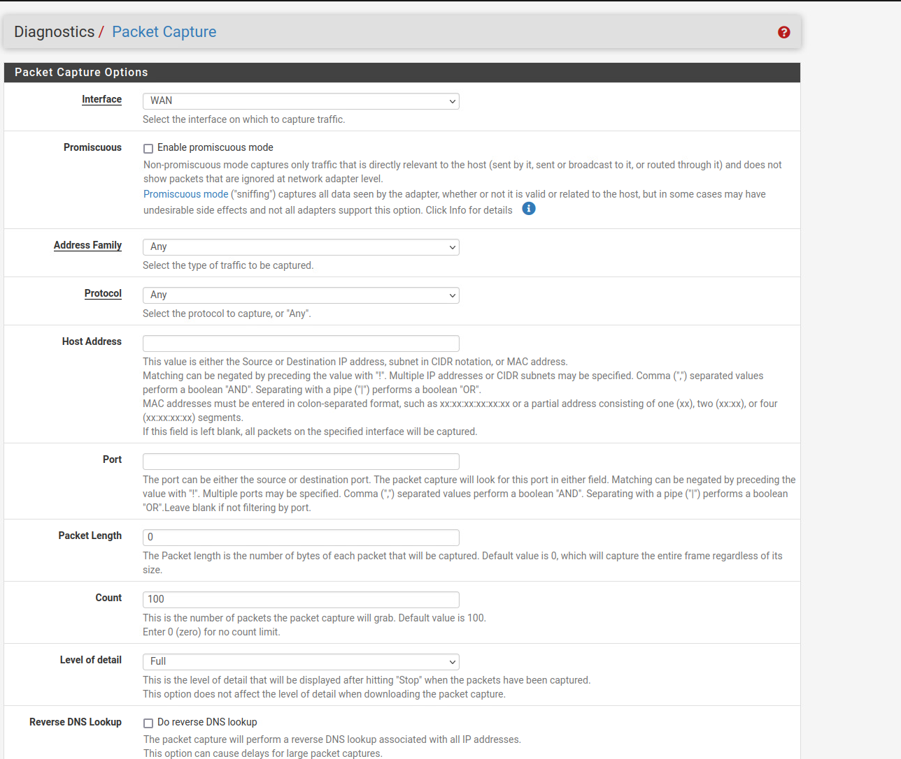

8. Start the capture; allow it to run for about 30 seconds.
9. Stop the capture; save it locally. 
10. Open the saved **pcap** in Wireshark. 
11. Look for data sent to the API at `10.7.7.7` from the external user on the `WAN`. You should find two different `HTTP` requests being made to the API at `10.7.7.7`.

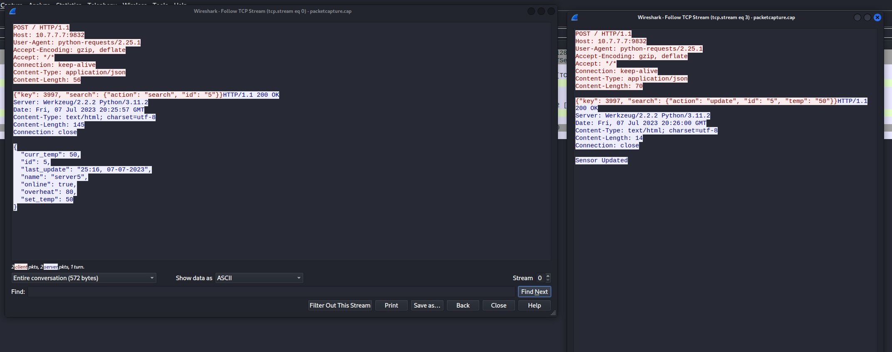

This step can also be done using the Man in the Middle attack and analyzing captured HTTP traffic. 

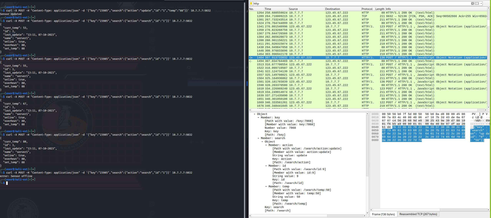

This shows you what syntax/data to send to the API at `10.7.7.7` to send commands to the back-end `Sensor API`.

To overheat the sensors, block the requests coming from the user on the wan so your requests are the  only ones it receives. 

12. Add a firewall rule that blocks all traffic from the user `123.45.67.222`. If done correctly, it should look like this:

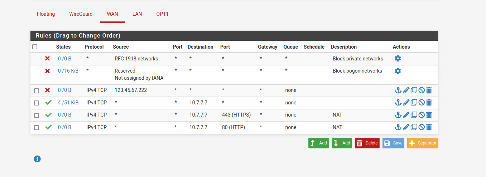

13. Send your own POST requests to tell the sensor to raise the temperature to overheat it. Here is an example:

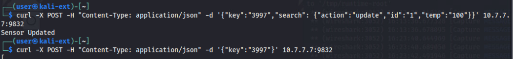

The next command returns data on every sensor if you want to check status while it's updating.

14. To do this, send six (6) of these requests to different `sensors`. When the temperature on enough sensors have increased, and the sensors overheated, they will go offline.
15. Go to `https://challenge.us` and click **Grade Challenge**. You will receive a token for submission.

## Question 4

*What is the token inside the file hosted on the website?*

On the Kali VM, browse to: `10.3.3.53:5000` and create an account with the same domain as the one already implemented, `@merch.codes`. Once created, the **New Account Created** page tells you a temporary password has been created for you and the method of creating it can be replicated. The temp password can be recreated by:

- concatenating the entered email plus a random number between 0 and 9 plus a new line character
- SHA1 hash the string

It also tells you that users created here are created in Mattermost -- this is useful information.

If you log into your newly created account, you can browse files present on the server. You see a file called **future_plans.txt**. This is the file you need. 

If you try to download **future_plans.txt**, you do not have permission to view that file.

Log into Mattermost at `https://chat.merch.codes` using your newly created account and join the team **The Hub**. The **Town Square** is the first channel. This is the default channel all registered users are added to upon joining. 

Knowing the general formula for creating temporary passwords through the website, start looking at the list of users on Mattermost. Each user's email is present, and if you look closer, you can see if a user has the role **System Admin** (it will be present when hovering over their account).

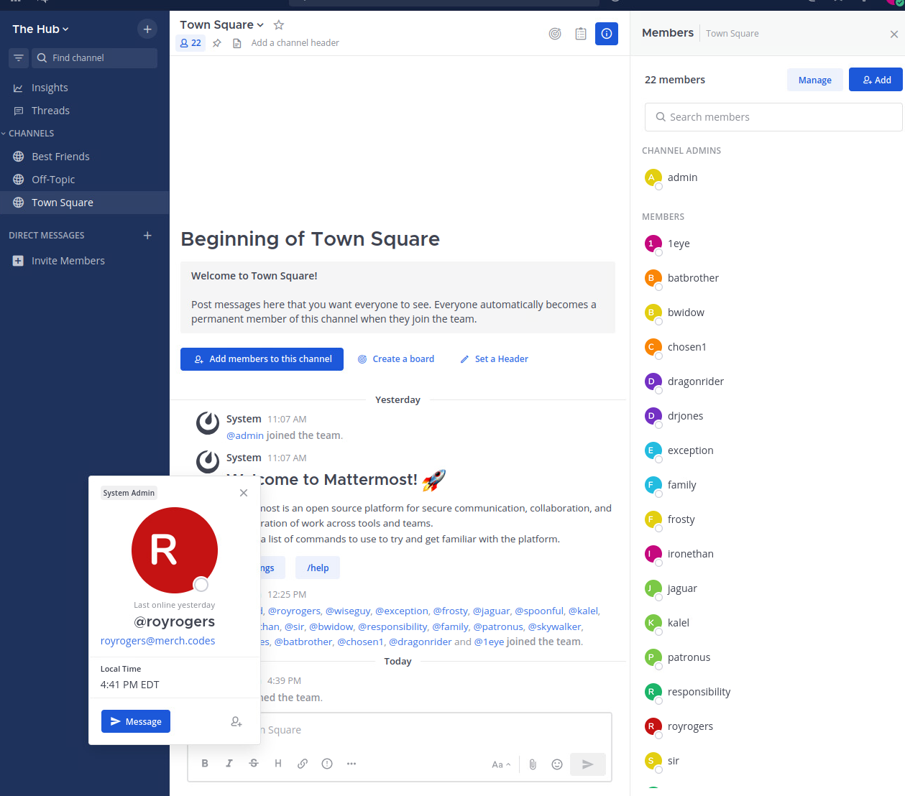

There are three **System Admins** you should focus on:
- `royrogers@merch.codes`
- `wiseguy@merch.codes`
- `suited@merch.codes`

Assuming they didn't update their password, you can attempt to brute force it and login to the website. Take the SHA1 hash of the concatenated string of their email with a random number between 0 and 9 followed by a new line character. You can do that with the following bash commands:

```bash
echo -n "royrogers@merch.codes1" | sha1sum

```
Using this command, repeat the possibilities and try logging in with them on the website to find the correct one. Using trial and error, you will find the correct password and log into one of the **System Admin** accounts. Once logged in, download **future_plans.txt**. The file contains the token for Question 4.
