# The Ship, The Ship, The Ship is on Fire

*Solution Guide*

## Overview

Regain control of a damaged ship using various networks and interfaces to intercept, alter, and create the appropriate network traffic. 

This is an infinity-style challenge. Some of the tokens you see in this solution guide will have different values, but will use the same format. 

>**Note:** If you choose to use Security Onion for creating PCAP files, make sure to enter `securityonion` in the `Sensor ID` field. Log into Security Onion at `10.4.4.4` through a browser or SSH. The Security Onion machine may take up to eight minutes to become available -- **please be patient!**

## Question 1

*What is the token that was revealed at `http://10.3.3.97/Home/GPS` after altering the GPS coordinates?*

The GPS system broadcasts the destination coordinates every 15 seconds to the GPS receiver. Unfortunately, the interface used to update the coordinates is damaged. Figure out a way to spoof the signal coming from the receiver and update the coordinates to `32.943241, -106.419533`. You can check your progress in-game by browsing to: `http://10.3.3.97/Home/GPS`.

1. Check the current status by opening a web browser in your Kali VM and navigating to: `http://10.3.3.97/Home/GPS`.

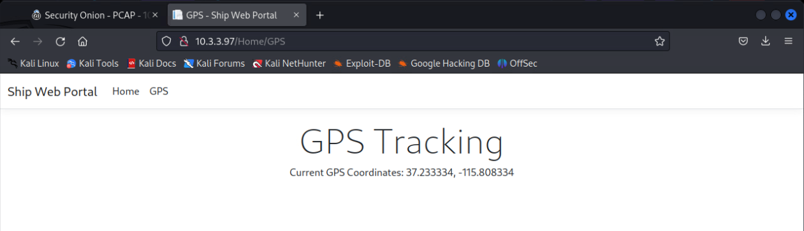

2. In your Kali VM,  browse to: `http://10.4.4.4`. Log into the Security Onion web interface with the following credentials:   
   - Email Address: `admin@so.org`
   - Password: `tartans@1`

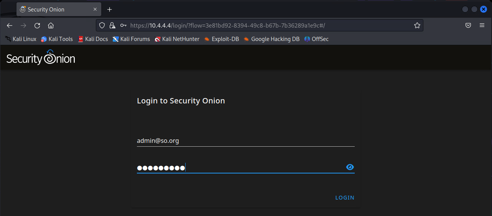

3. On the left, click **PCAP**, then **+**.
4. For **Filter Begin** and **Filter End**, enter the current date; for **Sensor ID**, enter `securityonion`. 

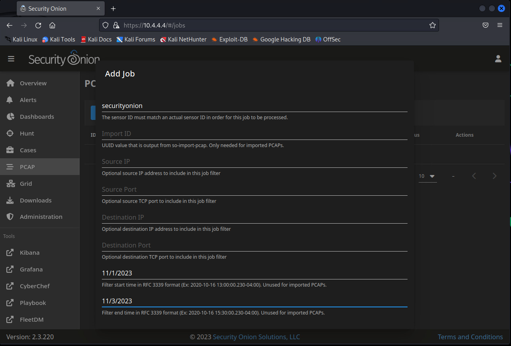

5. Click **Add**.
6. When **Status** is **Completed**, click the binoculars, then **Download**.

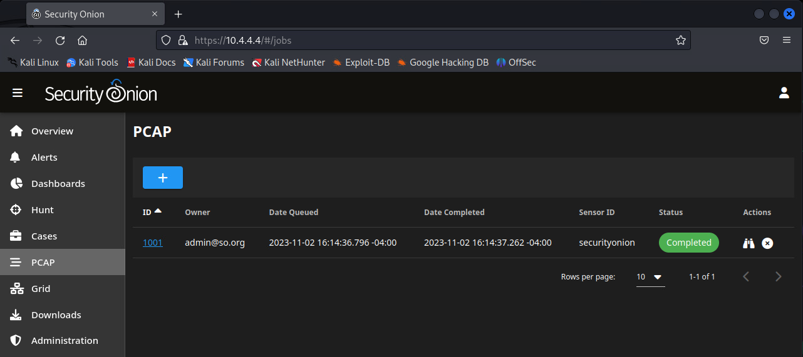

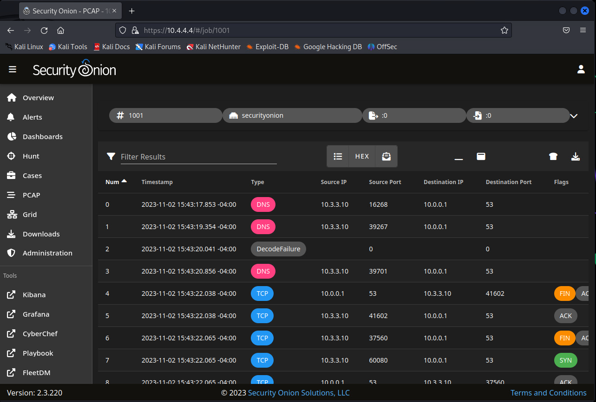

7. Using Wireshark, open the new packet capture.

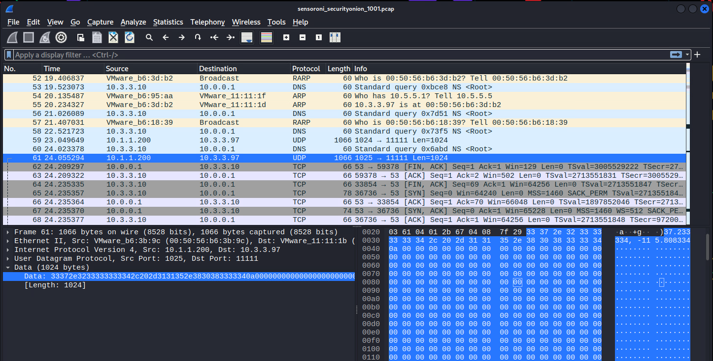

8. The challenge instructions mention looking for the GPS status at `http://10.3.3.97/Home/GPS`, so this is a good place to start looking. Search the packet capture or use filters to find traffic going from `10.1.1.200` to `10.3.3.97`.
9. Looking at the data section of the UDP packet, we see the following values, which look a lot like GPS coordinates: `37.233334, -115.808334`. Looking these coordinates up points to a location also known as Area 51.

Your goal for this question is to update the GPS destination coordinates from `37.233334, -115.808334` to `32.943241, -106.419533`. The task's instructions also mention spoofing a call. Since the traffic is coming from `10.1.1.200` and going to `10.3.3.97` we can try spoofing UDP traffic in the next steps.

10. Create a text file on the Kali VM Desktop named `gps.txt` and enter the following text into the file: `32.943241, -106.419533`.
11. Open a terminal and run the following command:

```bash
sudo hping3 -V -2 -s 1024 -a 10.1.1.200 -p 11111 -d 1024 -E Desktop/gps.txt 10.3.3.97
```

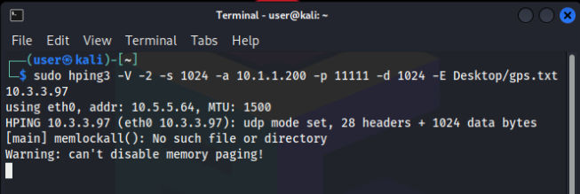

12. Refresh the GPS status web page: `http://10.3.3.97/Home/GPS`. You successfully spoofed the GPS sender and updated the coordinates! You will also notice that the GPS Token is visible.

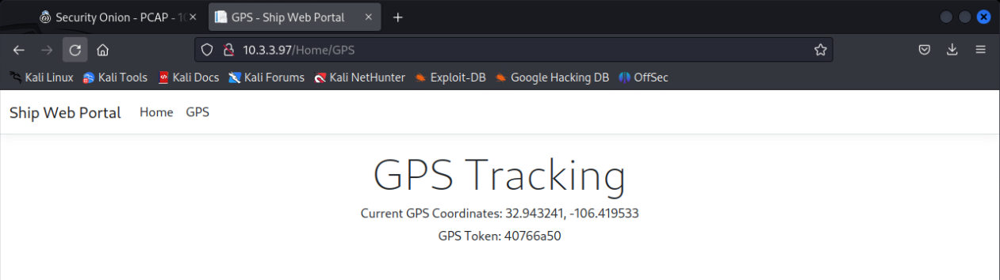

The correct submission for Question 1 is: `40766a50`. Recall that this is an infinity-style question and the answer will vary for your instance.

## Question 2

*What is the token revealed on `http://challenge.us`` after modifying the CAN Bus data for the antenna system?*

*For your convenience, we've included some of the challenge instructions here in the challenge solution guide.*

Our communications antenna isn't working. Reposition it to a new satellite to begin receiving data. Because the ship is damaged, the CAN bus can't be accessed via the usual physical interfaces. However, access via remote monitoring console allows data to be sent and received. 

The `python-can-remote` package has been installed on the Kali VMs, allowing communication with the server via web sockets. The current system sends encoded CAN Bus data from `10.1.1.183` to `10.3.3.223` using an arbitration id of `0xa1223a`. View the traffic, decode it, then look at the CAN Bus messages. 

To reposition the antenna: increase each of the existing values of the antenna (arbitration id of `0xa1223a`) by 11 (in decimal). E.g.:  if the existing data values transmitted are `[11, 22, 33, 44, 55, 66, 77, 88]`, you should transmit updated values of `[22, 33, 44, 55, 66, 77, 88, 99]` from your Kali VM to `10.3.3.223`. Be sure to transmit the data using an arbitration id of `0xa1223a`.

Use the in-game example `https://challenge.us/files/remote-can-bus.txt` to write a Python script using `python-can-remote` to adjust the antenna. 

Additional documentation can be found online here: `https://github.com/christiansandberg/python-can-remote`. It is recommended to broadcast the data using roughly the same time interval as the existing transmissions. Once you begin repeatedly transmitting the data to `10.3.3.223` from your Kali VM, run the grading script to check the results.

**Procedures to solve Question 2:**

1. Log into a Kali VM.
2. Open a terminal and run the following `nmap` command to explore the target machine:

```bash
sudo nmap 10.3.3.223 -p-65535
```
You should see results similar to the following:

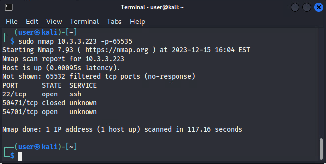

3. We know from reading the documentation at `https://challenge.us/files/remote-can-bus.txt` and `https://github.com/christiansandberg/python-can-remote` that port `54701` is significant. Open a web browser on the Kali VM and navigate to: `http://10.3.3.223:54701`.

4. Click **Play** to begin viewing the data transmitting to the CAN Bus server at `10.3.3.223`. Take note of the values associated with the CAN ID of `A1223Ax` as this is the arbitration id mentioned above.

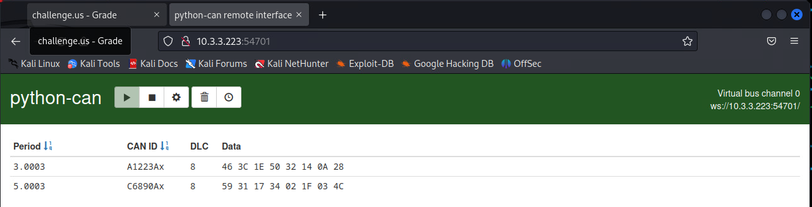

5. Take the hex data values for CAN ID `A1223Ax`:
`46 3C 1E 50 32 14 0A 28` and convert them to decimal. We should have the following: `70 60 30 80 50 20 10 40`.

6. Add 11 to each of these values: `81 71 41 91 61 31 21 51`.
7. We need to write some code to send these to the CAN Bus server. Open the example code from `https://challenge.us/files/remote-can-bus.txt` and modify it to function similar to the example below:

```python
import can
import time

bus = can.Bus('ws://10.3.3.223:54701/',
    bustype='remote',
    bitrate=500000,
    receive_own_messages=True)

while True:         
    msg = can.Message(arbitration_id=0xa1223a, data=[81, 71, 41, 91, 61, 31, 21, 51])
    bus.send(msg)
    msg2 = bus.recv(1)
    print(msg2)
    time.sleep(3)
```

8. Open a terminal on the Kali VM, create a file on the Desktop, then make sure it is executable.

```bash
cd Desktop  
touch cp.py
chmod +x cp.py
```

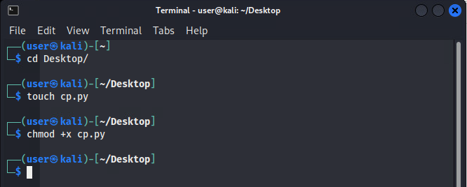

9. Copy the code shown above into the file and save it.

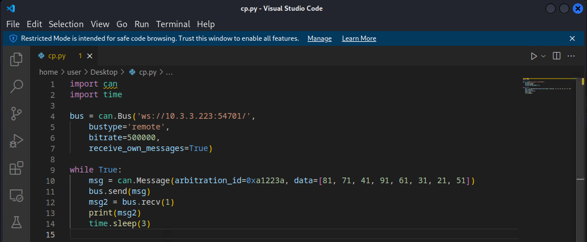

10. Run the file from the terminal. 

```bash
python3 cp.py
```

11. View the results and compare them to the values displayed in the web browser at `http://10.3.3.223:54701`.

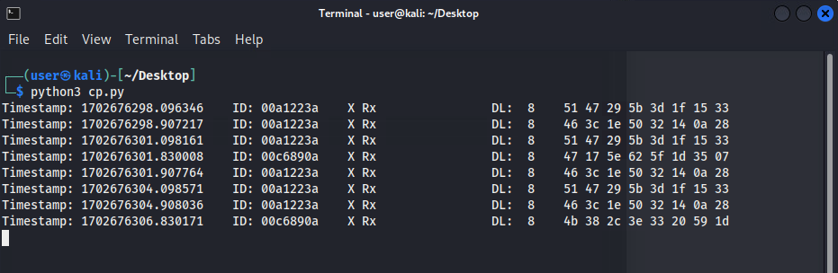

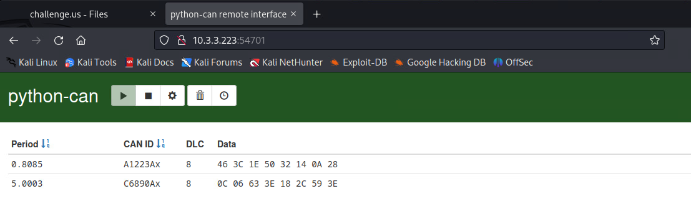

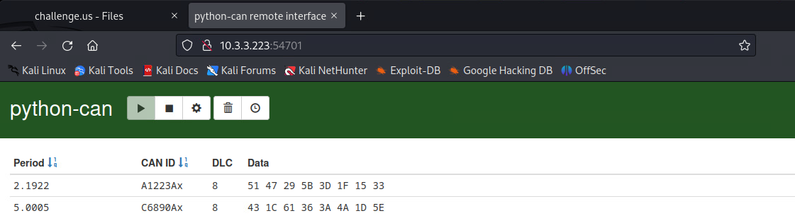

12. Notice the data for the CAN ID is now changing back and forth between the existing broadcasted values and the new values you are sending.

13. Browse to `http://challenge.us` from the Kali VM and click the `Grade Challenge` button.

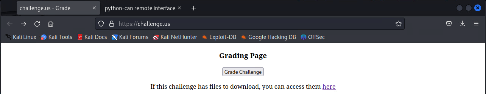

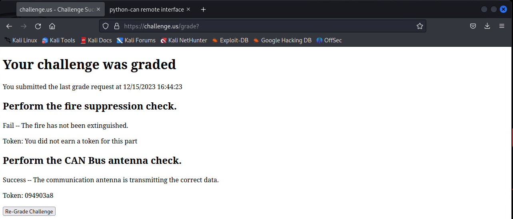

14. Copy the token value for the CAN Bus antenna check and submit it for Question 2. Note that this is an infinity style challenge and your token value will be different.

The correct submission for Question 2 is: `094903a8`.

## Question 3

*What is the token revealed at `http://10.2.2.161/Home/FireSuppression` after activating the fire suppression system?*

*For your convenience, we've included some of the challenge instructions here in the challenge solution guide.*

The ship's damage control console is reporting that a fire has broken out onboard! Unfortunately, we can't control the ship's systems from the console. Log into the damage control console at `http://10.7.7.119` to determine which rooms are alarming.

- The rooms that are on fire will have smoke alarms tripped and temperatures above the normal room temperature of 70 - 78 degrees F.
- Isolate the rooms on fire by activating the doors to close them off from the rest of the ship. Then, activate the fire suppression system. 
- Shuttles (marked on **Ship_diagram.png**) have sensors for smoke and temperature, but do not their own fire suppression. You can leave the door open between the adjacent room and activate the fire suppression system in the adjacent room.
- Fire suppression will not activate if the room is not isolated.
- Shuttles do not need to be isolated. You can use the doors of neighboring rooms to isolate them.

When the fire suppression systems have been activated, go to: `https://challenge.us` to retrieve the token. 

**A map of the ship (*Ship_diagram.png*) containing rooms and systems can be found here: `https://challenge.us/files`.**

**Procedures to solve Question 3:**

1. Get the ship map from `http://challenge.us/files`.


2. Log into the ship's Damage Control (DC) console at ```10.7.7.119``` using the credentials `user`| `tartans` and click the **System Status** link.


3. Note the Port shuttle and Ops room temperatures are above 3500 degrees and their smoke alarms are tripped.
4. Look at the ship systems page: the port shuttle and operations areas have high temperatures and smoke alarms. Isolating this area will require shutting door 4.
5. Find where the console is reading information from by getting a pcap from Security Onion:
	- Security Onion: `10.4.4.4`
	- `admin@so.org` | `tartans@1`
	Select **PCAP** and enter `securityonion` for Sensor Id.

6. Download and open the  pcap in Wireshark.
7. Filter on `modbus`, then `modbus && ip.addr==10.7.7.119`. This narrows down what is polled by the control panel. 


Coils and holding registers are read by the webserver from `10.3.3.200`.  

8. Expanding the `Read Coils` line from Wireshark in the image above shows the values for **Bits 1-18** are being read by the web server. Bit 16 and Bit 17 are `1` while all others are `0`.  The ship map tells us that coils 1-6 are doors, 7-11 are Fire Suppression, and 12-18 are smoke alarms.  This should lead you to deduce that 16 and 17 are set to "true" indicating fire alarms have been triggered.


9. Look at the ```Read Holding Registers``` packets. The values there correspond to the temperatures of the rooms.

10. Open `ctmodbus` on the Kali desktop.  At the prompt type:

```bash
connect tcp 10.3.3.200:502
```

11. Type `read coils 1-18` to see the same values the webserver is reading. 


12. Recall door coils are 1-6.  Close the operations doors by typing:

```bash
write coil 4 1
```
The System Status web page now shows the door is closed. 


13. Now that the room is isolated, activate the fire suppression system. Fire suppression is listed as coils 7-11. Following the same logic as the door numbering, starting from the front, and knowing the shuttles don't have fire control, assume that coil 11 is fire control for operations.
```write coil 11 1```

14. Refresh the System Status web page. The smoke alarms have cleared, the temperatures have returned to normal,  and the fire suppression system is enabled.


15. On `https://challenge.us`, grade the challenge. The token value is random. 

The correct submission for Question 3 is: `4bb67e97`. Recall that this is an infinity-style question and the answer will vary for your instance.

## Question 4

*What is the token embedded in the WebSocket data?*

One of the applications running on the ship's computers is repeatedly sending a message over the network using WebSockets. Find the token and submit it as the as the answer to Question 4.  The data transmitted for this part of the challenge *will not* contain CAN Bus data and is not related in any way to the data used to answer Question 2.

1. Open a web browser from your Kali VM and navigate to `http://10.4.4.4`.
2. Log into the Security Onion web interface with the following credentials:
	- Email Address: `admin@so.org`
	- Password: `tartans@1`


3. On the left, click **PCAP**, then **+**.
4. For **Filter Begin** and **Filter End**, enter the current date; for **Sensor ID**, enter `securityonion`. 

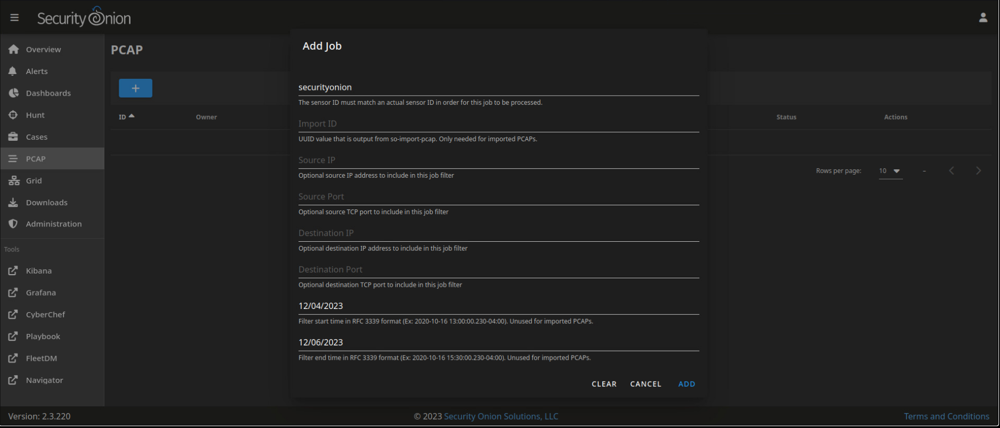

5. Click **Add**.
6. When **Status** is **Completed**, click the binoculars, then **Download**.

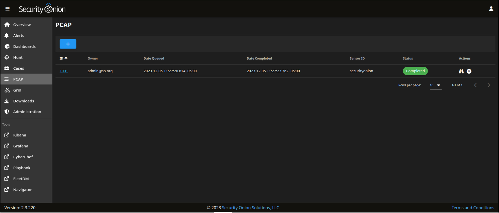

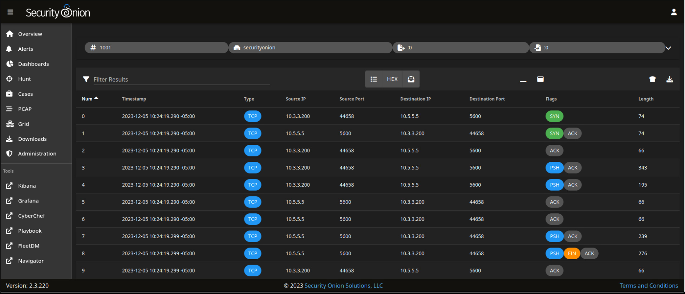

7. Using Wireshark, open the new packet capture.

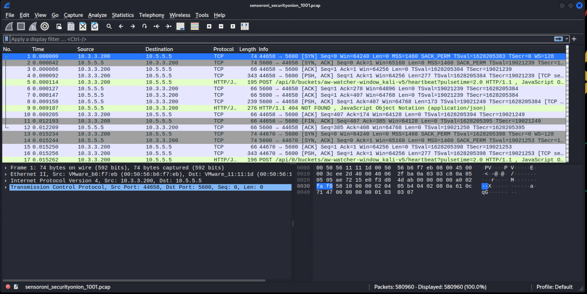

8. The challenge instructions mention looking for WebSocket data repeatedly sent over the network. Start by making a list of unique source IP addresses. Enter this command in a terminal:

```bash
tshark -r Downloads/sensoroni_securityonion_1001.pcap -2 -Tfields -eip.src | sort -n | uniq -c`, making sure to change the path and file name of your `PCAP` file.
```
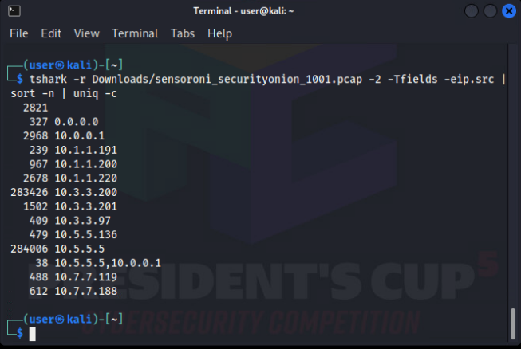

9. Using a WireShark source IP address filter, enter IP addresses until you find data that repeats. Filter on `ip.src == 10.1.1.191`. Notice the machine with an IP address of `10.1.1.191` is sending a message roughly every 15 seconds.

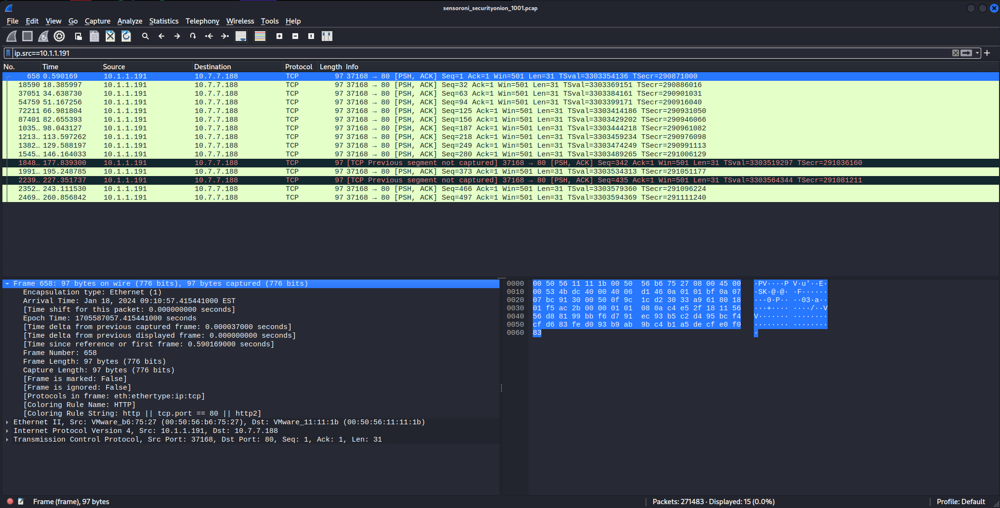

10. Select one of the packets and examine the TCP payload. You will see that it is 31 bytes in length. If you examine the other packets in this filtered view, you will see that all of them contain 31 byte payloads, but the data appears to be different in each packet. This is a good sign that we are on the right path.  

**Caution! Values will vary based on which packet is selected. Values *will not* match the exact values shown in the images below.**

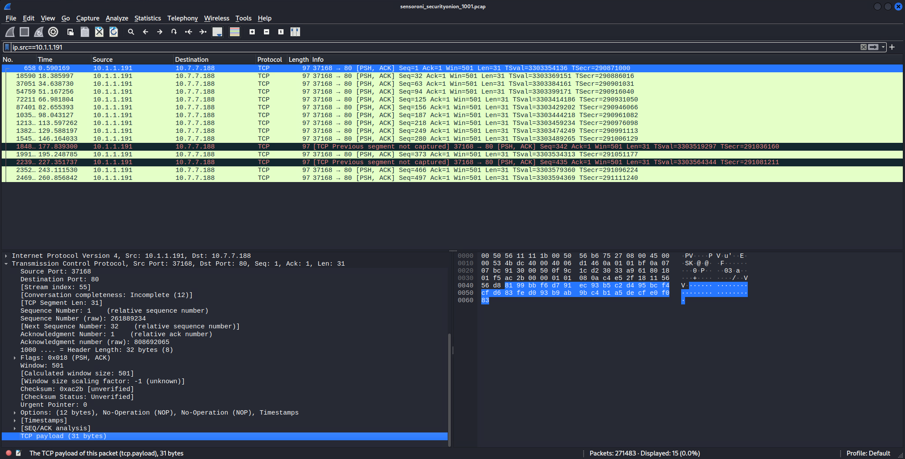

We know the following information about WebSocket data:
- The payload is 31 bytes, which is less than 125 bytes in length.
- Byte 0 is always 0x81.
- Byte 1 is the length of the payload data, which in this case, is 0x99 (153 in decimal). 
- Bytes 2, 3, 4, 5 hold the 4-byte xor key used to decode the payload data.
- The remaining bytes represent the payload itself. 
- For our data, 0x99 - 0x80 in hexadecimal is equivalent to 153 - 128 in decimal. 153 - 128 = 25, which is the length of the payload data, minus the first 6 bytes which are used to hold the message indicator (0x81), the length of the data (0x99) and the 4 byte key (0x95, 0x16, 0x1c, 0x89).

In the next steps, we will write a simple Python script to help decode the message. 

11. Open Visual Studio Code and select **New File**. When prompted, select **Python File** as the file type.

 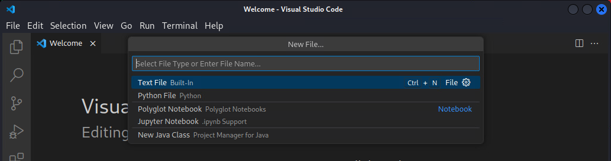

12. Add the code below to the file.

```python
index = 0
byteArray = bytes([])
length = byteArray[index + 1] - 0x80
output = bytearray()
xor = bytes([byteArray[index + 2], byteArray[index + 3], byteArray[index + 4], byteArray[index + 5]])
decodedText = ""

for i in range(length):
    bytePosition = index + 6 + i
    decodedText += chr(int(str(byteArray[bytePosition] ^ xor[i % 4])))

print()
print("Decoded WebSocket Message: ")
print(decodedText)
```
13. Copy the payload data from WireShark (right click, select **as Hex Dump**).

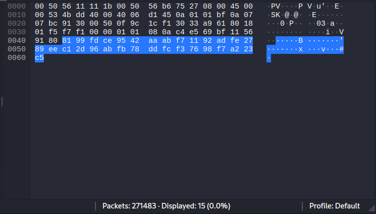

14. Paste it into the contents of the `byteArray` variable, removing all data that is not part of the 31 byte payload.

```python
byteArray = bytes([])
```

It will look similar to this, but your data will contain different values:

```python
byteArray = bytes([0x81, 0x99, 0xfd, 0xce, 0x95, 0x42, 0xaa, 0xab, 0xf7, 0x11, 0x92, 0xad, 0xfe, 0x27, 0x89, 0xee, 0xc1, 0x2d, 0x96, 0xab, 0xfb, 0x78, 0xdd, 0xfc, 0xf3, 0x76, 0x98, 0xf7, 0xa2, 0x23, 0xc5])
```

15. Save the file as `ws.py` in the **Documents** folder.
16. Open a terminal window, change to the **Documents** directory. Run

```bash
chmod +x ws.py
```

...to make the file executable.

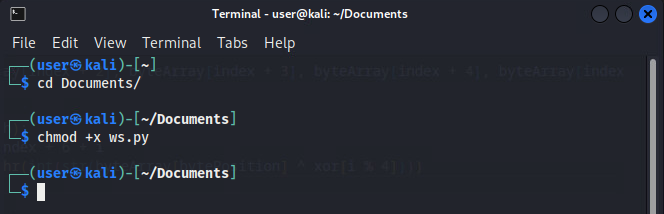

17. From the Visual Studio menu, select **Terminal > New Terminal**.
18. From the Terminal window, enter `cd Documents`.
19. Enter `python3 ws.py` to execute the script. 
20. Review the output of the script to retrieve the decoded message containing the WebSocket token.

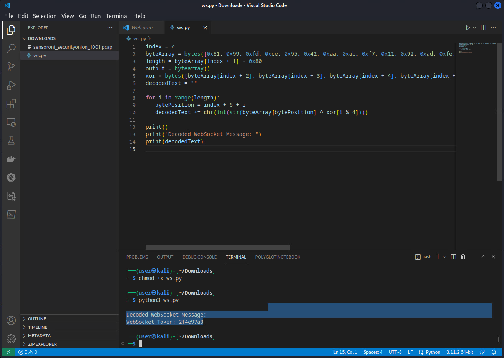

The correct submission for Question 4 is: `2f4e97a8`.
