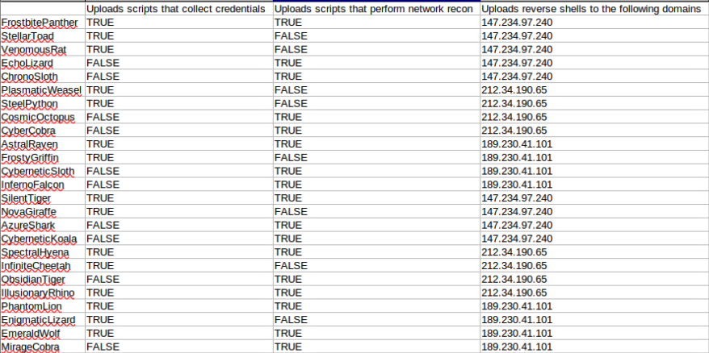

# A Beeautiful Sting Operation

*Solution Guide*

## Overview

In *A Beeautiful Sting Operation* players use a deployed T-Pot honeypot, investigate log and IDS data to identify threats and threat actors by their activities, techniques, tactics, procedures, and indicators of compromise.

Because *Sting* involves correlation between data stored in Kibana and data stored directly on the T-Pot system, there are multiple ways to approach each question. The procedures below are just one way to approach each problem without having to create new visualizations. These procedures take the most "basic" path to solve each question with the information and dashboards already available to you. You are free to try other methods in your solution attempts.

This solution guide assumes you are working through each question in order. Some instructions related to applying specific filters or how to access dashboards in Kibana may not be spelled out in later questions because they are covered in earlier questions.
## Question 1

*Which threat actor was responsible for breaching and then attempting to use a set of credentials that is present in your organization via SSH, Telnet, and FTP services on January 11th (UTC), 2024?.*

In the gamespace, retrieve the files labeled with **P1** from `https://challenge.us/files`. You'll need these to answer Question 1. 

Cowrie and Dionaea are the two honeypots in T-Pot that relay information related to SSH, Telnet, and FTP login attempts.

Look at the Cowrie and Dionaea dashboards in Kibana.

1. Browse to `https://10.7.7.200:64297`.
2. Select **Kibana**. 
3. Find the two dashboards, Cowrie and Dionaea, and open each in its own tab.
4. Change the date filter to **Absolute**, then change the filter to view the logs from **January, 2024**. See the screen print below.


​	The dashboards store all credentials used in attempted Telnet, FTP, and SSH connections, depending on   the dashboard you are looking at. Cowrie's dashboard collects Telnet and SSH data while the Dionaea dashboard collects data on FTP.


5. Locate the **Username** and **Password Tagcloud** graphs for both dashboards (yours will show several more passwords than the examples below).


6. *Most* importantly, in the **Password** graph, select the **Options** (three dots) icon, then **Inspect**. This provides a download link in CSV format of all of the passwords attempted so far.


7. Download this list of passwords. Do this for both the Cowrie and Dionaea dashboards to make sure you are seeing all three protocols -- Telnet, SSH, and FTP.


You have been provided with the shadow file (**P1-shadow**) for the accounts in your environment. You can't necessarily crack each of these passwords, but you can hash the downloaded list of passwords from Kibana and then compare against the shadow file for any matches.

8. Open the Cowrie and Dionaea dashboard datasets with something like **LibreOffice Calc**. Format the files so that just the password columns are left, by removing the count column and the first row. Your data should look like the following:


9. Double-check that each file only contains the password strings and no extra characters like `"` when viewing in other text editors. You may need to massage the data into a text file to be confident the CSV is not altering the strings before the next step.

10. You should then combine the two csv files' data together into one csv file through copy and paste, or whatever method you prefer. For the sake of the scripts below, name the file as `passwords.csv`.

11. Hash each item in the password files and write these hashes to a new file. We can see from the contents of the shadow file that the hashes are taken using the SHA-1 algorithm.


Therefore, we should do the same to our Kibana provided password lists.

12. Run the following looping script to write the SHA-1 hashes of the passwords to a new file:

```bash
while IFS= read -r line || [ -n "$line" ]; do
    clean=$(echo "$line" | tr -d '[:space:]') #optionally clean up the lines
    echo -n "$clean" | sha1sum | awk '{print $1}' >> hashlist.txt
done < passwords.csv
```

13. Repeat for each password file.

14.  When you have a complete hashlist file,  compare the hashes in the hashlist to those in the shadow file with this script:

```bash
while IFS= read -r hash || [ -n "$hash" ]; do
    matching_line=$(grep -F "$hash" "shadow.txt")
    if [ -n "$matching_line" ]; then
        echo "$matching_line"
    fi
done < hashlist.txt
```

(Remember to name your files accordingly for both scripts.)

15. Run this script and see the results in the terminal:


You should find 10 unique users present in your shadow file whose passwords were found in the Telnet, SSH, and FTP attempts. Duplicates in the output are OK, this just means the credentials may have been used against multiple protocols or multiple times during the login attack.

16. Lastly, search for any of these users and their passwords in the **P1-breach-report.pdf**. The only entry that matches is the threat actor and the answer to Question 1.

## Question 2

*Which threat actor was responsible for attempting to login to the fake Cowrie filesystem today (i.e. during the challenge) based on its IP address after correlating that IP to prior activities on the early hours of December 15th, 2023 (UTC)?*

Retrieve the files labeled P2 from `https://challenge.us/files`. 

1. In Kibana, browse to the Cowrie dashboard: `https://10.7.7.200:64297`.

2. Scroll down to see the IP addresses from today (during the challenge) attempting to log into the Cowrie SSH service. Ignore any alerts coming  from `10.5.5.5` (`challenge.us`) because they are logging checks. Focus on the other IP address found in the logs. This is the IP address of the attacker in your gamespace, and this IP drives the analysis.


In the example screen print above, the IP address of the attacker is `160.238.71.80`.

3. Change the date filter in the upper right to view the logs and alerts from **December 14, 2023** and **December 15, 2023**. You should see logs and alerts from 26 unique source IPs (remember, ignore `10.5.5.5`).


4. Create a `src\_ip` filter for the IP identified in the previous step using the filter option in the upper left.


The beneficial piece of information from the dashboard is the **Top Downloads** for this IP address. From the perspective of Cowrie, a *download* is actually something the attackers tried to *upload* via SCP.

Therefore, we want to investigate these files and the dashboard tells us the exact filepath to each one on the T-Pot system.


5. Change to the T-Pot system console, or login via SSH from your Kali system. 
6. Change directories to `/data/cowrie/downloads` and use `sudo less` on each file to view its contents and determine their purpose.

The files uploaded to the Cowrie fake filesystem are:

```
018e8f24...: A script that appears to wipe log files
52029ee1...: A script that appear to run nmap scans
676544da...: A binary that requires further analysis
7a4cabf5...: A script that appears to encrypt or XOR data
7f87ed15...: A binary that requires further analysis
a7b53055...: A script that appears to collect and compress/archive credentials
b8c33a60...: A binary that requires further analysis
```

These actions are present in the Threat Actor Matrix file, and you can start reducing the pool of potential candidates by removing the actors who do not have a "**TRUE**" value for the script functions you have identified coming from your attacker.

7. Referring to the example above, remove any threat actor who does not have a "**TRUE**" value under the columns for running nmap scans *and* scripts aimed at collecting credentials.



This reduces the overall list down to just these lines:


8. Inspect the binary files next. Copy them to your Kali system via SCP from the T-Pot server. The files are located at `/data/cowrie/downloads`. You truly only need to analyze the one that was uploaded by your attacker based on the logs above.


There are ways to reverse the .elf, but a simpler method to see if and what the .elf file connects to is to run it while watching Wireshark to see if it tries to connect to one of the malicious IPs in the matrix.


The binaries attempt to connect to these IPs:

```
676544da...: 189.230.41.101
7f87ed15...: 212.34.190.65
b8c33a60...: 147.234.97.240
```

In the example above, our actor is attempting to direct us to `212.34.190.65`.

9. Whittle down the possible list of threat actors using the information gathered on the uploaded scripts and binary. You should be left with two possible threat actors based on the upload activities alone.


10. Shift to the **download.csv** log file. This file lists all of the files retrieved by attackers. Sort the CSV by the **src_ip...** column, which sorts by IP address. Only look for the logs tied to your attacker's IP address.


For your target IP two types of files were retrieved. In this example, the types are 1.) intellectual property or sensitive files, and 2.) files containing PII or personnel information.

11. Determine the sole threat actor from the two possible choices remaining in the Threat Actor matrix. The name of the threat actor is the answer to Question 2.

You could do the reverse process by looking at the retrieved files in the download logs first. However, you are left with at
least two possible options of which requires analyzing the binary file to reduce the set to one.

Analyzing the data in either direction gets you close enough to guess, but you must tackle the problem by analyzing both the uploaded *and* downloaded files to come to one definitive conclusion.

## Question 3

*How many email messages received by the open relay on January 12th, 2024 (UTC) match the corresponding threat actor information found in the phishing reports based on the email messages received by the relay today (i.e. during the challenge)? Your answer should be on the order of tens of messages.*

Retrieve the files labeled **P3** from `https://challenge.us/files`. 

Review the logs for the Mailoney dashboard and honeypot, which collects all attempts and email messages sent to the fake relay at `123.45.67.89` over port `25`.


You should see two records of "attacks" coming from two separate IP addresses, each from a different country. These change for each deployment. Your countries may not match the above records.

First, correlate these countries with the threat actor list in the **phishing-breach-report.pdf** file from `challenge.us/files`.


You will find one, and *only* one, threat actor who used both of these countries of origin. The name of the threat actor may change
for each deployment.

You now know which malicious domains this threat actor uses in their malicious attachments. Next, review the attachments from  `challenge.us/files` for any references to, or macros pointing to, these domains/URLs.

You can view the files and most seem innocuous. However, upon opening some of the Word files: 


Given no other indicators, macros may be a way of tricking a user into visiting a malicious site upon opening this file.

Since we don't have access to Microsoft Office, we'll have to view macros within the native LibreOffice Writer application. Go to **Tools**, **Macros**, **Edit Macros**.

Expand the Object Catalog tree to see the macros attached to this file under Module 1 which has a type of AutoOpen.


You will find a domain that is listed on the **phishing-report.pdf** document. However, this specific domain may not apply to your threat actor.

Continue searching through each Word doc for evidence of other Macros and other domains. All in all, the following documents  point to the following domains or URLs from the phishing report. Any other domains or URLs can be ignored. 

```
BudgetSummary.docm -> https://maliciousness.biz
MeetingMinutes.docm -> https://cyberthreatsolutions.inc
ProjectProposal.docm -> https://hackerhideout.org
Quarterlies.docm -> https://malwaremasters.net
TrainingManual122.docm -> https://hacksforquacks.com
```

We now know: our threat actor, their country, and what attachments are associated with the malicious domains. We can correlate how many emails were received with these attachments.

First, filter for just the emails that came on the dates in question (**January 12, 2024**) and then filter for just
the countries associated with the threat actor identified earlier.


You can filter for each country by creating a filter in the top left of Kibana:

1. Click the blue "**+**" symbol to create a filter. 
2. Select the **geoip.country_name** field, choose an operator of "**is one of**" and add the country names as they appear in the results. (*Hint: You can figure out the specific field to use by clicking one of the countries in the **Attacks by Country - Dynamic** graph, which applies that country name as a filter*).


3. Click **Add filter** to apply it. T-Pot's default dashboard only shows the top 10 IP source addresses, so we'll manipulate the dashboard a bit to see what IP's are associated with our two countries to further refine our logs. To do this, edit the existing visualization. 
4. Click the **Edit** button in the upper right of the page. 
5. Then, return to the visualization for **Src IP -- Top 10 -- Dynamic**.


Click the cog wheel icon in the upper right and select **Edit visualization**.


Under the Buckets heading, increase the Size to 200 or higher (we saw earlier that only 200 IPs were seen from these two countries) and click Update. This will allow us to see every IP used in the email campaign.


Click Save and Return in the upper right. Click Save again in the upper
right on the main dashboard page and return to view mode by clicking the
link to the Save button.

Ensure you are still Filtered for your two countries.

Now that we can see all of the IP addresses used, start recording all of
the unique prefixes used, each network is a /24. You can download the
list of IPs as a csv just like we did in question 1. Download the
records via csv by clicking the three dots -> Inspect -> Download CSV
-> Raw CSV.

Open the csv with Calc, and then sort the IP column so we can chunk our
records by prefix. Filter the list down by preserving only one of the
IPs from each /24 subnet. Since every IP comes from one of these 10
subnets, we can use this to correlate the mail records.


We can also grab the full mail logs, to include the IP source, mail
sender, mail recipient, message, attachment, etc from T-Pot. The files
are located at /data/mailoney/log/commands.log and
/data/mailoney/log/mail.log. SCP those to your kali system.


Either of these files could perhaps get us our answer, but we will use the **mail.log** file in this instance.

We now know what IPs to filter for and what attachments are associated with the malicious domains for our threat actor. To recap:

In the example provided in this guide, we are looking for mail coming from IPs in the `155.236.123.0/24`, `155.236.187.0/24`, `155.236.231.0/24`, `155.236.45.0/24`, `165.4.100.0/24`, `203.162.150.0/24`, `203.162.177.0/24`, `203.210.134.0/24`, `203.210.171.0/24`, and `203.210.230.0/24` subnets and have attachments of either **MeetingMinutes.docm**, **TrainingManual122.docm**, or **BudgetSummary.docm**.

All we need to do now is a multi-stage `grep` to get our number of emails:

```bash
grep -E
'155.236.123|155.236.187|155.236.231|155.236.45|165.4.100|203.162.150|203.162.177|203.210.134|203.210.171|203.210.230' mail.log | grep -E 'MeetingMinutes.docm|TrainingManual122.docm|BudgetSummary.docm' | wc -l
```

This command greps for the lines that include any of our IPs, then greps those results for lines that include the attachment names we want, and finally delivers the total number of lines that match these parameters. The number we get is the answer to Question 3.

## Question 4

*How many different/unique Suricata alert signature IDs are generated from an all-inclusive enum4linux scan (e.g. enum4linux -a 10.10.10.100)?*

Retrieve the files labeled **P4** from `https://challenge.us/files`. 

The question provides a hint on how to complete the rest of this task. The scan report shows a list of common scans used by the
threat actor for your gamespace.


The `enum4linux` scan will always be one of the scans present.

The easiest way to solve this question is to run an `enum4linux` scan against the honeypot VM, just as written in the scan report and then see how many unique Suricata alert ID events are created.

Apply the proper network settings to the Murder Hornet system:

```bash
sudo ifconfig eth0 130.100.100.100/1
sudo route add default gw 128.1.1.1
```

Run the following scan command:

```bash
enum4linux -a 123.45.67.89
```

View the Suricata Dashboard in Kibana (filter for just your IP address if need be).


Regardless of how many event logs this traffic generated, you should see only four unique signature IDs being triggered -- `2023997`, `2102466`, `2102472`, and `2102475`.


Therefore, 4 (four) is the answer to this question.

## Question 5

*How many total Suricata log events (not unique types) match the Suricata alert signature IDs attributed to scans used by the threat actor in the scan report based on the activities observed on January 10th, 2024?*

Knowing the above, it's a good idea to test the other common scans on your scan report against `123.45.67.89` to see how many unique alert signature IDs come up. You may want to apply a new address for each test scan to keep things from being comingled, i.e.: `130.100.100.101`, then `130.100.100.102`, etc.

Each gamespace may ask about different types of common scans, though every report will ask about `sqlmap` and `enum4linux`. Your gamespace will include one of the following two scans:

```bash
nmap -sT -T5 -p1-65535 [target_ip]
nmap -f [target_ip]
```

...and one of the following three scans.

```bash
nmap -sA -T5 -p1-65535 [target_ip]
nmap -sF -T5 -p1-65535 [target_ip]
nmap -sX -T5 -p1-65535 [target_ip]
```

If you repeat the common scans in your report you should find the following mappings of scans to unique alert signature IDs.

```bash
sqlmap -u http://123.45.67.89/user.login: 2006445, 2006446, 2008538,
2011042, 2016935
nmap -sT -T5 -p1-65535 123.45.67.89: 2002910, 2002911, 2010935, 2010936,
2010937, 2010938, 2010939, 2100615, 2101418, 2101420
nmap -f 123.45.67.89: 2002910, 2009582, 2002911, 2010935, 2010936,
2010937, 2010939, 2014384, 2100615, 2101418
nmap -sA -T5 -p1-65535 123.45.67.89: 2009582
nmap -sF -T5 -p1-65535 123.45.67.89: 2009582
nmap -sX -T5 -p1-65535 123.45.67.89: 2009582
```

You may need to follow the same steps as you did for the Mailoney visualization to increase the bucket size of the Suricata Alert
Signature -- Top 10 visualization to guarantee you are seeing every alert signature. However, no single scan ever accounts for more than 10 unique signature IDs.

Now that we know all of the unique signature IDs we are looking for we can start filtering events for just these event IDs
*and* the country of origin as the **geoip.country_name**.

Remove any current IP filters used during testing.

Look at events from the correct date of **January 10, 2024** by applying the date filter range as you did in previous questions.

Next, add a **geoip.country_name** filter just as you did in previous questions.


This reduces the total number of events by roughly 80% but it is not exact because each country is responsible for a different amount of traffic.

Next, add a filter for **alert.signature_id**, use an operator type of "**is one of**",  and add each signature ID number that you identified earlier.


Apply this filter. You should have the total number of events applicable to this threat actor's scan types. This number is much less than the total number of events for this country, as other chaff scans not included in the scan reports were run by other IPs.


Based on the following threat actor names, determine the following number of events apply to each:

```
Shadow Cobra | Australia | 380 events
Sinister Raven | United States | 363 events
Cryptic Serpent | Canada | 355 events
Enigmatic Viper | Germany | 378 events
Malevolent Phoenix | United Kingdom | 382 events
```

The number of events is the answer for submission to Question 5.
