# And I Attacked It, My Way

*Solution Guide*

## Overview

*And I Attacked It, My Way* asks players to analyze three different websites, find vulnerabilities, exploit those vulnerabilities to access the websites, and ultimately retrieve important data.

> **Note:** If the websites are not available immediately upon starting the challenge, please give the challenge a few minutes to start up and try again.

## Question 1

*What is the 8-character hex string found after successfully logging into the website* `http://baratie.merch.codes`*?*

1. Log into the Kali VM, open Firefox, and browse to: `http://baratie.merch.codes`. A green login page asks for your username and password with no other visible information present.

2. Attempt to log in with a random username and password to view the page's response. You are redirected to a new page showing your authentication check has been added to the queue. The website will process your login attempt, and eventually, you are redirected to the login page with a message stating the credentials you entered were incorrect. 

   The important thing to note is that the website uses a *queue-based* login system. This is a hint: if the website uses a queue, then maybe it can be overloaded with too many requests causing the site to crash.

3. As part of this solution guide, the Python script below was created to make requests to login. You can view the script below.

```python
#!/usr/bin/python3

import requests, sys
while True:
    ## For the `data` in the `POST` request below
    # The key's match the name of the associated `input` element on the `baratie.merch.codes` login page
    # values are the random login creds im testing with
    try:
        resp = requests.post("http://baratie.merch.codes/login", data={"username":"user","password":"password"})
    except Exception as e:          # This will print an error if one occurs
        print(str(e))
    else:
        continue
        #print(resp.status_code)            ## This command will show the response code from your request, can be helpful if requests are failing.
```

4. Execute the Python script and wait.
5. Refresh the login page every minute. When done correctly, the page changes and presents new information. See the screen print below.

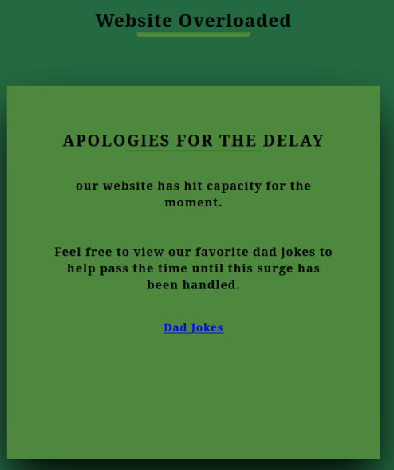

There is a file available for download on the page called `dad_jokes`. Open it if you want a quick laugh. :smiley:

6. Look at the source code of this page. Upon viewing the code around the `dad_jokes` file, you should see that the file referenced is located at the URL: `/download/dad_jokes`.
7. Based on that information, attempt a *directory traversal*, and browse to: `http://baratie.merch.codes/download/` to see if it can be viewed and if other files are present.
   A page in JSON format listing the files that are present is displayed. Focus on the file named `backup`. 

8. Browse to `http://baratie.merch.codes/download/backup`. This triggers the file download.
9. View the file. It contains the credentials to log in:

```
username:   grubbin
password:   red_l3g_zeff
```

The website needs to process the queue (you can view the status by clicking the link on the `overloaded` page). 

10. Once the website has handled the overload and returned to normal, log in with the newly found credentials. You are presented with your first token--the answer to Question 1!

## Question 2

*What is the 8 character hex string found after successfully logging into the website* `http://impel.merch.codes`*?*

The following procedures explain how to brute force the username and password *manually*. You could also write a script to accomplish this. See the section titled, "Exemplar Python script" below.

### Step 1: Brute force the username

1. Browse to: `http://impel.merch.codes`. A blue login page asks for your username and password with no other visible information present. Two things of note on this page:

- The **Password** field has a **Show Password** checkbox that when enabled shows the password in plain text.
- The notice tells us **Username** and **Password** are case sensitive.

2. Attempt to log in with a random username and password to view the page's response. You get a brief **Timeout Delay** for entering an incorrect login. Knowing an incorrect username and password submission causes a timeout delay is important when trying to gain access.

Testing different methods of attacks and injects shows us that the website acts differently when doing SQL injects.

You can't see the results of a SQL inject so the method of attacking this website is different. We'll have to do a *blind SQL injection*. Expect a lot of trial and error.

This type of injection requires an attacker to know the database table structure, but you can surmise that the table names match the labels on the inputs on the login form. So, the tables you will prioritize are `username` and `password`.

Craft a new query for use as the login credentials that allow for a wider possibility of being correct. For the purposes of this solution guide, we'll use the `like` command because it can query for substrings and still return records. 

For example:

```
123' or username like 'a%
```

Where each part is described:

- `123'`: Assume the query is doing some `select` statement on the backend.  By entering this, you trick the website into thinking the first part of the query has been completed.
- `or`: Makes it so if either parts of the query return results (are correct), the username part of the login will pass. You may not know the username, but if your inserted query on the second part is correct then you will know.
- `username like '%a'`: Searches the `username` table and returns records that start with the letter `a` if there are any. **Remember!** The `like` SQL command returns results that are *not* case-sensitive.

3. Enter that string in the **Username** field and enter a random password in the **Password** field. The site responds with a timeout, so we now know the account does not start with an "a".
4. Run the query using all alphanumeric characters (a-z, 0-9) one at a time. When you arrive at the letter "f" (` 123' or username like 'f%`) the response from the website is not a timeout. Instead, you're presented with this response: **Incorrect Credentials Entered**. This is your hint that your blind SQL inject worked. Assume the username starts with the letter "f".
5. To determine the username, repeat Step 4 changing the query slightly until you've built the whole username. 

For example:

```
123' or username like 'f0%
```

then

```
123' or username like 'f0r%
```

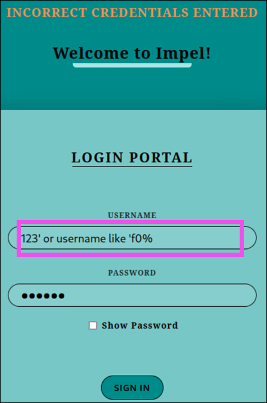

The username is some case variation of the string `f0rtr3ss` because the SQL command `like` returns results that are not case-sensitive. Searching for the string `f%` returns results starting with both an "f" and an "F". 

You won't determine the exact username until you start brute forcing for the password. For now, just knowing that the username is some form of `f0rtr3ss` is good enough.

### Step 2: Brute force the password

Now that you understand how the responses from the website prove how your blind SQL injects work, you can apply the same methodology to find the password.

You need the exact username before you can begin to brute force the password. You already know it is some version of `f0rtr3ss`. Applying the same methodology as you did in **Step 1** above:

1. Create variations of the `f0rtr3ss` username; each variation should contain different combinations of uppercase and lowercase letters.
2. Cycle through *all* of the possible usernames and a random password. If the response times out, the username is incorrect. If the response does not timeout, then you know you have the correct username.

The correct username is: `F0rTr3sS`. Now, we can start trying to get the password.

3. On the Impel website, enter `F0rTr3sS` for the username and a query similar to the one used in the steps above for the password. 

The new query:

```
123' or password like 'a%
```

You are presented with that **Incorrect Credentials Entered** message again. 

4. Run the query using all alphanumeric characters (a-z, 0-9) one at a time. When you arrive at the letter "p" (` 123' or password like 'p%`) the response from the website changes. Instead of **Incorrect Credentials Entered**, you're presented with: **Authentication Failed**. This is your hint that your blind SQL inject worked. Assume the password starts with the letter "p".
5. To determine the password, repeat Step 4 changing the query slightly until you've built the whole password. 

Eventually, you'll discover the *case-insensitive* accepted password is:  `p0rtga5dac3`. Using that password to log in won't work because of case sensitivity. 

6. Create variations of the `p0rtga5dac3` password; each variation should contain different combinations of uppercase and lowercase letters.
7. Cycle through *all* of the possible passwords and the correct, `F0rTr3sS`, username. 

The correct password is: `p0rTGa5DaC3`. A successful login to the Impel website presents you with the token that is the answer to Question 2.

### Exemplar Python script

For the purposes of this solution guide, an exemplar Python script that can be used to automate these tasks can be found here: [blind_sql.py](./script/blind_sql.py).

## Question 3

*What is the 8 character string found on* `https://baroque.merch.codes` *after logging into the account of the website owner?*

### Step 1: Find the owner's account info

1. On the Kali VM, browse to `https://baroque.merch.codes`, accept the security risk, and click the **Signup** link.
2. On the `/signup` page, read the note. The note states:


3. Create an account leaving the username blank, and **sign in** using the Email and password you just created. The default assigned username is the *first character of your first name* plus the *first four characters of your last name*. 
4. Click **My Profile**, then **Update Information**. The fields available on your account are: **First Name**, **Last Name**, **Username**, **Email**, **Password**, and **Personal Notes**. (The **Personal Notes** field will be important later.)

Baroque is the only website that uses `HTTPS` -- a hint that you should investigate the SSL Certificate.

5. In Firefox, **open the application menu** (the hamburger icon in the top right), then **Settings**. 

6. Enter "certificate" in the search field. In the results, click  **View Certificates**, then **Servers** tab.  You should see the certificate for `baroque.merch.codes:443`. See the screen print below for reference.

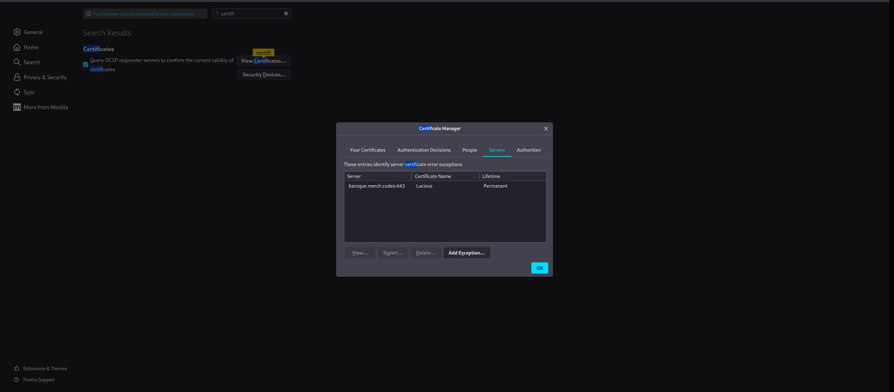

7. Select the entry for `baroque.merch.codes`, then **View**.

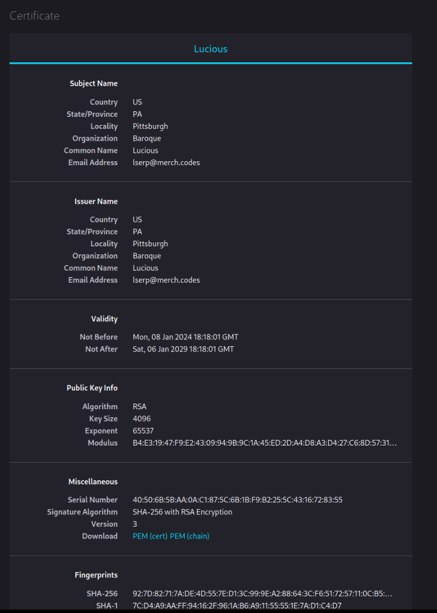

The owner's name is Lucious and their email address is `lserp@merch.codes`. 

8. Find Lucious's last name by right-clicking any HTML page and selecting **View Page Source**. In the  `<meta>` tags at the top of the file, one contains the following line: `"Owned, Created, and Managed by Mr. Serpentine"`.

You now have the owner's first name, last name, username (`lserp`, created by default), and his email address (`lserp@merch.codes`).

### Step 2: Find the vulnerability and attack

If you continue to analyze the website, you'll find the JavaScript used on any given page isn't hosted locally but pulled from `https://10.1.1.74`. 

1. On any webpage, right-click, then **View Page Source**. The `script` tag references the endpoint `/fetch_js` and passes the parameters `js=search.js`.
3. Click the `/fetch_js?js=search.js` URL to view the JavaScript code.
4. View the `fetch_js` endpoint without any arguments by browsing to: `https://baroque.merch.codes/fetch_js`. On that page, you see the following message indicating the JavaScript files are hosted on the server located at: `https://10.1.1.74`.

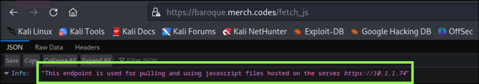

4. Browse to `https://10.1.1.74`. All of the JavaScript files are available for download. There is a `login.js` file present which handles the process of logging in. Editing or manipulating this file is how you'll access owner Lucious Serpentine's account.

If you try to `POST` a file to `https://10.1.1.74`, you get the message: `api_key not present and required for POST`. You don't have the API Key yet, so back to browsing the website.

If you tested different attacks (e.g., SQL injection, server-side template injection, cross-site scripting attack) you may have found that the form to list an item to sell (click **Shop**, then **List Item!**) has a vulnerability present.

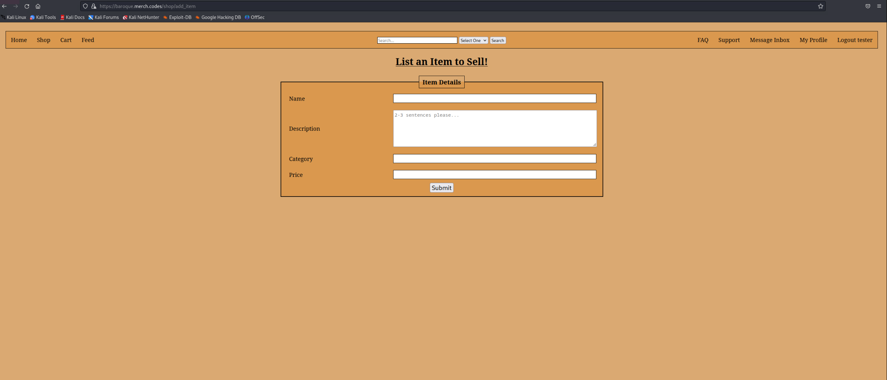

The vulnerability present allows for a stored SQL injection. This is where a SQL injection is submitted into a website where it is stored, and when the record with that data is processed on the website, the code is executed. The vulnerable field is **Category** on the **List an Item to Sell!** (`add_item`) page.

5. Go to **Shop**, then **List Item!**.
6. You may not know the structure of the SQL database just yet, so begin by entering any SQL injection into the **Category** form. For example, enter:

```
' or 1=1'
```

7. Complete the remaining fields on the form and click **Submit**. On the **Shop** page, on the left navigation menu with the other categories (Audio, Fashion, Technology, Toys, etc.) your new "category"--that is, your SQL injection appears at the bottom.

6. Click your SQL injection "category". 

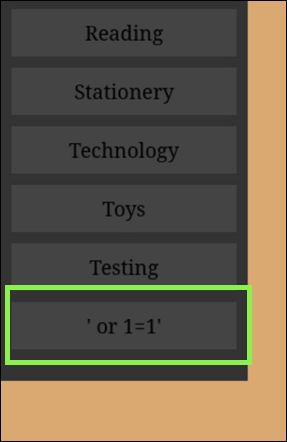

You should see an error page similar to the screen print below telling you a database error has occurred and the SQL query that caused it.

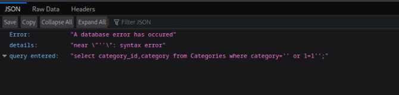

The error page tells you what the expected query is: 

`select category_id,category from Categories where category={}` where `{}` is the category selected and, in this case, your inject.

Assume the table you want is `user`, and the column you want data from in that table is `notes`. Recall from the previous section, "Step 1: Find the owner's account info", that the **Personal Notes** field will become important. Each user has their own **Personal Notes** -- this is the column of data you want from the owner's account. 

Knowing this, you can craft a new query:

```
' union select username,notes from user'
```

9. List a new item for sale putting the new query in the **Category**. See the screen print for reference prior to submitting.

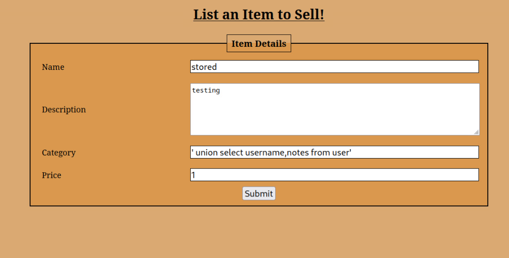

10. Click **Submit**. 
11. In the left navigation tree, click your latest SQL injection "category". Your inject executed. It should look similar to the screen print below.

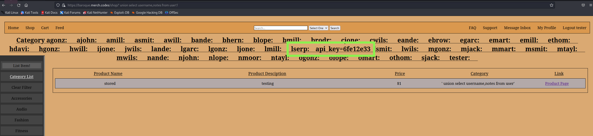

There is user `lserp` , and right next to them is the string: `api_key=61e12e33`. With this API Key you can send `POST` requests to the API.

### Step 3: POST new login.js to overwrite existing file

1. Download the current `login.js` file from `https://10.1.1.74`.
2. Edit it so it permits you to log into the owner's (Luscious Serpentine, i.e. `lserp`) account.  Click [here](./script/login.js) to view an example of the edited file for the solution guide.
3. Next, you need to send the `POST` request with this new file. You can use a script like [this one](./script/post.py) to do so.
4. Verify that it uploaded by viewing it on `https://10.1.1.74`. Thanks to the manipulated JavaScript file, regardless of authentication, the user associated with the email address can be logged in with *any* password.  
5. Click **Login**, then sign in with`lserp@merch.codes` and any password.

The third and final token is shown on the page!

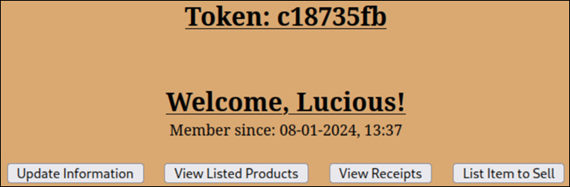