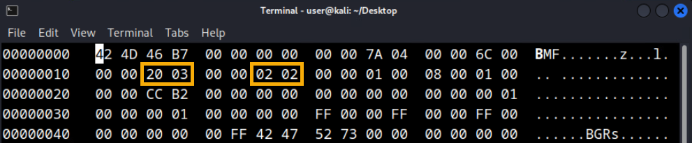
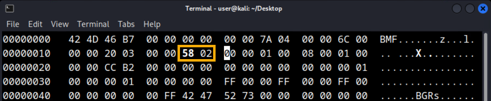
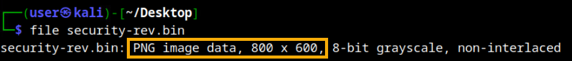
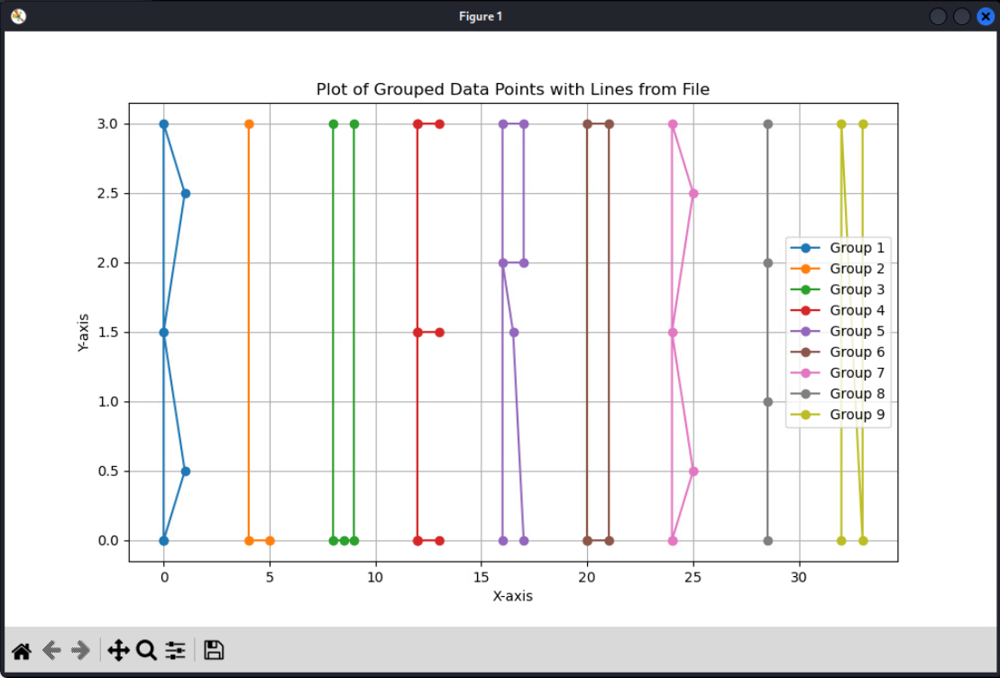
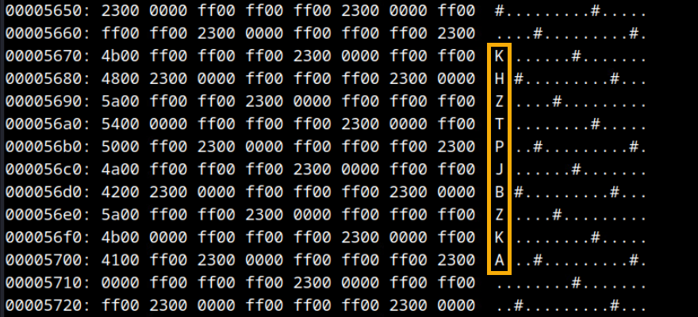

# Different Lens

*Solution Guide*

## Overview

*Different Lens* requires competitors to examine a website and make sense of data that is out of place and obfuscated.

>**Reminder!** Reading this solution guide *before* attempting the challenge will lead to the false notion that this challenge is easy to solve.

## Question 1

*What is the Red Token?*

1. On the Kali machine, browse to `10.1.1.155`, the Hacker Group website.

2. Review the **Home** page, **Ethos** page, **Motivational Quotes** page, and **About Us** page. On the `10.1.1.155/quotes` page, we see three motivational quotes as bitmaps (bmp). Each has a filename which is four hexadecimal characters. Create a script to search the website for any other bmp files that follow the same naming pattern. 

3. Right-click on the Kali Desktop and select `Open Terminal Here`

4. Type `mkdir Q1` and press `Enter` to make a new folder. Navigate to the newly created folder by typing `cd Q1` and pressing `Enter`. 

5. Type `nano token1-curler.sh` and press `Enter` to open the `nano` text editor. 

6. Copy the pre-made script below into the nano editor window.

    ```bash
    for i in {0..65535}; do
        hex=$(printf "%04x" $i)
        base_url="10.1.1.155/quotes"
        file_name="${hex}.bmp"
        full_url="${base_url}/${file_name}"
        echo "Downloading ${file_name}..."
        curl -O "${full_url}"
    done
    echo "Done"
    ```

7. When finished, press `Ctrl+o` and then `Enter` to write out your changes. Then press `Ctrl+x` to exit.  

8. In the terminal, run the script using the following command: 

    ```bash
    token1-curler.sh
    ```
    >**Note: This script will take up to thirty (30) minutes to complete.**

9. While this script is running, open up a new terminal and watch for any bmp files that are downloaded and larger than the others. You can continue to run the command below to do this.

    ```bash
    watch ls -lhaS
    ```

    In this example, we see **17ec.bmp** is ~46KB large and has been downloaded! 

10. Run the command below to view this file.

    ```bash
    open 17ec.bmp
    ```

    In the Image Properties, we see this image is not 800 x 600 like the other images. It is 800 x 514! Let’s change this back to 800 x 600 and see if we discover anything. The quote also mentions "*Look around. Look within.*" This is a hint.

11. In a Kali terminal, run the command below to create a backup of the file:

    ```bash
    cp 17ec.bmp 17ec.bmp.bak
    ```

12. In a Kali terminal, run the command below to open the file in `hexedit`:

    ```bash
    hexedit 17ec.bmp
    ```
    Here we see a hexdump. Each pair of hexadecimal characters is one byte. In the second row, third and fourth byte, we see **20 03** (0320 in hex is 800 in decimal). In the second row, seventh and eighth byte, we see **02 02** (0202 in hex is 514 in decimal). 
    
    

    Change this to **58 02** (0258 in hex is 600 in decimal). Once you make the changes, press **CTRL+X** then **Y** to save the changes.

    

13. Let’s see if the image is larger using the command below. Run the command to view this file.

    ```bash
    open 17ec.bmp
    ```
    The red token is in the top-right corner and is the answer to Question 1.

## Question 2

*What is the White Token?*

Within the last few years there has been a push for **security.txt** to be used by organizations in their websites. The primary purpose is to provide researchers with contact information they can use to report identified security vulnerabilities. An example of a **security.txt** file can be viewed at `https://www.cisa.gov/security.txt`.

1. Browse to `10.1.1.155/security.txt`. Reviewing, this does not appear to be a legitimate **security.txt** file!

2. Download this file using the command below:

    ```bash
    wget 10.1.1.155/security.txt
    ```

3. Looking at this file, it appears to be a hexdump. We also see some inconsistencies within the zeros. For instance: reading left to right, we see some zeros start, stop, and start again. However, if we read right to left, we see all zeros are together within their stretch.

4. Let’s reverse each line and convert this back to binary from hexdump. Reverse the text and save as a new file using the command below:

    ```bash
    rev security.txt > security-rev.txt
    ```

5. Install xxd:

    ```bash
    sudo apt install xxd
    ```
6. Convert from hex to binary:

    ```bash
    xxd -r -p security-rev.txt security-rev.bin
    ```
7. The `file` command can be used to see what type of file this is. In a Kali terminal, run the command: 
    
    ```bash
    file security-rev.bin
    ```
8. Here we see another 800 x 600 image; however, this time it is a png. 

    

9. Use the `open` command to view the image:
    
    ```bash
    open security-rev.bin
    ```
    The image contains the white token, which is the answer to Question 2.

## Question 3

*What is the Blue Token?*

A **robots.txt** file is designed to tell search engine crawlers which URLs the crawler can access on a website. The purpose is to prevent the site from becoming overloaded with requests. An example of a **robots.txt** file can be viewed at `https://www.cisa.gov/robots.txt`. 

1. Browse to `10.1.1.155/robots.txt`. Notice that it contains data like the data shown below. This is not the expected content of a **robots.txt** file and, instead, appears to be plot points.  

    ```
    1-1: (0.00, 0.00)
    1-2: (0.00, 3.00)
    1-3: (1.00, 2.50)
    1-4: (0.00, 1.50)
    1-5: (1.00, 0.50)
    1-6: (0.00, 0.00)
    2-1: (4.00, 3.00)
    2-2: (4.00, 0.00)
    2-3: (5.00, 0.00)
    3-1: (8.00, 3.00)
    3-2: (8.00, 0.00)
    3-3: (8.50, 0.00)
    3-4: (9.00, 0.00)
    3-5: (9.00, 3.00)
    <snip>
    ```
2. Download the `10.1.1.155/robots.txt` file and rename it: `points.txt`.
    ```bash
    wget -O points.txt 10.1.1.155/robots.txt
    ```

3. A script could be created to plot these points. In a Kali terminal, type `nano token3-plot.py` and press `Enter` to open the `nano` text editor.

4. Copy the pre-made script below into the nano editor window.

    ```python
    import matplotlib.pyplot as plt
        
    def read_points_from_file(file_path):
        data = {}
        with open(file_path, 'r') as file:
            for line in file:
                key, value = line.strip().split(': ')
                x, y = value.strip('()').split(', ')
                data[key] = (float(x), float(y))
        return data
    # Read data from file
    data = read_points_from_file('points.txt')
        
    # Grouping data points by their first number (e.g., 1-X, 2-X, 3-X)
    grouped_data = {}
    for key, value in data.items():
        group = key.split('-')[0]
        if group not in grouped_data:
            grouped_data[group] = []
        grouped_data[group].append(value)
        
    # Plotting each group with connected lines
    plt.figure(figsize=(10, 6))
    for group, points in grouped_data.items():
        x = [point[0] for point in points]
        y = [point[1] for point in points]
        plt.plot(x, y, marker='o', linestyle='-', label=f'Group {group}')
        
    plt.title('Plot of Grouped Data Points with Lines from File')
    plt.xlabel('X-axis')
    plt.ylabel('Y-axis')
    plt.legend()
    plt.grid(True)
    plt.show()
    ```
5. When finished, press `Ctrl+o` and then `Enter` to write out your changes. Then press `Ctrl+x` to exit. 

6. Run the script using the following command: 
    ```bash
    python3 token3-plot.py
    ```

7. In the plotted output you will see the blue token, which is the answer to Question 3.

    

## Question 4

*What is the Black Token?*

A **favicon** is a file containing one or more small icons that are associated with a website. They are used to represent the website in places such as shortcuts, browser tabs, and browser bookmarks. An example of a **favicon** can be viewed at `https://www.cisa.gov/profiles/cisad8_gov/themes/custom/gesso/favicon.png`. 

1. The **favicon.ico** on the Hacker website is a much larger file than normal. Use your browser to view the favicon by browsing to `10.1.1.155/favicon.ico`. 

    Here we see an image with yet another quote; however, there appears to be something strange happening at the upper-right corner. The quote says, “*If you can look up, you can get up.*” Maybe another hint?

    

2. Download the file with the command below:
    ```bash
    wget 10.1.1.155/favicon.ico
    ```

3. Use the following command to open **favicon.ico** to view its contents:
    ```
    xxd favicon.ico
    ```

4. Scrolling from the bottom and “looking up," we see some letters around the 5700 offset instead of 23, 00, or ff. In this example, we see **AKZBJPTZHK**. 

    

    Players know that the token starts with *Black*. If each letter of **AKZBJ** is advanced by one character, the word **BLACK** is formed. Doing this for each character reveals the answer to Question 4.  
    ```
    A -> B 
    K -> L
    Z -> A
    B -> C
    J -> K
    P -> Q
    T -> U
    Z -> A
    H -> I 
    K -> L 
    ```