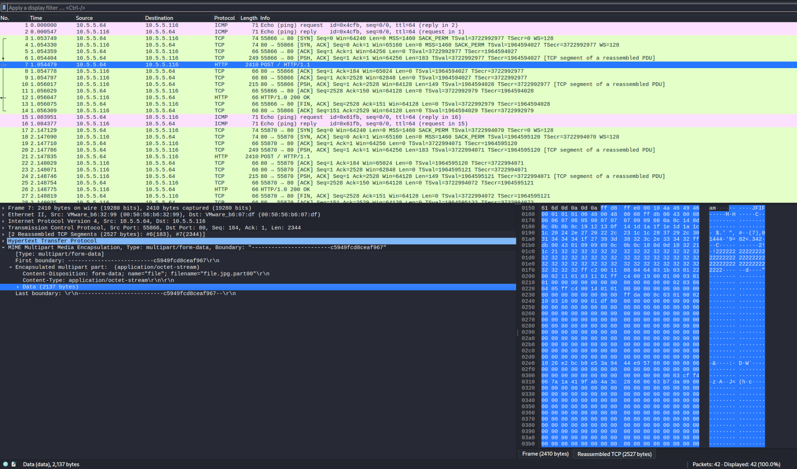

# I Must Fix You

*Solution Guide*

## Overview

In *I Must Fix You*, players must perform binary analysis on corrupt files to recover data contained in those files.

### Using a Hex Editor

For any file editing you do, it is recommended that you use a **hex editor**. The Hex Editor GHex is used in this solution guide. It can be installed using the following command:
```bash
sudo apt-get install ghex
```

Many hex editors start in "overwrite mode" and when you attempt to type characters the editor overwrites the character your cursor is on with the character you typed. In GHex, you can switch to  "insert mode" by pressing the **Insert** key on your keyboard.

If you are using a Mac computer or don't have the **Insert** you can toggle insert mode in the bottom right of the GHex app.


### Detailed Solution Guide Available!

Below are the steps for solving the challenge from a high-level perspective. If you want a more detailed guide to help you understand file structure, determine errors present, and show how to fix them, please see this [in-depth guide](./extra/in_depth_guide.md).

## First Steps

Open Firefox, browse to `https://challenge.us` and download the files **corrupted_files.zip** and **instructions.txt**. 

Upon unzipping the file you should see:
1. A pdf file named **file.pdf**
2. A  zip file named **corrupt.zip**
3. A folder labeled **image**
4. A pcap file named **capture.pcap**

Read the information in the **instructions.txt** as this file provides vital information to helping you repair each of the files.

## Question 1

*What is the 8-character hex string found in the PDF after successfully repairing it?*

After analyzing **file.pdf**, you find that the indicators of the start of each object in the file are missing. This is why the file is corrupted and can't be opened.

Scroll to the bottom of the hex editor and view the `XREF Table`: it has the string `xref` before signifying its start and `.trailer` indicates its end.


To make it easier to view, copy the XREF table from `xref` to right before `.trailer` and paste it into Visual Studio Code. It should look similar to the example below.

```
xref
0 14
0000000000 65535 f 
0000006258 00000 n 
0000000019 00000 n 
0000000572 00000 n 
0000006382 00000 n 
0000000592 00000 n 
0000005446 00000 n 
0000005467 00000 n 
0000005655 00000 n 
0000005983 00000 n 
0000006171 00000 n 
0000006203 00000 n 
0000006507 00000 n 
0000006604 00000 n 
```

This is the mapping of *objects* in the pdf and their offset from the beginning of the file. You can ignore the first entry `0000000000 65535 f ` as it is a standard entry for all pdf files. 

The beginning of each object in the pdf body is indicated with the notation `# # obj` where the first `#` indicates the object number and the second `#` indicates its generation number. 

For the above table, you can map each entry object starting indicators (or object ID line) by incrementing values going down the table, like so:

- The start of the object associated with the line `0000006258 00000 n ` is indicated in the pdf with the notation `1 0 obj`. 
- The start of the object associated with the line `0000000019 00000 n ` is indicated in the pdf with the notation `2 0 obj`. 
- For each entry the object number increments by one (1) and follows the same syntax and format.

If done correctly, the mapping of the entries to their associated object ID line should look similar to below where the comments starting with  `--` indicate which object ID line get inserted into the pdf body for each entry:

```
xref
0 14
0000000000 65535 f 
0000006258 00000 n -- 1 0 obj
0000000019 00000 n -- 2 0 obj
0000000572 00000 n -- 3 0 obj
0000006382 00000 n -- 4 0 obj
0000000592 00000 n -- 5 0 obj
0000005446 00000 n -- 6 0 obj
0000005467 00000 n -- 7 0 obj
0000005655 00000 n -- 8 0 obj
0000005983 00000 n -- 9 0 obj
0000006171 00000 n -- 10 0 obj
0000006203 00000 n -- 11 0 obj
0000006507 00000 n -- 12 0 obj
0000006604 00000 n -- 13 0 obj

```

Unfortunately, you can't re-insert the object ID line in any order because, since they are all missing, if you go out of order the offsets will be incorrect and the pdf still un-viewable.

The correct way to fix it is to insert the object ID lines starting with the entry that has the *lowest* offset value, then the *second* lowest,  and so on. This is the only way the offsets for each entry will be correct because the offset is from the beginning of the file.

Following this methodology, here is how to fix the pdf:

1. Look at each entry. The third entry associated with the object ID line `2 0 obj` has the smallest offset with the value `0000000019` or `19`.
2. In GHex, click the "3 dots icon" in the top right and then click **Jump to Byte**. This opens a search bar where you can enter the offset you want to go to.
3. Enter the value `19` and click the `jump` button. It brings your cursor to the location of that offset.


4. Click that location in the right-side ASCII pane. On your keyboard press **Insert** and type the string `2 0 obj` to insert it. You have now fixed the mapping of the first object in the PDF. If done correctly, it should look like the screen print shown below. 


5. Repeat this process by identifying the next lowest offset and inserting the object ID. For your convenience the table below has been reordered from lowest to highest offset. 

| Offset | Object ID | 
| ----- | ----- | 
| 19 | 2 0 obj |
| 572 | 3 0 obj |
| 592 | 5 0 obj |
| 5446 | 6 0 obj |
| 5467 | 7 0 obj |
| 5655 | 8 0 obj |
| 5983 | 9 0 obj |
| 6171 | 10 0 obj |
| 6203 | 11 0 obj |
| 6258 | 1 0 obj |
| 6382 | 4 0 obj |
| 6507 | 12 0 obj |
| 6604 | 13 0 obj |

If done correctly the file is repaired and a token viewable when opened. Enter this token as the answer to Question 1.  


### Q1 Alternate Method
You can create a script to automate this process. An exemplar Python script can be found [here](script/fix_pdf.py).


## Question 2

*What is the 8-character hex string found in the zip after successfully repairing it?*

### Part 1: Fixing Local Header Records

Begin analyzing the zip by running the command: `zipinfo corrupt.zip`. You will see a message stating it is "missing 70 bytes" and the "start of central directory not found" and other information.


Open **corrupt.zip** in the hex editor. Each file contained in a zip is defined by a Local File Header which gives information about the file in a set structure. 


Some key points to this structure are:  
 - Each Local File Header begins with the same signature which is always `\x50\x4b\x03\x04`
 - The file name length is offset 26 bytes from the start of the Local File Header
 - The file name is offset 30 bytes from the start of the Local File Header 

Reviewing the first Local File Header of corrupt.zip, notice that there are no filenames referenced. 


**Instructions.txt** tells us the zip should contain these filenames in order: 

1. joyous
2. whimsical
3. bingo
4. sad

Recall that `zipinfo` gave a warning that bytes were missing. It appears some of the missing bytes were the filenames. Fixing this is the first step toward recovering the zip file. 

**The following steps guide you through repairing the first Local File Header. Repeat this process for each Local File Header record.**

1. Locate the first Local File Header by searching for the signature `50 4b 03 04`. 

2. Based on the data from **instructions.txt**, the first file that was added to the zip, and which is represented by the first Local File Header is named "joyous".

3. Starting from the beginning of the Local File Header, go to `offset 26`. These two bytes should represent the file name length of the first file, joyous. This length, in little endian, is `06 00`. Insert this value at `offset 26`.

4. Starting from the beginning of the Local File Header, go to `offset 30`. Recall from above this is where the file name starts. Click `offset 30` in the ASCII section of the hex editor, press **Insert** on your keyboard, and type the filename `joyous`. The repaired Local File Header should look like the image below: 


The first Local File Header has now been repaired. Repeat this process on each of the remaining Local File Header records using the information provided. 

### Part 2: Fixing Central Directory Records

Recall from the `zipinfo` output that the error "start of central directory not found" was reported. 

The Central Directory Records signature is always ` \x50 \x4b \x01 \x02 `. In the hex editor, search for `05 4b 01 02` and you will not get any results. Because of this, we will depend on data in the End of Central Directory Records to locate where the Central Directory Records should start. 

The End of Central Directory Records signature is always ` \x50 \x4b \x05 \x06 `. Search for this signature in the hex editor to locate the start of the End of Central Directory Records. It is near the end of the file. Offset 16 bytes from the start of the End of Central Directory Records is that start of the Offset of Central Directory to Starting Disk entry. This four (4) byte entry gives the offset location of the start of the Central Directory. Here the entry is `05 02 00 00`. 


Using the **Jump to Byte** feature, jump to offset `05 02`. On your keyboard press **Insert** and type the Central Directory signature `50 4b 01 02`. This recreates the start of the first Central Directory record. 

Filenames are also stored in the Central Directory record. Reviewing, they are not present and will need to be manually inserted. 

1. Offset 46 bytes from the beginning of the first Central Directory record is the start of the file name entry. 

2. Press **Insert** on your keyboard and type the filename "joyous". 

3. The first Central Directory record is fixed, but to fix the next record we need to identify where it starts. The final entry of each Central Directory is `file comment`. Review the ASCII text and locate the word `comment:` followed by the emoticon `(:`. This is the `file comment` for the file joyous. 

4. Where the comment ends, insert the Central Directory signature `50 4b 01 02` to recreate the start of the second Central Directory record. 

5. Repeat the process of entering the appropriate filename and locating the start of the next Central Directory record. Continue this until all records have been created. 

If done correctly, you should have fully repaired the zip file. Upon extracting the contents you will find the token to Question 2 in the file **bingo**.

### Q2 Alternate Method

You can create a script to automate this process. An exemplar Python script can be found [here](script/fix_zip.py).

## Question 3

*What is the 8-character hex string created by concatenating the contents of each image after successfully reassembling them?*

Look at the structure of the **image** folder. You should see that it contains multiple folders labeled **img_1**,**img_2**... up to **img_8**. 

Each of these **img_#** folders has the same structure. They contain the folders chunk1, chunk2, chunk3 and the file header.txt.

The image type is not known, but can be determined by looking at the file signature in the header.txt file. If you look you will see the hex values `89 50 4E 47 0D 0A 1A 0A` which means it is a png.

Examining the contents of each chunk folder, you will see they have an identical structure. They all contain the files crc.txt, data.txt, length.txt, and type.txt.

After analyzing the folders and files, you should determine that each image has been split up, and the naming convention used for the files and folders hint at how you need to combine the data to recreate the image.

### Part 1: Assemble Image Chunks 

>Note: This example will use `img_1/chunk1`. This same procedure will need to be followed for the remaining chunks in all folders. 

Examining the files in the chunk1 folder you will notice that the crc.txt file is empty. The CRC value will need to be manually calculated and inserted to properly create the chunk. 

1. Create the file chunk1 by concatenating the length.txt, type.txt, and data.txt files using the following command. 
```bash
cat length.txt type.txt data.txt > chunk1
```

2. Combine the type.txt and data.txt files. This is so the CRC value can be calculated.  
```bash
cat type.txt data.txt > crcCalc
```

3. Calculate the CRC value using the following command.
```bash
crc32 crcCalc
```


Here we see the calculated CRC value is: `1A 0D 09 53`.

4. Open chunk1 using `hexedit`.
```bash
hexedit chunk1 
```

5. Navigate to the end of the file. Insert the CRC value you calculated for chunk1.

   

6. Press **Ctrl+X** and press **Y** to save your changes.

7. Repeat this process for the files in the **img_1/chunk2** and **img_1/chunk3** folders. 

### Part 2: Assemble PNG Image 

1. With each chunk created in the img_1 folder, concatenate the header.txt file and all three chunks using the following command.

```bash
cat header.txt chunk1 chunk2 chunk3 > image1.png 
```
2. If done correctly, you will be able to open and view image1.png. You will see that it contains one character.


### Part 3: Assemble the Token 

Repeat the steps in Part 1 and Part 2 for the remaining seven folders in the **image** folder. Once complete, assemble the images in numerical order. The eight-character token they create is the answer to Question 3.

### Q3 Alternate Method

You can create a script to automate this process. An exemplar Python script to do so can be found [here](script/fix_png.py).

## Question 4

*What is the 8-character hex string found in an image in the packet capture (PCAP) after successfully repairing and extracting it?*

If you attempt to open the pcap, you are greeted with an error that its been damaged. There are two pieces of information you should glean from this:

1. You should see the one packet present is showing the protocol LIN. This hints at the reason why the capture is corrupted. 
   - The **instructions.txt** tells us the capture was caught on a normal Ethernet Link-layer, not LIN. So, looking at the bytes representing protocol in the PCAP will be required.

2. The error states there is an issue with reading the packet bytes and says the capture is a huge 4-byte packet bigger than the maximum size of **262144**. Remember this value.

### Part 1: Fixing Specified Capture Network Type

Open the capture in your hex editor and begin looking for the bytes that represent the network types. This can be found at offset 20 and is the final four (4) bytes of the global header. You should see the current bytes are shown as `D4 00 00 00`, which when read as little endian (`0xD4`) and converted to decimal is `212`. This value assigns the LIN protocol and we know that is incorrect.


We know the PCAP is using the `Ethernet Link-Layer` protocol and that is represented with the bytes `01 00 00 00`. Replace the `D4` with `01` and this will fix the first part of the PCAP.


### Part 2: Repairing the Packets

Open the PCAP in your hex editor and begin with looking for the `snaplen` section of the `global header`. You will find it is 4 bytes long with an offset of 16 bytes from the beginning of the file. You should find that the value of those four (4) bytes is `00 00 04 00`. 


Those 4 bytes need to be reversed into little endian format, which is `00 04 00 00`. When converted to decimal, it gives the value `262144`. This is the same value we saw above mentioned in the error regarding the maximum size of the PCAP.

Because the error message says the packet is larger than 262144, the problem must be within each packet's header where the captured packet length is specified. To test this, we need to find the captured packet length section of the first packet in the PCAP.

>The following information contains steps for repairing the first packet in the pcap and those steps need to be repeated for each "Packet in the Capture":

1. Go to the offset which specifies the end of the global header section and the start of the first packet header. The offset is 24 bytes.

2. Go to the offset of 8 bytes from the packet header's starting location. The next 4 bytes indicate the size of the data stored for this packet. The bytes for the captured packet length are:`00 00 00 00`. This is incorrect and we can determine what the captured length is.

   

3. Look at the next 4 bytes representing the original packet length section after the capture packet length. 

4. This entry has bytes that do not equal 0. Use bytes `47 00 00 00` as an example. If you read this in little endian, the hex value for the original packet length is `0x47`; when converted to decimal is equivalent to `71`.

5. This means the length of the original data in the pcap was 71 bytes and since the max length a packet can capture is specified in the global header as 262144, we can infer that the captured packet length is the same as the original packet length. Its packet size isn't bigger than the specified max length.

6. In your hex editor, replace the incorrect captured packet length represented as `00 00 00 00` with the correct length of `47 00 00 00`.

   

7. To test if this worked, save your changes and attempt to open the file. 

8. You will receive the same error, but if you look at the packets in the capture, you should see there are now **two** packets displayed instead of one. 
   

This means you have repaired the first one successfully and can follow the same methodology as above to repair each packet.

**But, before you can begin fixing the next packet, you need to find where it starts. Follow these steps once you've determined the current packet's captured length.**

1. Go to offset of 16 from the start of the current packet and get the 4 bytes representing the actual packet length. (71 bytes for the first as found above.)

2. Create the offset of the next packet by adding the following values from the current packet.
- Offset from packet start to where the data begins. This is 16 bytes.
- Number of bytes in the current packet. This is 71 bytes as calculated above.
  

You should find that the offset is 87 bytes to the second packet from the start of the first packet. If done correctly, you are at the beginning of the next packet. 

Now you can repeat the process above to repair every packet in the capture.

### Q4 Alternate Method

You can create a script to automate this process. An exemplar Python script to do this can be found [here](script/fix_pcap.py).

### Part 3: Extracting the Image from Network Traffic

With the PCAP now fixed, you just need to extract the **image** in the PCAP to solve. 

Look through the PCAP and you will see a repeating pattern of 2 ICMP packets, followed by TCP and HTTP packets containing a `POST` request. 

If you double-click the first ICMP packet, you should see a message stating **Sending Part 1 Momentarily...**. This is a hint that the image will be received in parts and you will need to retrieve all of them. 

You can begin doing this with the following steps.

>Note: You will need to repeat this process for each `POST` request in the packet capture.

To extract the first part of the image:

1. Click the packet containing the first `POST` request.
2. In Wireshark, click the arrow next to **MIME Multipart Media Encapsulation** to open.
3. Click the arrow next to **Encapsulated multipart part** to open. The data you want is in **Data** section. 
4. Select it and some bytes will become highlighted. See the screen print below:

   

5. Right-click the **Data** section, then select **Export Packet Bytes**.
6. Save it to a file and make sure you label it as the data containing the `first part` of the image. For this example, I'll call the file `part1`.

Repeat the above steps for the second and third `POST` requests.

If done correctly, you should now have three files, each containing the data from the three `POST` requests.

My files are labeled `part1`,`part2`, and `part3`.

In order to combine these parts, you need to concatenate the data. Run the following command:

```bash
cat part1 part2 part3 > file.jpg
```

If done correctly, you can open the newly saved image file and find the token for this part.