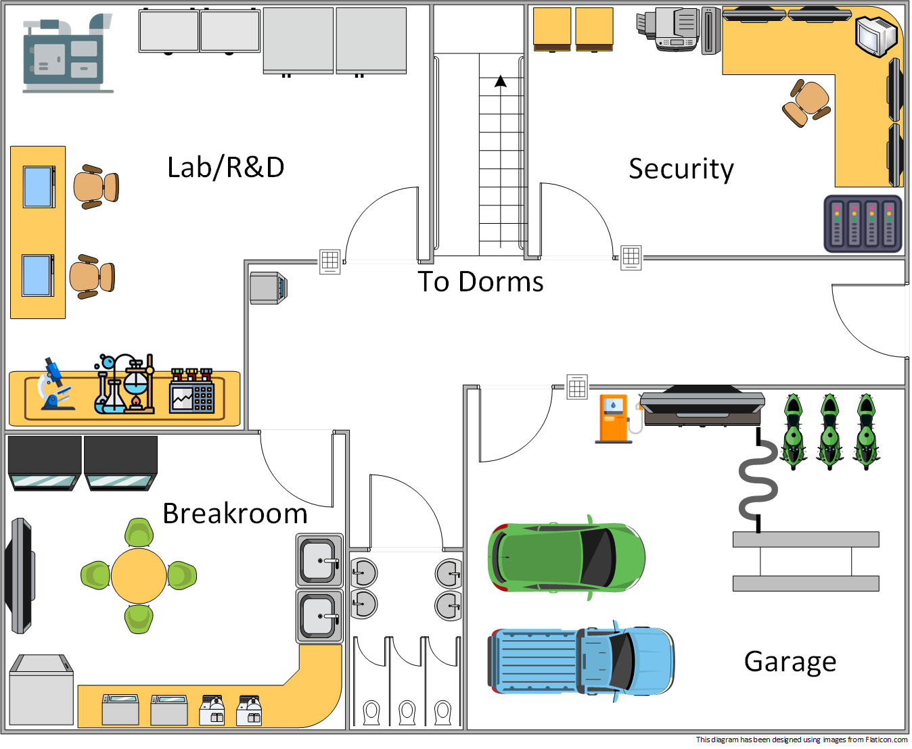

# IoT - Investigation of Things

An operations center full of "Internet of Things" (IoT) devices has reported anomalous and odd network traffic, but none of the engineers on site have the experience to analyze the traffic thoroughly. Investigate the center's ongoing network traffic for oddly behaving devices. Perform enumeration and remediation as necessary.

**This challenge includes a time-sensitive task!**

**NICE Work Roles**

- [Cyber Defense Analyst](https://niccs.cisa.gov/workforce-development/nice-framework)
- [Cyber Defense Incident Responder](https://niccs.cisa.gov/workforce-development/nice-framework)

**NICE Tasks**

- [T0023](https://niccs.cisa.gov/workforce-development/nice-framework): Characterize and analyze network traffic to identify anomalous activity and potential threats to network resources.
- [T0161](https://niccs.cisa.gov/workforce-development/nice-framework): Perform analysis of log files from a variety of sources (e.g., individual host logs, network traffic logs, firewall logs, and intrusion detection system [IDS] logs) to identify possible threats to network security.
- [T0163](https://niccs.cisa.gov/workforce-development/nice-framework): Perform cyber defense incident triage, to include determining scope, urgency, and potential impact, identifying the specific vulnerability, and making recommendations that enable expeditious remediation.
- [T0259](https://niccs.cisa.gov/workforce-development/nice-framework): Use cyber defense tools for continual monitoring and analysis of system activity to identify malicious activity.
- [T0291](https://niccs.cisa.gov/workforce-development/nice-framework): Examine network topologies to understand data flows through the network.

## IMPORTANT
This challenge is only partially open sourced. The files in the [challenge directory](./challenge) are provided to give a starting point if you want to recreate the challenge on your own. The full challenge can be completed on the hosted site.

## Background

The operations center is made up of four distinct rooms at its ground level with dormitories for the engineers located on the upper floors. Each room's network is connected by a central router, and a firewall protects the entire network at its WAN. The ground floor is made up of a breakroom, garage, lab, and security room. IoT devices are dispersed throughout the facility (see the facility map) and are listed in the device list below. 

The onsite engineers are unsure which devices are behaving strangely, what data is sent beyond their normal logs, and why such devices are behaving oddly. In addition, none of the devices' current IP addresses are recorded. Analyze the traffic and security hub data to figure out which is which.

### Facility Map

### Device List
The list below can be found at `https://challenge.us` so you can complete the data in-game. 

| Device | Room | IP? |
|--------|------|-----|
| *****  | Breakroom | 10.1.1.0/24 |
| Coffee Maker 1 | Breakroom | ??? |
| Coffee Maker 2 | Breakroom | ??? |
| Microwave 1 | Breakroom | ??? |
| Microwave 2 | Breakroom | ??? |
| Television | Breakroom | ??? |
| Vending Machine 1 | Breakroom | ??? |
| Vending Machine 2 | Breakroom | ??? |
| ***** | Garage | 10.2.2.0/24 |
| Fuel Pump | Garage | ??? |
| Diagnostics Station | Garage | ??? |
| ***** | Lab | 10.3.3.0/24 |
| Cold Storage 1 | Lab | ??? |
| Cold Storage 2 | Lab | ??? |
| Frozen Storage 1 | Lab | ??? |
| Frozen Storage 2 | Lab | ??? |
| Electron Microscope | Lab | ??? |
| Centrifuge | Lab | ??? |
| Generator | Lab | ??? |
| ***** | Security | 10.4.4.0/24 |
| SecurityOnion | Security | 10.4.4.4 |
| Command Center Hub | Security | 10.4.4.250 |

***Ignore the `.250` address in each of the other networks.** This system is used to monitor the running devices in its respective network to ensure the challenge is running properly.

## Getting Started

A security command center hub website is accessible at `http://10.4.4.250` from any in-game system. This hub provides the most recent log messages for the devices reporting to the hub. You can view a single device's latest message data by browsing to its IP address directly over **http/port 80**. Not all devices may report to the hub. To identify each device, some process of elimination may be required.

SecurityOnion allows you to capture and view all of the network traffic for the facility by sniffing on the `tap0` interface in Wireshark by opening Wireshark with the `sudo wireshark` command. Only one team member can use the SecurityOnion console at a time. Additionally, others can create packet captures using the PCAP function in SecurityOnion's web tools. Use a **sensor id** name of `securityonion`, add a **start** and **end date** encompassing today's date, and provide any other filter options you like. This allow multiple people to review the traffic simultaneously. You can capture and **SCP** (Secure Copy Protocol) traffic PCAP files to Kali for analysis.

**Teams are responsible for ensuring they do not use all available disk space on the Security Onion with their captured data**

Break the tasks for the challenge down room-by-room. The final task involves *two* remediation tasks.

#### 1. Breakroom Investigation Task:

 - Identify each device on the network.
 - Find the anomalous device and its associated outlier traffic.
 - Investigate the anomalous traffic for evidence of data exfiltration.

#### 2. Garage Investigation Task:

 - Identify each device on the network.
 - Find the anomalous device and its associated outlier traffic.
 - Investigate the anomalous traffic for evidence of data exfiltration.

#### 3. Lab Investigation Task:

 - Investigate the failing generator.
 - Determine how to prevent the generator's fuel pressure from reaching 100 psi. You have two (2) hours to complete this task.

#### 4. Remediation Tasks:

 - Review the cold storage and frozen storage devices in the lab and ensure each device is running at the required version to avoid inconsistencies in data transmissions.
 - *You should perform this task last*: Implement pfSense firewall rules to block any malicious devices identified in Tasks 1 and 2 from exfiltrating data to the Internet while maintaining Internet connectivity for the other devices in the facility that legitimately require it.

The challenge is internally verifying your firewall blocks as they are implemented, but it may take 2 minutes or more for the status checks to be collected. Please wait 2-3 minutes **after** applying your firewall changes **before** you trigger the grading check.

To grade the remediations, visit `https://challenge.us/files` and select **Grade Challenge**. Each remediation will be validated independently. You will be notified if, and why, the check fails.

## Challenge Questions

1. What is the token recovered from the exfiltration attempts in the breakroom?
2. What is the token recovered from the exfiltration attempts in the garage?
3. What is the token recovered by finding and fixing the generator?
4. What is the token provided by the grading check that verifies the lab devices are all running at the correct version?
5. What is the token provided by the grading check that verifies the firewall has been updated to block exfiltration attempts?
