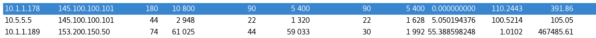
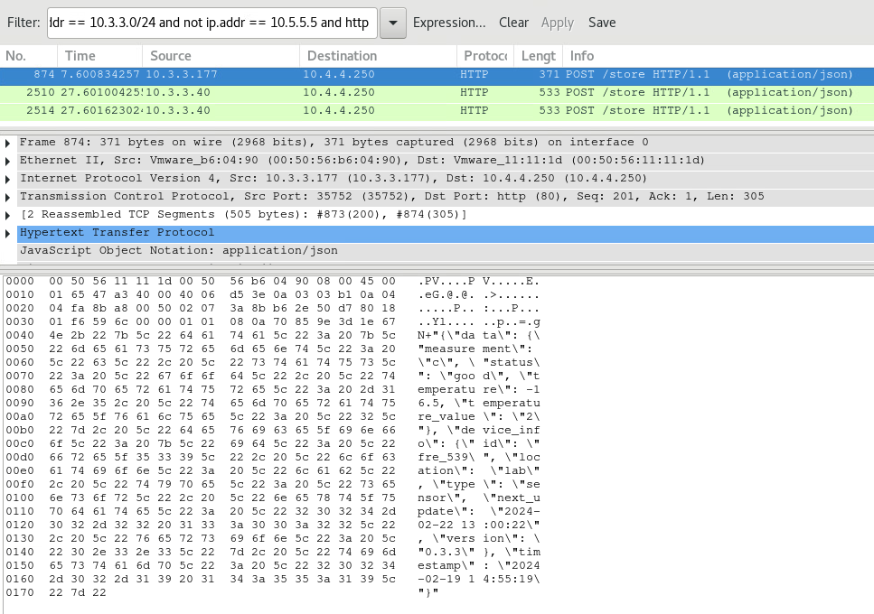

# IoT - Investigation of Things

*Solution Guide*

## Overview

The scenario for *IoT - Investigation of Things* is this: an operations center full of "Internet of Things" (IoT) devices has reported anomalous and odd network traffic, but none of the engineers onsite have the experience to analyze the traffic thoroughly. 

*Investigation of Things* asks players to investigate network traffic for oddly behaving devices, perform enumeration and remediation as necessary.

This solution guide assumes the reader has a working knowledge of Wireshark and Python. Finally, this solution guide is lengthy, so we've provided a *Quick Solve Method* in places which walks the reader through the steps to solve *Investigation of Things* with less explanation.

## Question 1

*What is the token recovered from the exfiltration attempts in the breakroom?*

The first step to solving the breakroom task is to analyze the traffic on this subnet and identify each device by its IP address.

We have a list of devices located in the breakroom (in the challenge instructions): two coffee pot devices, two vending machines, two microwaves, and a television; though, there could be additional devices we are not aware of.

From the Kali VM, browse to the Command Center's web GUI hub at `http://10.4.4.250`. The Command Center shows updates from the listed breakroom devices; however, it has a device not on the list labeled **egg_38**.


Selecting a device in the Command Center shows its latest status, and if you click **egg_038** it appears to be some sort of egg tracking device not in our list. There is also a `control_code` that looks suspiciously like a password, and we don't see this type of data on any of the other devices.


We need to understand what traffic belongs to **egg_38**. 

On the provided Security Onion VM, start Wireshark:

1. Open a Terminal.
2. Enter `sudo wireshark`.
3. Password: `tartans`.

Start a capture on the **tap0** interface: select **tap0**, then **Start**. Apply a filter to watch only the breakroom network:
```
ip.addr == 10.1.1.0/24
```

Watch the traffic--you'll see random http posts made to the security hub at ``10.4.4.250``. You'll also see some traffic heading outbound to `145.100.100.101` that seems to be constant and more frequent than the other traffic.

Identify each of the known devices by IP address. Look at any of the http post messages and notice the packet contents include json messages sent to the Command Center at `10.4.4.250`. Within these messages are the device ids for the sending device. In the example below, `10.1.1.55` corresponds with the device with `id cp_910` and seems to be one of the coffee pots.

> Another method is to run an Nmap scan for any hosts in the `10.1.1.0/24` network, then check each device's webpage on port 80 and compare the json data there as well.


We can also use Wireshark statistics to determine how many unique addresses are talking with the Command Center in this network. 

In the menu, select **Statistics**, **Conversations**, and then the **IPv4** tab.


Seven devices are talking to the Command Center from the breakroom network of `10.1.1.0/24`.

Looking closer reveals two addresses talking to the Internet, but we don't know what these are. Watch enough traffic and you will see that these are the only two devices that talk to anything *but* the Command Center at `10.4.4.250`. And, all of the traffic to/from `10.4.4.250` appears to be legitimate.



Put these off to the side for now and continue to identify the reporting devices one by one. We see these unique IP addresses: 

- `10.1.1.12`
- `10.1.1.55` (identified as one of the coffee pots earlier in the guide)
- `10.1.1.77`
- `10.1.1.101`
- `10.1.1.138`
- `10.1.1.178`
- `10.1.1.189`
- `10.1.1.204`

Repeat the process outlined above: find one of the http post packets for each IP address; then, find its device id in the packet data. Cross-reference this information with the data on the Command Center website. Your mapping should look like this:

- `10.1.1.12`: microwave_001
- `10.1.1.55`: cp_910
- `10.1.1.77`: vending_machine_001
- `10.1.1.101`: cp_909
- `10.1.1.138`: vending_machine_002
- `10.1.1.178`: unknown, sends TCP traffic out every second to `145.100.100.101`
- `10.1.1.189`: egg_038*, but we don't know what this device is. This device also talks to `153.200.150.50` outside of our network.
- `10.1.1.204`: microwave_020

Looking deeper into the traffic for `10.1.1.178` we can't tell much from the traffic to `145.100.100.101`, but we can find evidence of DNS lookup references for this IP address.


`145.100.100.101` appears to be a streaming service, and the constant stream of data (no pun intended) makes it likely that `10.1.1.178` is the television, though we cannot definitively prove this just yet. However, you won't see any other devices, so by process of elimination we assume it's the TV.

The last device to inspect is `10.1.1.189`, the egg tracking device. In Wireshark, start a new capture or filter the current capture so you are only watching traffic involving `10.1.1.189`. You will notice a pattern. The device sends its json message to the hub, but then also sends alternate data to `153.200.150.50` just after.


We will ignore the TCP traffic to the Command Center - 10.4.4.250 and instead focus only on the traffic to `153.200.150.50`.

Set a filter for this ip address: `ip.addr == 10.1.1.189 and ip.addr == 153.200.150.50`.

Two streams of TCP traffic to the external host will present roughly every 2 minutes.

Within the first few packets of the first TCP stream sent to `153.200.150.50` in this two-minute period is evidence of filename, and that filename alludes to a zip file being chunked and sent in a separate control stream. Depending on when you catch one of these transmissions you may see part 00, 01, or 02. The pattern repeats after three chunks are sent.


A second stream to `153.200.150.50` will follow where the packet lengths are much longer, indicating evidence of the file transfer itself, as these are the only two streams sent externally to `153.200.150.50`.

Additionally, the `control_code` sent with the correspondingly timed json messages to `10.4.4.250` rotates when part 00 is sent and remains the same until the next part 00 is sent. These can be found in the HTTP POST packets that are sent at roughly the same time as the filename messages mentioned above. (You'll need to adjust your filter to see this.)


Now we have our clues. We need to capture all three chunks to reassemble the chunked zip file. The `control_code` is likely the password used to unlock or extract its contents which appears to be a zip file found during the same timeframe.

Capture enough traffic so you see three parts of the same file go across the wire and also make sure to note the `control_code` sent in the json messages *at roughly the same time*. 

**Important! The file transfer is in the TCP streams following the stream with the message about sending a file chunk when filtered for 10.1.1.189 AND 153.200.150.50.** 

I.e., if the message about sending a file is stream 200, the data transfer stream should be 201 or closely thereafter (for example: 202, 203, or 204). You can also search for the string "part00" in the packet bytes to help find where a new file starts. Essentially, you are looking for an entire series or pattern of traffic streams.

#### Traffic Stream Pattern

1. Sending the json message in an http post with a new `control_code`.
2. Sending the message about sending **rawdata.zip.part00**.
3. Sending chunk 1 in a new stream.
4. Sending a new json message in an http post with the same `control_code`.
5. Sending the message about sending **rawdata.zip.part01**.
6. Sending chunk 2 in a new stream.
7. Sending a new json message in an post with the same `control_code`.
8. Sending the message about sending **rawdata.zip.part02**.
9. Sending chunk 3 in a new stream.

This sequence repeats with a new `control_code`.

The total time this traffic will take is just over four minutes from when the first chunk is sent and you must get all three file chunks in the same sequence in order to use the `control_code` as the password. Otherwise, you can't unlock the file. The maxmimum time you may need to cpature to see all three parts to the same file may be as long as 10-12 miutes, depending on where you first caught the series of events.

In order to find the traffic for the first file, perform a search looking for the text: **part00**.


This indicates that the next transmission sent from that same host will contain the file **rawdata.zip.part00**. You can determine which is the next packet sent if you look at the type of packet sent. Tracking the "conversation" of the requests (`SYN`,`SYN-ACK`,`ACK`,`FIN`, etc.) you can see when the previous transmission ends and the new one begins. 

Once found, right-click the packet and select **Follow TCP Stream**. You should see something similar to the screen print below.


Extract this data by selecting **Raw**, then **Save As**. Name the new file so you can correctly map it to the file which was sent.

You will need to repeat this process in order to retrieve the data for the files containing **part01** and **part02**.

> **Caution! ** During this process, please make sure you are getting the first instance of the traffic for **part01** and **part02** that occurs directly after the packet that you found for **part00**.

Once you have all three parts, you can begin to reassemble the original file. To do this, make sure you combine them in the correct order. Thus, if our files were named `rawdata.zip.part00`, `rawdata.zip.part01`, and `rawdata.zip.part02`, we would use the following command:

```bash
cat rawdata.zip.part00 rawdata.zip.part01 rawdata.zip.part02 > rawdata.zip
```


Hopefully, your new file resembles a complete zip file! 

It is indeed locked with a password. Open it using the `control_code` you found in the json post traffic sent around the same time as the first chunk.


The zip file contains a PDF file that is a user manual for the egg tray device.


The table of contents has an entry for finding CTF flags at the end. Scroll to the end of the document to find the token. The token is randomized for each deployment.


This token is the submission for Question #1 (very *eggciting* to get!).

It *is* possible to reassemble a mismatched zip file from chunks that do not relate to each other; however, you won't be able to unlock the Eggcellent Smart Egg Tray User Manual inside using any passwords because the encryption method is not the same for all of the data.

### Quick Solve Method

For a "quick solve", begin here. On the **Security Onion** machine, open a terminal and start Wireshark (run the command `sudo wireshark`). In Wireshark, select the interface **tap0** and start the packet capture. 

Set a filter for this IP: `ip.addr == 10.1.1.189`. Look for traffic going to `153.200.150.50`.

The first few packets of each TCP steam to `153.200.150.50` contain evidence of filename, and that filename alludes to a zip file chunked into pieces and sent in a separate control stream. Depending on when you catch one of these transmissions you may see **part 0**, **1**, or **2**. The pattern repeats again after three chunks are sent.


Find and document the `control_code` sent with the correspondingly timed json messages to `10.4.4.250`. The `control_code` rotates when part 0 is sent and remains the same until the next part 0 is sent. These can be found in the http post packets sent at (roughly) the same time as the filename messages mentioned above. 


We need to capture all three chunks and reassemble the zip file. The `control_code` found previously is
likely to be the password used to unlock or extract the contents of the zip file found during the same timeframe.

Capture enough traffic so you see three parts to the same file go across the wire making sure to note the `control_code` sent in the json messages at roughly the same time. 

The file transfer itself is in one of the TCP streams *following* the one with the message about sending a file chunk. I.e., if the message about sending a file is stream 200, the data transfer stream should be 201, 202, 203...something closely after. You can also search for the text string "part00" in the packet bytes to help find where a new file starts. 

You are looking for the entire series of traffic streams documented above under **Traffic Stream Pattern**. The sequence repeats with a new `control_code`.

The total time this traffic will take is just over four minutes from when the first chunk is sent and you must get all three file chunks in the same sequence in order to use the `control_code` as the password. Otherwise, you can't unlock the file. The maxmimum time you may need to cpature to see all three parts to the same file may be as long as 10-12 miutes, depending on where you first caught the series of events.

In order to find the traffic for the first file, perform a search looking for the text: **part00**.


This indicates that the next transmission sent from that same host will contain the file **rawdata.zip.part00**. Take note of the `source IP` and the `destination IP`.

You can determine which is the next packet sent if you follow the connections. Track the *three-way handshake* (`SYN`,`SYN-ACK`,`ACK`,`FIN`, etc.) by following these steps:

1. From your search on "part00", you should have that packet selected. 
2. Go down in the capture, packet by packet, until you see the string `FIN` in the column `Info` occuring between the same `source IP` and `destination IP`. This means the connection that occured to send the string containing the `part00` string is complete.
3. Look for the next `TCP` packet that occurs between the same `source IP` and `destination IP`.
4. Right-click on the packet and select **Follow TCP Stream**. 

You should see something similar to the screen print below.


Extract this data by selecting **Raw**, then **Save As**. Name the new file so you can correctly map it to which file was sent.

Repeat this process to retrieve the data for the files containing `part01` and `part02`. 

> **Important!** During this process, make sure you get the first instance of the traffic for `part01` and `part02` that occur directly after the packet you found for `part00`.

Once all three files are retrieved, you can reassemble the original file. Make sure to combine them in the correct order. 

If our files were named `rawdata.zip.part00`, `rawdata.zip.part01`, and `rawdata.zip.part02`, we would use the following command:

```bash
    cat rawdata.zip.part00 rawdata.zip.part01 rawdata.zip.part02 > rawdata.zip
```


Hopefully, your new file will now resembles a complete zip file! 

It is indeed locked with a password. Open it using the `control_code` you found in the json post traffic sent around the same time as the first chunk.


Within you will find a PDF file that appears to be a manual for the eggtray device.


The table of contents has an entry for finding CTF flags at the end. Scroll to the end of the document to find the token. The token is randomized for each deployment.


This token is the submission for Question #1.

## Question 2

*What is the token recovered from the exfiltration attempts in the garage?*

This task also requires some traffic analysis to weed out the device or system in question. Recall the procedures used in the first task for more context. Start by filtering for just the garage network, `10.2.2.0/24`, and see what is talking on the network. We expect to find a fuel pump and a vehicle diagnostic station. There is far less traffic on this network so we only have to inspect a few items.

There is an IP address, `10.2.2.153`, with the device id **fp_115**. Based on its json message posts to `10.4.4.250` and the visible json messages in the Command Center web page, this appears to be the fuel pump.


Another address, based on the http post traffic, appears to be the vehicle diagnostics station or **vds_800**, but its IP address changes sporadically. In fact, its IP address will change every 5 minutes.

To find the IP its currently using, run the command `nmap 10.2.2.0/24` and filter out the known IPs from the response to find the IP for this device.


We also see this same address sending side channel traffic of various types: ICMP, DNS, and TCP.

If you browse to this IP while still active at that address, you'll see it is running a web api hosting the json data.


Further down there are references to a key file and a cipher file in a device info section.


We see additional traffic on this device, so we should look closer. An Nmap scan (on the Kali VM, *not* the Security Onion VM) shows it is only listening on port 80.


Let's also scan the website with `Dirb`: `dirb http://10.2.2.[IP]` where you must put in the current IP address of the device.


We find a robots.txt page--not uncommon. Let's view it for more clues.


We see that the site allows a files directory with specific functions. Perhaps the two files mentioned in the json output can be found here.

Browse to both but be sure the IP hasn't changed by this point.

In this example, you would browse to the URL: `10.2.2.[IP]/files/keys.txt`. 


Then, `10.2.2.[IP]/files/cipher.py`.


When you have both pieces of data, you don't need to interact with the site any longer. The data that you need to decrypt is present inside of the ICMP messages sent from this device (the vehicle diagnostics station) to `167.183.42.200`. This data is also static for the entire challenge, so you only need to capture one instance of this message.

You could filter for `icmp and ip.addr == 167.183.42.200` since the extennal address never changes.


Right-click the **data line**  highlighted in the screen print above, hover over **Copy**, then **Bytes**, and click **Printable Text Only**. This copies the **encrypted data** string.

Now you have *all* of the pieces required to decrypt the contents of the ICMP message.

>For this section, the IP of the website is currently `10.2.2.93` and we will be using that in the steps below. In your deployment the IP may not be the same as its address changes over time. To find it, you should run the command `nmap 10.2.2.0/24` and filter out the known IPs from the response to find the IP for this device.

**To solve for Question 2 quickly, start here.** You will need the data from the `keys.txt` file found at `10.2.2.93/files/keys.txt`, the `cipher.py` file found at `10.2.2.93/files/keys.txt` (if the sr), and the `encrypted string` found in the Wireshark traffic using this filter: `icmp and ip.addr == 167.183.42.200`. 

Create the *decryption* script based on the *encryption* script discovered on the website plus the list of keys.

For the purposes of this solution guide, this [script](./script/decrypt.py) was created. You will need to update this script with the encrypted string from the ICMP traffic in your challenge environment.

```python
#!/usr/bin/python3

import os, sys, subprocess
from Crypto.Cipher import AES
from Crypto.Util.Padding import pad, unpad

def decrypt_data(data, key):
    cipher = AES.new(key, AES.MODE_ECB)
    encrypted_data = bytes.fromhex(data)
    decrypted_data = cipher.decrypt(encrypted_data)
    unpadded_data = unpad(decrypted_data, AES.block_size)
    return unpadded_data

def loop_keys():
    enc_str = "**Encrypted String Found Above**"
    keys = [
    b"8fb8433941a22d52",
    b"1ff2be7b1af755da",
    b"f651913346f5eeeb",
    b"3dcf9a4307eaee9a",
    b"9995584e2654d2ee",
    b"2809e1667ce55dbb",
    b"a61f211917963980",
    b"9f64b0bd029a9bc1",
    b"d9a37eab49cf59e6",
    b"a2a921d571739b57"
    ]
    for key in keys:
        try:
            resp = decrypt_data(enc_str,key)
        except Exception as e:
            print("Incorrect Key:\t",key.decode('utf-8'))
            print("Continuing ")
        else:
            print("String Decrypted")
            print("key used:\t",key.decode('utf-8'),'\n')
            print("Decrypted String:",resp.decode('utf-8'))
            break

if __name__ == "__main__":
    loop_keys()
```

You will need to substitute the value of the variable `enc_str` with the encrypted string you found above.

If done correctly, you will see output similar to the screen print below, where the decrypted string is the submission for this task (Question 2).


## Question 3

*What is the token recovered by finding and fixing the generator?*

To see more devices checking in with the hub in this room, in Wireshark, filter by: `ip.addr == 10.3.3.0/24`.

There are two cold storage fridges and two frozen storage freezer devices in the lab. We can ID these by their traffic or by comparing their local site data to the hub data.




There is also the generator that is failing, but we don't see it reporting in. Scan for any unknown devices that aren't reporting in.


The very first device at `10.3.3.11` shows what could be the generator based on the data available at its web API.


If you continue monitoring this data you will see the fuel pressure rising every minute or so.


Try Dirb to see if there are other hidden pages.


We find an `/admin` page and a `/manual` page.

The `admin` page appears to be a console for operating the generator. 


The `manual` page provides a pdf with instructions on how to pass codes to the generator and an emergency restart procedure.


We have to interact with the `admin` console to enter the correct codes in the correct sequence. We also need to add to the codes to achieve the desired state for some entries.

The `admin` console has three functions: *store*, *execute*, and *reset*.

- **Store**: Stores the inputted code and allow you to add codes to the sequence.
- **Execute:** Runs all stored commands.
- **Reset:** Clears the stored commands and allows you to start over.

Unless you enter the full sequence of codes the generator will not restart, and the fuel pressure will continue to rise.

### Quick Solve Method

The bad device is located at: `10.3.3.11`. Its manual can be found at `10.3.3.11/manual`, and `admin` page at `10.3.3.11/admin`.

Browse to `http://10.3.3.11/admin`.

The following codes are required to restart the generator.

1.  Enter maintenance mode: `4D540A0A`.
2.  Set the fuel pressure to exactly 50 (psi): `50520A32`, where 32 is the hex equivalent of the number 50.
3.  Extinguish the pilot light: `504C0A00`, where 00 denotes turning it off.
4.  Flush the fuel line to avoid combustion: `464C0A00`, where 00 denotes flushing it.
5.  Discharge any static charge build-up: `53430A00`, where 00 denotes discharging it.
6.  Charge the primer: `434852FF`, where FF denotes charging it.
7.  Reignite the pilot light: `504C0AFF` where FF denotes turning it on.
8.  Enter run mode: `524E0A0A`.
9.  Restart the generator: `5253540A`.

Once you have stored all command codes, execute the sequence.


If all codes are entered correctly then the generator restarts, preventing the fuel pressure from climbing any higher, and giving a token.


If a code is incorrect, you will be notified.


## Question 4

*What is the token provided by the grading check that verifies the lab devices are all running at the correct version?*

Like the generator task, you should identify what devices are talking on the network and which is which. You can see which devices are communicating with the hub.


Then, check the data stored in the hub to determine which IP goes to which device, or browse to each device's web API over port 80, just as you've done in previous steps. With these devices additional data is present when browsing directly to their APIs.

You should determine the following mapping of IPs-to-device:

- `10.3.3.40` = Fridge 1
- `10.3.3.122` = Fridge 2
- `10.3.3.230` = Freezer 1
- `10.3.3.177` = Freezer 2

Fridge 1 has an additional update server tag and an update path `"/fr1dge"`.


Fridge 2 shows a different version that is higher than Fridge 1. Therefore, we should try to update Fridge 1 based on the challenge instructions.


The Update Server site mentioned shows this:


We see that the correct endpoint is "Fridge", but Fridge 1 is actually pointing to "Fr1dge"--causing the failures to update.

We can also try browsing to the local update endpoint of the device at: `http://10.3.3.40:/update-server-pointer`.


We can see the page, but it only responds to POSTs. So, we need to find a way to tell it to update itself at the correct endpoint.

View the device's home page, `http://10.3.3.40/`, and note the following entries from the JSON:

- `change_device_server_pointer`
- `endpoint`
- `port`
- `update_server`

When looking at the `endpoint` entry, you see it points to `/fr1dge` which looks suspicious. If you view the homepage of the other fridge device at `http://10.3.3.122`, you see it correctly points to `/fridge`. 

You know the URL `http://10.3.3.40:/update-server-pointer` only accepts POST requests--try to send a POST to update its config. Since the required data for the POST is unknown at this time, we will not send any data. Use the following code:

```
#!/usr/bin/python3

import os, sys, requests, json

data = {}

resp2 = requests.post("http://10.3.3.40/update-server-pointer", json=data, headers={"Content-Type":"application/json"})

rec = resp2.content.decode("utf-8")
print(json.dumps(json.loads(rec),indent=2))
```

You should get this response: `'update_key' required for updates.`. Add an entry to the data object used above to include the `update_key` (although the value of it is unknown at this time).

Run it again. You should get a response stating the: `'server_url' is required to update device config to point to new server`. Add the entry `server_url` to the data object and give it the value `179.77.202.10` found in the device config above.

Run it again. You should get a response stating the: `'server_port' is required to update device config to point to new server`. Add the entry `server_port` to the data object and give it the value `28572` found in the device config above.

Run it again. You should get a response stating the: `'device_endpoint' is required to update device config to point to new server`. Add the entry `device_endpoint` to the data object and give it the value `fridge`--which is the correct endpoint found when referencing the good fridge device shown above.

If done correctly, you should have a script that looks similar to the script below.

```python
#!/usr/bin/python3

import os, sys, requests, json

data = {
        "update_key": "unknown",
        "server_url":"179.77.202.10",
        "server_port":"28572",
        "device_endpoint":"fridge"
        }

resp2 = requests.post("http://10.3.3.40/update-server-pointer",json=data, headers={"Content-Type":"application/json"})

rec = resp2.content.decode("utf-8")
print(json.dumps(json.loads(rec),indent=2))
```

We get this response if successful.


Ok, so maybe that's the key. Let's update the script and try again.


The expected key is shifting, so we'll need to see if there is a pattern. We could keep hammering it and hope that we see it loop through the keys, which it would, in fact, do after 52 attempts. However, the posting is rate-limited to once per minute, so this would take an hour. It's faster to figure out the pattern of change.

Let's try one more time to get a third datapoint.


Now, we have three keys in a sequence: `a61Z5A`, `B42y79`, `c63X58`.

We can see some method to the pattern. The first letter increments but also switches case, *a > B > c*, so the next letter should be D.

The second and third characters are numbers in this case: *61 > 42 > 63*, but 63 is also only two more than 61, so maybe this corresponds to the letters "a" and "c". But, 42 does not make sense here. Let's keep going.

The fourth character is again a letter and goes from *Z > y > X*, so it seems to be the opposite of what was happening before. We are starting at the end of the alphabet and moving backwards alternating the case. The next letter should be "w".

The fifth and sixth characters are now both numbers and letters. How is 58 less than 5A? Could it be hex? If A is 10 and 8 is 8, then X (58) would be two less than Z (5A).

If you recall, you were given an *ascii > hex > binary* chart as part of the challenge files. And, if you know your ascii to hex, the letter "a" is 61, and "c" is 63, and sure enough a capital "B" is 42.

Now, we can predict the next key by inserting the hex values for D and w: `D44w77`.


Recheck the device stats at `http://10.3.3.40`.


We are now running at version 02.7. --like Fridge 2.

### Quick Solve Method
>For a "quick solve", start here. "Quick solve" assumes you've done nothing else prior to affect the expected output of the code given below.

The script below will work if you havent made any attempts to update the devices version. 

If you have already attempted updates, you should see that the `update_key` rotates. Please `refer to ~line 554`. This is the beginning of the section that explains how the `update_key` rotates and will explain how you can determine the next expected key to use in the script below. 

Run this script on any Kali system:

```python
#!/usr/bin/python3

import os, sys, requests, json

data = {
    "update_key": "a61Z5A",
    "server_url":"179.77.202.10",
    "server_port":"28572",
    "device_endpoint":"fridge"
}

resp2 = requests.post("http://10.3.3.40/update-server-pointer",json=data, headers={"Content-Type":"application/json"})

rec = resp2.content.decode("utf-8")

print(json.dumps(json.loads(rec),indent=2))
```

Once you have successfully updated the fridge device, run the grading check at `https://challenge.us`. This grading check has two parts, but the
first part only checks if the version of the fridge device has been updated correctly.

If it has, you are presented with a token.


If it hasn't, the grading check will fail. If this occurs, double-check all the steps have been completed correctly and the updates are visible on the device.

## Question 5

*What is the token provided by the grading check that verifies the firewall has been updated to block exfiltration attempts?*

Completing this task requires you to have correctly:

1. Identified and found the devices exfiltrating data in the breakroom and garage, and
2. Identified the television and frozen storage devices as valid devices.

Complete this task by creating two firewall rules in pfSense.

The first rule should block all traffic outbound for the eggtray device at `10.1.1.189`.

1. Select **Firewall**, **Rules**, **LAN**, and add a new rule.
2. Set the following:
    - Action: **Block**
    - Protocol: **Any** (TCP alone would work here, but we want to be sure)
    - Source Single host or alias: `10.1.1.189`
    - Destination Network: `128.0.0.0/1` range (or leave a default of **any**, because only Internet-bound traffic would be crossing the firewall anyway)
    - Leave all other defaults

3. **Save** and add the new rule.


The second rule should block all traffic from the rogue device in the garage network, but its IP address is always changing and it uses random ports. However, since there is no requirement to allow other devices out to the Internet, block this entire subnet from sending traffic outbound.

4. Set the following:
    - Action: **Block**
    - Protocol: **Any**, because this time we need to block ICMP, DNS, and TCP
    - Source Network: 10.2.2.0/24 network
    - Destination Network: 128.0.0.0/1 (or leave a default of any, since only Internet-bound traffic would be crossing the firewall anyway)
    - Leave all other defaults

5. **Save** and add the new rule.


6. Apply the new rules once added.

There is no action to take for the lab network devices as long as you don't mistake these software update checks for malicious traffic and block these by accident.

Once you have added the firewall rules above, wait about 2-3 minutes and run the grading check on `challenge.us`. The reason for the pause is that the grading service that is running in the background needs to get statuses on the various IoT devices in the network. Since the eggtray only communicates every 2 minutes with the external server, it may take a bit longer than this for it to report back that it's connection has failed. Sometimes it can take as long as 4-5 minutes to gather all of its responses, so if you are confident your rules are correct, try the grading check again after another minute or so.

If all checks pass, you will receive a token.


If the check fails, you are told what room(s) you have failed to meet the requirements for, but you aren't told about a specific device because this could give away answers to previous tasks. Double-check your assumption, and fix any rules that may be allowing/blocking the traffic mentioned above. Then, rerun the grading check.


