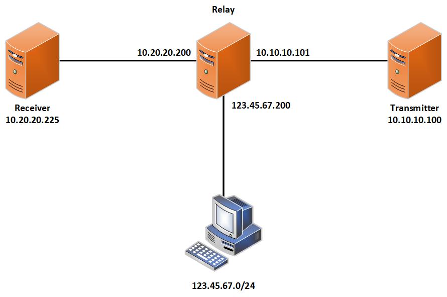

# Relay in Decay (on Tape Delay?)

_Challenge Artifacts_

Challenge Server Scripts and Required Files
- [startup.sh](./challengeserver/startup.sh) -- moves the selected pcap files to the transmitter, initializes the various crontab values on the transmitter and receiver, and starts the cronjobs on each system via SSH. If setting up a lab environment, you can elect to run everything manually using the notes provided below. It may not operate as intended unless it is run with a VM configuration that mirrors what is in the hosted challenge.
- [grading.py](./challengeserver/grading.py) -- performs the grading check to validate proper code receipt on the receiver and advances the phase after each successful solve. Self-grading can be performed in a replicated environment simply by checking the codes.txt file on the receiver (more details below). It may not operate as intended unless it is run with a VM configuration that mirrors what is in the hosted challenge.

## Open Source Artifacts

_Competitor Artifacts_

This is a network diagram of the transmitter, relay, and receiver triad. In the original challenge, competitors would access the relay's FTP service through a local router and firewall. To recreate the challenge, you may place a Kali workstation directly on the relay's 123.45.67.200/24 network. 



_codeword pcap files_

- [codeword-pcaps.zip](./challengeserver/codeword-pcaps.zip) -- the collection of small pcap files that include the test pattern (alphabet) and codewords for the challenge. These pcaps can be used on the transmitter to send various codewords through the relay to the receiver. Codeword pcap files can be interchanged as desired for each phase of the challenge.

The following scripts can be applied to a set of Kali machines in order to replicate a similar environment for the challenge

_Transmitter (eth0 - 10.10.10.100)_

To run the transmitter script, it is recommended to add a script to a crontab like:

```
* * * * * echo "[root password] | sudo -S /usr/bin/python3 /home/user/transmit.py /home/user/[pcap filename] eth0 10.10.10.101
```

This will transmit the specified pcap file contents every minute to the relay system. You can change the pcap file as needed to advance the phase. You should start with alphabet.pcpang to simulate the test pattern.
 - [transmit.py](./transmitter/transmit.py) -- this script will transmit the specified pcap contents to the relay system. It may not operate as intended unless it is run with a VM configuration that mirrors what is in the hosted challenge.

_Relay (eth1 - 10.10.10.101, eth0 - 10.20.20.200, eth2 - 123.45.67.200)_

To run the relay scripts, it is recommended to add the scripts to a crontab like:

```
* * * * * echo "tartans" | sudo -S /bin/bash /home/user/capture.sh
* * * * * echo "tartans" | sudo -S /usr/bin/python3 /home/user/replay.py eth0 10.20.20.225
```

This will run the capture and replay scripts every minute on the relay. Unlike the transmitter and receiver, no changes are necessary throughout the challenge on the relay.
 - [capture.sh](./relay/capture.sh) -- captures traffic every minute and writes the packet capture file to the filesystem using the date/timestamp at the time the capture was started as the file name. The capture script also removes capture files that are older than the most recent 5, while ignoring the token file that is stored in the FTP storage directory for question 1. It may not operate as intended unless it is run with a VM configuration that mirrors what is in the hosted challenge.
 - [replay.py](./relay/replay.py) -- captures traffic on eth1 and replays it via eth0 to the receiver. The script assumes the proper source, destination, and port are in use. It may not operate as intended unless it is run with a VM configuration that mirrors what is in the hosted challenge.

You will also want to run an FTP server in the relay. `vsftp` will work fine. You will need to edit the following lines in the vsftp.conf:

```
listen=YES
listen_address=123.45.67.200
listen_port=54321

local_enable=YES

write_enable=YES

chroot_local_users=YES
```

Also, make sure you have created a user for the FTP login.

_Receiver (eth0 - 10.20.20.225)_

To run the receiver scripts, it is recommended to add the scripts to a crontab like:

```
* * * * * echo "[root password] | sudo -S /usr/bin/python3 /home/user/parser0.py
```

This will run the parser script every minute. To change the phase, simply replace the parser script name in the crontab item. You should only run one parser at a time, depending on which phase you want to run.
 - [parser0.py](./receiver/parser0.py) -- initial parser script that reads the test pattern (alphabet) replayed pcap and does not permutate any data on receipt. It may not operate as intended unless it is run with a VM configuration that mirrors what is in the hosted challenge.
 - [parser1.py](./receiver/parser1.py) -- phase 1 parser script that reads the first code replayed pcap and reduces received values by 20%. It may not operate as intended unless it is run with a VM configuration that mirrors what is in the hosted challenge.
 - [parser2.py](./receiver/parser2.py) -- phase 2 parser script that reads the second code replayed pcap and reduces received values by 40% as well as makes every even numbered packet (odd-numbered indexed packets) negative in value as well. It may not operate as intended unless it is run with a VM configuration that mirrors what is in the hosted challenge.
 - [parser3.py](./receiver/parser3.py) -- phase 3 parser script that reads the third code replayed pcap and reduces received values by 60% as well as makes every even numbered packet (odd-numbered indexed packets) negative in value as well and adds the previous value received to the current value for each packet. It may not operate as intended unless it is run with a VM configuration that mirrors what is in the hosted challenge.
 - Each parser scripts also write any received alphabetical strings to a file at `/home/user/codes.txt` and writes all received values to a file at `/home/user/values.txt`
