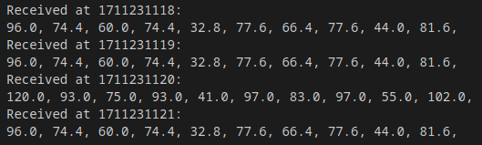

# Relay In Decay (on Tape Delay?)

*Solution Guide*

## Overview

*Relay in Decay (on Tape Delay?)* asks players to analyze a communication relay's running code to determine how it works, how to access its files, and replace signal files with their own crafted packet captures to send the proper mission codes to the receiver. 

Before walking you through how to solve each question, this solution guide presents a code review of the four scripts available on `https://challenge.us./files`:

- **capture:**
- **parser.py:**
- **crafter.py:**
- **replay:**

**Suggested resource:** [Official Scapy documentation](https://scapy.readthedocs.io/en/latest/)

## Code Review

### capture

This Python code is obfuscated to hide variable purposes.

```python
import os as x
from subprocess import run as y
import datetime as z

a = '/home/user/captures'
b = z.datetime.now().strftime("%d%m%Y%H%M")

c = x.popen("echo 'tartans' | sudo -s timeout 55 tcpdump -i eth1 -w " + a + "/" + b + ".pcapng " + "\"src host 10.10.10.100 and dst host 10.10.10.101 and tcp\"")

d = "/home/user/captures"   #s*n*a*t*r*a*t*|*y*a*l*e*r* esu ,serutpac/yaler/emoh/ ot dnuob
e = sorted(x.listdir(d), key=x.path.getctime)
f = e[4:]

for g in f:
    x.rmtree(x.path.join(d, g))
```
From this obfuscated code, we learn a few key things:
 1. Capture files are stored as the timestamp, to the minute, of when the capture began and each runs for 55 seconds, or roughly one minute.
 2. There appears to be a bound directory to the capture directory. By reversing the text in the comment to retrieve the original string of `bound to /home/relay/captures, use r*e*l*a*y|t*a*r*t*a*n*s`. We can assume this means the credentials are `relay | tartans` with the obfuscation removed.
 3. The expected source and destination IP addresses in these captures are `10.10.10.100` and `10.10.10.101`, respectively.
 4. The script removes files that are not the five (5) most recent files: the four (4) most recent full captures, and whatever capture is currently in progress.

### parser.py

```python
from scapy.all import *

# Add character mapping here

# Snippet of receiver parsing code

processed_packets = []

# Function to process packets and map values to letters
def process_packet(packet):
    if packet.haslayer(IP) and packet.haslayer(TCP) and packet.haslayer(Raw):
        data = packet[Raw].load
        try:
            value = float(data.split()[-1])
        except ValueError:
            return None
        if value in value_to_letter:
            letter = value_to_letter[value]
            if packet not in processed_packets:
                processed_packets.append(packet)
                return letter
    return None

# Sniff incoming packets, process them, and write mapped letters to a file
def main():
    def packet_handler(packet):
        letter = process_packet(packet)
        if letter is not None:
            with open(output_file, "a") as file:
                file.write(letter)
            print(f"Processed packet: {packet.summary()}. Mapped letter: {letter}")

    sniff(iface="eth0", prn=packet_handler, timeout=55)

if __name__ == "__main__":
    main()
```

Use **parser.py** to test your own packet captures by playing them against it. Parser.py also gives some insight on how to craft your packet captures with Scapy. Click [here](https://scapy.readthedocs.io/en/latest/) for the official Scapy documentation.

The script ingests each packet, looks for a value inside of the packet bytes, and then (using a predefined mapping) translates that value to a letter and writes that string to a file.

### crafter.py

**Crafter.py** can be used as a template for writing your own Scapy packet generation script. Add in the full character mapping, destination and port details, and the function that writes the packets.

```python
from scapy.all import *
import time
import sys

# Define the destination IP and port
dest_ip = "X.X.X.X"  # Replace with the destination IP address
dest_port = XXXXX
# Define the string to send, taken in via argument
text_string = sys.argv[1]

# Define the letter-to-value mapping
letter_to_value = {
    'a': 139,
    # Add mappings for other letters as needed
}

# Define the timing between packets (in seconds)
packet_delay = 1

# Create an empty list to store the packets

# Craft the packets with the mapped values and append them to the list
for letter in text_string:
    # Fill in the blanks

# Send the packets with the specified timing
for packet in packets:
    send(packet)
    time.sleep(packet_delay)

# Save the packets to a PCAP file
wrpcap("custom_packets.pcap", packets)
```

### replay

The **replay** script is heavily obfuscated, so that the series of underscore characters represents unique variables within the script.

```python
_ = __import__; __, ___, ____ = _.os, _.re, _.sys
_____.___, ____._____, ______ = _.subprocess, _.uuid, _.time
from scapy.all import *

____.sleep(5)

_ = (':'.join(___.findall('..', '%012x' % ____.getnode())))
print(f"{_}")

if len(____.___) != 3:
    print("Usage: python replay.py <capture_file> <interface> <new_destination_ip>")
    ___.exit(1)

______ = '/home/user/captures'
_______ = ______.strftime("%d%m%Y%H%M", ______.localtime(______.time() - 180)) + ".pcapng"
________ = __.__.join(______, _______)

print(f"{________}")

_________ = ____.____[1]
__________ = ____.____[2]

___________ = rdpcap(________)

_____.call(["ping", "-c", "1", __________])
____________ = __.__.popen('arp -a').read()

_____________ = ___.___.compile(r'([0-9A-Fa-f]{2}[:-]){5}([0-9A-Fa-f]{2})')
______________ = None

for _________ in __________.split('\n'):
    if ___________ in _________:
        ______________ = _______________.search(___________)
        if ______________:
            ________________ = ______________.group(0)
        break

if not ________________:
    print("No valid MAC address found for the new destination IP.")
    ___.exit(1)

print(f"{________________}")

for _________________ in _____________:
    if IP in _________________:
        _________________.IP.dst = ____________
        _________________.IP.src = '10.20.20.200'
    _________________.Ether.dst = ________________
    _________________.Ether.src = _
    sendp(_____________, iface=__________)
```

The key takeaways from this heavily obfuscated code are:

1. The replay script always replays the capture file from three (3) minutes prior-- meaning there is a two-minute delay between when the capture process finishes and when that capture file is replayed. This is the time window you have to replace capture files on the relay system, which will be demonstrated later in this solution guide.
2. The replay script preserves the naming convention for capture files used in the capture script, so anything you insert must keep this naming.

## Question 1

*What is the token found within the relay's transmission storage directory?* 

First, you must discover where the relay exists on the network and how to access the capture directory noted during the code review: `/home/relay/captures`.

Scan the `123.45.67.0/24` network for hosts.

```bash
nmap 123.45.67.0/24
```

You will find a host at `123.45.67.200`.


You might try to connect via SSH, but without a proper password, this is difficult and time consuming. Instead, scan the system more thoroughly for other open ports and services.

```bash
nmap -T5 -sV -p 1-65535 123.45.67.200
```


You will find an open FTP service running on port `54321`.

Connect to this service with the credentials found in the relay code script: `relay`|`tartans`.

```bash
ftp <relay@123.45.67.200> 54321
```

Use the password `tartans`.

Use either `ls` or `dir` to see the contents of the FTP directory. You will find a **captures** directory.


Change into this directory and browse the contents.

```bash
cd captures
```

Use the `ls` or `dir` commands.


From here, you can see the token. Use the `get` command to retrieve it.

```bash
get token1
```

Or, use something like `less` to view the token contents directly in the FTP session.

This string is the token for submission for Question 1. Obtaining this token guarantees you are looking at the correct location for captures, and can access the relay's capture storage directory.

## Question 2

*What is the token given for passing grading check 1 and successfully sending code 1 to the receiver?*

There are several things about the process you need to know when solving for the first time, including: understanding how the relay works, knowing what the character mapping of letter values is, and devising a method to create a packet capture file with specific values per packet. Then, you will use your Kali systems to generate the capture files with the proper source
and destination addresses and invoke a listener to receive the traffic.

Hence, the value of Phase 1 is worth more than the other two phases. Solving Phase 1 puts you in good shape to solve
Phases 2 and 3 with minor adjustments to the process.

### Determining character mapping

Retrieve any of the captures found in the capture directory during "Phase 0" of the challenge using the FTP `get` command.

Then, view the packet capture in Wireshark. You will see 78 (26 alphabet characters x 3 packets each) packets consisting of TCP SYNs, SYN ACK's, and RSTs. Each SYN packet has a source of `10.10.10.100` and a destination of `10.10.10.101`. Each initial SYN packet contains a signal value parameter. Also note the port used,` 55555`, for receiving this traffic.


Since there are 26 SYN packets and 26 letters in the alphabet, we can assume each of these packets holds the value of a letter. From the challenge instructions, we know the test pattern is the alphabet and the letters are sent in alphabetical order.

Create a mapping of each value to its corresponding letter in the alphabet. The full mapping is:

|---| -----| ---| ----| ---| -----| ---| -----| ---| -----|
|---| -----| ---| ----| ---| -----| ---| -----| ---| -----|
  |A |  139|   B |  64|   C |  86|    D|   124|   E|   93|
  |F   |118   |G   |71   |H   |45    |I   |97    |J   |56|
  |K   |81    |L   |75   |M   |30    |N   |102   |O   |55|
  |P   |63    |Q   |35   |R   |141   |S   |83    |T   |120|
  |U   |134   |V   |41   |W   |112   |X   |68    |Y   |47|
  |Z   |131   |    |     |    |      |    |      |   ||


### Writing a packet capture generation script

This *may* be a difficult task for those inexperienced with the packet manipulation app, Scapy. There are several parameters that should be maintained for the settings when generating packets with Scapy and we want to write each packet to the same capture file too.

 - The destination address should be a second Kali system in your gamespace
 - The destination port must be `55555`
 - The packet types must be `TCP`
 - The contents of the packets should contain `"Signal Value: {value}"`
 - The value should be pulled from a mapping of values to letters

An example of this code is:

```python
from scapy.all import *
import time # only used to slow down the packets a bit, not necessary
import sys # used to allow us to pass the character string to the script

# Define the destination IP and port
dest_ip = "10.10.10.101" # Replace with the destination IP address you'll use to capture later
dest_port = 55555 # Gotten from reviewing the replay code or viewing the captures
# Define the string to send
text_string = sys.argv[1]

# Define the letter-to-value mapping

letter_to_value = {
'a': 139,
'b': 64,
'c': 86,
'd': 124,
'e': 93,
'f': 118,
'g': 71,
'h': 45,
'i': 97,
'j': 56,
'k': 81,
'l': 75,
'm': 30,
'n': 102,
'o': 55,
'p': 63,
'q': 35,
'r': 141,
's': 83,
't': 120,
'u': 134,
'v': 41,
'w': 112,
'x': 68,
'y': 47,
'z': 131,
}

# Define the timing between packets (in seconds), not necessary but good to have
packet_delay = 1

# Create an empty list to store the packets
packets = []

# Craft the packets with the values and append them to the list
for letter in text_string:
  if letter in letter_to_value:
    value = letter_to_value[letter]
    data = f"Signal Value: {value}"
    packet = IP(dst=dest_ip) / TCP(dport=dest_port, sport=RandShort()) / Raw(load=data)
    packets.append(packet)

# Send the packets with the specified timing
for packet in packets:
  send(packet)
  time.sleep(packet_delay)

# Save the packets to a PCAP file
wrpcap("custom_packets.pcap", packets)
```

You can test run your script with:

```bash
sudo python3 crafter.py teststring
```

Where `teststring` is whatever character string you want to test with. Test that this script outputs a packet capture with the expected
contents and values based on the character string you provided. If all goes well, you'll have a foundational script moving forward.

### Creating your own pcap to solve Phase 1

Now that you know the mapping, and have a method of generating a capture with the required data, it's time to initiate Phase 1 and see what the first code word is.

Go to the grading page (`https://challenge.us`) and trigger the grading check *one* time. This advances the challenge to Phase 1. Make sure you know the character mapping before taking this step!

After a few minutes, grade the challenge again to see what the server receives in the file placed at `https://challenge.us/files`. This file rotates each time you run the grading check. You can also pull down one of the latest packet captures and compare the values received at the relay. The timestamp of when the traffic was received is also shown.


These values differ, so it may be easier to visualize them in a table. The values differ for each deployment.

  |---------- |-----| ------| ---- |------| ------| ------| ------| ------| ----| ------|
  |---------- |-----| ------| ---- |------| ------| ------| ------| ------| ----| ------|
  |Received   |96   |74.4   |60    |74.4  |32.8   |77.6   |66.4   |77.6   |44   |81.6   |
  |Sent       |120  |93     |75    |93    |41     |97     |83     |97     |55   |102    |
  |Letter     |T    |E      |L     |E     |V      |I      |S      |I      |O    |N      |

We know the string sent in this example table is `TELEVISION` (yours may differ) but it appears that our values decrease in
transit before they hit the receiver. Based on some of the easier-to-discern number values, it appears each value received is 80% of its original value. This may take some trial-and-error to determine, but some numbers make this readily apparent.

You could apply a bit of statistical analysis to this by taking the average of the sent and received values. The average of what was
sent is 85.6; the average of what was received is 68.48. 68.48 is 80% of 85.6, so assume the rate of reduction is a constant
among all packets.

To cancel the reduction on the relay's end, boost our values by 125% of their original value, because 100 / 80 = 1.25 or 125%. In other words, if a signal value of 100 is reduced to 80, then a value of 125 would be reduced to 100.

Now, we can adjust our `crafter.py` script to multiply the original mapping values by 1.25 by modifying this section.

```python
# Craft the packets with the values and append them to the list
for letter in text_string:
  if letter in letter_to_value:
    value = 1.25 * letter_to_value[letter] # add a multiplier here
    data = f"Signal Value: {value}"
    packet = IP(dst=dest_ip) / TCP(dport=dest_port, sport=RandShort()) / Raw(load=data)
    packets.append(packet)
```

Because we're doing a straight multiplication here, you could just adjust all of your mapping values; but, this won't work by itself beyond this phase. Besides, it's much easier to handle with a simple multiplier as we add the value to each packet as shown above.

We can pass the crafter the string "television" to send our capture over to a second Kali system.

First, check the IP address of a second Kali system in your gamespace. A teammate can assist. Also, on the receiving Kali system, start a netcat listener because we want the traffic to be legitimately received.

On the receiving Kali: `nc -l -k -p 55555`.  The `-k` option keeps the listener open after the packets end so you only have to start this once.

Launch Wireshark: `sudo wireshark` and capture traffic on eth0. You may want to apply a filter of `ip.addr == [kali sender
IP]` to reduce what you capture.

Make sure the destination IP address in the `crafter.py` script matches the receiver and send the packets while capturing in Wireshark on the receiver.

```bash
sudo python3 crafter1.py television
```

On the receiver, validate in the received capture file that the values are the original values multiplied by 1.25. For the string of "television" you should see the following values:

150, 116.25, 93.75, 116.25, 51.25, 121.25, 103.75, 121.25, 68.75, 127.5

Don't worry about values with decimals, as our `parser.py` example script rounds off to the nearest two (2) decimal places. Ignore any retransmission packets because these are ignored by the relay.


Export the filtered packets (30 packets plus any retransmits) and save the capture file to the receiving Kali system.

**File**, **Export Specified Packets** (make sure that the **Displayed** radio button is checked), choose a name for the file and click **Save**.

Insert this new pcap with the proper name into the flow of replayed traffic on the relay. Because of the three (3) minute delay, you have two minutes between when any given capture finishes and when it is sent or replayed to the receiver.

The best method to inject your capture is to connect via FTP, wait until the minute changes on the clock and a new capture file starts being written. As soon as this happens, delete the capture from the previous minute and upload your file with the same filename.

```
del 151120231859.pcapng
```

Rename your capture file to `151120231859.pcapng`.

```
put 151120231859.pcapng
```


It is OK if the size does not match as long as the values are included in the packets.

Wait at least 2-3 minutes before getting feedback from the grader. After three minutes, trigger the grading check to see if you have passed this phase and retrieve your token. This advances the challenge to Phase 2.


If you did not pass, you can see what values the receiver received and adjust accordingly. If no value was found for your capture, you may have missed adding the proper destination address.

For "peace of mind," check the received values after passing the check to see that it received what you intended after the reduction was made. Since we uploaded a capture to replace the capture file time-stamped with `171120231117`, we would expect the correct values to be received at `171120231120`--and they were.



If done correctly, you can trigger the grading check and receive the token for this phase. If not done correctly, check the values file to see what the receiver got and if there are any adjustments or corrections to make.

## Question 3

*What is the token given for passing grading check 2 and successfully sending code 2 to the receiver?*

You will repeat much of the same process as in Phase 1 to determine the new form of decay in Phase 2.

Wait for the new code to be sent, pull down one of the capture received by the relay, check the values that the receiver got after a few minutes of traffic have gone by, and then compare the two.


This screen print highlights that you may still see the previous code for the first three minutes after the next phase is initiated, so be sure you are using the current code. Any timestamp that is more than three (3) minutes old must be current. Recent packet captures show new values captured by the relay:


A table makes it easier to compare values.

  |---------- |-----| ------| ---- |------| ------| ------| ------| ------| ----| ------|
  |---------- |-----| ------| ---- |------| ------| ------| ------| ------| ----| ------|
  |Received   |42.6 |-84.6  |55.8  |-42.6 |83.4   |-84.6  |58.2   |-33    |80.4 |-49.8  |
  |Sent       |71   |141    |93    |71    |139    |141    |97     |55     |134  |83     |
  |Letter     |G    |R      |E     |G     |A      |R      |I      |O      |U    |S      |

This time, the code word sent is `GREGARIOUS`. Yours may differ.

We are told the rate of decay is linear in the challenge guide, and it appears consistent that the values are being reduced by roughly 60% this time, following the same logic to deduce this as before. Additionally, every other received value is made negative, or has its value inverted.

Accounting for the new multiplier is straight-forward--change it in our script. Like before, we figure out the multiplier by dividing 1 by .6 to get 1.6667. We also need to handle making every even-numbered packet sent negative in value.

You can't just change the mapped values this time, so we should handle this programmatically. Using our previous script from Phase 1, a new example of this code might be:

```python
# Craft the packets with the values and append them to the list
for i, letter in enumerate(text_string):
  if letter in letter_to_value:
    # You'll want to capture enough decimal places here to retain accuracy, 5 should suffice
    value = 1.666667 * letter_to_value[letter]
    if i % 2 == 1:
      value = -value
    data = f"Signal Value: {value}"
    packet = IP(dst=dest_ip) / TCP(dport=dest_port, sport=RandShort()) / Raw(load=data)
    packets.append(packet)
```

Iterate each packet sent so we can index them. Because odd-indexed packets are actually the even-numbered packets sent, we want every odd-numbered packet in the index to be negative to reflect the 2nd, 4th, 6th, 8th, and 10th packets generated.

Follow the same steps as in Phase 1 to generate, capture, review, and upload the capture into the relay's stream.

```bash
sudo python3 crafter.py gregarious
```

Again, it's a good idea to verify in the captured traffic that the expected behavior is observed. Each original value should be multiplied by 1.66667 and every other packet should be negative in value. We expect the following values:

113.6, -225.6, 148.8, -113.6, 222.4, -225.6 155.2, -88, 214.4, -132.8

If done correctly, you can trigger the grading check and receive the token for this phase. If not done correctly, check the values file to see what the receiver got and if there are any corrections to make.

## Question 4

*What is the token given for passing grading check 3 and successfully sending code 3 to the receiver?*

Repeat much of the same process as in Phase 1 and Phase 2 to determine the new form of decay in Phase 3.

Wait for the new code to be sent, pull down one of the captures received by the relay, check the values that the receiver got after a few minutes of traffic, and then compare the two.


In this example, our new code word is `HYPOTHESIS`. Yours may differ.

  |---------- |-----| ------| ---- |------| ------| ------| ------| ------| ----| ------|
  |---------- |-----| ------| ---- |------| ------| ------| ------| ------| ----| ------|
  |Received   |18   |-36.8  |44    |-47.2 |70     |-66    |55.2   |-70.4  |72   |-72    |
  |Sent       |45   |47     |63    |55    |120    |45     |93     |83     |97   |83     |
  |Letter     |H    |Y      |P     |O     |T      |H      |E      |S      |I    |S      |

We are told the rate of decay is linear in the challenge guide, and it appears consistent that at least the first value is reduced by roughly 40% this time as 18/45 = .6. Therefore, if we apply consistent reduction like the previous phases, our new multiplier would be 1 / .4 = 2.5.

If we multiply each received value by 2.5, though, we don't get the expected value of the letter received--at least not for packets 2-10.

  |---------- |-----| ------| ---- |------| ------| ------| ------| ------| ----| ------|
  |---------- |-----| ------| ---- |------| ------| ------| ------| ------| ----| ------|
  |Received   |18   |-36.8   |44   |-47.2   |70    |-66   |55.2   |-70.4   |72   |-72   |
  |Multiplied |45   |-92     |110  |-118    |175   |-165  |138    |-176    |180  |-180  |
  |Sent       |45   |47      |63   |55      |120   |45    |93     |83      |97   |83    |
  |Letter     |H    |Y       |P    |O       |T     |H     |E      |S       |I    |S     |

Something else is happening here.

  |---------- |-----| ------| ---- |------| ------| ------| ------| ------| ----| ------|
  |---------- |-----| ------| ---- |------| ------| ------| ------| ------| ----| ------|
  |Received   |18   |-36.8   |44   |-47.2   |70    |-66   |55.2   |-70.4   |72   |-72   |
  |Corrected  |45   |92      |110   |118    |175   |165   |138    |176     |180  |180   |
  |Sent       |45   |47      |63   |55      |120   |45    |93     |83      |97   |83    |
  |Letter     |H    |Y       |P    |O       |T     |H     |E      |S       |I    |S     |

If you pay attention to each successive value after packet 1, you will notice that the value, after multiplying and removing the negative values, is always the sum of the current packet value and the previous packet value, where packet 1 is just itself.

Accounting for the new multiplier is straight-forward--change it in our script. But, we need to handle adding the previous packet's
value to the current packet too. The order of operations is: add the current letter value to the previous one; multiply by 2.5; account for the negative shifts.

Don't forget to initialize `previous_value` as `0` for the first iteration of the loop, and then assign the `previous_value` as the value for all further loops. Remember: it's not the value of the letter we *want* to send, but whatever the final value of *the last packet sent was* that is used here.

Using our previous script from Phase 2, a new example of the code might be:

```python
# Initialize the previous_value
previous_value = 0

# Craft the packets with the values and append them to the list
for i, letter in enumerate(text_string):
  if letter in letter_to_value:
    value = 2.5 * letter_to_value[letter]
  if i % 2 == 1:
    value = -value
  value = value - previous_value
  previous_value = value
  data = f"Signal Value: {value}"
  packet = IP(dst=dest_ip) / TCP(dport=dest_port, sport=RandShort()) / Raw(load=data)
  packets.append(packet)
```

Here we still iterate each packet sent so we can index them, and due to the fact that each packet is indexed starting with 0, we want every odd-numbered packet in the index to be made negative to reflect the 2nd, 4th, 6th, 8th, and 10th packets generated. We also want to store the value of each packet so we can carry that value forward.

Follow the same steps as in Phase 1 and Phase 2 to generate, capture, review, and upload the capture into the relay's stream.

```bash
sudo python3 crafter3.py hypothesis
```
The expected values for the string in the example are:

112.5, -230, 275, -295, 437.5, -412.5, 345, -440, 450, -450

Assuming all goes as planned, you will be able to trigger the grading check and receive the token for this phase. If not, check the values file to see what the receiver got, and if there are any corrections to make.
