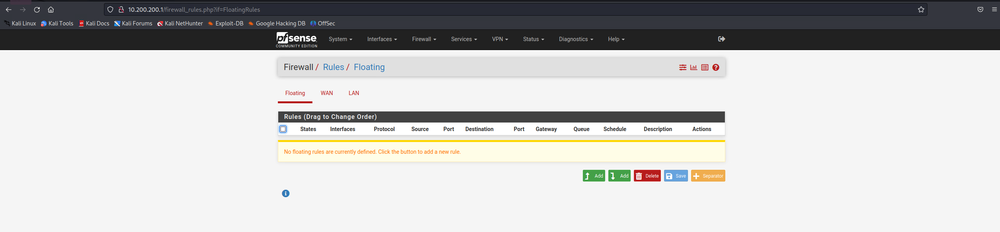
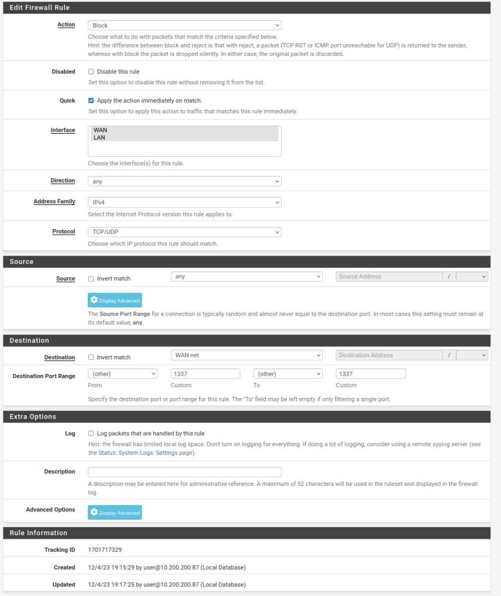
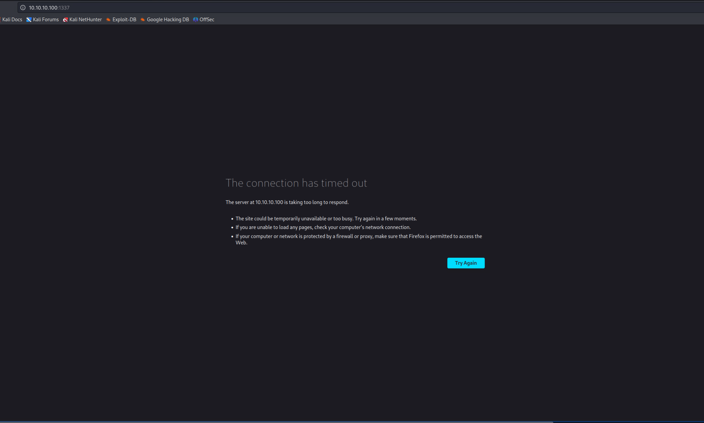
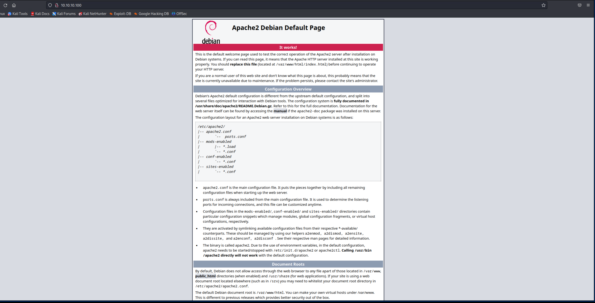
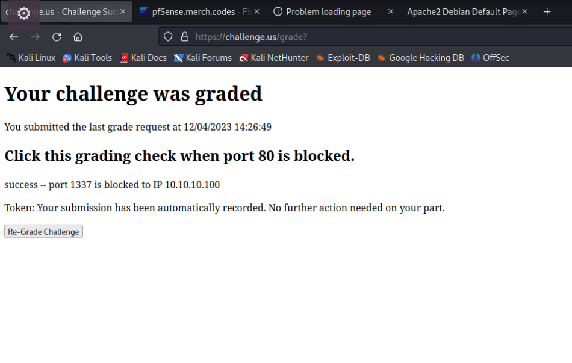

# Cut Them Off At The Firewall

*Solution Guide*

## Overview

*Cut Them Off At The Firewall* asks players to create a firewall rule to block port `1337` from going to the WAN.

## Question 1

*Is port 1337 successfully blocked on 10.10.10.100?*

1. On Kali, browse to the pfSense control page at ```10.200.200.1``` and log in:
   - **U:** `user`
   - **P:** `tartans` 
2. Go to **Firewall**, **Rules**.



3. Select **Floating**.
4. Edit the rules to match the screen print.



5. Test by browsing to `10.10.10.100:1337`.  Make sure the page loads normally on port 80.





6. On `challenge.us`, grade the challenge.


