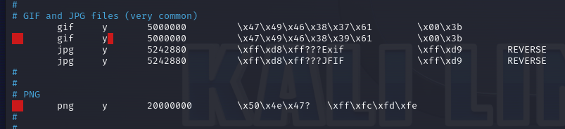
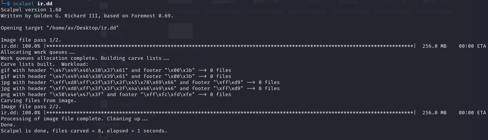
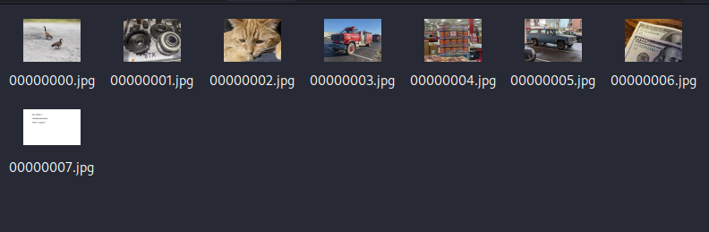
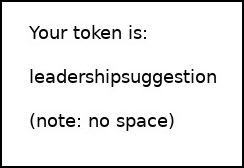
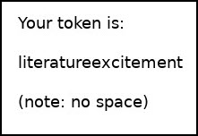
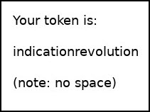
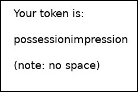
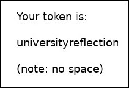

# Digging Through 1's and 0's

*Solution Guide*

## Overview

*Digging Through 1's and 0's* expects players to use data carving techniques to retrieve a deleted image from a disk image file to answer the question. Download the disk image file from `challenge.us/files`. There are multiple images ending in **.dd**. Submit the phrase as the token with no spaces.

## Question 1

*What is the phrase, with no spaces, in the image?*

For the purposes of this solution guide, we'll use Scalpel, a file carving and data recovery tool used in digital forensics.

1. In the gamespace, browse to `challenge.us/files` and download the image file ending in **.dd**.
2. Edit, then save, the `scalpel.conf` file *uncommenting* the image files you want to retrieve. 

```bash
sudo nano /etc/scalpel/scalpel.conf
```

   See the screen print below.



3. Press `Ctrl + O` to write the changes, **Enter** to confirm, and `Ctrl + X` to exit.
4. `cd` into the same directory where you downloaded image.
5. In that directory,  run `scalpel` on the image.

```bash
scalpel XX.dd

   # Replace XX with your image.
```



You now have the carved images in the output directory. One image contains your token.



6. Go to `challenge.us`, and submit the token found in the deleted image. For your convenience, the possible tokens in the photo images are provided here.









