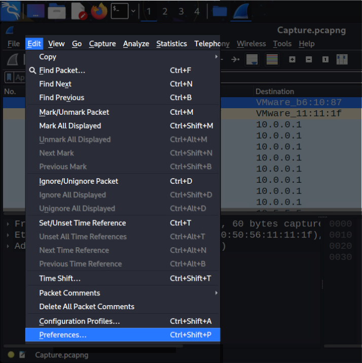
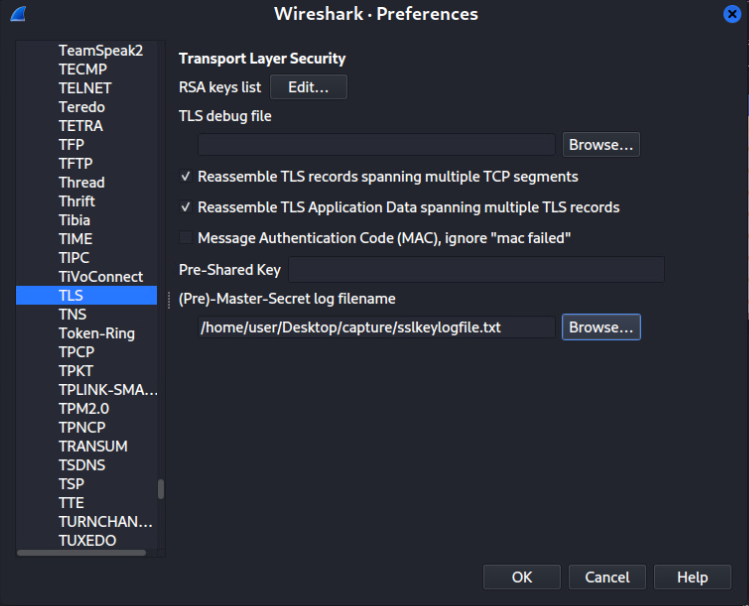
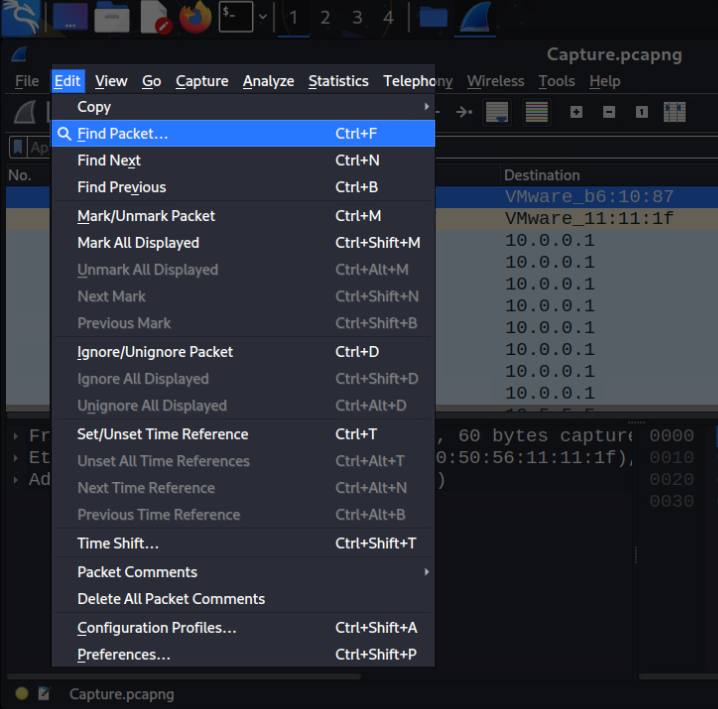
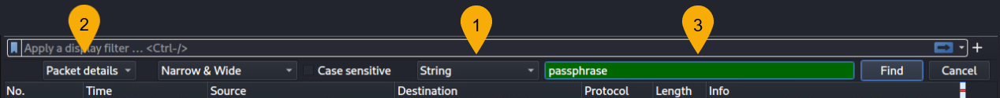
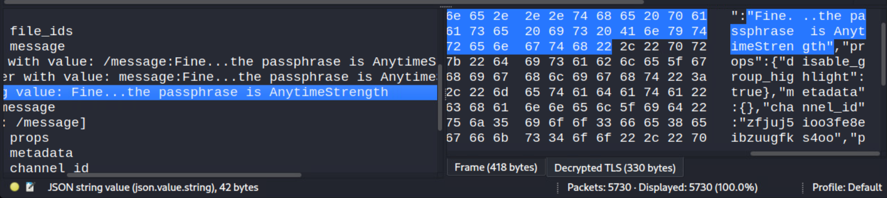

# Here's the Key

*Solution Guide*

## Overview

In *Here's the Key*, you have been given a packet capture and the contents from a key log file. You have been asked to examine the network traffic to identify a `passphrase` that was sent between two parties. 

## Question 1

*Examining the packet capture, what is the passphrase that was sent?*

1. Browse to `challenge.us/files` and download the `capture.tar.xz` file to the Kali workstation.
2. Decompress the `capture.tar.xz` directory. The directory contains the files `Capture.pcapng` and `sslkeylogfile.txt`. 
3. Use `Wireshark` to open the packet capture file.
4. In Wireshark, click on `Edit` then `Preferences...` to open the Wireshark Preferences window. 

5. In the left-hand menu, select `Protocols` and scroll down to `TLS`. 
6. In the `(Pre)-Master-Secret log filename` section click `Browse...` and locate the `sslkeylogfile.txt`. Click `Open` to select the file. Click `OK` to close the `Preferences` window.  

 

7. In Wireshark, click on `Edit` then `Find Packet...` to open the Find Packet toolbar. 

8. Do the following in the Find Packet toolbar:  
    1. In the dropdown menu select `String`
    2. In the `Packet List` dropdown menu select `Packet details`
    3. In the Search bar, type `passphrase` 

9. Click on `Find` to search the packet capture and locate the passphrase that was transmitted. 

In this example, the correct submission for Question 1 is: `AnytimeStrength`
