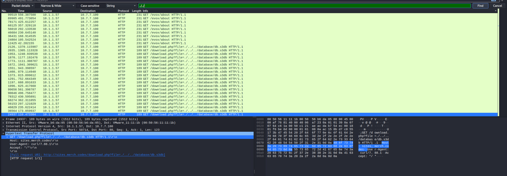

# ID the APT                    

*Solution Guide*

## Overview

In *ID the APT*, players are expected to analyze a **pcap** file, and based upon the attacks in the file, determine the attacker.

## Question 1

*Token 1.*

In the gamespace, browse to `challenge.us/files` and download `incoming.pcap`. Reviewing the pcap will show a directory traversal attack.

### Directory Traversal

1. In Wireshark, in the **Search** field, enter `../../`. This is indicative of attempts to navigate the directory structure.

