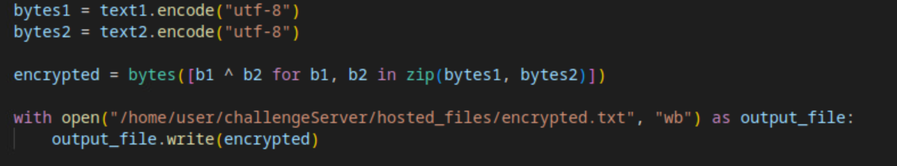

# It's an Older Code, Sir, but it Checks Out

*Solution Guide*

## Overview

*Older Code* asks players to deduce how encryption was done given three files to analyze: **encrypted.txt**,  **unencrypted.txt**, and **encryptor.py**. *Older Code* is an infinity-style challenge so the answer is different every time the challenge is attempted. The answer for the included open-source files is `b2df4ed7`.

## Question 1

*Enter the encryption key.*

1. In the gamespace, browse to `challenge.us` and download the three files.

2. Look at **encrypted.txt**.  It shows nonsense, garbled text.

3. Look at **unencrypted.txt**. It shows `deadbeef`.  


4. Look at the Python script, **encryptor.py**. It shows it is reading in two text files. One is **unencrypted.txt**, which we have.


  It takes those two files and encodes them into `utf-8`.

  The next operation is an XOR operation against the bytes in the two files; finally outputting the result as a binary text file called **encrypted.txt** -- which we also have.



  Since XOR is a symmetrical operation, we can use the output file and perform the XOR operation against the input file to get the original key.

8. Use the following script to decrypt the value:

```python
## read the unencrypted value
with open("/home/user/Downloads/unencrypted.txt", "r", encoding="utf-8") as file1:
    text1 = file1.read()

## read the encrypted file AS BYTES

with open("/home/user/Downloads/encrypted.txt", "rb",) as file2:
    encoded_value = file2.read()

## XOR The bytes against one another

original_key = bytes([b1 ^ b2 for b1, b2 in zip(encoded_value, text1.encode("utf-8"))])

### Decode the bytes as text

key_text = original_key.decode("utf-8")

## Print the original key
print(key_text)
```

6. Submit the answer on `challenge.us`.


