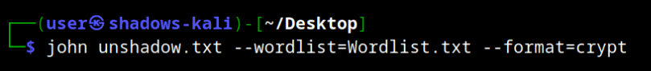
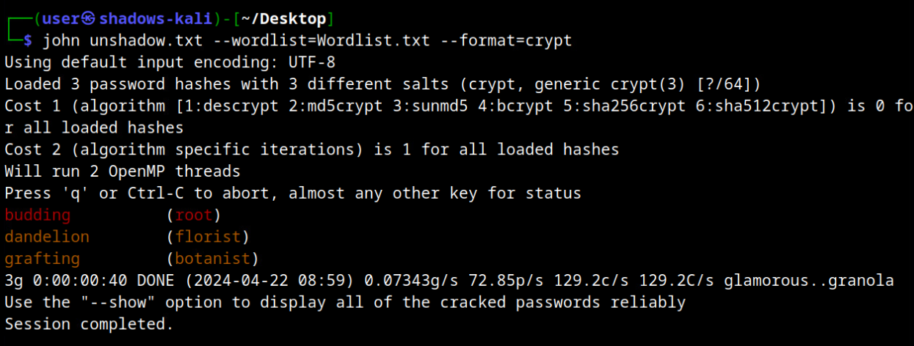

# Pass'n By Shadows 

*Solution Guide*

## Overview

In this challenge, you have been provided with the `passwd` and `shadow` files from an Ubuntu 22.04 system, as well as a wordlist. Using these two files, identify the password used by the `florist` user. 

There are five possible variants for this challenge. This solution guide covers the walk-through for one of those variants. The steps used to solve all variants will be similar, but the answers will vary.

## Quick Answer 

Depending on the file selected at startup, the password for user `florist` may be: 

1. chamomile
2. dandelion
3. daffodil
4. lavender
5. magnolia 

## Question 1

*What is the password of the florist user account?*

1. Browse to `challenge.us/files` and download the `files.tar.xz` and `Wordlist.txt` files to the local workstation. 


2. Decompress the `files.tar.xz` directory. 

3. In a terminal, use `unshadow` to combine the passwd.txt and shadow.txt files:
   
```bash
unshadow passwd.txt shadow.txt > unshadow.txt
```


4. Use John to decrypt the passwords using the provided wordlist. Depending on where you saved your files, you may need to specify full paths:

```bash
john unshadow.txt --wordlist=Wordlist.txt --format=crypt
```



***Important Note!** Ubuntu 22 uses `yescrypt` for password hashing. In order for the password hashes to be seen by John, the `crypt` format must be specified.*

John runs and provides the results for the `root`, `botanist`, and `florist` user accounts. 

5. The password for the `florist` account should be submitted to complete the challenge. 



In this example, the correct submission for Question 1 is: `dandelion` .
