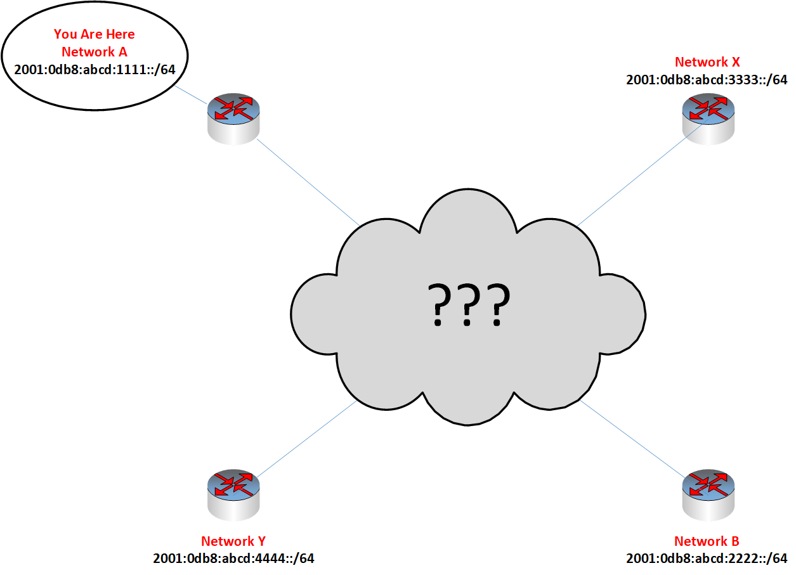

# Route Route Revolution

Map an IPv6 mesh network of VyOS routers then optimize and deoptimize BGP routes to achieve mission-critical effects on both our own and enemy transmission speeds.

**NICE Work Roles**

- [Network Operations Specialist](https://niccs.cisa.gov/workforce-development/nice-framework/)
- [Cyber Defense Analyst](https://niccs.cisa.gov/workforce-development/nice-framework/)

**NICE Tasks**

- [T0035](https://niccs.cisa.gov/workforce-development/nice-framework/): Configure and optimize network hubs, routers, and switches (e.g., higher-level protocols, tunneling).
- [T0081](https://niccs.cisa.gov/workforce-development/nice-framework/): Diagnose network connectivity problems.
- [T0291](https://niccs.cisa.gov/workforce-development/nice-framework/): Examine network topologies to understand data flows through the network.

## Background

Our IPv6 mesh network is compromised by enemies who deliberately hacked our routers. Their goal is to shorten their transmission times and extend ours to HQ, gaining a crucial advantage in communication speed. We only have details on the connected gateway router and local bases; you must map the rest of the network.

## Getting Started

You have access to a set of Kali systems within Network A. Each Kali system should obtain a DHCPv6 address in the `2001:0db8:abcd:1111::/64` network and be able to connect to the closest gateway at `2001:0db8:abcd:1111::1`.

Start by remotely connecting to the gateway, a VyOS 1.3 virtual router, through SSH. Examine its configuration and settings. Repeat this procedure for successive routers, progressively mapping the entire network.

## Grading

Visit `https://challenge.us` from the provided Kali VM to grade the challenge. Submissions are automatically recorded; correct answers are awarded points after requesting in-game grading at `https://challenge.us`.

Grading assesses each condition and provides feedback, along with traceroute results available at `https://challenge.us/files` for help.

To successfully complete the two grading checks, you must:

1. **Check 1:** Optimize the "Friendly" route between Network A and Network B, ensuring transmissions require no more than four (4) hops. Verify by running a traceroute6 to `2001:0db8:abcd:2222::1000` from your Kali system. This check can be independently passed.

2. **Check 2:** Deoptimize the "Enemy" route between network X and network Y, making transmissions take six (6) or more hops, thus slowing down enemy transmissions. Verify by running a traceroute6 to `2001:0db8:abcd:4444::1000` from your Kali system. While deoptimizing the enemy route, maintain the optimization of the friendly route. Both conditions must pass to receive credit for Check 2.

>Assume uniform transmission times between routes, and linear distance is not a factor due to technological advancements.

## Challenge Questions

1. Did you optimize the friendly network route?
2. Did you deoptimize the enemy route while maintaining the optimization of the friendly route?
