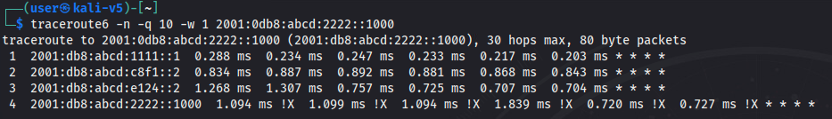

# Route Route Revolution

*Solution Guide*

## Overview

*Route Route Revolution* asks players to map an IPv6 router network and optimize/deoptimize specific paths.

## Mapping the Network

There are no token submissions to obtain from this section. However, it is essential for later grading checks.

Start with the local gateway at `2001:0db8:abcd:1111::1`.


Confirm your Kali system received a DHCPv6 address from the router and access the router via SSH.


Since the network is comprised of IPv6 addressing, adjust commands like `ping` to `ping6` or `traceroute` to `traceroute6`. SSH works the same as long as you provide the correct IPv6 formatted address.


SSH to the first router:

```bash
ssh vyos@2001:0db8:abcd:1111::1
```

Enter the password `tartans` to authenticate. Each router is accessed the same way with the same
credentials.


Your goal is to identify all routers in the network and establish their connections, so you understand the required BGP peering reconfigurations later on in the guide.

Track each router's configuration settings and create a visual map of the network as you go. Guidance is provided in this solution guide, but you're free to draw your own conclusions or make assumptions.

Start by checking each interface's IPv6 address on what we will refer to as **router A**.


Router A, our local gateway, has four interfaces in the `2001:0db8:abcd:3a7f::/64`, `2001:0db8:abcd:9e4a::/64`, and `2001:0db8:abcd:c8f1::/64` networks, and the local
`2001:0db8:abcd:1111::/64` network. Each network in the challenge was designed with the `2001:0db8:abcd:xxxx::/64` prefix pattern.

Next, check the router config for more clues. View the current configuration with the following command:

```bash
sh conf
```


The BGP configuration lines tell us the router's peers and their addresses. Knowing this, we can infer that the corresponding router on any network likely has an address ending in either :1 or :2 within the same prefix, depending on our router's configuration, either ::1 or ::2. The local-as (autonomous system) numbering is useful for tracking routers, as each router has a unique local-as number assigned. Each neighbor is assigned a distinct AS number as well.

From the above output, we presumably have three additional routers to check at `2001:0db8:abcd:3a7f::2`, `2001:0db8:abcd:9e4a::2`, and `2001:0db8:abcd:c8f1::2`. We'll name the new routers B, C, and E, as shown below. Why we skip to E in this guide becomes evident as we uncover more of the network though you can assign names however you like.


At this point, the team can split up to connect to and enumerate the other discovered routers.

For the sake of brevity, screenshots won't be duplicated for the same commands above as the process is the same for each router when checking its interfaces and BGP settings to find new IPv6 networks/prefixes and BGP peers/neighbors.

When connecting to **router B** at `2001:0db8:abcd:3a7f::2`, notice it has interfaces in the `2001:0db8:abcd:6a2d::/64` and `2001:0db8:abcd:b6d2::/64` networks.

When connecting to **router C** at `2001:0db8:abcd:9e4a::2`, notice it has interfaces in the `2001:0db8:abcd:d7b1::/64` and `2001:0db8:abcd:5f2e::/64` networks.

When connecting to **router E** at `2001:0db8:abcd:c8f1::2`, notice it has something different than the others. This router has interfaces in eight different networks: 

- `2001:0db8:abcd:c8f1::/64`(which is connected to router A)
- `2001:0db8:abcd:6a2d::/64`(which is connected to router B)
- `2001:0db8:abcd:f578::/64`
- `2001:0db8:abcd:d7b1::/64`(which is connected to router C)
- `2001:0db8:abcd:8e34::/64` 
- `2001:0db8:abcd:a983::/64`
- `2001:0db8:abcd:4d6b::/64`
- `2001:0db8:abcd:e124::/64`

It's becoming clearer that this router is the central hub for the rest of the network. It has more interfaces than any other router, and every router we checked is connected to it. We call this **E**, so it has the central letter by designation.

A crude drawing based on some assumptions is given below. We should confirm these assumptions as this central router is connected to eight devices including routers A, B, and C. Routers B and C have an additional neighbor we haven't checked.


The map is still murky but we're making connections. Next, we'll go a step further from routers B and C
by checking their configuration.

Looking at router B's configuration: we see it has BGP neighbors of `2001:0db8:abcd:3a7f::1` (we know it's our local gateway, router A), `2001:0db8:abcd:6a2d::2` (it's the central router, router
E), and `2001:0db8:abcd:b62d::2` (unknown to us).

Similarly, router C has BGP neighbors of `2001:0db8:abcd:9e4a::1` (we know it's our local gateway, router A), `2001:0db8:abcd:d7b1::2` (it's the central router, router E), and
`2001:0db8:abcd:5f2e::2` (unknown to us).


A pattern should emerge. Router E connects to routers D and F on networks `2001:0db8:abcd:f578::/64` and `2001:0db8:abcd:a983::/64`, respectively. Repeat the process for routers D and F and examining their interfaces and BGP neighbors.

**Router D** has interfaces in the `2001:0db8:abcd:b6d2::/64`, `2001:0db8:abcd:f578::/64`, `2001:0db8:abcd:1b7c::/64` networks, and `2001:0db8:abcd:3333::/64` (our second endpoint network). Its BGP neighbors are `2001:0db8:abcd:b6d2::1` (we know this is router B), `2001:0db8:abcd:f578::2` (central router E), and `2001:0db8:abcd:1b7c::2` (still unknown).

**Router F** has interfaces in the `2001:0db8:abcd:5f2e::/64`, `2001:0db8:abcd:4d6b::/64`, `2001:0db8:abcd:2f8a::/64` networks, and `2001:0db8:abcd:4444::/64` (our first endpoint network). Its BGP neighbors are `2001:0db8:abcd:5f2e::1` (we know this is router C), `2001:0db8:abcd:a983::1` (central router E), and `2001:0db8:abcd:2f8a::2` (still unknown).

Our updated map now reveals three discovered endpoint networks.


Let's look at the new routers we discovered: router G and router H.

**Router G** has interfaces in the `2001:0db8:abcd:1b7c::/64`, `2001:0db8:abcd:8e34::/64`, and `2001:0db8:abcd:7c59::/64` networks.

**Router H** has interfaces in the `2001:0db8:abcd:2f8a::/64`, `2001:0db8:abcd:a983::/64`, and `2001:0db8:abcd:af17::/64` networks.

**Router G** has BGP neighbors at `2001:0db8:abcd:1b7c::1` (we know is router D), `2001:0db8:abcd:8e34::1` (the central
router, E), and `2001:0db8:abcd:7c59::2` (unknown).

**Router H** has BGP neighbors at `2001:0db8:abcd:2f8a::1` (we know is router F), `2001:0db8:abcd:4d6b::1` (the central
router, E), and `2001:0db8:abcd:af17::2` (unknown).

Our map now looks like this, with only one piece left to verify.


Routers E, H, and I each still have one undiscovered peer, and we don't know the final endpoint. Assume what we connect to next is the undiscovered final router. Connect to it via any known interface and examine its interfaces and BGP neighbors.

Upon connecting, confirm that it has interfaces in the `2001:0db8:abcd:af17::/64`, `2001:0db8:abcd:e124::/64`, and `2001:0db8:abcd:7c59::/64` networks, along with the final endpoint network `2001:0db8:abcd:2222::/64`.

Router I's BGP neighbors include `2001:0db8:abcd:af17::1` (router H), `2001:0db8:abcd:e124::1` (central router E), and `2001:0db8:abcd:7c59::1` (router G). With this information, we now have a comprehensive map of the four endpoint networks.


Alternatively, branching out from the central node, once it's known to connect to eight neighbors, would yield the same overall map.

## Question 1

*Did you optimize the friendly network route?*

Let's review the final network map (see diagram below).


To affect traffic between networks A and B, we need to affect the configurations of routers A, E, and I. This is important because it is the only direct path resulting in traffic taking four (4) hops from a network A endpoint to a network B endpoint.

Similarly, to affect traffic between networks X and Y, we need to affect the configurations of at least routers B, E, and F. However, to guarantee traffic from network X takes seven (7) or more hops to network Y we need to adjust other routers too. For example: adjust BGP configurations to force traffic from X to go through routers D, B, E, G, I, H and finally, F. There are other possibilities.

At a minimum, we'll modify at least six or seven routers in the environment to achieve our goals. You could, of course, implement a different route. The route proposed above is only used to demonstrate the scale of the task at hand.

Remember the BGP configuration of router A, which serves as an example for your reference.


Pay close attention to these items in each BGP neighbor profile:

1. **ipv6-unicast:** Determine whether ipv6-unicast is disabled or not. If set to disable-send-community, the router won't share information with the assigned neighbor. If *both* corresponding neighbors have ipv6-unicast disabled, they won't peer or establish a BGP connection. Effectively, this setting disables BGP with the neighbor without removing the entry altogether. See evidence of this by viewing the results of: `sh bgp neighbors`.
2. **Soft-Reconfiguration inbound/outbound:** Ascertain whether soft-reconfiguration is configured for inbound or outbound routes. If set to inbound, the router receives the advertised routes from the neighbor. If set to outbound (or not set), it won't receive route advertisements from that neighbor. If both corresponding neighbors have this set to outbound, they won't share any routes despite being peered. Examine evidence of this by reviewing the results of: `sh bgp`. 
3. **Weight Value:** Weight Value is how much this router prefers that neighbor when sending traffic. The higher the weight, the more this router prefers that neighbor. Manipulate traffic for weight, even if it means deviating from a shorter path or optimizing a longer path.

### Optimizing the friendly route

Let's begin by examining the current route of traffic from network A to network B. On Kali, perform a traceroute, which is exactly what the grading check does.

```bash
traceroute6 -n -q 10 -w 1 2001:0db8:abcd:2222::1000 (the options added
here will speed up the traceroute to save time)
```


The traceroute reveals a circuitous path: router A -> router C -> router F -> router H -> router I.

To optimize this route, we need to reconfigure routers A, E, and I. We'll start on our local router, router A.

### Router A

SSH into router A and view the config: `sh conf`.

```
protocols {
    bgp {
        address-family {
            ipv6-unicast {
                network 2001:0db8:abcd:1111::/64
            }
        }
        local-as 65001
        neighbor 2001:0db8:abcd:3a7f::2 {
            address-family {
                ipv6-unicast {
                    soft-reconfiguration {
                        inbound {
                        }
                    }
                    weight 150
                }
            }
            remote-as 65002
        }
        neighbor 2001:0db8:abcd:9e4a::2 {
            address-family {
                ipv6-unicast {
                    soft-reconfiguration {
                        inbound {
                        }
                    }
                    weight 80
                }
            }
            remote-as 65003
        }
        neighbor 2001:0db8:abcd:c8f1::2 {
            address-family {
                ipv6-unicast {
                    soft-reconfiguration {
                        inbound {
                        }
                    }
                    weight 30
                }
            }
            remote-as 65005
        }
        parameters {
            router-id 10.1.1.1
        }
    }
}
```

We don't see any errors in the configuration, though the weights applied are not ideal. Adjust the weight values so router E, `2001:0db8:abcd:c8f1::2`, is the highest. It doesn't matter (yet) what the values to router B and C are, but lower them so router E is preferred.

There are two ways to edit the configuration:

1.  Edit the config file at `/config/config.boot` directly (somewhat riskier)
2.  Configure the router in configuration mode (preferred)

If using the first method: edit the file using `vi`, change the weight values, and reboot the router to apply your changes. You will lose your connection at this time.

If using the preferred second method: 

1. At the VyOs prompt, type and enter `conf` to enter configuration mode.
2. Use the following commands to modify, commit, and save the configuration.

```
set protocols bgp neighbor 2001:0db8:abcd:c8f1::2 address-family ipv6-unicast weight 150
set protocols bgp neighbor 2001:0db8:abcd:9e4a::2 address-family ipv6-unicast weight 50
set protocols bgp neighbor 2001:0db8:abcd:3a7f::2 address-family ipv6-unicast weight 50
commit
save
exit
```

3. Check your updates: `sh conf`.

```
protocols {
    bgp {
        address-family {
            ipv6-unicast {
                network 2001:0db8:abcd:1111::/64
            }
        }
        local-as 65001
        neighbor 2001:0db8:abcd:3a7f::2 {
            address-family {
                ipv6-unicast {
                    soft-reconfiguration {
                        inbound {
                        }
                    }
                    weight 50
                }
            }
            remote-as 65002
        }
        neighbor 2001:0db8:abcd:9e4a::2 {
            address-family {
                ipv6-unicast {
                    soft-reconfiguration {
                        inbound {
                        }
                    }
                    weight 50
                }
            }
            remote-as 65003
        }
        neighbor 2001:0db8:abcd:c8f1::2 {
            address-family {
                ipv6-unicast {
                    soft-reconfiguration {
                        inbound {
                        }
                    }
                    weight 150
                }
            }
            remote-as 65005
        }
        parameters {
            router-id 10.1.1.1
        }
    }
}
```

### Router E

Connect to router E via SSH at `2001:0db8:abcd:c8f1::2` and view the running config to see what must be reconfigured. This time, there is more to explore.

```
protocols {
    bgp {
        address-family {
            ipv6-unicast {
                network 2001:0db8:abcd:4d6b::/64
                network 2001:0db8:abcd:6a2d::/64
                network 2001:0db8:abcd:8e34::/64
                network 2001:0db8:abcd:a983::/64
                network 2001:0db8:abcd:c8f1::/64
                network 2001:0db8:abcd:d7b1::/64
                network 2001:0db8:abcd:e124::/64
                network 2001:0db8:abcd:f578::/64
            }
        }
        local-as 65005
        neighbor 2001:0db8:abcd:4d6b::2 {
            address-family {
                ipv6-unicast {
                    disable-send-community {
                    }
                    soft-reconfiguration {
                        inbound {
                        }
                    }
                    weight 100
                }
            }
            remote-as 65008
        }
        neighbor 2001:0db8:abcd:6a2d::1 {
            address-family {
                ipv6-unicast {
                    disable-send-community {
                    }
                    soft-reconfiguration {
                        inbound {
                        }
                    }
                    weight 120
                }
            }
            remote-as 65002
        }
        neighbor 2001:0db8:abcd:8e34::2 {
            address-family {
                ipv6-unicast {
                    disable-send-community {
                    }
                    soft-reconfiguration {
                        inbound {
                        }
                    }
                    weight 30
                }
            }
            remote-as 65007
        }
        neighbor 2001:0db8:abcd:a983::2 {
            address-family {
                ipv6-unicast {
                    soft-reconfiguration {
                        inbound {
                        }
                    }
                    weight 120
                }
            }
            remote-as 65006
        }
        neighbor 2001:0db8:abcd:c8f1::1 {
            address-family {
                ipv6-unicast {
                    soft-reconfiguration {
                        inbound {
                        }
                    }
                    weight 30
                }
            }
            remote-as 65001
        }
        neighbor 2001:0db8:abcd:d7b1::1 {
            address-family {
                ipv6-unicast {
                    disable-send-community {
                    }
                    soft-reconfiguration {
                        inbound {
                        }
                    }
                    weight 30
                }
            }
            remote-as 65003
        }
        neighbor 2001:0db8:abcd:e124::2 {
            address-family {
                ipv6-unicast {
                    weight 30
                }
            }
            remote-as 65009
        }
        neighbor 2001:0db8:abcd:f578::1 {
            address-family {
                ipv6-unicast {
                    soft-reconfiguration {
                        inbound {
                        }
                    }
                    weight 120
                }
            }
            remote-as 65004
        }
        parameters {
            router-id 10.5.5.5
        }
    }
}
```

Several configuration issues need attention, including: weight adjustments, disabled peering with four neighbors, and a missing soft-reconfiguration setting with router I. To optimize the friendly route, focus on the following steps:

1. In configuration mode, modify the weight to prioritize router I. Choose any value higher than or equal to the weights for router G (AS 65007) or router H (AS 65008).

    ```
    set protocols bgp neighbor 2001:0db8:abcd:e124::2 address-family ipv6-unicast weight 150
    ```

2. Apply soft-reconfiguration = inbound status for updates from router I.

    ```
    set protocols bgp neighbor 2001:0db8:abcd:e124::2 address-family ipv6-unicast soft-reconfiguration inbound
    ```

3. Commit, save, exit, and verify the configuration. 

This is all for router E at the moment. The next part is included just in case the check doesn't pass.

### Router I

Lastly, connect to router I at `2001:0db8:abcd:e124::2` and examine its configuration file.

```
protocols {
    bgp {
        address-family {
            ipv6-unicast {
                network 2001:0db8:abcd:2222::/64
            }
        }
        local-as 65009
        neighbor 2001:0db8:abcd:7c59::1 {
            address-family {
                ipv6-unicast {
                    soft-reconfiguration {
                        inbound {
                        }
                    }
                    weight 120
                }
            }
            remote-as 65007
        }
        neighbor 2001:0db8:abcd:af17::1 {
            address-family {
                ipv6-unicast {
                    soft-reconfiguration {
                        inbound {
                        }
                    }
                    weight 90
                }
            }
            remote-as 65008
        }
        neighbor 2001:0db8:abcd:e124::1 {
            address-family {
                ipv6-unicast {
                    soft-reconfiguration {
                        outbound {
                        }
                    }
                    weight 30
                }
            }
            remote-as 65005
        }
        parameters {
            router-id 10.9.9.9
        }
    }
}
```

Once again, weight plays a role, and we should set the soft-reconfiguration setting to inbound for its peering with router E (AS 65005).

In configuration mode:

```
set protocols bgp neighbor 2001:0db8:abcd:e124::1 address-family ipv6-unicast weight 150
set protocols bgp neighbor 2001:0db8:abcd:af17::1 address-family ipv6-unicast weight 100
set protocols bgp neighbor 2001:0db8:abcd:7c59::1 address-family ipv6-unicast weight 100
```

These settings force router I to prefer router E as the central hub for the network.

```
set protocols bgp neighbor 2001:0db8:abcd:e124::1 address-family ipv6-unicast soft-reconfiguration inbound
```

This ensures router I can receive router E's advertised routes and make the shortest path back to network A for grading check 1.

Commit, save, exit, and verify the config to make sure your changes were applied.

Now, run Grading Check 1 to observe the number of hops from the router in network A to network B, ideally achieving four hops.

Before that though, confirm our work by running a `traceroute` from Kali to the endpoint in Network B, `2001:0db8:abcd:2222::1000`.

```
traceroute6 -n -q 10 -w 1 2001:0db8:abcd:2222::1000 (the options added here will speed up the traceroute to save time)
```


The route takes the expected path through routers A, E, and I.

### Running the grading check

Browse to `https://challenge.us` from any Kali system.

The grading button checks the following:

1. How many hops it takes to send a transmission from an endpoint in Network A to an endpoint in Network B, and whether that value is four (4) or less.   
2. How many hops it takes to send a transmission from an endpoint in Network X to an endpoint in Network Y, and whether that value is seven (7) or more.

The two traceroutes take a maximum of 60 seconds to complete if all 30 hops are exhausted. The grading check shouldn't take more than 10-15 seconds. Click refresh after a few seconds to see your results.

If one or more of these conditions fails, you will be provided with feedback on the page, including the number of hops taken, so you can correct. If you pass any part, you will be told which part and your token will be submitted.

Run the grading check to confirm results for **Check 1**: "optimizing the friendly route."

As expected, we passed the first check by optimizing the route between Network A and Network B.


Remember that you can view the direct traceroute output from the first grading check at `https://challenge.us/files`.

## Question 2

*Did you deoptimize the enemy route while maintaining the optimization of the friendly route?*

Deoptimizing the route between network X and Y without breaking the shortest path between network A and B takes some planning. Use the grading check output and the direct traceroute
details from the last grading check at `https://challenge.us/files` for guidance.

For this solution, we propose routing traffic as follows:

`Network X -> router D -> router B -> router E -> router H -> router F -> Network Y`

This will create a six (6) hop route between the enemy networks. We will need to interact with routers B, D, E, F, and H to achieve this. Importantly, this path will not adversely affect the optimized friendly route.

Start with the router nearest to network X, which is router D.

### Router D

Connect to router D via SSH at `2001:0db8:abcd:b6d2::2` and view its BGP
configuration.

```
protocols {
    bgp {
        address-family {
            ipv6-unicast {
                network 2001:0db8:abcd:3333::/64
            }
        }
        local-as 65004
        neighbor 2001:0db8:abcd:1b7c::2 {
            address-family {
                ipv6-unicast {
                    soft-reconfiguration {
                        outbound {
                        }
                    }
                    weight 40
                }
            }
            remote-as 65007
        }
        neighbor 2001:0db8:abcd:b6d2::1 {
            address-family {
                ipv6-unicast {
                    soft-reconfiguration {
                        outbound {
                        }
                    }
                    weight 30
                }
            }
            remote-as 65002
        }
        neighbor 2001:0db8:abcd:f578::2 {
            address-family {
                ipv6-unicast {
                    soft-reconfiguration {
                        inbound {
                        }
                    }
                    weight 150
                }
            }
            remote-as 65005
        }
        parameters {
            router-id 10.4.4.4
        }
    }
}
```

Using the same methods as previous, redistribute the weights to prefer router B (As 65002) over router E (AS 65005) or G (AS 65007).

```
set protocols bgp neighbor 2001:0db8:abcd:b6d2::1 address-family ipv6-unicast weight 150
set protocols bgp neighbor 2001:0db8:abcd:f578::2 address-family ipv6-unicast weight 100
set protocols bgp neighbor 2001:0db8:abcd:1b7c::2 address-family ipv6-unicast weight 100
```

Note that if you have already solved the first check, then the `set protocols bgp neighbor 2001:0db8:abcd:b6d2::1 address-family ipv6-unicast weight 150` line should already be set.

We need to change the soft-reconfiguration setting to `inbound` so advertised routes are accepted with router B.

```
set protocols bgp neighbor 2001:0db8:abcd:b6d2::1 address-family ipv6-unicast soft-reconfiguration inbound
```

Commit, save, and exit, then verify the configuration to ensure your changes were applied. We are done with router D.

You could run the grading check and see the results at `https://challenge.us/files` to verify that traffic destined for network Y is now being redirected through router B and then router E, adding one more hop.


### Router B

Connecting to router B may not be absolutely required, but we'll play it safe and connect anyway.

Connect to router B via SSH  at `2001:0db8:abcd:3a7f::2` and view its BGP
configuration.

```
protocols {
    bgp {
        address-family {
            ipv6-unicast {
                network 2001:0db8:abcd:3a7f::/64
                network 2001:0db8:abcd:6a2d::/64
                network 2001:0db8:abcd:b6d2::/64
            }
        }
        local-as 65002
        neighbor 2001:0db8:abcd:3a7f::1 {
            address-family {
                ipv6-unicast {
                    soft-reconfiguration {
                        inbound {
                        }
                    }
                    weight 120
                }
            }
            remote-as 65001
        }
        neighbor 2001:0db8:abcd:6a2d::2 {
            address-family {
                ipv6-unicast {
                    disable-send-community {
                    }
                    soft-reconfiguration {
                        inbound {
                        }
                    }
                    weight 100
                }
            }
            remote-as 65005
        }
        neighbor 2001:0db8:abcd:b6d2::2 {
            address-family {
                ipv6-unicast {
                    weight 30
                }
            }
            remote-as 65004
        }
        parameters {
            router-id 10.2.2.2
        }
    }
}
```

Our weights are acceptable. Add the soft-reconfiguration setting of `inbound` to router D (AS 65004) and reestablish the peering between router B and E (AS 65005).

Checking the output of `sh bgp neighbors` on router E won't show router B as an established peer. While router B receives BGP info from router E, the reverse is not true.

Apply the inbound soft-reconfiguration to the peering with router B.

```
set protocols bgp neighbor 2001:0db8:abcd:b6d2::2 address-family ipv6-unicast soft-reconfiguration inbound
```

Finally, (re)enable advertising to router E (AS 65005) by removing the disabled setting.

```
delete protocols bgp neighbor 2001:0db8:abcd:6a2d::2 address-family ipv6-unicast disable-send-community
```

Commit, save, and exit, then verify the configuration to ensure your changes were applied. We are done with router B.

If you are curious if your changes are effecting the route, then run the grading check to see if the number of hops increased. If you ran it at this point in the solution, it would take five hops, which is better than four hops.

### Router E

Proceed to router E. SSH into `2001:0db8:abcd:c8f1::2` and inspect its BGP configuration, which, assuming you only applied the changes mentioned above for Grading Check 1, should now look like the following.

```
protocols {
    bgp {
        address-family {
            ipv6-unicast {
                network 2001:0db8:abcd:4d6b::/64
                network 2001:0db8:abcd:6a2d::/64
                network 2001:0db8:abcd:8e34::/64
                network 2001:0db8:abcd:a983::/64
                network 2001:0db8:abcd:c8f1::/64
                network 2001:0db8:abcd:d7b1::/64
                network 2001:0db8:abcd:e124::/64
                network 2001:0db8:abcd:f578::/64
            }
        }
        local-as 65005
        neighbor 2001:0db8:abcd:4d6b::2 {
            address-family {
                ipv6-unicast {
                    disable-send-community {
                    }
                    soft-reconfiguration {
                        inbound {
                        }
                    }
                    weight 100
                }
            }
            remote-as 65008
        }
        neighbor 2001:0db8:abcd:6a2d::1 {
            address-family {
                ipv6-unicast {
                    disable-send-community {
                    }
                    soft-reconfiguration {
                        inbound {
                        }
                    }
                    weight 120
                }
            }
            remote-as 65002
        }
        neighbor 2001:0db8:abcd:8e34::2 {
            address-family {
                ipv6-unicast {
                    disable-send-community {
                    }
                    soft-reconfiguration {
                        inbound {
                        }
                    }
                    weight 30
                }
            }
            remote-as 65007
        }
        neighbor 2001:0db8:abcd:a983::2 {
            address-family {
                ipv6-unicast {
                    soft-reconfiguration {
                        inbound {
                        }
                    }
                    weight 120
                }
            }
            remote-as 65006
        }
        neighbor 2001:0db8:abcd:c8f1::1 {
            address-family {
                ipv6-unicast {
                    soft-reconfiguration {
                        inbound {
                        }
                    }
                    weight 30
                }
            }
            remote-as 65001
        }
        neighbor 2001:0db8:abcd:d7b1::1 {
            address-family {
                ipv6-unicast {
                    disable-send-community {
                    }
                    soft-reconfiguration {
                        inbound {
                        }
                    }
                    weight 30
                }
            }
            remote-as 65003
        }
        neighbor 2001:0db8:abcd:e124::2 {
            address-family {
                ipv6-unicast {
                    soft-reconfiguration {
                        inbound {
                        }
                    weight 150
                }
            }
            remote-as 65009
        }
        neighbor 2001:0db8:abcd:f578::1 {
            address-family {
                ipv6-unicast {
                    soft-reconfiguration {
                        inbound {
                        }
                    }
                    weight 120
                }
            }
            remote-as 65004
        }
        parameters {
            router-id 10.5.5.5
        }
    }
}
```
Adjust a few weights to prefer sending traffic to router H (AS 65008) while maintaining the optimized route between network A and B. Apply an equal weight setting of 150 (or any previously applied value). Decrease weights for the most direct path through router F (AS 65006) and consider lowering preference weights for paths to routers C (AS 65003) and H (AS 65008) to prevent unwanted shortcuts.

```
set protocols bgp neighbor 2001:0db8:abcd:4d6b::2 address-family ipv6-unicast weight 150
set protocols bgp neighbor 2001:0db8:abcd:a983::2 address-family ipv6-unicast weight 30
set protocols bgp neighbor 2001:0db8:abcd:d7b1::1 address-family ipv6-unicast weight 30
```

Re-enable the peering with router B (AS 65002) and router H (AS 65008) --like we did on router B.

```
delete protocols bgp neighbor 2001:0db8:abcd:6a2d::1 address-family ipv6-unicast disable-send-community
delete protocols bgp neighbor 2001:0db8:abcd:4d6b::2 address-family ipv6-unicast disable-send-community
```
We don't need to do anything else with router E right now. There are other issues with the BGP settings, but they won't affect our preferred longer route.

Commit, save, and exit, configuration mode and verify the configuration.

### Router F

Connect via SSH at `2001:0db8:abcd:5f2e::2` and check the configuration.

```
protocols {
    bgp {
        address-family {
            ipv6-unicast {
                network 2001:0db8:abcd:4444::/64
            }
        }
        local-as 65006
        neighbor 2001:0db8:abcd:2f8a::2 {
            address-family {
                ipv6-unicast {
                    soft-reconfiguration {
                        inbound {
                        }
                    }
                    weight 90
                }
            }
            remote-as 65008
        }
        neighbor 2001:0db8:abcd:5f2e::1 {
            address-family {
                ipv6-unicast {
                    soft-reconfiguration {
                        inbound {
                        }
                    }
                    weight 90
                }
            }
            remote-as 65003
        }
        neighbor 2001:0db8:abcd:a983::1 {
            address-family {
                ipv6-unicast {
                    soft-reconfiguration {
                        inbound {
                        }
                    }
                    weight 120
                }
            }
            remote-as 65005
        }
        parameters {
            router-id 10.6.6.6
        }
    }
}
```

To prioritize our route to router H (As 65008), increase its weight while decreasing the weights for router C (AS 65003) and router E (65005).

```
set protocols bgp neighbor 2001:0db8:abcd:2f8a::2 address-family ipv6-unicast weight 150
set protocols bgp neighbor 2001:0db8:abcd:a983::1 address-family ipv6-unicast weight 30
set protocols bgp neighbor 2001:0db8:abcd:5f2e::1 address-family ipv6-unicast weight 30
```

Nothing else needs to be changed.

### Router H

Connect to router H via SSH at `2001:0db8:abcd:4d6b::2` and view its BGP
configuration.

```
protocols {
    bgp {
        address-family {
            ipv6-unicast {
                network 2001:0db8:abcd:2f8a::/64
                network 2001:0db8:abcd:4d6b::/64
                network 2001:0db8:abcd:af17::/64
            }
        }
        local-as 65008
        neighbor 2001:0db8:abcd:2f8a::1 {
            address-family {
                ipv6-unicast {
                    soft-reconfiguration {
                        inbound {
                        }
                    }
                    weight 80
                }
            }
            remote-as 65006
        }
        neighbor 2001:0db8:abcd:4d6b::1 {
            address-family {
                ipv6-unicast {
                    disable-send-community {
                    }
                    soft-reconfiguration {
                        inbound {
                        }
                    }
                    weight 120
                }
            }
            remote-as 65005
        }
        neighbor 2001:0db8:abcd:af17::2 {
            address-family {
                ipv6-unicast {
                    soft-reconfiguration {
                        inbound {
                        }
                    }
                    weight 80
                }
            }
            remote-as 65009
        }
        parameters {
            router-id 10.8.8.8
        }
    }
}
```

Once again, we'll adjust weighting to prefer router I (AS 65009) over router E (AS 65005) or router F (65006).

```
set protocols bgp neighbor 2001:0db8:abcd:af17::2 address-family ipv6-unicast weight 150
set protocols bgp neighbor 2001:0db8:abcd:2f8a::1 address-family ipv6-unicast weight 30
set protocols bgp neighbor 2001:0db8:abcd:4d6b::1 address-family ipv6-unicast weight 30
```

...fix the peering with router E (AS 65005).

```
delete protocols bgp neighbor 2001:0db8:abcd:4d6b::1 address-family ipv6-unicast disable-send-community
```

This now satisfies the condition to make the enemy traffic take six or more hops, without breaking our optimized friendly path. Allow a few moments for the BGP information to disseminate throughout the network.

As a last resort, consider restarting the BGP service or rebooting routers E and F. This ensures any previously preferred routes are disregarded. However, run the grading check first to determine if this step is necessary.

### Running the grading check

Browse to `https://challenge.us` from any Kali system.

The grading button checks the following:

1.  How many hops it takes to send a transmission from an endpoint in Network A to an endpoint in Network B, and whether that value is four (4) or less.
2.  How many hops it takes to send a transmission from an endpoint in Network X to an endpoint in Network Y, and whether that value is seven (7) or more.

The two traceroutes take a maximum of 60 seconds to complete if all 30 hops are exhausted. The grading check shouldn't take more than 10-15 seconds. Click refresh after a few seconds to see your results.

If one or more of these conditions fails, you will be provided with feedback on the page, including the number of hops taken, so you can correct. If you pass any part, you will be told which part and your token will be submitted.

If you successfully deoptimized the enemy route without affecting the optimization of the friendly route, your token is submitted. If your changes broke the optimized friendly path, you are told how many hops the route now takes and have the opportunity to fix it and regrade.

Remember, you can view the output of the `traceroute` commands at `https://challenge.us/files` for more information.
