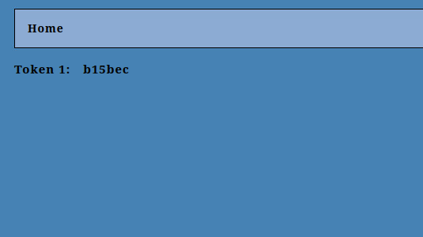

# The Art of the Heist

*Solution Guide*

## Overview

This solution guide walks the reader through the solution to *The Art of the Heist*, including: completing the multi-staged authentication for the website, `vault.merch.codes`, and blocking the external machine terminating unauthorized sessions on `vault.merch.codes`.

The authentication stages include submitting a valid user and password login credential, a four-character pin, and a digital identification file.

### Review the 'instructions.txt' file first!

If you are playing *The Art of the Heist* in a gamespace, browse to`challenge.us` and read `instructions.txt`. It contains information about the Vault, its authentication process, and other outside influences. Information about **admins** is especially important. For
your convenience, it's linked [here](c43/challenge/hosted_files/instructions.txt).

## Question 1

*What is the hex string found on `vault.merch.codes` after successfully logging in?*

### Log into the Vault website successfully

On the Kali VM, browse to the Vault URL: `vault.merch.codes` and review the information on the home page.

At the bottom of the page, notice:

- the link to the User Login page
- the footer stating: **Supported by Mattermost** with a link to `https://chat.merch.codes` (this is a hint)

There is no "create user" page and no apparent vulnerability on the login page. `Instructions.txt` tells us the suspected method of authentication for login is verification through a remote database on the network; the link to Mattermost hints it is the database.

Create a Mattermost account:

1.  Click the **Mattermost** link in the home page footer.
2.  Select **View in Browser**.
3.  On the Log in page, click **Don't have an account?**
4.  Complete the remaining fields and click **Create Account**.

Try logging into the Vault (`vault.merch.codes/level1`) with your new Mattermost credentials. You get the message: *Admin account required for access*. This tells us we're on the right path.

Given you can't create an admin account on Mattermost yourself, let's look at pfSense and see if any network traffic can help.

Browse to `pfsense.merch.codes` and login using the credentials found in `instructions.txt` and in the challenge document: **U:** bookworm | **Pw:** read-only .

Click **Services**, **DNS Resolver**. Scroll down to **Host Overrides**. It should look like the screen print below:


This information is key to solving the challenge.

Go to **Diagnostics**, **Packet Capture**. Change the following settings and start a packet capture:

- **Interface:** WAN - we want to see what traffic is sent inside the network
- **Promiscuous:** Enable promiscuous mode -- we want to capture all traffic, not just traffic directed to the firewall.
- **Count:** set to a higher number -- we don't want to miss any important traffic.
- **Level of detail:** Full - we want the most information from the packet capture.

Click **Start** and allow the packet capture to run. After some time has passed, **Stop** and **Download Capture**.

Open the capture in Wireshark and analyze it. Most of the traffic is encrypted but some traffic is sent in plaintext via http originating from the **tkretts IP** (`123.45.67.199`) found in the DNS Resolver.

In Wireshark, in the search field, enter `http` to see just the http packets.

It may be helpful to reference the Mattermost API documentation found [here](https://api.mattermost.com/#tag/users/operation/GetUsers).

Open the packet running the GET request from the tkretts IP (`123.45.67.199`) to the IP `10.3.3.10`. Take note of the following information:

- **Full request URI: https://chat.merch.codes/api/v4/users:**  The request is made to the Mattermost API.
- **Requester: tkretts@merch.codes:** Not needed to complete this task but provides a hint; according to `instructions.txt` the admin Topsy Kretts handles login authentication.
- **Authorization: Bearer [*key*]:** Passes the Authorization Key to the Mattermost API so the API knows the request being made is authorized and can be completed.

Below is a screen print of what you should see.


Using this information, you can craft your own request to the Mattermost API to help you log into the Vault.

For the first request, make the same request as the one from the packet capture. Use the following information:

- Run `GET` request against the URL`https://chat.merch.codes/api/v4/users`
- Set the header of the request using the key from the previous step.
  - Authorization: Bearer {key found}
  - Content-Type: application/json

The exemplar Python script below uses the requests library.

```python
import requests, json
Auth_key_found = "eih7t4qbypg5uqkuijnnudhhpa"
url = f"https://chat.merch.codes/api/v4/users"
try:
  out = requests.get(url,headers={"Requester":"tkretts@merch.codes", "Authorization":f"Bearer {Auth_key_found}","Content-Type":"application/json"})
except Exception as e:      # To help with troubleshooting if you should run into issues.
  print(str(e))
else:
  print(json.dumps(json.loads(out.text),indent=2))
```

If executed correctly, you should get a list of every user account created on the Mattermost website. There are two important pieces of information you need from the response:

- Admin accounts on Mattermost have two roles; normal users have one. The additional role, needed to log into the Vault, is **system_admin.**
- The id string associated with the account you created.

Since your account doesn't have the **system_admin** role, we will make a request to the Mattermost API using all the found information to change your permissions and give you the **system_admin** role.

It may be helpful to reference the Mattermost API documentation found [here](https://api.mattermost.com/#tag/users/operation/GetUsers).

For the second request:

- Run `PUT` request against the URL `https://chat.merch.codes/api/v4/users/{*ID of your account*}/roles`
- Set the `header` with the same information as the `GET` request:
    - `Authorization:Bearer {key found}`
    - `Content-Type:application/json`
- Create and pass a `dictionary` object that contains the `roles` you want to apply to your account.
    - new_roles = {"roles":"system_admin system_user"}

Below is another exemplar Python script like the previous script using all the information required to complete this request.

```python
import requests, json
Auth_key_found = "eih7t4qbypg5uqkuijnnudhhpa"
user_acc_id = **ID of your account found in previous step**
new_roles = {
    "roles":"system_admin system_user"
}
url = f"https://chat.merch.codes/api/v4/users/{user_acc_id}/roles"
try:
  out = requests.put(url,json=new_roles,headers={"Authorization":f"Bearer {Auth_key_found}","Content-Type":"application/json"})
except Exception as e:      # To help with troubleshooting if you should run into issues.
  print(str(e))
else:
  print(json.dumps(json.loads(out.text),indent=2))
```

If done correctly, you get a message stating: `"status":"OK"` telling you the request was completed successfully.

Return to the Vault login page (`vault.merch.codes/level1`) and login. Now, you pass authentication.

The first token, and the answer to Question 1, is present on the next page.



## Question 2

*What is the hex string found on `vault.merch.codes` after successfully passing all stages of authentication?*

### Prevent automated service from terminating session

#### Get Admin access to pfSense

Shortly after logging in the session checker catches your session and ends it.


Now that you have **admin** credentials, see what information is present in Mattermost. Log into the Mattermost server at `chat.merch.codes`.

In the top-left corner, click the **cube icon**, then **System Console**.


In the left navigation, under **USER MANAGEMENT**, click **Teams**. There is a second team called **admin** that is invite-only. Click the **Edit** link next to it.


Under **Members** section, click **Add Members,** and search for your account. Add yourself to the admin team and **Save**.

Click **\< Back to dev**. A new row appears on the left side of the screen that shows both of your teams. Click the **AD** square.

Click the **+** button and select **Browse Channels**.


Join the channel called **Updates**. Upon joining, there is a message from **admin** telling you the admin password for pfSense has been updated. The new password is: `T3mp@sT`.

Using `admin` \| `T3mp@sT`, you can fully access pfSense.

### Change firewall rules to block monitor 

Browse to `pfsense.merch.codes` and login with the admin credentials. We can surmise that the VM `monitor` (`10.3.3.17`) is watching and terminating unauthorized sessions.

The rest of DNS is needed to work to authenticate and gain access, but now we can add new rules to block `monitor` from sending requests to`vault.merch.codes`.

**There may be other ways to achieve the same results, but for the purposes of this solution guide, use this method.**

Still in pfSense:

1.  Go to **Firewall**, **Rules**.
2.  Click **LAN**, then **up arrow Add**.
3. In Firewall / Rules / Edit:
   -   **Action:** Block
   -   **Interface:** LAN
   -   **Protocol:** Any
   -   **Source:** Single host or alias 10.3.3.17
   -   **Destination:** Single host or alias 10.7.7.7
5.  Click **Save** and then **Apply Changes**.

Your newly created rule appears at the top of the rules list for the LAN (except for the Anti-Lockout Rule). Your screen should look like the screen print below.


Now, the `monitor` VM can't see or terminate your session. You can log in and stay logged in for the session duration on `vault.merch.codes`. Log in now.

## Submit PIN

### Create a PIN for your user

The Vault home page states each session has a five-attempt limit, so the PIN can't be brute forced.

`Instructions.txt` tells you user **shiamazu** handles the Pin Authentication and the DNS Resolver told you shiamazu has a machine on the network.

Browse to: `shiamazu.merch.codes`. Mr. Shiamazu's Vault Pin Service page describes the website's functionality. You want to create a PIN for your new account but can't because you lack a PIN from an already authenticated user.

When viewing the website, it is evident that it is a "bare bones" setup. If you attempt to send a few commands to Mr. Shiamzu's site, you realize it doesn't have a maximum attempt configuration like Vault does. Thus, it's vulnerable to brute force.

`Instructions.txt` tells you PIN codes are four-character hex string format--so you must use that information to brute force the **Verify a pin** function on Mr. Shiamazu's site.

Based upon the syntax shown on the `shiamazu.merch.codes` home page, here is a script to brute force verifying the pin. In this exemplar script, the attack is against the admin, **tkretts**. You could choose **canello** or **shiamazu** too.

View the script [here](script/brute_force.py).

When complete, you know the PIN for **tkretts**. Now, you can create a PIN for your account using this code.

```python
import requests, json
data = {
"function":"create",
"auth_username":"tkretts",
"auth_pin":"**pin found previously**",
"new_user_username":"**Your account username**"
}
try:
  resp = requests.post("http://shiamazu.merch.codes/",json=data)
except:
  print("error")
else:
  print(resp.text)
```

If done correctly, your new PIN is printed. Enter it in the Vault and proceed to the final layer of authentication.

## Digital Identification File

From `instructions.txt` you know user **canello** handles the Digital Identification Files and from DNS Resolver you know he has a machine on the network.

Browse to: `canello.merch.codes`. This site is better organized than `shiamazu.merch.codes`. It seems to have three major functions: Digital Identification Creation, Digital Identification Hash Verification, and Digital Identification Updater.

The Canello home page contains important information:

- Admin Approval Codes are required to create an ID.
- When an ID is created, it is sent to the email address entered during creation.
- The Digital ID Updater is a **NEW BETA FEATURE**. This is a hint that it may have a vulnerability you can exploit.
- It says **Supported by Roundcube**, which is an email server.

Recall the `instructions.txt` file states:

"*The Vaults verification of the submitted Digital Identification File compares the submitted files hash against the hash during creation rather than verifying its contents."*

In other words, an ID file that has your username is not required. You just need to retrieve a valid ID.

Before continuing, create an email account on `mail.merch.codes` (for example, `your-username@merch.codes`). You need it to receive your Digital Identification File.

>**Caution!** If you attempt to log out of your account on **mail.merch.codes** you may encounter a bug where your account isn't fully logged out. If this occurs, click the padlock icon next to the address bar and select the option to **clear cookies and site data**. Then, refresh the login page. Login with your username and password.

On Canello's home page, click **Update ID**. The Update Existing ID form allows a user to update aspects of their ID, but it still requires an Admin Approval Code.

Look at the source code (right click the page, **View Page Source**). Scroll down to the code commented out `<!--For Beta testing-->`.In the commented code there is an entry in the form for a checkbox input, when enabled, allowed the tester to submit with an override. This override is so an Admin Approval Code isn't required.

This is your hint that even though the webpage form is commented, the website itself might still accept a POST with that value passed. When crafting your form injection, note:

- For the `old_username`, target any user who is an admin: `tkretts`, `shiamazu`, or `canello`.
- For the `new_username`, enter the username of the account you are logged in as on `vault.merch.codes`.
- For the `email`, enter the email you created in Roundcube mail.
- For the `key`, enter any string you'd like.
- For the `role`, enter `system_admin` because that is what would be returned from the HTML form viewed in the source code.

Knowing all that, write your custom POST request using the HTML values present on `canello.merch.codes/update_id/`.

View the script [here](script/form_injection.py).

>**Please Note:** If you attempt to send the POST request exploit using **Firefox Developer Tools**, pay attention to the following:
>
>When creating the POST request in Firefox, Firefox may autopopulate values/configuration for the request. If the `Content-Length` is set, and the number it is set to is *lower* than the length of the data you want to send in the `Body` of the request, Firefox reads the number of characters equal to the number set to `Content-Length`.
>
>For example: In the screen print below, the `Content-Length` is set to `102`, but the string entered in the `Body` is 105 characters long. When you send, the last three characters are dropped and and the request can't complete successfully.
>
>
>
>Therefore, make the `Content-Length` value the same or greater than the length of the data in `Body` to ensure your request is made.

You will receive an email to your `merch.codes` account that contains the newly created Digital Identification File. See the screen print below.


Download the Digital Identification File.

Now that you have all parts, complete the authentication process on`vault.merch.codes` and retrieve the second and final token.


