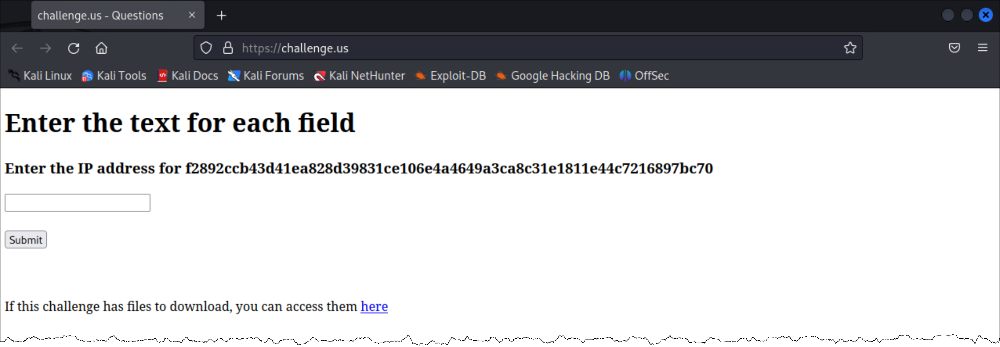
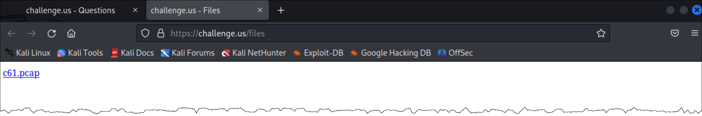
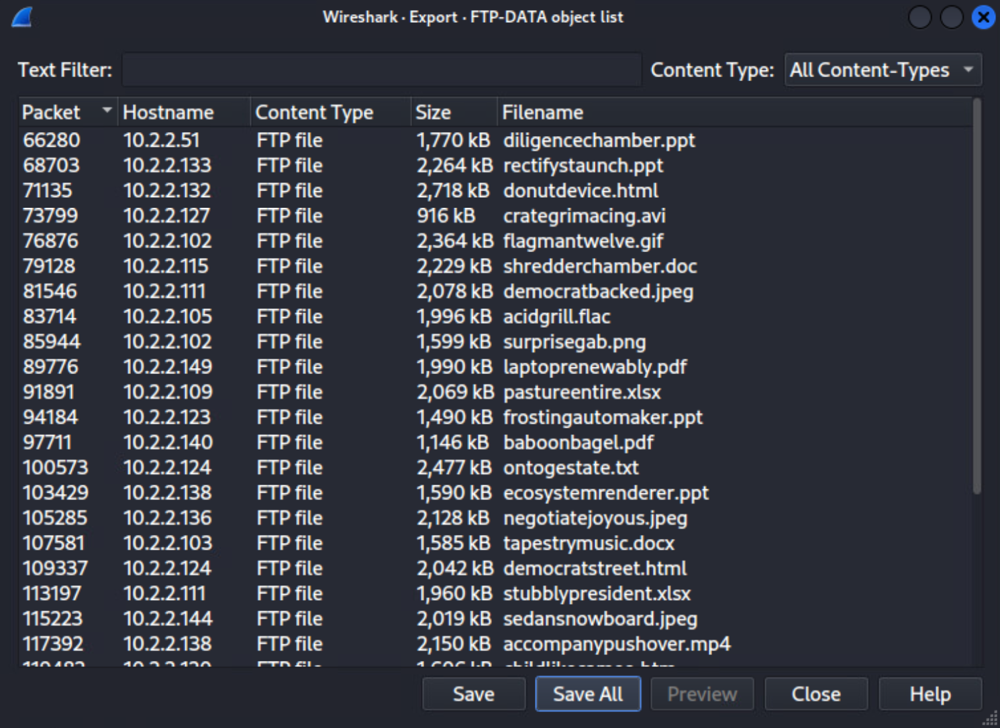
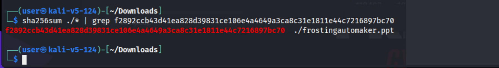
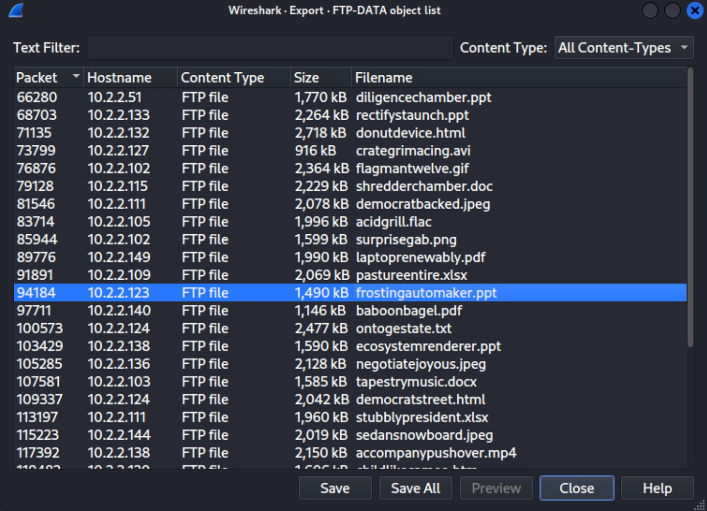
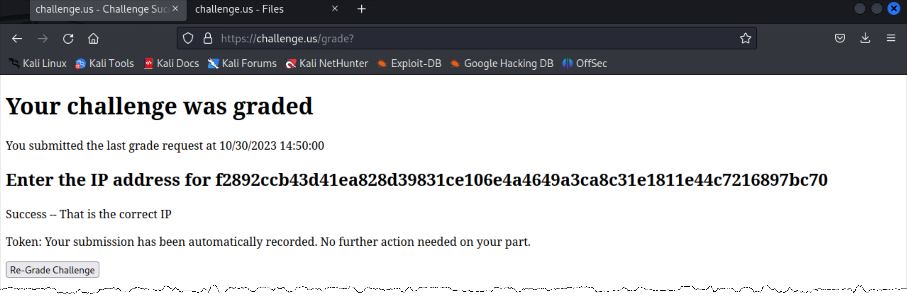

# Who Put That There?

*Solution Guide*

## Overview

In *Who Put That There?* players are asked to examine a pcap file to find which IP address uploaded a file with the **SHA-256** hash of
**`a541516295176dff5b68a404a5b42ba1691bc51898baf4171f93e38349bf850b`** to the FTP server.  Players are given a pcap file available in-game from `challenge.us/files'.

## Question 1

To find the IP address of the file:

1. In the gamespace, browse to `challenge.us`.



2. Click the "**here**" link, go to `challenge.us/files`, and download the pcap file. Open it in Wireshark.



3. Select **File**, **Export Objects**, **FTP-DATA**.
4. Select **Save All** and save the files to disk.



5. Open the saved location in a terminal and run the following command:

```
sha256sum ./* | grep <the hash from the question>
```


6. Return to the Wireshark - Export window for the FTP-DATA files and find the filename with the IP address that uploaded it.



7. On `challenge.us`, enter the IP address and click **Submit** to grade the challenge.



The answer is `10.2.2.138`.
