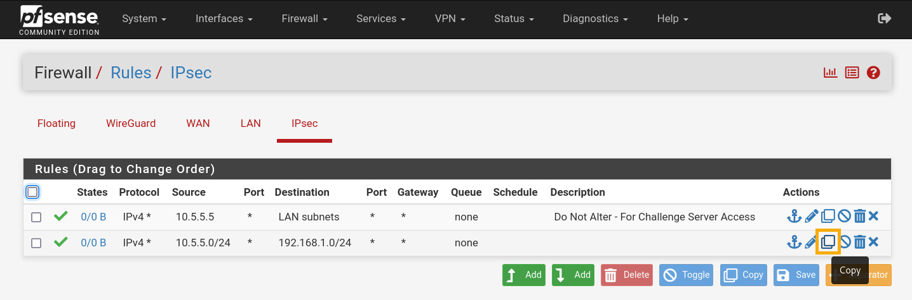

# Branching Out

*Solution Guide*

## Overview

This challenge has two main tasks. The first task asks the competitor to establish network communication between the Main office and the Branch office. The second task asks the competitor to identify a network issue with one of the servers at the Branch office. Both tasks are evaluated within the challenge environment where the competitor is provided tokens to enter and complete the challenge. Note that the tokens are dynamically generated and will be different each time the challenge is attempted.

## Question 1

### (Task 1)

*What is the 8-digit hexadecimal code you received from the grading check (`challenge.us`) for Task 1?*

1. Begin by confirming what the users are reporting. From `kali-main`, attempt to ping server `192.168.2.11`. No replies are received.

2. From `kali-branch`, attempt to ping server `192.168.2.11`. This time replies are received, so we know the server is reachable on the network. Something is preventing network communication between the Main office and Branch office.

3. From the `kali-main` console, open a web browser and navigate to `https://pfsense.merch.codes`. Enter the username `user` and password `tartans` to login.

4. Navigate to **VPN** > **IPsec**. Reviewing the configuration we see that there is an IPsec VPN which is labeled **Merch Branch Office**.

5. Navigate to **Status** > **IPsec**. The Main Branch Office tunnel has a status of **Disconnected**. Clicking **Connect P1 and P2s** places it into a **Connecting** status, but it does not connect. Click **Disconnect P1** to stop the connection attempt. Something is preventing the VPN from establishing. This is likely why the Main office cannot reach the Branch office.

6. Navigate to **VPN** > **IPsec**. We see that the VPN is configured with a Remote Gateway of `45.67.98.32`.

7. Navigate to **Diagnostics** > **Ping**. Enter **45.67.89.32** as the Hostname and click **Ping**. In the Results we see that the destination host is unreachable. You are told that the Branch office has internet, so it has connectivity. Perhaps the Remote Gateway is not configured to respond to ICMP?

8. From the `kali-branch` console, open a web browser and navigate to `https://pfsense-branch.merch.codes`. Enter the username `user` and password `tartans` to login.

9. From the pfSense Dashboard notice that the IP address of the WAN interface is `45.67.89.23`. Recall that the Remote Gateway on the Main office pfSense was configured to use `45.67.89.32`; it appears that someone transposed the last octet of the IP address.

10. From the `kali-main` console, return to the pfSense Dashboard (`https://pfsense.merch.codes`) logging in if necessary.

11. Navigate to **VPN** > **IPsec** and click the pencil icon to edit the Phase 1 entry of the VPN.

12. On the **Edit Phase 1** page, correct the Remote Gateway IP address so it is `45.67.89.23`.

13. Click **Save** to save your edit and click **Apply Changes**.

14. Navigate to **Status** > **IPsec**. The Merch Branch Office VPN should now show a status of **Established**.

15. From `kali-main`, attempt to ping server `192.168.2.11`. We still see that no replies are received.

16. From `kali-branch`, open a terminal window and enter the command: `ip address`.

17. Locate the IP address assigned to `eth0` of the `kali-branch` console.

18. Return to `kali-main` and attempt to ping the IP address of `kali-branch`. This time replies are received! This confirms that the VPN tunnel is able to pass traffic; which means something else must be preventing the Main office from being able to reach server `192.168.2.11`.

19. From the `kali-main` console, return to the pfSense Dashboard (`https://pfsense.merch.codes`) , logging in if necessary.

20. Navigate to **VPN** > **IPsec** and click **Show Phase 2 Entries**. We see an entry for traffic from `10.5.5.0/24` to `192.168.2.0/24`, so the traffic is being allowed across the tunnel. Perhaps something is misconfigured on the remote side.

21. From the `kali-branch` console, return to the pfSense Dashboard (`https://pfsense-branch.merch.codes`), logging in if necessary.

22. Navigate to **Firewall** > **Rules** then click **IPsec** to see the firewall rules associated with the IPsec VPN tunnel.

23. Reviewing the rules, note there is only a rule allowing traffic from the `10.5.5.0/24` network to the `192.168.1.0/24` network. This is why we were able to ping the IP address of the `kali-branch` workstation. There is no rule allowing traffic to the `192.168.2.0/24` network which may be why server `192.168.2.11` is unable to be reached.

24. Click **Copy** on the `10.5.5.0/24` to `192.168.1.0/24` rule.

25. Under **Destination**, change the network to `192.168.2.0/24`.

26. Click on **Save** to save the new rule and click **Apply Changes**.

27. From `kali-main`, attempt to ping server `192.168.2.11`. Replies are received!

28. Navigate to `challenge.us` on either `kali-main` or `kali-branch` and click **Grade Challenge**. After a few moments you will receive the token for Question 1 (Task 1).

## Question 2

### (Task 2)

*What is the 8-digit hexadecimal code you received from the grading check (`challenge.us`) for Task 2?*

1. Begin by confirming what the users are reporting. From `kali-branch`, attempt to access server `192.168.2.11` using SSH by entering the command: `ssh user@192.168.2.11`.

2. Accept any authenticity warnings and enter the password `tartans`.

3. Attempt to navigate the server using basic commands such as `ls` or `ip address`. After a short period, you should receive a notice and be disconnected from your SSH session.

4. In the Gamespace Resources, you are provided console access to a system labeled `192-168-2-11`. From the console, login to the system using the username `user` and password `tartans`.

5. Run the `ip address` command on the system and note it returns an IP address of `192.168.2.11`. This matches its hostname `192-168-2-11` and is a clue.

6. From `kali-branch` again access server `192.168.2.11` using SSH by entering the command: `ssh user@192.168.2.11`. Repeat your SSH login several times, paying attention to the hostname being returned. After a few attempts you should notice it cycles between **192-168-2-11** and **192-168-2-12**. It appears the network may have a duplicate IP address in use!

7. Since you only have console access to `192-168-2-11` resolution of this will take a few steps.

8. From the `192-168-2-11` console, enter the command: `sudo ip link set ens32 down`. This will disable the ens32 network interface on the server.

9. From `kali-branch`, enter the command `ssh user@192.168.2.11` and the password `tartans` when prompted.

10. The hostname of the system will show **192-168-2-12**. Enter the command: `sudo nano /etc/netplan/00-installer-config.yaml` and the password `tartans` when prompted.

11. This will open the network configuration yaml file. Use the arrow keys to navigate to the IP address and change it from `192.168.2.11/24` to `192.168.2.12/24`.

12. Press `Ctrl`+`o` to write out your changes and press `Enter` to confirm the filename. Press `Ctrl`+`x` to exit nano.

13. Enter `sudo netplan try`. This will validate your configurations before they are applied. This is important since you will lose access to the system once the IP address has changed.

14. Enter`sudo netplan apply` to apply your changes. When your changes are applied, your console session will hang; this is because it had been established to `192.168.2.11` which is no longer the IP address of the server.

15. From a new terminal window, enter the command `ssh user@192.168.2.12`. Accept any authenticity warnings and enter the password `tartans`. You should now be logged in to the `192-168-2-12` server!

16. From the `192-168-2-11` console, enter the command `sudo ip link set ens32 up`. This will enable the interface on the server.

17. With the duplicate IP address issue resolved, navigate to `challenge.us` on either `kali-main` or `kali-branch` and click **Grade Challenge**. After a few moments you will receive the token for Question 2 (Task 2).