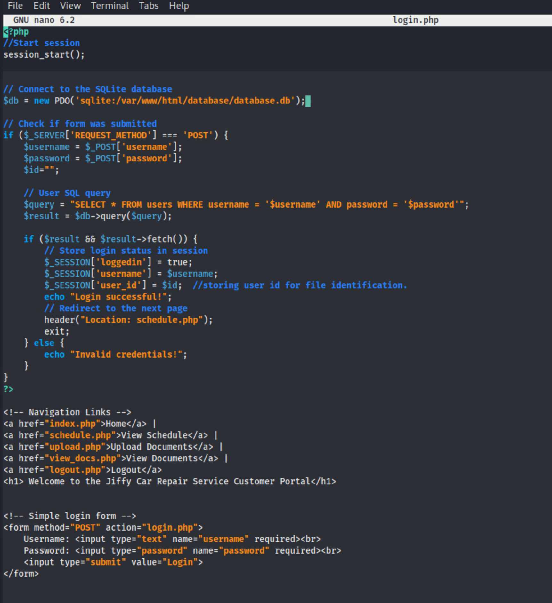
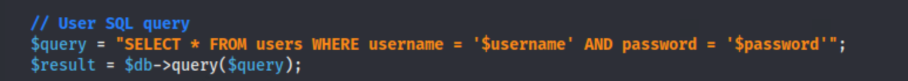
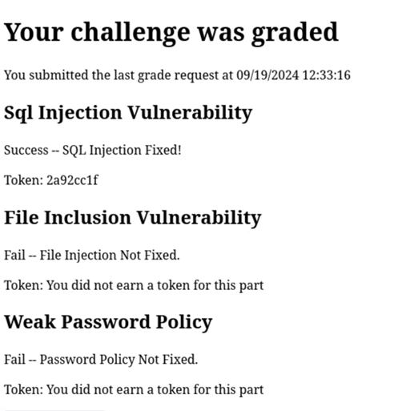
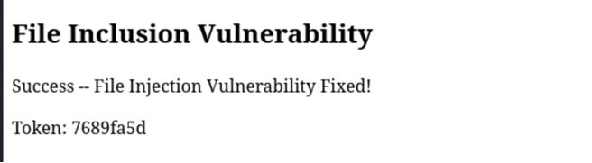
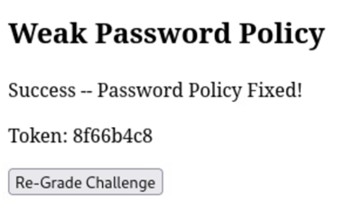

# Disservice Station

*Solution Guide*

## Overview

The objective of *Disservice Station* is to repair three (3) vulnerabilities on the **Jiffy Car Repair Company** web site. This solution guide walks you through making the fixes and solving the challenge. You will:

1. Fix the SQL injection vulnerability without breaking any login functionality.
2. Fix the file inclusion vulnerability and still allow `.pdf` file types at a minimum to upload.
3. Implement a strong password policy requiring a minimum of eight (8) characters, one uppercase character, one lowercase character, and one number.

## Question 1

*Token 1: Repair a SQL injection vulnerability.*

Start by accessing the web server (`10.5.5.100` ) via SSH.

1. Open a terminal on the `user-box (kali)` VM.
2. Enter the SSH command to connect to the web server using these credentials: **username:** `user` | **password:** `tartans`.

```bash
ssh user@10.5.5.100
```

3. Elevate to root privileges by entering `sudo su`, and when prompted, the password `tartans`.

4. Then, navigate to the `/var/www/html/` directory:

```bash
cd /var/www/html/
```

5.  And open `login.php` using the text editor `nano`.

```bash
nano login.php
```



The SQL query at line 16 is sending input directly to the database.



6. To sanitize the input and avoid a SQL injection, we will use prepared statements for SQL. Replace these lines:

```php
$query = "SELECT * FROM users WHERE username = '$username' AND password = '$password'";
$result = $db->query($query);

if ($result && $result->fetch()) {
        // Store login status in session
        $_SESSION['loggedin'] = true;
        $_SESSION['username'] = $username;
        $_SESSION['user_id'] = $id;  //storing user id for file identification.
        echo "Login successful!";
        // Redirect to the next page
        header("Location: schedule.php");
        exit;
    } else {
        echo "Invalid credentials!";

```

with these lines:

```php
//sql query with prepared statements
$query = "SELECT * FROM users WHERE username = ?";
$stmt = $db->prepare($query);
$stmt->execute([$username]);
$result = $stmt->fetch(PDO::FETCH_ASSOC);

// Check if user exists and password matches
if ($result && $password === $result['password']) {
    // Store login status and user info in session
    $_SESSION['loggedin'] = true;
    $_SESSION['username'] = $username;
    $_SESSION['user_id'] = $result['id'];

    echo "Login successful!";
    // Redirect to the next page
    header("Location: schedule.php");
    exit;
} else {
    echo "Invalid credentials!";
```

7. Press `CTRL+O` to save the file and `CTRL+X` to exit the editor.
8. In a browser, navigate to `challenge.us` and click **Grade Challenge**. If done correctly, you should receive a token. Remember that the tokens are random so your token will be different than the token below.

 

## Question 2

*Token 2: Fix the file inclusion vulnerability.*

1. If you aren't already connected, log into SSH on `10.5.5.100`.
2. Open the file for editing:

```bash
nano /var/www/html/upload.php
```

3. Replace the existing code:

```php
    if (move_uploaded_file($_FILES["file"]["tmp_name"], $target_file)) {
        // Insert file info into the database
        $query = "INSERT INTO uploads (user_id, filename, upload_date) VALUES (?, ?, ?)";
        $stmt = $db->prepare($query);
        $stmt->execute([$user_id, basename($_FILES["file"]["name"]), date('Y-m-d H:i:s')]);

        echo "The file " . htmlspecialchars(basename($_FILES["file"]["name"])) . " has been uploaded.";
    } else {
        echo "Sorry, there was an error uploading your file.";
```

...with new code:

```php
    $file_extension = strtolower(pathinfo($target_file, PATHINFO_EXTENSION));
    $allowed_extensions = ['jpg', 'jpeg', 'png', 'pdf']; // *** Note: the question specifies only pdf is needed at minimum.  Others can be added as desired.

    if (in_array($file_extension, $allowed_extensions)) {
        if (move_uploaded_file($_FILES["file"]["tmp_name"], $target_file)) {
            // Insert file info into the database
            $query = "INSERT INTO uploads (user_id, filename, upload_date) VALUES (?, ?, ?)";
            $stmt = $db->prepare($query);
            $stmt->execute([$user_id, basename($_FILES["file"]["name"]), date('Y-m-d H:i:s')]);

            echo "The file " . htmlspecialchars(basename($_FILES["file"]["name"])) . " has been uploaded.";
        } else {
            echo "Sorry, there was an error uploading your file.";
        }
    } else {
        echo "File type not allowed. Please upload a valid file.";
```

4. Press `CTRL+O` to save the file and `CTRL+X` to exit the editor.
5. In a browser, navigate to `challenge.us` and click **Grade Challenge**. If done correctly, you should receive a token. Remember that the tokens are random so your token will be different than the token below.



## Question 3

*Token 3: Implement a strong password policy requiring a minimum of 8 characters, one uppercase character, one lowercase character, and one number.*

To receive the token for Question 3, you will have to enhance the password strength requirements in `register.php`.

1. While connected via the SSH session on `10.5.5.100`, open the file:

```bash
nano /var/www/html/register.php
```

2. Add additional password complexity by changing the logic for creating users as follows. Replace this code:

```php
    // Check if password and confirm password match
    if ($password !== $confirm_password) {
        echo "Passwords do not match!";
    } else {
        // Check if username already exists
        $query = "SELECT * FROM users WHERE username = ?";
        $stmt = $db->prepare($query);
        $stmt->execute([$username])

        if ($stmt->fetch()) {
            echo "Username already exists!";
        } else {
            // insert new record into users db
            $query = "INSERT INTO users (username, password) VALUES (?, ?)";
            $stmt = $db->prepare($query);
            $stmt->execute([$username, $password]);

            echo "Registration successful!";
```

...with this updated code:

```php
 // Ensure passwords match
    if ($password !== $confirm_password) {
        echo "Passwords do not match!";
        exit;
    }

    // Enforce password complexity (minimum length, at least one uppercase, lowercase, and a number)
    if (strlen($password) < 8 || !preg_match('/[A-Z]/', $password) || !preg_match('/[a-z]/', $password) || !preg_match('/[0-9]/', $password)) {
        echo "Password must be at least 8 characters long, contain at least one uppercase letter, one lowercase letter, and one number.";
        exit;
    }

    // Insert into database (after ensuring username does not exist)
    $query = "SELECT * FROM users WHERE username = ?";
    $stmt = $db->prepare($query);
    $stmt->execute([$username]);

    if ($stmt->fetch()) {
        echo "Username already exists!";
    } else {
        $query = "INSERT INTO users (username, password) VALUES (?, ?)";
        $stmt = $db->prepare($query);
        $stmt->execute([$username, $password]);
        echo "Registration successful!";
```

4. Press `CTRL+O` to save the file and `CTRL+X` to exit the editor.
5. In a browser, navigate to `challenge.us` and click **Grade Challenge**. If done correctly, you should receive a token. Remember that the tokens are random so your token will be different than the token below.

 