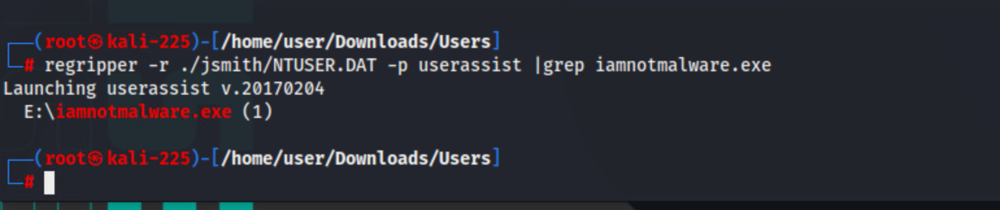
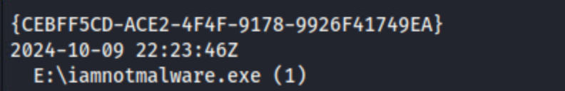
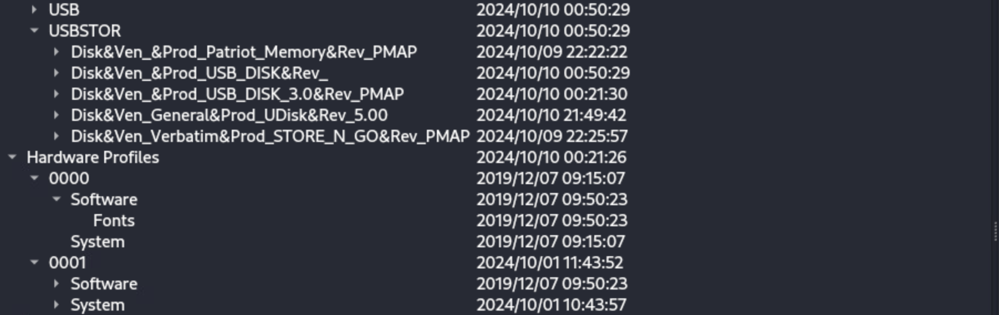
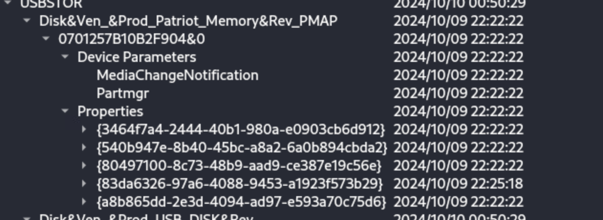
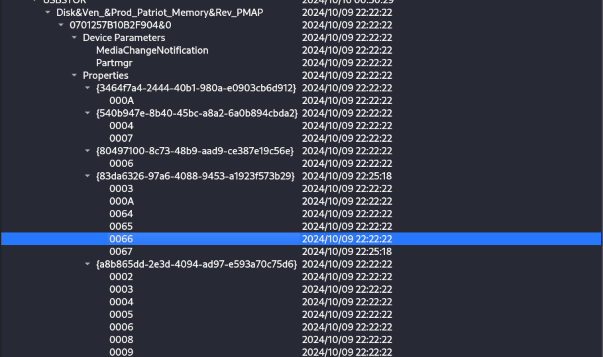
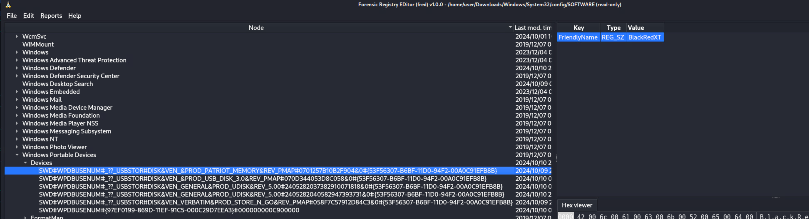

# Have You Seen My Keys?

*Solution Guide*

## Overview

In *Have You Seen My Keys?* players examine Windows artifacts to discover information about which user performed certain actions on the machine.

>**Variants:** There are three possible variants for *Have You Seen My Keys?*. All three variants are included in the same set of artifacts; the questions pertain to one of three different users who all performed similar actions. Answers for all three variants are given, but the steps are for Variant 1.

## Question 1

*Which user ran the file iamnotmalware.exe?*

1. On the `examiner` console, browse to `challenge.us/files` and download **Users.zip** and **Windows.zip**.

2. Extract **Windows.zip**. You'll need this later.

3. Extract **Users.zip** and, using the command `cd`, navigate to the extracted **Users** folder.

4. There are five (5) sub folders in this folder; one for each user. Run the following command for each user. We know for Variant 1 that the answer is `jsmith`. The user is different for the other variants.

```bash
regripper -r /path/to/userdir/NTUSER.DAT -p userassist |grep "iamnotmalware.exe"
```



**Answers:**

1. The answer to Variant 1 is: `jsmith`.
2. The answer to Variant 2 is: `mmartinez`.
3. The answer to Variant 3 is: `tlake`.

## Question 2

*What was the usb drive volume name iamnotmalware.exe was run from?*

Because of the way the question is phrased, we know it is a USB drive. We know the drive letter is `E:`.  We will need the execution time, and then we need to see when devices were connected and disconnected.

1. On the command line in the `jsmith` folder, enter:

```bash
regripper -r /path/to/userdir/NTUSER.DAT -p userassist
```

This time we are *not* grepping - we already know this user executed the file - we just need the execution time.

2. Scroll up through the output until you see:



This is your execution time.

3. Now, we need to check on connected USB drives. On the command line, enter: `fred`. This opens **fred**, the **Forensic Registry EDitor**.

4. In **fred**, go to: **File**, **Open hive**. Navigate to the folder where you extracted the **Windows.zip** file, then  **/System32/config** and open the **SYSTEM** file.

5. Drill down in **ControlSet001/ENUM/USBSTOR** and expand the key. You'll see a list of devices; the keys all start with `Disk&Ven_`. Expand each of these.



Under each key, you'll see a number ending in `&0` The part before the `&0` is a device serial number.  One at a time, expand these keys, then expand their **Properties** subkey. Beneath each subkey is a key identified by a GUID:



Expand each of these GUID identified subkeys, looking for the values `0066` and `0067`. These codes indicate *Last Connect* and *Last Eject* respectively. Find the times that bracket the run time of  your malicious executable.



Take note of the serial number for this device, in this example: `0701257B10B2F904`.

6. Open the hive **SOFTWARE** in the same folder where you found **SYSTEM**.

7. Navigate to the key Microsoft / Windows Portable Devices / Devices and look for your device's serial number in the long strings starting with `SWD#`.  When you select your drive, you'll see in the information windows the *FriendlyName* of `BlackRedXT`. This is the answer to Question 2.



**Answers:**

(Case does not matter.)

1. The answer to Variant 1 is: `BlackRedXT`.
2. The answer to Variant 2 is: `TinyBlue`.
3. The answer to Variant 3 is: `SilverC`.

## Question 3

*What is the timestamp from when was this drive first connected in the following format, Zulu time? yyyy-mm-dd hh:mm:ssZ*

1. Navigate to **ControlSet001/ENUM/USBSTOR**  in the **SYSTEM** hive (like you did in the previous question) and expand the keys for your device serial number.

2. Look for Event ID `0064` this time.  This is the first installed time event for Windows 7+ for a device.

**Answers:**

1. The answer to Variant 1 is: `2024-10-09 22:22:22Z`.
2. The answer to Variant 2 is: `2024-10-09 22:25:57Z`.
3. The answer to Variant 3 is: `2024-10-10 00:21:30Z`.