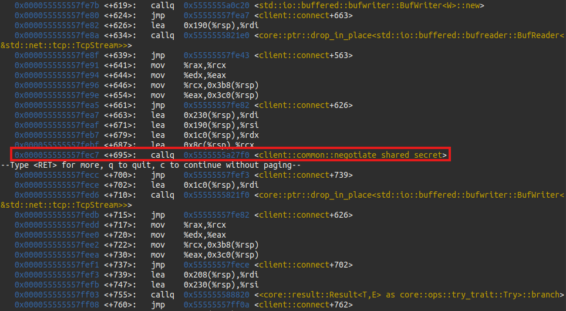

# What's This Button Do?

*Solution Guide*

*What's This Button Do?* tests a player's understanding relatively simple reverse engineering concepts. The intended way to complete the challenge is to examine the client program in a debugger tailored to the language the software is written in. In this case, we will use `rust-gdb` because the software was written in Rust.

The first part of the challenge involves finding the return value from a function call and using the provided `encode_bytes.py` to encode the data in Base64.

The second part of the challenge involves exploiting a denial of service vulnerability inherent in the communication protocol. This vulnerability is present in both the client and server, but the server will never trigger it in the client.

The standard calling convention used in Linux is [System V AMD64 ABI](https://en.wikipedia.org/wiki/X86_calling_conventions#System_V_AMD64_ABI).

> **Note:** The screenshots used in this solution guide were made on a development system with full access to the source code. In the challenge environment, competitors will see function names *mangled*, in which the compiler replaces some characters in order to facilitate name overloading. `rust-gdb` can use the source code to "de-mangle" names. This is why the screenshots below use the clean names. The actual names are still readable, but will look different from the screenshots. The commands below will still work.

## Getting Started

On the `kali` VM, open a browser and navigate to `challenge.us`. Follow the instructions in the prompts. For **Part 2**, no input is required in the text box; grading is automatic.

After reviewing the requirements for each part of the challenge, proceed to the hosted file page at `challenge.us/files`.

Download at least the **client** file. The **encode_bytes.py** script may help with encoding **Part 1** bytes as specified.

## Question 1

*Submit the part 1 token from challenge.us*

**Submit the most recently negotiated shared secret to the challenge grading server.**

1. *Optional:*`rust-gdb --version` If you see a version for `gdb`, you can skip the next step. In the online challenge environment, `rust-gdb` is installed.
2. *Optional, pending Step 1:* `sudo apt install rust-gdb`.
3. Navigate to the directory where the `client` program was downloaded.
4. `chmod +x client`
5. `rust-gdb client`
6. `b main`
7. `run`, or `run -t` if running on the same machine as the server.
8. `disas` and examine the disassembly, and find `client::main`.


9. `b client::main`
10. `c`
11. `disas`, then examine the disassembly, and find `client::connect`.


12. `b client::connect`
13. `c`
14. `disas`, then examine the disassembly, and find `client::common::negotiate_shared_secret`.




15. `b client::common::negotiate_shared_secret`
16. `c`
17. `fin`, to continue until the function returns. `rust-gdb` will automatically print the return value of the function, which contains the shared secret as an array.


18. Since `encode_bytes.py` expects a hex string, we'll need to convert it. Copy just the array from the return value, and run the following command, replacing the array in the command with the array you copied:

```python
python -c 'print(bytes([59, 106, 116, 181, 225, 232, 95, 106, 29, 222, 27, 220, 62, 62, 141, 27, 141, 115, 230, 113, 34, 72, 238, 101, 97, 242, 212, 236, 72, 173, 134, 43]).hex())'
```

19. This will give a hex string that can be fed into `encode_bytes.py` to get a Base64-encoded string to submit to the challenge grading page (`challenge.us`).
20. If you are running this challenge outside of a competition environment and have access to the server program, `cat secret` in the server program working directory should match the Base64 string you just encoded with `encode_bytes.py`.

Otherwise, submit the Base64 string to the grading page found on `challenge.us`. Also see `solution.py` for a script which negotiates a shared secret and prints it out.

## Question 2

*Submit the part 2 token from challenge.us*

**Exploit a denial of service vulnerability in the server.**

In the second part of the challenge, we need to consider places where the server may be tricked into crashing. Examining the network traffic for the unencrypted message exchange in `negotiate_shared_secret` would reveal packets that seem to contain plain JSON. But,  they also contain a value before the JSON, 8 bytes long. This is the payload length, encoded as a big-endian unsigned integer.

Now, we need to find a way to crash the server. Let's examine the functions that handle the client/server messaging protocol.

1. Set breakpoints with `b client::common::read_message` and `b client::common::write_message` in your `gdb` interpreter. Restart the program with `run`.
2. Continue with `c` until you hit the breakpoint on `client::common::write_message`.

The first call in the function is to `serde_json::ser::to_vec`. We can infer that this takes the message object and converts it to JSON. We don't actually need to pay too much attention to the JSON, since it is only used to call attention to the message passing scheme. We're just interested in what happens to the returned `Vec` here.


Further into the function is a call to `Vec<T,A>::len`, which you can assume gets the length of the `Vec` and confirm by searching the online documentation. The length is stored at `0x98(%rsp`.


Later, the value at `0x98(%rsp)` is moved into the `rdi` register right before a call to `u64::to_be_bytes`. The result is a `[u8; 8]` according to the documentation (ensure that you are looking at the one for `u64`, *not* `u32`). So, the length is converted into a big-endian formatted value, as per network convention. A reference to the returned array is stored in `0x50(%rsp)`.


Immediately after that call, there are several `mov` operations in a row done for some kind of optimization by the compiler. Following these swaps, the length bytes end up in the `%rsi` register, followed by a call to `<std::io::Write>::write`. You can confirm this is the first thing that is being written to the outgoing socket (indirectly, through the `BufWriter` object).


3. We can take a few more steps to be really sure that this is the one. Continue the program with `c` until you hit the `client::common::read_message` breakpoint. In this function, we can expect that the first thing to be read from the socket is the 8-byte length buffer.

The first two calls here are `memset` and `read_exact`. The arguments to the *memset* call are `0x80(%rsp)` which is loaded into the `%rdi` register, `0` which is loaded in `%rsi` by an `xor` operation, and `8` in `%rdx`. The three arguments to `memset` are the address to start from, the value to fill with, and the number of bytes to fill from the start. This is the destination buffer for the message length!

Following the `memset` is a call to `read_exact`. Looking up the documentation, we find that the first argument is the object to be read from (`self`), followed by a buffer to read bytes into. We're not interested in the reader object, but we are interested in the buffer, and it's the same buffer that was just initialized. The documentation doesn't mention the length of the buffer, but that is because the compiler is tracking it automatically. We can see that in the assembly, there is a third argument that in the `%edx` register, `8`.

4. The return from `read_exact` is a `Result<()>` type, meaning that it's only relevant when it fails. Ignore the return.


Further down, there is a call to `u64::from_be_bytes`. Documentation says it takes a `[u8; 8]` buffer. Preceding the call, there is some more value swapping, but we can trace the instructions and see that the `0x80(%rsp)` buffer ends up in `%rdi`. The return value is stored in `0xb8(%rsp)`.


We could verify further, but it gets much trickier from here, since the read function uses `panic_unwind` to prevent an actual server crash, but it's not so hard to test our findings.

See `solution.py` for an example of code that can exploit this. The code sends a false length value that is the maximum possible unsigned 64-bit integer. This causes the server to register the overflow attempt.

If you are running this challenge outside of a competition environment and have access to the server program, `file capacity` in the server program working directory should find an empty file with the name `capacity` if you have successfully triggered this mechanism.

Otherwise, the challenge grader (`challenge.us`) will automatically find this file and award a token if it is found.