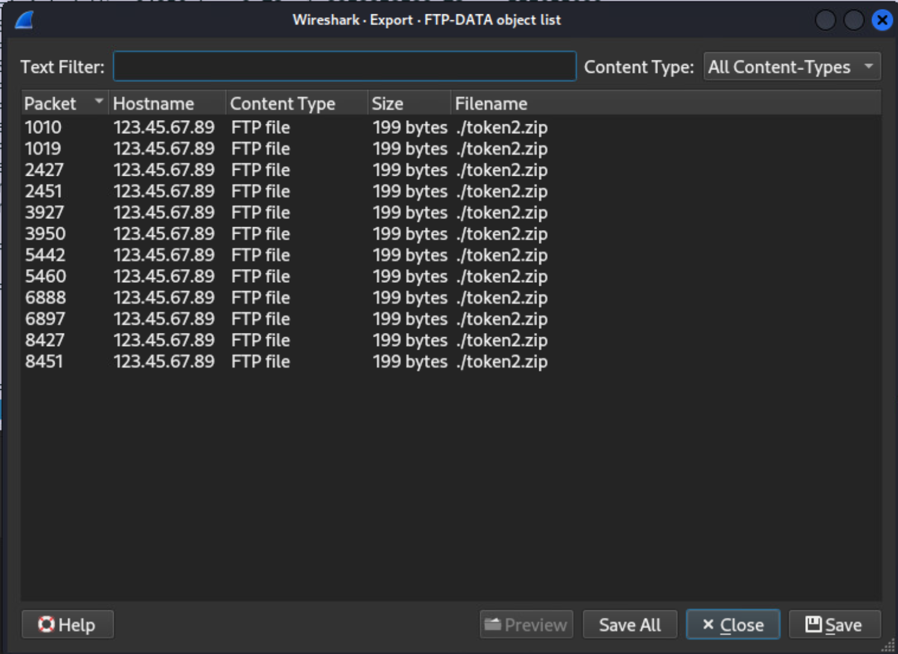

# Exfil Enigma

*Solution Guide*

## Overview

In *Exfil Enigma*, you are to help assess a small business's network. They recently noted suspicious activity and need you to identify data exfiltration, potentially compromised machines, and malicious software.

There are five (5) tokens to retrieve in this challenge.

*Exfil Enigma* is a variant-style challenge, with four different variants. However, Question 1 through Question 4 use infinity-style values. Only the answer to Question 5 will change based on one of the four variants. The tokens you see in this solution guide will have different values, but will use the same format.

For your convenience, we've repeated some of the challenge instructions here in the challenge solution guide.

Start by logging into the `kali` VM, then use the provided tools to explore and analyze the network.

Finally, if you use Security Onion for creating PCAP files, make sure to enter `securityonion` in the **Sensor ID** field. Log into Security Onion at `10.4.4.4` through a browser or SSH. The Security Onion machine may take a few minutes to become available--**please be patient!**

## Question 1

*What is the value of Token 1, which can be found in the payroll data that is being actively exfiltrated?*

We know that data is being exfiltrated from the network somehow.  Let's begin by capturing some traffic from the pfSense firewall.

1. Log into the analyst machine (`kali-exfil-enigma`) and browse to `http://123.45.67.89` (the pfSense Web GUI).

2. Sign into pfSense with these credentials:  **username:** user | **password:** tartans.

3. Select **Diagnostics**, then **Packet Capture**.


4. In **Capture Options**, set the `Max number of packets to capture` to 0 so that it captures continuously. Then click **Start**.

5. Let the capture run for a few minutes to get enough network traffic, then click **Stop**, and then **Download**.

6. Open the PCAP file in Wireshark, then select **Statistics**, **Conversations**.

7. Select the **IPv4** tab. Note that there are a large number of packets sent to `123.45.67.100` and `123.45.67.189`.  Let's start by filtering traffic to `123.45.67.100` -- right-click the conversation and select **Apply as filter**, **Selected**, **Any <-> B**.


8. Back on the main Wireshark screen, you'll see all the traffic to this IP.  Let's try to see what was happening: select **Statistics**, **Conversations**.  This time, check the **TCP** tab.

9. Sort by Port B (as this is the `123.45.67.100` IP address, we can see what it's listening on and what it's receiving). A couple of ports should stand out.  Port 21 indicates there is FTP data being sent and there is an odd port, 12345, being used.  Note this and return to the main Wireshark screen.

10. Since we know there is FTP transmission let's try to see what's being sent. Use the **File**, **Export Objects**, **FTP-DATA** menu selection.  You'll note it's **token2.zip**.  Let's save that file for Question 2. Save it to the Desktop for later.



11. Let's check that other interesting port, 12345. In the filter bar of Wireshark, next to where it says `ip.addr==123.45.67.100` add `&& tcp.port==12345`.


12. Scroll to find where one of the conversations to port 12345 begins.


13. Let's examine a few packets -- notice it looks like a PDF is being sent (note the `%PDF` in the image below).


14. Let's try to get this PDF out of the stream.  Select the packet, right-click, and select **Follow**, **TCP Stream**.


15. You will see this is a PDF file. If you scroll to the bottom, you'll see a lot of data appended to the file after the `EOF` (*end of file*) tag.


16. If you don't recognize it, this is base64 encoded data. There are several ways to decode this data:

You can copy the text out of the VM and put it into CyberChef online:


From inside the Kali VM, use this console command:

```bash
echo "--copied base64 code here--" | base64 -d
```


This will return the following:


Recall, this is an infinity-style question and the token will vary for your challenge instance.

## Question 2

*What is the value of Token 2, which can be found in one of the exfiltrated file collections?*

The file for Token 2 is sent via FTP.  If you haven't already discovered it, let's pull it from the PCAP:

1. Log into the analyst machine (`kali-exfil-enigma`) and browse to `http://123.45.67.89` (the pfSense Web GUI).

2. Sign into pfSense with these credentials:  **username:** user | **password:** tartans.

3. After logging in, select **Diagnostics**, then **Packet Capture**.


4. In Packet Capture Options, set the `Max number of packets to capture` to 0 so it captures continuously, then click **Start**.

5. Let the capture run a few minutes to get enough network traffic, then click **Stop**, and **Download**.

6. Open the PCAP file in Wireshark, then select **Statistics**, **Conversations**.

7. Select the IPv4 tab. There are a large number of packets sent to `123.45.67.100` and `123.45.67.189`. Start by filtering traffic to `123.45.67.100` by right-clicking the conversation and selecting **Apply as Filter**, **Selected**, **Any <-> B**.


8. On the Wireshark screen, you'll see all the traffic to this IP. Let's see what was happening -- select **Statistics**, **Conversations**.  This time, check the `TCP` tab.

9. Sorting by `Port B` (as this is the `123.45.67.100` IP address we can see what it's listening on and receiving). A couple of ports should stand out.  Port 21 indicates there is FTP data being sent, and there is an odd port, 12345, being used. Note this and return to the main Wireshark screen.

10. Since we know there is FTP transmission, let's see what's being sent: **File**, **Export Objects**, **FTP-Data**. It's token2.zip.

11. When you attempt to unzip the file, you are prompted for a password. The instructions indicate the password is in another transmission.  Filter for traffic going to `123.45.67.100`.  Right-click on any packet with the destination IP of `123.45.67.100` and select **Apply as Filter**, **Selected**.

12. Examine all the traffic going to the targeted IP; you should notice several **ICMP** packets with a Destination Unreachable Error. It looks like the machine may be pinging something that isn't there. Let's take a closer look. Change your Wireshark filter to `icmp`.  Analyzing the traffic indicates something is pinging the host but the replies are not reaching the destination.


13. The packets show there are messages being transferred in the ICMP packets. You should see *Begin Password*, followed by three (3) four (4) character codes, then *End Transmission*. Filter the packets further as necessary.


14. The following filter shows only the transmissions:
`(icmp && ip.dst==123.45.67.100) && !(_ws.col.info == "Destination unreachable (Host unreachable)")`
Passwords are randomized so yours will be different.


15. Collect all three (3) pieces of the password and use it to unzip token2.zip.


Recall, this is an infinity-style question and the token will vary for your challenge instance.

## Question 3

*What is the value of Token 3, which can be found on the user-workstation-exfil-enigma VM?*

1. Log into the `user-workstation-exfil-enigma` VM with the following credentials: **username:** user | **password:** tartans.

2. Open the `/home/user/Documents` folder. Here you will see a list of documents with the `.gpg` file extension. You should also notice a file with the name `token3.txt.gpg`. This is the file we need to decrypt.


3. Any files that are placed in this folder will be encrypted by some unknown process every 30 seconds. Figuring out what is encrypting the files is the first step in finding the decryption key.

4. See which services are running using the following command:

```bash
systemctl --type=service --state=running
```


5. You should see a service named `securityservice.service`. This is not a well known Linux service, so you should be suspicious.

6. When you stop the `securityservice.service` service and drop a file into the `/home/user/Documents` folder you will notice that new files are no longer encrypted.

```bash
sudo systemctl stop securityservice.service
```

7. Stop and restart `securityservice.service`. This doesn't give us much insight into what this suspicious service is doing other encrypting files.

```bash
sudo systemctl stop securityservice.service
sudo systemctl restart securityservice.service
```

8. Start a packet capture with Wireshark and select `eth0` as the interface to capture traffic on. Restart the `securityservice.service` one more time.

```bash
sudo systemctl restart securityservice.service
```


9. Stop the packet capture and examine the data and experiment with various filters. You should notice a lot of HTTP traffic. Filter out the most common traffic:

```text
http && ip.dst != 10.1.1.165 && ip.dst != 10.5.5.5
```

Take note of the following URL, which mentions a keyfile: `http://123.45.67.189/32ea4fa6920cad997bc340cde/keyfile.txt`.


10. Open a web browser and navigate to `http://123.45.67.189/32ea4fa6920cad997bc340cde/keyfile.txt`.


We now have what could be a decryption key: `T4f890616B3dcPT10D66SxZ99`.

11. Try decrypting the `token3.txt.gpg` file using the following command and the key from the last step. Keep in mind that if we don't stop the `securityservice.service` or send the file to a different directory, it will be encrypted again.

```bash
gpg --passphrase "T4f890616B3dcPT10D66SxZ99" --batch --quiet --yes --decrypt token3.txt.gpg > /home/user/token3.txt
```

12. Navigate to the `/home/user` directory and inspect the contents of the token3.txt file.


The correct submission for Question 3 is: `6cd56e22`. Recall, this is an infinity-style question and the token will vary for your challenge instance.

## Question 4

*What is the value of Token 4, which can be found hidden in the web traffic?*

1. Log into the `kali-exfil-enigma` VM.

2. Open a web browser navigate to the pfSense Web GUI at `https://123.45.67.89`.

3. Login with the following credentials: **username:** admin | **password:** tartans.


4. Go to **Diagnostics**, **Packet Capture**.


5. Make sure that **Capture Options** is set to `WAN` and set the **Max number of packets to capture** to 0. The default is 1000, but that isn't enough.


6. Click **Start** to begin the packet capture.


7. Let the packet capture run for a few minutes, then go back to pfSense and **Stop** the packet capture.


8. **Download** the packet capture and open it in Wireshark.


9. We know we are looking for web traffic, so a Wireshark filter of `http` is a good starting point. You should quickly notice multiple `GET` requests going to `123.45.67.189`. Set your Wireshark filter to:

```text
http && ip.dst == 123.45.67.189
```


10. Review a few of the `GET` requests. Notice multiple requests to `faq.html`. If you examine the HTTP headers of the requests for `faq.html`, you will notice that every other request contains an HTTP header named `Session`.


11. Take the value of the `Session` header and base64 decode it:

```bash
echo -n VG9rZW4gNDogM2I0N2M1Nzk= | base64 --decode
```


The value for Token 4 will be displayed. Submit this token for Question 4.

The correct submission for Question 4 is: `3b47c579`. Recall, this is an infinity-style question and the token will vary for your challenge instance.

## Question 5

*What is the password of the user with the username of p.wheeler in the exfiltrated database file?*

1. Log into the `kali-exfil-enigma` VM.

2. Open a web browser and navigate to the pfSense Web GUI at `https://123.45.67.89`.

3. Login with the following credentials: **username:** admin | **password:** tartans.


4. Go to **Diagnostics**, **Packet Capture**.


5. Make sure that **Capture Options** is set to `WAN` and set the **Max number of packets to capture** to 0. The default is 1000, but that isn't enough.


6. Click **Start** to begin the packet capture.


7. Let the packet capture run for a few minutes, then **Stop** the packet capture.


8. **Download** the packet capture and open it in Wireshark.

9. Examine the packet capture and see the fair amount of HTTP traffic going to `123.45.67.189`. Set the Wireshark filter to the following:

```text
http && ip.dst == 123.45.67.189
```

We can see something is attempting to POST a file that is 16,384 bytes in lengths.


10. Look at the Data section; the format is displayed as `SQLite format 3`.


11. Right-click the Data section in the details and select `Export Packet Bytes`. Choose to save the file as `file.db`. You can use any name you would like for the file, but the file extension of `.db` is the important part in this step.

12. Open the location where you saved the database file. Right-click the file and open it with the `SQLite database browser`.


13. Expand the `users` table and look at the structure of the table.


14. Select the `Execute SQL` tab. We know we are looking for information tied to the `p.wheeler` account; enter the following query and execute it:

```sql
select * from users where username == 'p.wheeler'
```


15. Right-click the `password` field of the results to copy the password. This is the value you need to submit to answer Question 5.


The correct submission for Question 5 is: `b45dec06`. Recall, this is a variant-style question and the token will vary for your challenge instance.