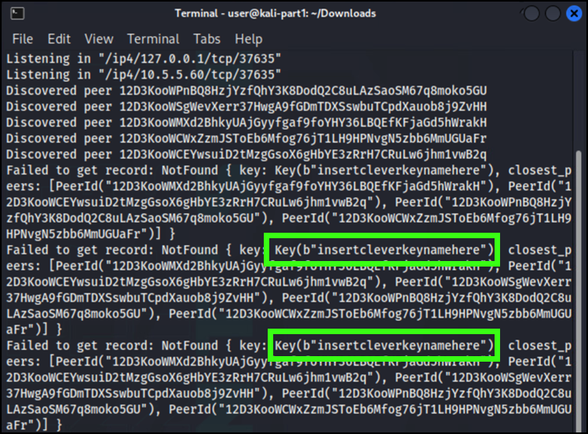
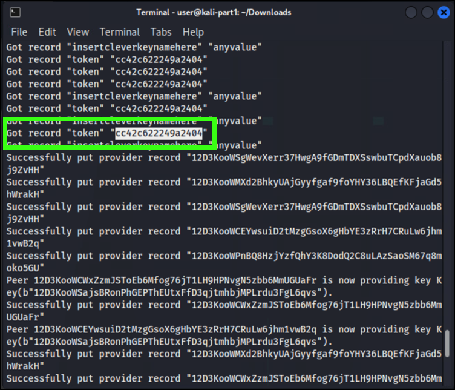
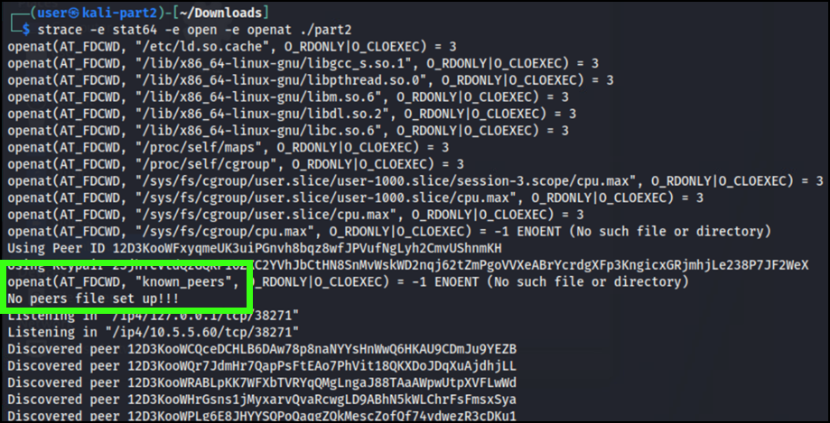
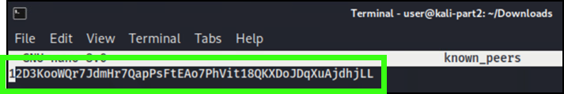

# Fun with Distributed Systems

*Solution Guide*

## Overview

*Fun with Distributed Systems* is a look at some of the possible vulnerabilities faced by distributed systems. Players need to trick the remote nodes into accepting data from the player. The executable file ("the program") downloaded by the player runs as an *interactive command line tool*. It accepts `PUT` and `GET` commands as well as other commands not relevant to the challenge.

## Question 1

*Part 1 Token*

This part of the challenge revolves around a distributed system using a simplistic peer reputation system. This reputation system means *Node A* considers *Node B* reputable if *Node B* responds to a `GET` operation from *Node A* with a value.

To solve, players must get a remote node to accept their node as reputable, which requires the player to use a `PUT` operation in response to seeing `GET` operations from remote nodes. The `PUT` operation only stores the value *locally*, but the next time a `GET` operation looks for the same key, it will succeed; the remote node will consider the local node reputable and start accepting `PUT` operations from the local node.

1. Launch the `kali-part1` VM.
2. In a browser, navigate to `challenge.us/files` and download **part1**.
3. In your Downloads folder (or using *Show in Folder* in the browser), locate the downloaded **part1** file.
4. In the Downloads folder, right-click and select **Open Terminal Here **.
5. In the terminal, run the command `chmod +x part1` to make the file executable.
6. Run `./part1` to start the program. After a short wait of 5-15 seconds, look for a message indicating a failure to retrieve a record. This shows the program is trying to retrieve a key named *"insertcleverkeynamehere"*.

   

7. Run `PUT insertcleverkeynamehere anyvalue`.
8. Watch for messages from connected peers, which should start providing a new key. This new key is your node's Peer ID.
9. Run `PUT anykey anyvalue` to prompt remote nodes to store your key/value pair.
10. Look for messages indicating remote peers are now providing the key `token`.
11. Run `GET token` to retrieve the token for **part 1**. You may have to scroll up in the terminal to identify the token.

   

## Question 2

*Part 2 Token*

This part of the challenge has a distributed system which uses public keys for nodes to consider *another* node to be trustworthy enough to store incoming `PUT` requests. Unfortunately, it has a fatal flaw: instead of keeping track of just the public keys a node will accept operations from, the node keeps track of the whole key pair. Worse, in order to keep track of trusted remote nodes the local node stores all of its known peers in its local store, with keys set to the Peer ID and values set to the key pair.

Since the player is not given a `known_peers` file, players need to first discover this behavior. Upon starting a node, the node looks for a `known_peers` file in the same directory. Because the player will not have this file, they will get a warning message saying "No peers file set up!!!". The warning doesn't specify how the file should be named or where it should be, which requires the player to use a tool to find this information.

Once the player creates the file, they need to populate it with the data it expects. The obvious choice is to simply add the Peer IDs of remote nodes into the file, but this will result in an error. By now, the player should have noticed the node generates a key pair on startup (and derives the Peer ID from the generated key pair). If they add the generated key pair into the `known_peers` file (and remove all previous attempts), the program starts successfully and says it stored the saved peer locally in its store, with a Peer ID as a key.

This shows the player the critical flaw in the network, which is: the private key of every trusted peer is stored in the local data store. Using this information, the player can query the network for the Peer ID of any remote node and get its key pair, and then impersonate that node, which allows it to issue `PUT` operations on the network that are accepted by any remote nodes that consider it trustworthy.

1. Launch the `kali-part2` VM.
2. In a browser, navigate to `challenge.us/files` and download **part2**.
3. In your Downloads folder (or using *Show in Folder* in the browser), locate the downloaded **part2** file.
4. In the Downloads folder, right-click and select **Open Terminal Here **.
5. In the terminal, run the command `chmod +x part2` to make the file executable.
6. Run `./part2` to start the program. Note the `No peers file set up!!!` message.
7. Press **ctrl+c** to exit the program and then run `strace` to see what file names the program is attempting to open. You will discover that the program is looking for a file named `known_peers`.

```bash
strace -e stat64 -e open -e openat ./part2
```

>You should be prompted to install the `strace` package. You can do so by following the prompts in the terminal or running: `sudo apt-get update`, then `sudo apt-get install strace`.



8. We now know what file the program is looking for (`known_peers`). Press **ctrl+c** to exit the program and create a file named `known_peers`.

```bash
touch known_peers
```

9. Given its name, it makes sense that the `known_peers` file would contain a list of Peer IDs; try inserting the Peer ID generated by a run of the **part2** program. Open the file to edit it.

```bash
nano known_peers
```



Add the Peer ID generated when you ran **part2**. Save your changes by pressing **ctrl+x**, then **Y**, and **Enter** to confirm.

10. Run the program again: `./part2`. You'll get an error message upon starting the program that it can't find a private key.
11. In `known_peers`, try replacing the Peer ID with a key pair generated by the program. This should permit the program to run. Edit `known_peers` again with:

```bash
nano known_peers
```

Replace the existing content with a key pair (e.g.: `23jhTeC8BLKHTiH99P4gqegUqXaW8LUB3y6f23sVSFhakKTcdq1Ru7a8cqxWkw25f1FaYdhZwpd4DZhhThCnrPVnNtoVS`), and save your changes.

12. Run the program again: `./part2`. Now note, in the startup sequence, the program says it stored data locally. The *key* is the Peer ID corresponding to the key pair you added to the file, and the *value* is an array of bytes.

13. If the local node exhibits this behavior, perhaps the remote nodes do too. Run `GET <peer ID>` using one of the nodes you are connected to (e.g., `12D3KooWQr7JdmH...`). This should return a long string that looks like a key pair.

14. The challenge instructions tell you that the `-h` flag can be specified. Specifying this flag on program startup shows that you can specify a key pair. Run **part2** with the `-h` flag. Remember to **ctrl+c** to exit the program.

```bash
./part2 -h
```

This shows you additional options, including that you can use a specific key pair on startup.

15. Run **part2** with the key pair returned from the previous `GET` request:

```bash
./part2 <found key pair>
```

Replace `<found key pair>` with the *actual* key pair.

16. Now that you've impersonated one of the nodes in the "in-group", use the `PUT` command to add data:

```bash
PUT anykey anyvalue
```

17. The remote nodes should start providing the token. Sometimes,  you won't see the message, but you should run `GET token` after a few seconds to retrieve the token for **part 2**.

```bash
GET token
```