# Shop SMart

*Solution Guide*

## Overview

The purpose of this challenge is to attack the website at `http://10.5.5.100` using the [OWASP Top Ten vulnerabilities](https://owasp.org/www-project-top-ten/) to gain four (4) tokens.  Start by logging into the `shopper-terminal` VM with `user`|`tartans` and browse to `http://10.5.5.100`.

## Question 1

*Enter the token received from logging in as an admin user.*

1. Open Burp Suite and choose the defaults until you come to the Learn tab.

	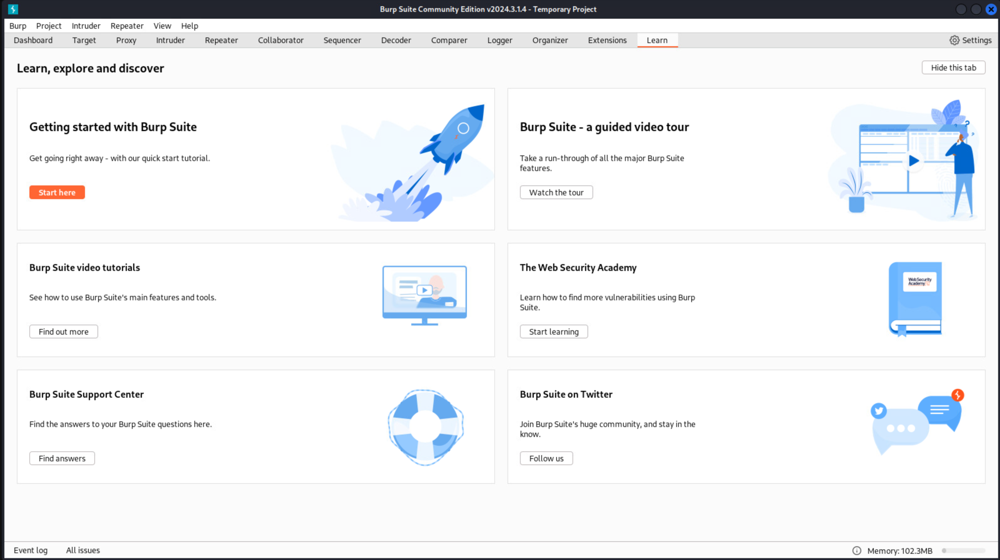

2. Select **Proxy**, **Open browser** in the Proxy tab. Browse to `10.5.5.100`in the Burp browser.

	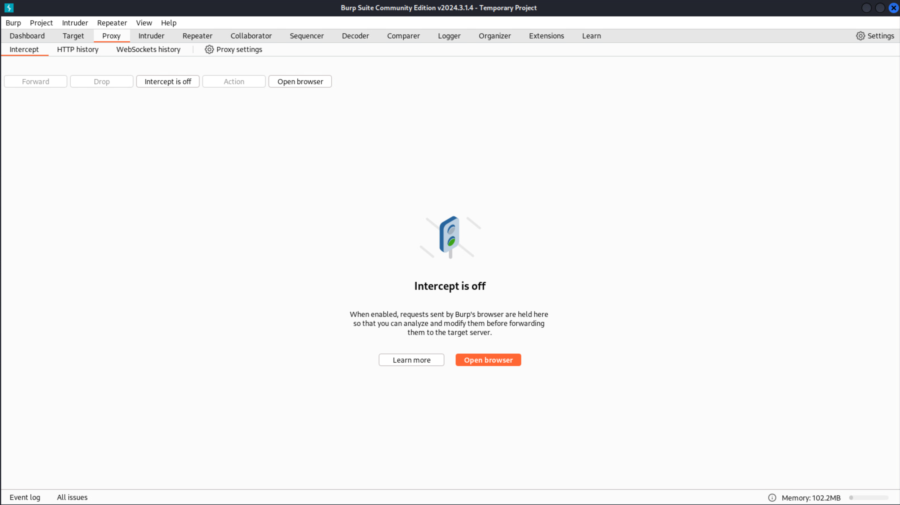

3. In Burp, select the **HTTP history** tab.  In the Burp browser, browse to the **REGISTER** tab, then in the HTTP history window, select the URL for `/register.php`.

	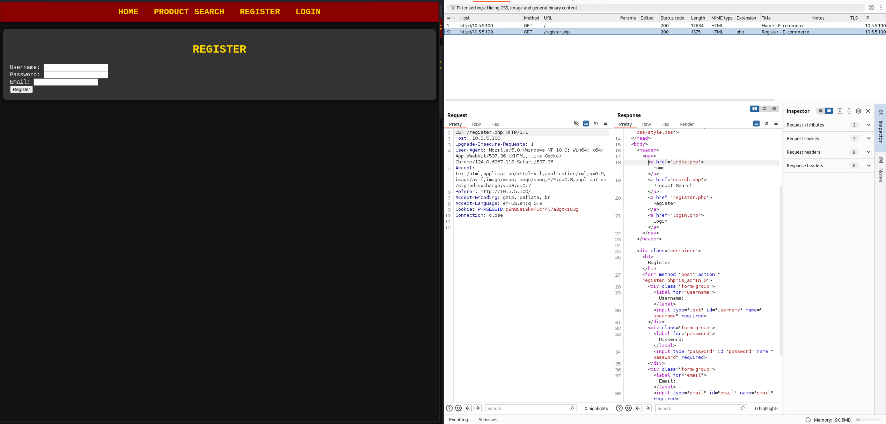

4. Create a user on the **REGISTER** tab. We used *blah* for the username and some random information for the password and email.  Note the new address added to HTTP history.

	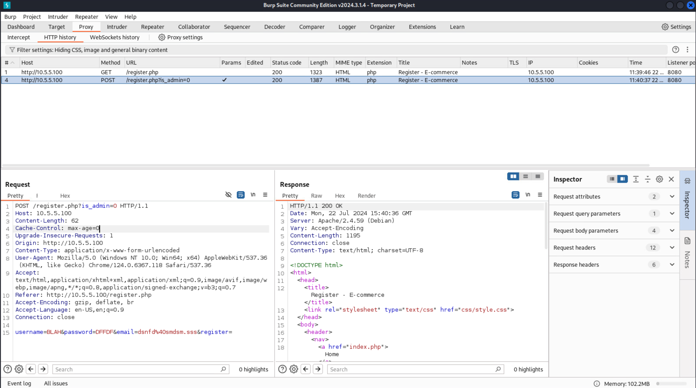

5. Right-click the left panel in Burp (**Request**) and select **Send to Repeater**. Note that the Repeater tab is highlighted. Select it. The left pane should look something like what's pictured below.

	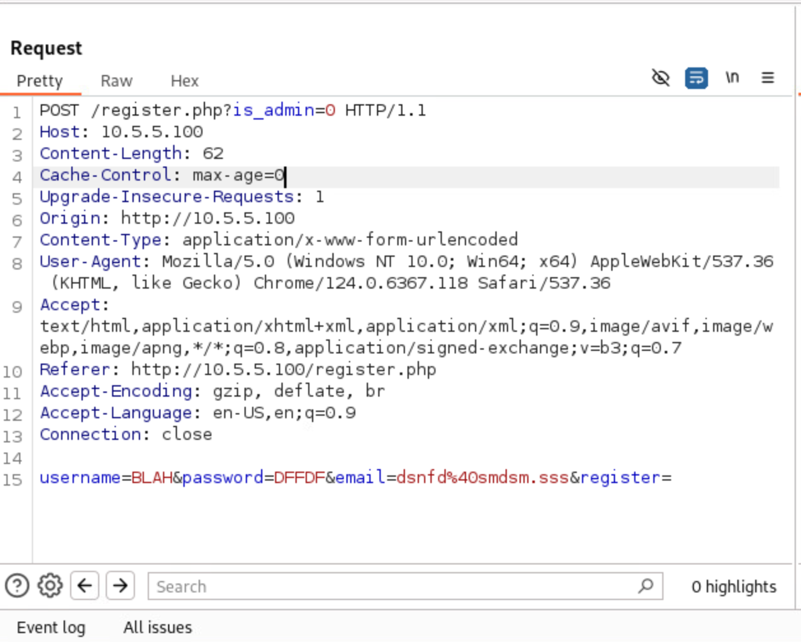

6. The very first line is sending the command with the parameter `is_admin=0`.  Change that to `is_admin=1`.  The last line starting with `username` is the user you attempted to register. Change them to something you'll remember such as `username=tartan&password=password` and click **Send**.

7. After clicking **Send**, the right pane populates. If you select **Render**, you will see the page indicates registration successful!

	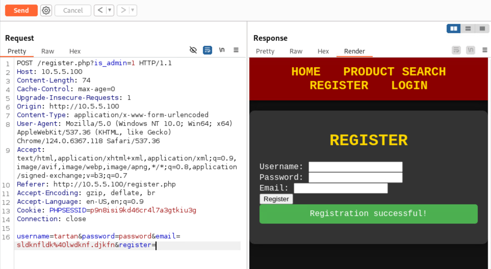

8. Return to the browser, go to the **Login** page, and log in with your newly created administrator account. You should see a welcome message and the first token.

	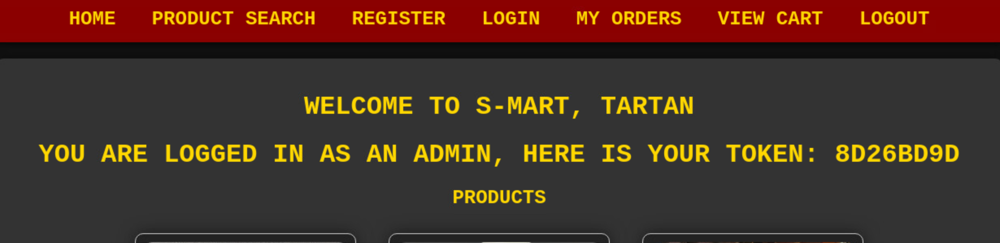

>**Note!** The tokens are randomized, so your answer will be different than what is pictured.

## Question 2

*Enter the token from bcampbell's order history.*

1. Now, we need to login as a specific user.  For this, we will use the **wordlist** mounted in the cdrom on the Desktop.  You may have to double-click to mount the drive.

2. Back in the browser, click **LOGOUT** -- you are returned to the LOGIN page.

3. Try logging in as `bcampbell` and any password -- you will get the following error.

	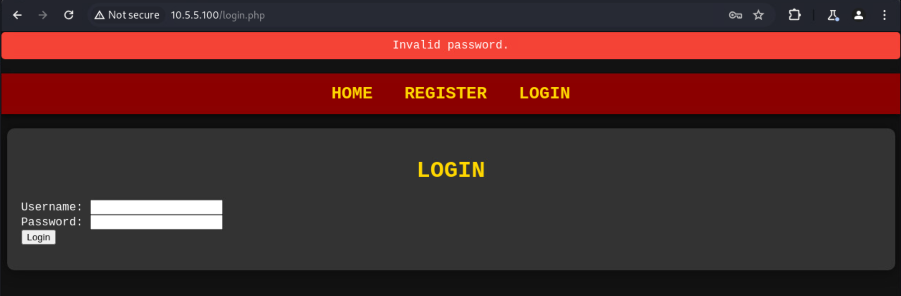

4. Let's brute force the login from the command line using Hydra. Open a terminal window and enter:

```bash
sudo hydra -t 4 -l bcampbell -P /media/cdrom0/wordlist.txt 10.5.5.100 http-post-form "/login.php:username=bcampbell&password=^PASS^:Invalid Password."
```

These options tell Hydra: the number of threads (4), to set the login to `bcampbell`,  the path to the password in the list provided, the IP of the  server, that it is an HTTP POST form, and that "Invalid Password." is the error message.

5. After a few moments, the password should be cracked and the login information displayed.

	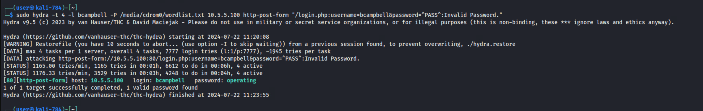

6. Login using `bcampbell` and the password `operating`. Navigate to the **MY ORDERS** page to find the token:

	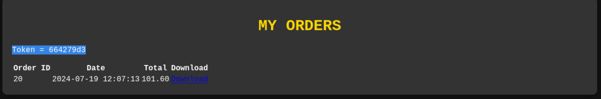

>**Note!** The tokens are randomized, so your answer will be different than what is pictured.

## Question 3

*Enter the value on the token3.txt file found in the /var/www/ directory.*

For this question, you should exploit the download orders function.

1. Log into the site with any account and click **MY ORDERS**.

2. Examine the **Download** link next to any order. The URL is: `http://10.5.5.100/download.php?file=invoices/order_##.pdf`.

3. The question tells us the file name is **token3.txt** and the path is `/var/www/`. So, let's change the link to `http://10.5.5.100/download.php?file=/var/www/token3.txt`.  You will get a file to download. Open this file to retrieve the token.

## Question 4

*Enter the token for checking out with the chainsaw.*

To answer this question, we need to check out with a chainsaw in the shopping cart.  If we look at the index page, it specifically calls out *not* carrying chainsaws.  Let's see if we can find them anyway.

1. Go to the **PRODUCT SEARCH** page.  You'll find searching on "chainsaw" yields "*No products found.*"

2. Let's try a SQL injection.  Enter `' OR 1=1#` into the search box. This returns many results:

	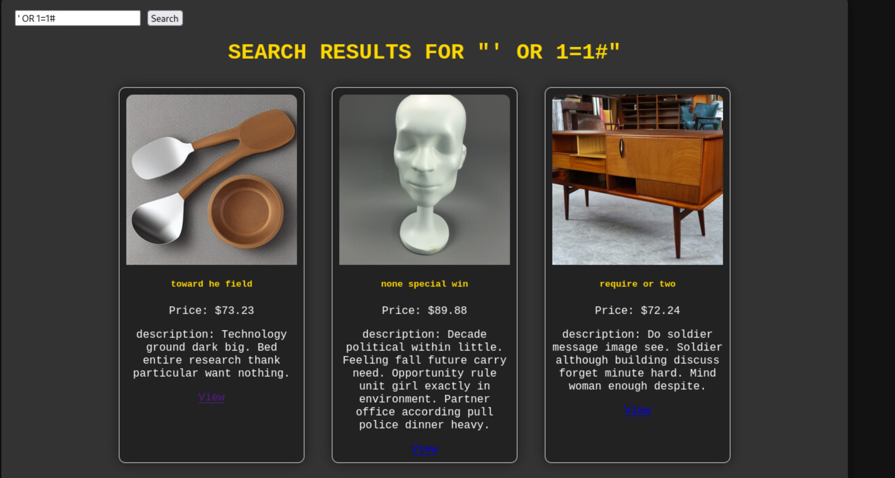

3. Scroll to the bottom to reveal the chainsaw that was previously undiscovered.

	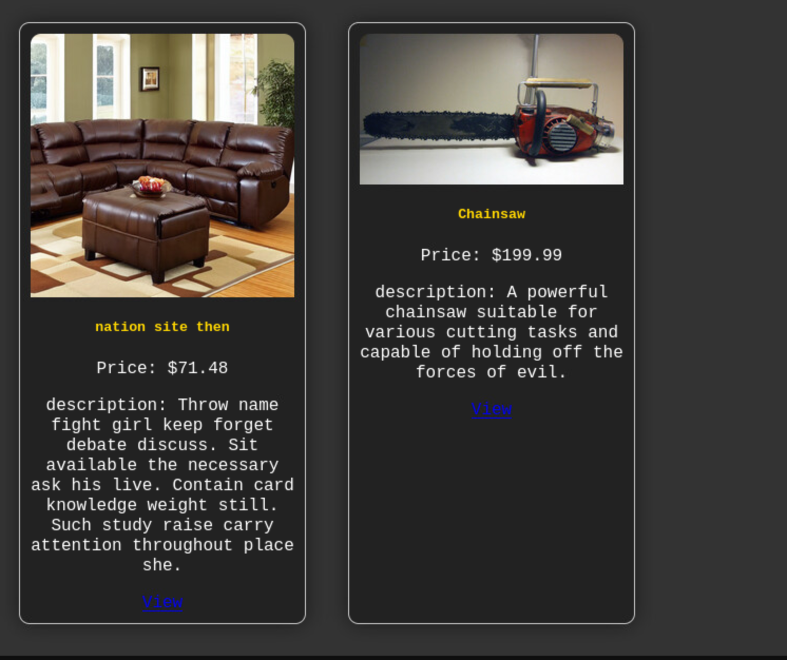

4. Click the chainsaw **View** link to go to its product page. Look at the URL. You could have entered any product page and manipulated the `?id=XXX` until you hit `259`, but this would have taken significantly longer.

	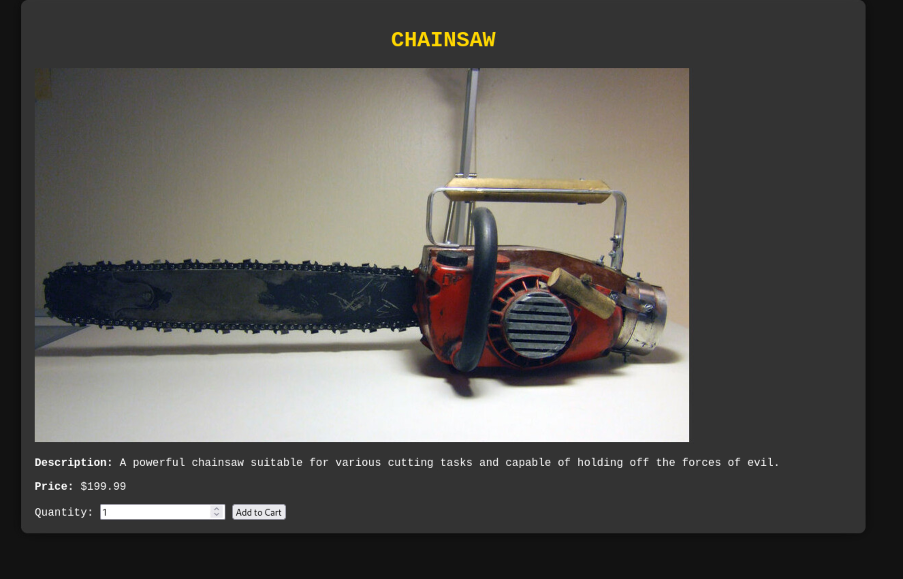

5. Click **Add to Cart**, which takes you to the SHOPPING CART page.

	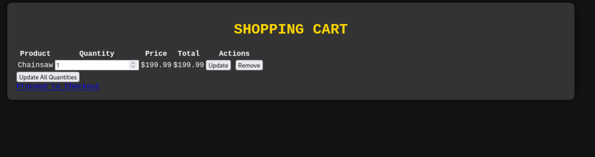

6. Click the **Proceed to Checkout** link and get the token!

	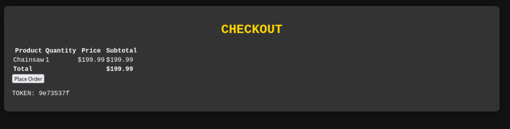