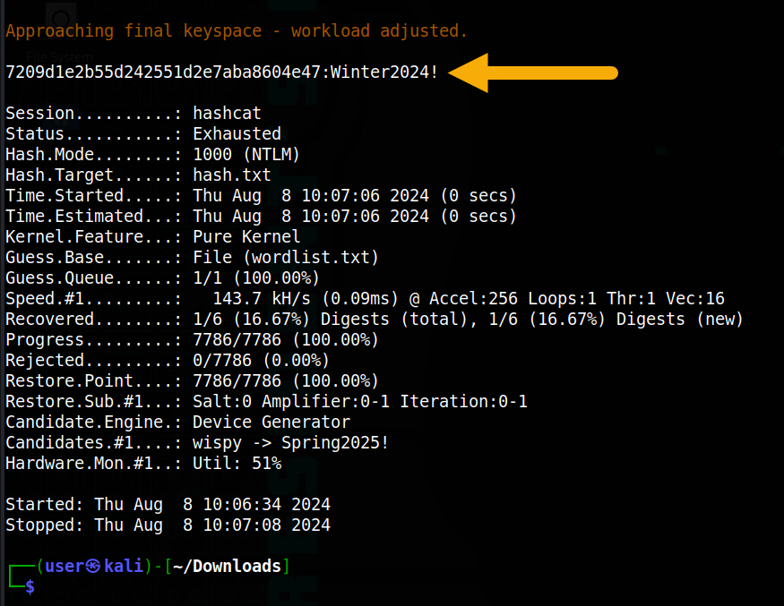
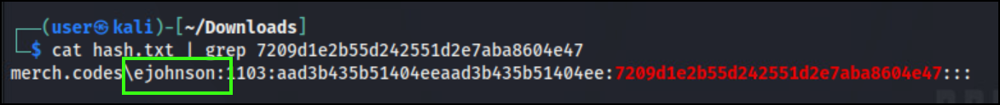
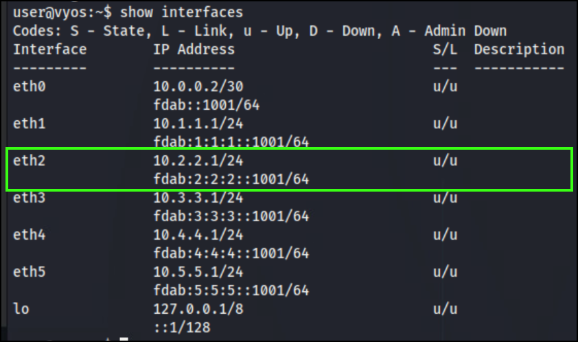

# Throw Me A Bone

*Solution Guide*

## Overview

There are two components to this challenge. The first asks competitors to identify weak or commonly used passwords present in the `merch.codes` Active Directory. The second asks competitors to review a vulnerability report and make remediations on systems in the environment.

Reminder, the credentials for *all* of the challenge systems/tools are:

- **username:** user
- **password:** tartans

## Question 1

*What is the username of the MERCH Domain account which is using a weak and/or commonly used password?*

1. On the **kali** VM, in Firefox, download the `ntds.zip` and `wordlist.txt` files from `challenge.us/files`.
2. Extract the `ntds` folder from `ntds.zip`. Inside of the extracted `ntds` folder are the files `ntds.dit` and `SYSTEM`.
3. In the same folder as the `ntds.dit` and `SYSTEM` files, create a folder called `OUTPUT`. This is where the created hashdump files will be saved.
4. `Right-Click` in the `ntds` folder window and select `Open Terminal Here`.
5. Dump the hashes from the NTDS file using the following  `impacket-secretsdump` command in the Terminal window you just opened.

```bash
impacket-secretsdump -ntds ntds.dit -system SYSTEM local -output ./OUTPUT/hash.txt
```

6. After the command has run, there will be three files in the `OUTPUT` directory. Rename the file `hash.txt.ntds` to just `hash.txt`. This is the hashdump file we will use to attempt to crack the passwords.
7. Move the files so that the `hash.txt` and `wordlist.txt` files are in the same directory.
8. Use `hashcat` to check for any weak or commonly used passwords.

```bash
hashcat hash.txt wordlist.txt
```

9. In the `hashcat` output we see a hash that was cracked with a password `Winter2024!`.




```bash
Approaching final keyspace - workload adjusted.

7209d1e2b55d242551d2e7aba8604e47:Winter2024!
```

10. Using the cracked hash, compare to the hashes in the `hash.txt` file.

```bash
cat hash.txt | grep 7209d1e2b55d242551d2e7aba8604e47
```

It matches the password hash for user `ejohnson`.



The answer to Question 1 is: `ejohnson`.

## Question 2

*What is the 8-digit hexadecimal code you received from the grading check (`challenge.us`) after remediating vulnerabilities on all servers in the environment?*

### Step 1: Identify the undocumented systems

On the **kali** VM, in Firefox, download the *Scan Report* (`vulnerabilityReport.pdf`) from `challenge.us/files`.

The challenge instructions tell us there are six servers in the environment which need to be reviewed. However, only three systems are listed in the *Scan Report*. This detail is important because it suggests there are servers in the environment that haven't been scanned. You'll need to locate the network these undocumented systems are on. For reference, they are:

- **Documented systems:** `10.3.3.3`, `10.3.3.10`, `10.1.1.151`
- **Undocumented systems:** `10.2.2.151`, `10.2.2.152`, `10.2.2.153`

There are multiple ways to identify these systems, but the most direct way is to look at the networks configured on the VyOS router.

1. Use SSH to access VyOS using the credentials from the challenge instructions (**u:** user | **p:** tartans).

```bash
ssh user@10.5.5.1
```

2. Use the `show interfaces` command to examine the configured interfaces on the VyOS router. We see that `eth2` has an assigned IP address of `10.2.2.1` with a subnet mask of `/24`. This `10.2.2.0/24` network should be examined further.



3. Check the `arp` table to see if there are any active systems on that network. We see there are three.

```bash
user@vyos:~$ show arp | grep 10.2.2.
10.2.2.152               ether   00:50:56:b6:b4:dd   C                     eth2
10.2.2.151               ether   00:50:56:b6:d7:64   C                     eth2
10.2.2.153               ether   00:50:56:b6:1e:8b   C                     eth2
```

Alternatively, you can use a basic `nmap` command to scan the `10.2.2.0/24` network.

```bash
┌──(user㉿kali)-[~]
└─$ nmap 10.2.2.0/24
Starting Nmap 7.94SVN ( https://nmap.org ) at 2024-08-08 10:17 EDT
Nmap scan report for 10.2.2.1
Host is up (0.00071s latency).
All 1000 scanned ports on 10.2.2.1 are in ignored states.
Not shown: 1000 closed tcp ports (conn-refused)

Nmap scan report for 10.2.2.151
Host is up (0.0011s latency).
Not shown: 999 closed tcp ports (conn-refused)
PORT   STATE SERVICE
22/tcp open  ssh

Nmap scan report for 10.2.2.152
Host is up (0.00052s latency).
Not shown: 999 closed tcp ports (conn-refused)
PORT   STATE SERVICE
22/tcp open  ssh

Nmap scan report for 10.2.2.153
Host is up (0.00053s latency).
Not shown: 999 closed tcp ports (conn-refused)
PORT   STATE SERVICE
22/tcp open  ssh

Nmap done: 256 IP addresses (4 hosts up) scanned in 2.46 seconds
```

Both outputs tell us there are three servers we need to examine and potentially remediate: `10.2.2.151`, `10.2.2.152`, and  `10.2.2.153`.

### Step 2: Use the scanner application to check systems

Within the challenge environment, the Scanner Application (`scanner.merch.codes`) should be used to check the current remediation status of systems. Use this application to verify your remediations have been properly implemented.

### Step 3: Implement remediations

#### Prevent login as root

The targeted systems are: `10.3.3.3`, `10.2.2.151`, and `10.2.2.152`. To address this vulnerability, the `sshd_config` file needs to be modified to remove `PermitRootLogin yes`. Two approaches can be taken:

1. Comment out the line so it is no longer a part of the configuration. This is done by adding a `#` to the beginning of the line.
2. Change `yes` to `no` on the configuration line.

Either approach will yield success when the Grading Check is run, provided it is applied to the correct systems. On each of the targeted systems, do the following:

1. Access the targeted systems via SSH using the credentials from the challenge instructions. For example:

```bash
ssh user@10.3.3.3
```

2. With elevated permissions, use a text editor to open `sshd_config`.

```bash
sudo nano /etc/ssh/sshd_config
```

3. Locate the `PermitRootLogin` configuration and add a `#` in front of the line.

```text
#PermitRootLogin yes
```

4. Exit, and save your change.
5. Restart the `sshd` service.

```bash
sudo systemctl restart sshd.service
```

6. Repeat the procedure above for each system.

#### Remove inactive user accounts and move `/home` directories

The targeted systems are: `10.1.1.151`, `10.2.2.151`, and `10.2.2.153`. In the example below, user `jdoe` is removed and their home directory moved to the `archived_users` directory. The same commands can be used to remove users from the targeted systems; replace`jdoe` with the username you wish to remove.

```bash
sudo deluser jdoe
sudo mv /home/jdoe /home/archived_users/
```

But first, you have to identify the inactive user accounts. The challenge instructions say: “*(t)he list of users is confirmed and all of them are currently active.*” The `hash.txt` file created when you identified the commonly used passwords provides the usernames associated with each password hash. In other words, these are the active users for the environment. Compare *that* list of usernames against the user home directories on each system. The user directories that don't match the active list are considered *inactive* and should be removed.

|System|Accounts to Remove|
|------|------------------|
|10.1.1.151|dgreen, hcarter|
|10.2.2.151|lrobinson, awright, dgreen|
|10.2.2.153|eclark, sscott, hcarter|

You may ask, "*Why the requirement to move home directories?*" Deleting a user account does not remove their `home` folder. If the folder is not deleted, it is possible a user added later could have the same UID and gain access to that folder. Moving the folder helps prevent this from happening while still allowing administrators access to the home directory if required.

#### Change file permissions

The targeted systems are: `10.3.3.3`, `10.2.2.152`, and  `10.2.2.153`. Depending on the system, either the `passwd` file or the `shadow` file needs to have file permissions changed. Run the appropriate command below on a targeted system.

```bash
sudo chmod 644 /etc/passwd
sudo chmod 640 /etc/shadow
```

## Challenge Grading

> **Info** Prior to grading your results, you can use the the Scanner Application (`scanner.merch.codes`) to check the current remediation status of systems. If everything in the scan results is green (i.e., **Pass**), then your remediations have been properly implemented.

Once all remediations are applied, use an in-game browser to navigate to `challenge.us`. Click **Grade Challenge**. If all the necessary remediations are in place, you will receive an eight-character hexadecimal token. Enter this token as the answer to Question 2.