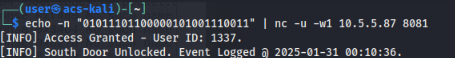

# ACS Shenanigans

This guide will provide challengers with full insight into how this challenge is solved. 

## Overview

Your goal is to analyze log files for signs of sensitive data exfiltration, monitor network traffic for active breaches, and develop a script to simulate Access Control System(ACS) scan replays.

### Part 1

**Task**: Players will analyze a raw log file using the provided spec (`Spec.md`).

**Question**: What is the value of the intercepted frame sent at 2024-12-13 09:11:00?

### Solution - Token 1

Here are the steps needed to complete question 1:

1. First, navigate to `https://challenge.us/files` and download two files:
* `fac_187.log` - This log file contains packets using the ACS protocol who's specifications is present in the `Spec.md` file coupled with it in this directory.
* `Spec.md` - (Important) This file contains the encryption algorithms' general characteristics and will be used throughout the duration of the challenge.
2. Copy these files to your working directory `cp ~/Downloads/* .`

💡**Think of the Spec.md file as a user manual for a product - it details the appropriate steps needed in order to use it properly.**

**File Listing**


In order for us to understand the data presented in the log, we must follow the specification in order to create a way to decode the log. The `Spec` file provides several insights into the protocol:
* XOR'ing occurs within the file
* Hex content must be decoded
* The protocol in use is `structured` and uniform in nature (making it more predicable from a reverse engineering perspective)

With all of these factors in mind, let's develop a script to automate decoding of this log file:

```python
# filename: decrypt.py
# usage: python3 decrypt.py
def xor_decrypt(data, key):
    return bytes([byte ^ key for byte in data])

def decode_hex_dump(hex_dump_file, output_file, key):
    with open(hex_dump_file, 'r') as infile, open(output_file, 'wb') as outfile:
        for line in infile:
            hex_part = line[10:57].strip()  # Extract the hex part
            hex_bytes = bytes.fromhex(hex_part)
            decrypted_bytes = xor_decrypt(hex_bytes, key)
            outfile.write(decrypted_bytes)

# Example usage
hex_dump_filename = 'fac_187.log'
decoded_output_filename = 'decoded_log.txt'
xor_key = 0xAA  # XOR key for decryption

# Decode the hex dump log file
decode_hex_dump(hex_dump_filename, decoded_output_filename, xor_key)

print(f"Decoded data saved to {decoded_output_filename}")
```

The script does the following with each line of content from the log:
* The `xor_decrypt()` function applies an XOR operation to each byte in a given data set using a single-byte key, effectively decrypting or obfuscating the data.
* The `decode_hex_dump()` function reads a hex dump file line by line, extracting the relevant hexadecimal portion (from positions 10 to 57) while ignoring other content such as addresses or ASCII representations.
* The extracted hex values are then converted into bytes, then decrypted using the XOR function with a predefined key (0xAA).
* The decrypted byte stream is written into an output file (decoded_log.txt), effectively reconstructing the original data before obfuscation.

After execution of the script `python3 decrypt.py`, you will presented with the output below. We can now see that line `26` harbors the answer we seek:


Examine the output file "decoded_log.txt" `cat decoded_log.txt`

 

**Answer**: The answer to question 1 is `01011101100001011100100101`.

## Part 2 

**Task 2**: Players run PCAP to gather scans. 

### Solution - Token 2

**Question 2**: How many unique card numbers were detected in the intercepted transmissions?

The simplest way to solve this question is to use native commands presented by the Linux environment and create a filter by which we can extract the desired result.

In this case, using the `awk` command allows users to parse organized data and specify which fields should be examined in a query.  We will examine our file "decoded_log.txt" from Part 1. 

In this case, we have several options:

`awk '{print $1}' decoded_log.txt | sort | uniq`

We can use `cut` to perform the same operation:

`cat decoded_log.txt | cut -d" " -f1 | sort | uniq -c`

In both instances, the result is is two lines from the log returned to the terminal:


**Answer**: As a result, the answer to this question is `2`

### Solution - Token 3

**Question 3**: How many events were logged each day?

Using native tools in our Kali instance, we can either `visually` inspect the decoded log ("decoded_log.txt") to determine how many events per day or we can use the tool `grep` to pull out a specific date and see the accompanying data.

Using a command (as seen below) can aid in this effort:

`grep 2024-12-11 decoded_log.txt | wc -l`

Alternatively, we can use this command: 

`cat decoded_log.txt | grep "2024-12-14" | wc -l`

In both instances, we're calling `grep` to filter the text to only present lines that contain the specified date (`2024-12-14` in this instance) and then we pass it to the `wc` or `word count` utility to list (-l) the lines that match what we're looking for:


**Answer**: After executing either of these commands, the result should be `8` (8 lines presented back to the user regardless of the date filtered against).

### Solution - Token 4

**Question 4**: What is the interval(in seconds) between each Wiegand broadcast?

Using the protocol analyzer `Wireshark`, players can identify the traffic they will need to answer this question.

* Open Wireshark from the Applications menu or by typing `wireshark &` in your command line.
* Double-click `eth0` to select the interface to monitor.


After opening the Wireshark, navigate to the Filter bar above the packet content and enter `udp` or, more specifically `udp.port = 8080`.  


When looking at the left most value in the results from the `Time` column (displayed in seconds, by default) and visually looking for communications with the broadcast address (`10.5.5.255`), you will find that the interval is `30 seconds`:
* 138.xxxx
* 168.xxxxx
* 198.xxxxx

**Answer:** The answer in this instance is `30`.

### Solution - Token 5

**Question 5**: How many unique Wiegand broadcasts were detected in the captured traffic?

`Broadcasts` are network communications where one asset is asking the location of another (traditionally seen in ARPs) or generally used for communications to all assets in a network. 

Using the packet capture from Part 4, filter as above using `udp.port == 8080`. Using this filtered list of packets, export to a file: File -> Export Specified Packets.  Ensure you have selected "All Packets" and "Displayed" as indicated here. Save file as "broadcast.pcapng" 


Now that we have this filtered packet capture "broadcast.pcapng", we can use the tshark command and apply techniques from earlier to get a count of the unique data fields: `tshark -r broadcast.pcapng -T fields -e data | sort | uniq`


**Answer**: We can see 4 unique values; as a result, the answer to this question is `4`.

### Solution - Token 6

**Question 6**: What is the value of the broadcast's facility code?

Examining `Spec.md` there is mention of characters 2-9 in communication being viewed as the `facility code` of any given packet.

When examining a sample packet, we see the following binary value `10111011` in those positions which, when converted, becomes `187`.


You can perform this conversion using an online calculator (binary to decimal conversion) or by running the following from your command line: `echo "ibase=2; 10111011" | bc`


**Answer**: As a result, the answer is `187`.

## Part 3

### Solution - Token 7 

**Question 7**:  Which door is unlocked?

In our previous packet analysis, we see that IP address `10.5.5.87` is **consistently communicated with**. Additionally, in the challenge instructions, we are told that the scan data to open doors is `01011101100000101001110011` 


Finally, in our spec file ("Spec.md"), we find that the default listening port for this service is UDP/8081. 


In order to pass data across the network to the controller, we can use a tool called `netcat` or `nc`. Netcat is a power tool that has the ability to open network sockets and write data to the socket for transfer to remote assets.

Let's now combine the information we know with `nc` to send it to the controller:

`echo -n "01011101100000101001110011" | nc -u -w1 10.5.5.87 8081`

The result of this is:



The controller will present the user (if correct) with the appropriate response (cardinal direction of door opened).

**Answer**: The answer to this final question will be either `North`, `South`, `East` or `West` depending on the version of the challenge you execute.

**This concludes the Solution Guide for this challenge.**