# Color Theory

*Solution Guide*

## Overview

In this challenge, the competitor will download a zip file containing memory artifacts for examination. They will need to create a custom ISF file utilizing provided tools and files on the ``analyzer`` machine. They will use Volatility3 with appropriate plugins to examine the memory dump to derive the answer to the challenge questions. 

>There are three possible variants for this challenge. This solution guide covers the walk-through for Variant 2, organized by submission question. The steps used to solve all variants will be similar, but the answers will vary.

## Orientation
*Setting up the examining environment*

Download the file ``artifacts.zip`` from ``challenge.us``.

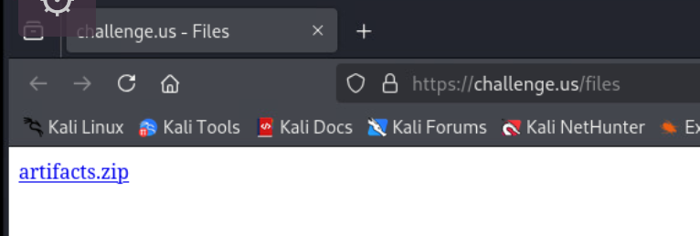

Unzip the file.

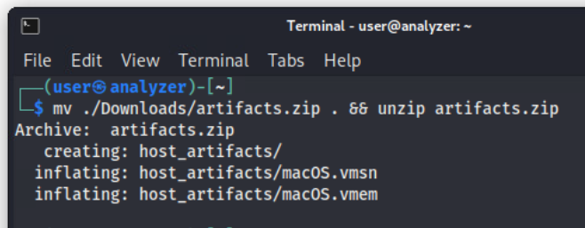

This creates the ``host_artifacts`` folder containing the necessary ``.vmem`` and ``.vmsn`` artifacts.

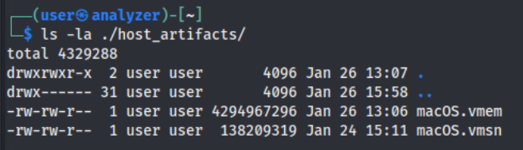

There are files located in ``/home/user/challenge_files`` as highlighted in the ``Challenge Guide``. These files include the kernel of the compromised host and a Kernel Debug Kit necessary to create the ISF.

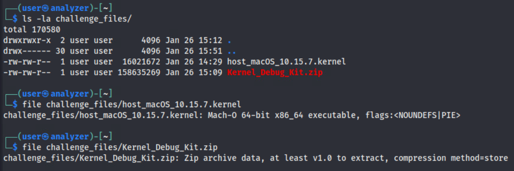

Unzipping the ``Kernel_Debug_Kit.zip`` expands the folder ``Kernel_Debug_Kit``. 

``unzip challenge_files/Kernel_Debug_Kit.zip``

At this point, following along with this guide, we have not changed the working directory and ``/home/user/`` should contain the following folders:

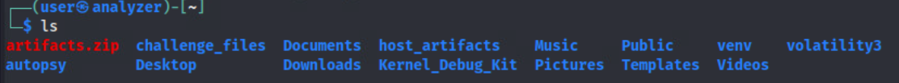

## Question 1
*What is the Darwin Kernel Version of the compromised host?*

As an introduction to volatility, the Darwin Kernel Version is critical information required for creating an ISF. 

This can be accomplished via the Banners plugin by running: ``./volatility3/vol.py -f ./host_artifacts/macOS.vmem banners.Banners``

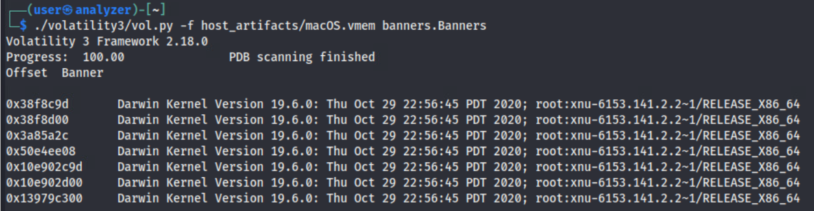

The answer to this question is ``19.6.0`` and is the same across all variants.

*Note: It is necessary to run volatility against the ``.vmem`` with the ``.vmsn`` in the same directory. Volatility will provide an error message if this occurs.*

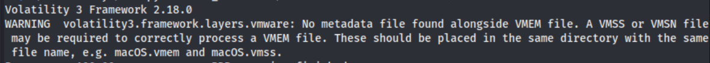

## Question 2
*What is the name of the exfiltrated file from the compromised host?*

Trying to analyze the memory dump without an ISF does not work. We will need to create our own.

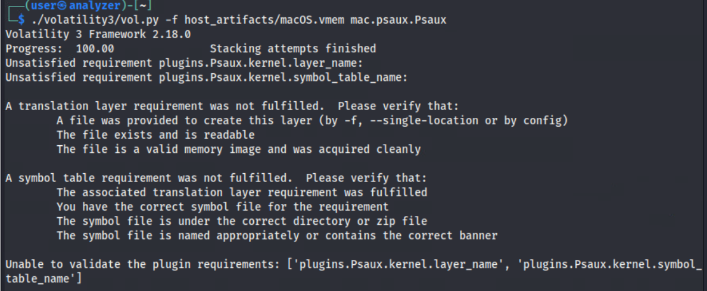

From referencing the Volatility documentation, required files for creating an ISF is the KDK Kernel available at ``/System/Library/Kernels/kernel.dSYM/Contents/Resources/DWARF/kernel`` within the correct Kernel Debugging Kit version and the actual kernel from the forensic host. Both are available within the ``analyzer`` machine at ``/home/user/challenge_files/`` directory.

With these files, we can craft the ISF using ``dwarf2json``:

```bash
dwarf2json mac --macho ./Kernel_Debug_Kit/System/Library/Kernels/kernel.dSYM/Contents/Resources/DWARF/kernel --macho-symbols ./challenge_files/host_macOS_10.15.7.kernel > macOS10.15.7_19H15.json
```

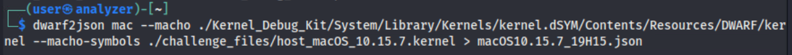

This file needs to be stored within Volatility's ``/symbols/`` directory to be parsed correctly. 

```bash
mv macOS10.15.7_19H15.json ./volatility3/volatility3/symbols/generic/vmcs/
```

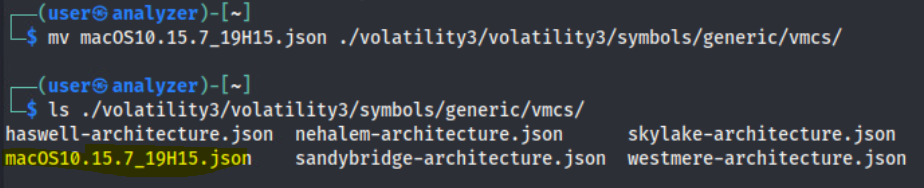

With a working ISF in place, we can run plugins and analyze the memory dump. Running Volatility with the plugin, ``mac.psaux.Psaux`` shows running processes.

```bash
./volatility3/vol.py -f host_artifacts/macOS.vmem mac.psaux.Psaux
```

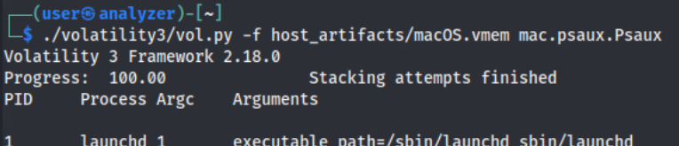

From this command, interesting ``bash`` activity can be observed:

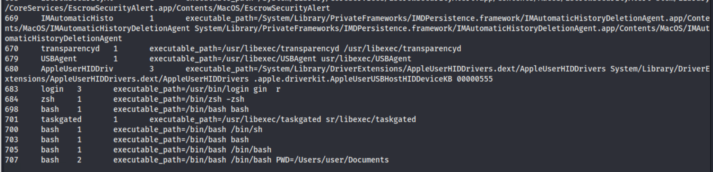

This can be further analyzed with the ``mac.bash.Bash`` plugin.

```bash
./volatility3/vol.py -f host_artifacts/macOS.vmem mac.bash.Bash
```

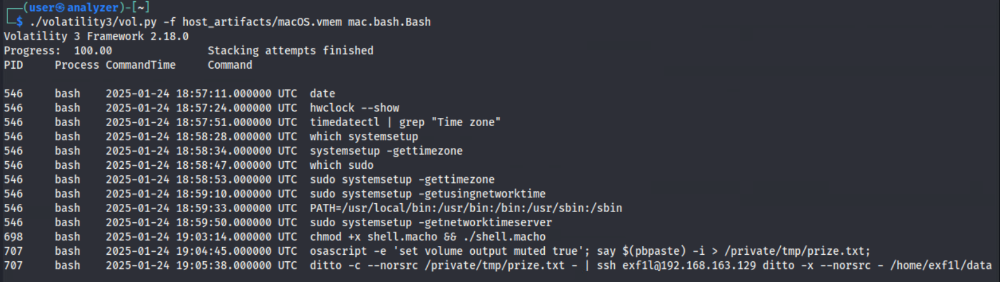

The commands which were ran on the system appear to be utilizing "Living Off the Orchard" techniques, leveraging MacOS commands such as ``osascript``, ``say``, ``pbpaste``, and ``ditto``. It may not be completely obvious to competitors unfamiliar with MacOS commands that the attacker is writing the contents of the user's clipboard to a file and exfiltrating the data to a remote host. 

The answer in this case is ``prize.txt``. Keep in mind this is a variant-style challenge. The answer for Question 2 across the variants are as follows:
- Variant1: loot.txt
- Variant2: treasure.txt
- Variant3: prize.txt

## Question 3
*What is the virtual memory address of the shell code executed on the compromised host?*

Referring back to the ``bash`` history, we can follow the sequence of commands to identify the shell code, ``shell.macho``:

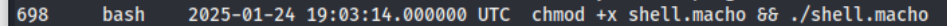

We will use another available plugin, ``mac.list_files.List_Files`` which returns the metadata of the vnode objects. 

```bash
./volatility3/vol.py -f host_artifacts/macOS.vmem mac.list_files.List_Files | grep shell.macho
```

This includes the virtual memory address of the file structure. 

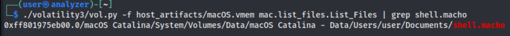

The answer in this case is ``0xff801975eb00.0``. Keep in mind this is a variant-style challenge. The answer for Question 3 across the variants are as follows:

- Variant1: 0xff801975a700.0 
- Variant2: 0xff8019767e00.0
- Variant3: 0xff801975eb00.0

(Answers also accept addresses without the ".0")