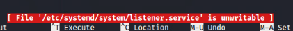
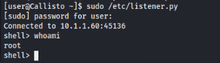

# Wildy Escape Solution Guide

## Part 1: The Scanning Device
- Identify the machine that is currently scanning the network.
- Permanently disable the machine's process that is scanning the network.
- You must wait for the `challenge.us` site to come up before the first part is solvable.

1. To identify the machine that is currently scanning the network, the user can run a tcpdump on the current network to view any network traffic indicating a scan:

    ```bash
    sudo tcpdump -i eth0
    ```

    After a few moments, you will notice traffic coming from `Venentatis.us`:

    

1. Next, we can log in to the machine by running: 

    ```bash
    ssh user@venenatis
    ```

1. We can look for strange services on the machine by looking for anything out of the ordinary at `/etc/systemd/system` by running:

    ```bash
    ls /etc/systemd/system
    ```
    
    You will notice the first item in the list is `client.service`:

    

1. Reading the file will reveal a call to a python script `/etc/client.py`:

    

1. Next, we can inspect this file by running:

    ```bash
    sudo vim /etc/client.py
    ```

    Further investigation will reveal the scanning process, but also reveal a connection to another machine:

    
    

1. Now that the service has been identified, the user can permanently disable this machine's ability to scan the network by running:

    ```bash
    sudo systemctl stop client.service
    sudo systemctl disable client.service
    ```

    

    You can verify that the service has been disabled and stopped by running:

    ```bash
    systemctl status client.service
    ```

    
    
Once the last step has been invoked on `venenatis`, the first token will be available at https://[]()challenge.us.

## Part 2: Find the source of the compromise
- Identify the source machine of the compromised device.
- Permanently disable the source machine's ability to remotely turn on more scanning processes on other machines.

1. From our findings in the previous section, we can investigate the remote machine on `10.3.3.3`.

1. The user can then invoke `ssh user@10.3.3.3` to access that machine.

1. After running 

    ```bash
    sudo netstat -tunlp
    ```

    The user will notice port 9090 is currently listening from another `python3` script:

    

1. Looking at the services at `/etc/systemd/system/` again, we will notice oddly-named files `service.service` and `listener.service`, as well as other oddly-named services:

    

1. Going through the same steps investigating the `service` service, the user will find the python script `/etc/service.py` and discover this is the service that is telling other machines like `venenatis` to scan the network.

1. Now that the service has been identified, the user can permanently disable this machine's ability to remotely turn on more scanning processes by running:

    ```bash
    sudo systemctl stop service.service
    sudo systemctl disable service.service
    ```

1. After doing so, the user will quickly realize that the service is still up. The user may try deleting the python script directly by running:

    ```bash
    sudo rm /etc/service.py
    ```

    Yet the service will remain up.

    

1. Investigating the cron jobs will reveal why this is happening:

    ```bash
    sudo crontab -e
    ```

    

    This information shows that data is being copied from `/kdata` and the `service` service is being kept alive.

1. To solve this part, edit the crontab for the root user and delete all records:
        
    ```bash
    sudo crontab -e
    ```

    Type `dd` until all the lines are gone. Since this is a `vim` instance, you will not see `dd` come up anywhere.

    
    

    Then type `:wq` and press `enter` to save the crontab:

    

    Then reboot:

    ```bash
    sudo reboot
    ```

    This will kill your `ssh` connection. You can simply login via `ssh` again:

    ```bash
    ssh user@10.3.3.3
    ```

1. Then you may stop the `service` service as before:

    ```bash
    sudo systemctl stop service
    sudo systemctl disable service
    ```

    Then you may check to see if the service has finally stopped:

    ```bash
    systemctl status service.service
    ```

        

Once the last step is complete on `10.3.3.3`, the second token will be available at https://[]()challenge.us.

## Part 3: Find more compromises

1. To find the next compromise, you can run `tcpdump` on the machine to find more suspicious-looking traffic, excluding ssh packets coming from your current session:

    ```bash
    sudo tcpdump -i ens32 not port 22
    ```

    Notice the connection on port 45136 to 10.1.1.60:

    

1. To stop the connection, from the `/kdata` directory on `10.3.3.3`, you will see the file `listener.py` as an executable. You will also find a service from the `/etc/systemd/system/` directory we browsed earlier named `listener.service`. We can try to stop the service, but we will get an error:

    ```bash
    sudo systemctl stop listener.service
    ```

    

1. Reading the service file, we will see that the file is read-only, even with root privileges. The following screenshot was captured from invoking `sudo nano /etc/systemd/system/listener.service`:

    

1. To fix this, we can invoke:

    ```bash
    sudo chattr -i /etc/systemd/system/listener.service
    ```

1. Next, remove the line `RefuseManualStop=yes` from the file and run `sudo systemctl daemon-reload`. The following screenshot shows the line commented instead of removed, which yields the same result:

    

1. Now we can stop the service:

    ```bash
    sudo systemctl stop listener.service
    ```

1. `ssh` has been blocked to `10.1.1.60`:

    

    We will have to use a different method in accessing the machine. If the user runs the `/etc/listener.py` executable, they will get a shell connecting to the machine:

    ```bash
    sudo /etc/listener.py
    ```

    

    If you get an error stating "Failed to execute script", this is normal. You can simply run the script again.

    From here, we can allow `ssh` on the machine to get a more stable connection to the machine:

    ```bash
    ufw allow 22
    ufw reload
    ```

    

    And then exit the shell and `ssh` to the machine:

    ```bash
    ssh user@10.1.1.60
    ```

    
    

1. Once again, browsing through the services at `/etc/systemd/system/` will reveal an oddly-named service `connector.service`:

    

1. Reading the service will lead to the python script `/etc/listener.py`:

    

1. As the script is a binary file, the source code is not easily readable. The user can then run: 

    ```bash
    sudo systemctl stop connector.service
    sudo systemctl disable connector.service
    ```

    To confirm that the service has stopped, you can run:

    ```bash
    systemctl status connector.service
    ```
    
    

Once the last step is complete on `10.1.1.60`, the third token will be available at https://[]()challenge.us.