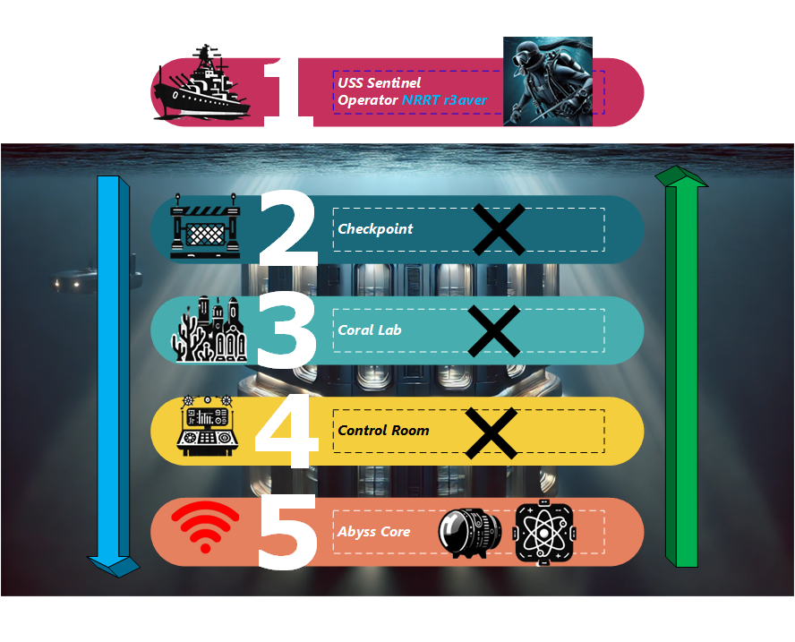

# Deep Blue Sea

⚔️ **After deploying the challenge, please wait five minutes for before starting to allow the systems to set up correctly.**

🐬 A mysterious cyber-attack has compromised the DEEPCOM Research Facility, an underwater base housing classified marine research. The adversary has infiltrated the systems, leaving behind layered security countermeasures to erase their presence. As a top forensic investigator, you must trace their steps, recover critical evidence, and prevent the facility from going dark forever. Are you ready to dive into the abyss?

**NICE Work Roles**
* Digital Forensics
* Incident Response
* Exploit Analysis

For more information on these roles, please visit: https://niccs.cisa.gov/workforce-development/nice-framework

**NICE Tasks**
* [T0108] Perform analysis of the incident to identify the affected systems, networks, and potential perpetrators.
* [T0018] Assess the effectiveness of cybersecurity measures utitlized by the system
* [T0411] Identify and/or develop reverse engineering tools to enhance capabilities and detect vulnerabilities

## Background
⚠️ Communication from the DEEPCOM (Division of Environment Enrichment and Protection Command) Research Facility was lost for exactly 4 minutes and 32 seconds, followed by an automated distress signal. When the systems came back online, most of the security logs had been wiped, key researchers had gone missing, and a silent backdoor remained open to an unknown remote entity.

🔍 As a senior member of the Nautical Rapid Response Team (NRRT), you are tasked to:
* Analyze systems (in full) to determine clues about the malware which took down the facility
* Determine how the discovered syndicate has corrupted the environment
* Break through disk encryption to recover a secret key
* Reverse engineer a Self-Destruct mechanism and stop permanent deletion of the facility's data before it's too late

## Getting Started

### Battle Map

Shown below is your mission route; there is a faint signal from the `Abyss Core`. Completing each task will turn on full power to each subsequent floor as you discover more and dive deeper into the facility:

**You will find artifacts from other researchers and even the adversary itself.**

### Your Mission

[Important] Reading this section will provide you with the mindset needed to complete the following tasks and keep you on target: 

**Checkpoint**  
**Story:** You come across a mainframe terminal with `ABYSSNET` written on the side; it is locked but operational. One of the assailants connected their mind to the Security terminal and broke the key panel subsequently after.   

Let's journey through remnants of their memory and investigate `ABYSSNET` (terminal program) can do to help us get to the `Coral Lab`. 

**NOTE:** We must move quickly as minds are volatile and can shift on a whim. Ensure that you consistently capture all parts of the key to get the appropriate access.  

**Coral Lab**  
**Story:** DEEPCOM's network logs were partially wiped, but operational logs seem somewhat intact.

**Task:** You must find the attack timeline and extract artifacts from these logs to decrypt credentials to enter the `Control Room`.

**Control Room**  
**Story:** As you enter this part of the facility, you see ☠️ marks on the terminals in low lighting. Advanced malicious logic appears to have been deployed to attempt to erase DEEPCOM's data. Researcher and Scientist workstations are scattered throughout the room.

**Task:** Your mission here is to navigate the remaining encrypted backups in the facility to gain clues as to the true identity of the yara.* syndicate.

**Abyss Core**  
**Story:** DEEPCOM's final security system has engaged a self-destruct mechanism.

**Task:** The adversary has weaponized and deployed `code_osiris` (flagship exploit kit), a malicious ELF binary that can wipe all forensic evidence when triggered. You must reverse-engineer this binary, patch the kill-switch, and then make your escape by any means possible.

[IMPORTANT - Keypad] You must enter the right key (retrieved earlier in the challenge) to escape. It is thought that this logic may be faulty so entering the incorrect key **three times could** terminate the keypad (defense mechanism), locking you out of the final token. Be careful when interacting with it.

Additionally, you must interact with the keypad **directly from** the `abysscore` workstation. 

Pay attention to your surroundings and **enumerate everything**; you **may have company**.

**Good luck out there, operator.**
\- akum4, signing off

### Submission

All presented tokens are unique. Please note that in the `final challenge` that the critical information needed to leave the facility can be `entered via keyboard`. This artifact is **not** case-sensitive. 

### System and Tool Credentials

|system | operating system | username|password| location | IP |
|-----------|--------|--------|--------|-----------------|-----------------|
|uss-sentinel | Kali (Debian) |r3aver|rebirth| 35.302192, -70.946726 (entry point) | 10.5.5.7 |
|checkpoint.deepblue.mil | Ubuntu 22.04 | r3aver | rebirth | DEEPCOM HQ Floor *1 | 10.5.5.2 |
|corallab.deepblue.mil | Ubuntu 22.04 | x | x | DEEPCOM HQ Floor B2 | 10.5.5.3 |
|controlroom.deepblue.mil | Ubuntu 22.04 | x | x | DEEPCOM HQ Floor B4 | 10.5.5.4 |
|abysscore.deepblue.mil | Ubuntu 22.04 | x | x | DEEPCOM HQ Floor B10 | 10.5.5.6 |

**x** - This credential information is discovered during the course of the challenge's completion.

**[NOTE]**
Attacking or unauthorized access to `challenge.us` (10.5.5.5) is forbidden. You may only use the provided web page to view challenge progress and download any challenge artifacts that are provided.
