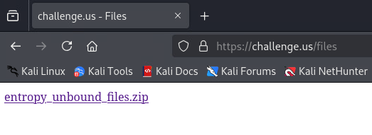
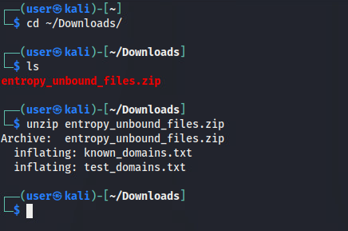
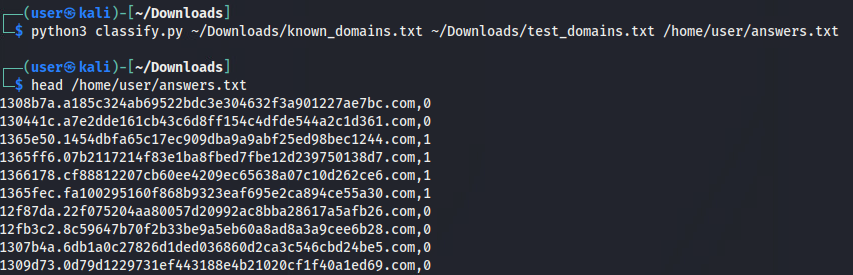

# Entropy Unbound

*Solution Guide*

## Overview
💻 Network Analysts have been observing strange DNS traffic on the internal network. It appears that the malware (codenamed AURORA) is using a domain generation algorithm to connect to Nautilus C2 servers. As Forensics experts, we are tasked with disrupting the malware's propagation by writing a classifier which will allow us to find the domain AURORA uses, filter them out and, eventually, shut them down.

## Questions and Taskings
* 🥉 Enter the Bronze Token (50% Completion)
* 🥈 Enter the Silver Token (70% Completion)
* 🥇 Enter the Gold Token (85% Completion)
* 💎 Enter Master Token (100% Completion)

## Solution

1. Download the required files from `challenge.us/files`



2. Unzip the files

```bash
cd ~/Downloads
unzip entropy_unbound_files.zip
```



3. Analyze the provided data in `known_domains.txt` and `test_domains.txt` 

Opening `known_domains.txt` will show a list of 5000 domain names which were generated by the domain generation algorithm (DGA). To correctly classify the domains in `test_domains.txt`, a set of features from the domains in `known_domains.txt` will need to be determined to create a unique signature for the DGA domains. 

Once this set of features is determined, it can be converted into "feature vector" to be used in a machine learning classifier. 

Start by analyzing the two files and identifying similarities and differences. 

A sample of the domains in `known_domains.txt` can be seen below:

```plain
1343abf.65091700082592819fdc7d2485e607dfe73926a8.com
1343ac0.ea95085ffde4f340796a71e603679dfa16012754.com
1343ac1.abdc0aa37a41c3932683d12b414cb3d67746ece0.com
1343ac2.5f7dd7614a03a69a851af1e26488286bf57abaa1.com
1343ac3.9e465468866f36f87a7a6f5b895a9a373e9074c2.com
1343b09.bf4dc2be70d3c34d2aede6a9f5272b6916f9942f.com
1343b0a.d43114dc86febb01da071b13d5cb095c09bf5f10.com
1343b0b.790eea734d0738dddbf0784dd6c063d3c545b323.com
1343b0c.ed54d299def4597bcee20274a4995884b426d283.com
1343b0d.f5c77495052c5d1d44575724ac2b91e31154cf0c.com
1343b0e.3f625e412c8cb260161b319194a8357a3bf3dba8.com
1343b0f.e27b4c78e603f4da4c3cf88522a22ab503adf644.com
1343b10.e71269a30b40e0508495b2e8f994f9052327bb76.com
1343b11.f1805c44d9aacd0496bf3ba61db0ed1f90501d69.com
1343b12.d3c31d0533b474eb89476fec1de364229b82e9fc.com
1343b13.b4e15474d896c374d7d99f6ca89418e71dcfa564.com
1343b14.97d57add9559f45783997a5245f9aa7c0fb5dca2.com
1343b15.3e7e8bd1025c10f32d702c909c648091d8f156dd.com
1343b16.9ec709d30d40409d2381473adb31e903c70a5561.com
1343b17.82866a8079f8ccbe9a8c48c1ee6b1a09e970c4b2.com
...
```


A sample of the domains in `test_domains.txt` can be seen below:

```plain
1308b7a.a185c324ab69522bdc3e304632f3a901227ae7bc.com
130441c.a7e2dde161cb43c6d8ff154c4dfde544a2c1d361.com
1365e50.1454dbfa65c17ec909dba9a9abf25ed98bec1244.com
1365ff6.07b2117214f83e1ba8fbed7fbe12d239750138d7.com
1366178.cf88812207cb60ee4209ec65638a07c10d262ce6.com
1365fec.fa100295160f868b9323eaf695e2ca894ce55a30.com
12f87da.22f075204aa80057d20992ac8bba28617a5afb26.com
12fb3c2.8c59647b70f2b33be9a5eb60a8ad8a3a9cee6b28.com
1307b4a.6db1a0c27826d1ded036860d2ca3c546cbd24be5.com
1309d73.0d79d1229731ef443188e4b21020cf1f40a1ed69.com
12fed0c.9c918a76f72539400c8d8d3a114233ea08e75d3e.com
1365d99.4b64ad6faae00a460401c0cd848f4aa7ebc1e783.com
1363a05.eb3fd680ea4ba998d58bdc0cc2cf1203f3c276ce.com
1363a70.53907a656f274e1723d430c56064d5700d066658.com
130a87b.1baffae8120b8b171d6c2ca51e3eaf8774ce1fd3.com
1363ac8.cde8c8e80a0e644b8ea9ace3e9e62a40c107a84f.com
136605f.8d7994d4c5dda8f169c56a9d47e5747879c135c2.com
1363a71.e3ad6229ce0b07ee6dc469cace6c2003ac65a900.com
1363a78.ae50917d12b4bcb472cae4d4b22621fb3ba29e24.com
130a84e.98174fb129ab644eed175fd99d1b6c3bb86866a3.com
...
```

It appears that each domain contains 3 parts - a subdomain, the main domain, and the top-level domain. 

Any commonality between the data in both files can be ignored as a differentiating factor. These includes:
- The domains all end in a `.com` TLD
- The domains are all 52 characters long
- The domains all contain strictly hex values in both their subdomain and main domain components

Next, identify any interesting attributes:
- The subdomain component in `known_domains.txt` appears to be a counter that is incrementing each row
- The main domain component in both files appear to be completely random

4. Write code to create a feature vector using properties of the data

The following code will generate a feature vector of 3 features:
- The number of unique characters in the main domain
- The value of the subdomain when converted from hex to decimal
- The entropy of the entire domain

**Note** - for the purposes of brevity in this solution, only these 3 features were selected as the minimum to obtain a viable solution. However, in practice, there would be a process of iteratively adding in additional features in an attempt to improve the accuracy of the classifier.  

```py
from collections import Count
def extract_features(domain):
  subdomain = domain.split('.')[0]
  domain_main = domain.split('.')[1]num_letters = sum(c.isalpha() for c in domain)
  num_vowels = sum(c in "aeiou" for c in domain)
  num_consonants = num_letters - num_vowels


  num_letters = sum(c.isalpha() for c in domain)
  num_vowels = sum(c in "aeiou" for c in domain)
  num_consonants = num_letters - num_vowels
  num_unique_chars = len(set(domain_main))
  subdomain_val = hex_to_int(subdomain)
  entropy = compute_entropy(domain)

  return {
    "num_unique_chars": num_unique_chars,
    "subdomain_val": subdomain_val,
    "entropy": entropy,
  }

def hex_to_int(hex_str : str) -> int :
  return int(hex_str, 16)

def compute_entropy(domain):
  # Calculate the 
  freq = Counter(domain)
  total = len(domain)
  return -sum((count/total) * math.log2(count/total) for count in freq.values())
```

5. Write code to train the machine learning classifier

There are many different classifiers that could be used. This example below will perform unsupervised anomaly detection using Mahalanobis-like distance calculation. With this method, the training data is used to calculate a mean vector and a variance vector.

With this classifier, each sample is converted into a feature vector and then the distance between the feature vector and the mean vector is calculated. A threshold value can be configured to specify how far from the mean vector a sample can be before it is considered an anomaly (and therefore, not from the DGA).

```py
import numpy as np
import pandas as pd
import math

THRESHOLD_STANDARD_DEV = 8 # The number of standard deviations a sample can be away from the mean before it is considered an anomaly

def train(training_data, test_data):
  # Convert to DataFrame
  training_df = pd.DataFrame(training_data, columns=["domain"])
  full_df = pd.DataFrame(training_data + test_data, columns=["domain"])

  # Convert dataset to numerical feature vectors
  training_matrix = pd.DataFrame([extract_features(d) for d in training_df["domain"]]) # Only contains the training data
  full_matrix = pd.DataFrame([extract_features(d) for d in full_df["domain"]]) # Contains the combination of the training + test data

  # Calculate the mean and variance of the full_matrix for normalization
  full_matrix_mean_vector = full_matrix.mean()
  full_matrix_variance_vector = full_matrix.var()

  # Normalize features
  """
  This needs to be done because the units for each vector are not the same.
  Without normalization, features which have more variance would have a disproportionally higher impact the classification. 
  The full full matrix containing both the training and test data will be used for normalization because the training data contains no negative matches (i.e. no domains that are NOT from the DGA), which is not representative of all possible data. 
  """
  training_matrix_normalized = (training_matrix - full_matrix_mean_vector) / (full_matrix.std() + 1e-5) 
  full_matrix_normalized = (full_matrix - full_matrix_mean_vector) / (full_matrix.std() + 1e-5)

  full_matrix_normalized_mean_vector = full_matrix_normalized.mean()
  full_matrix_normalized_variance_vector = full_matrix_normalized.var()

  # Compute distances between the test data and the normalized mean using Mahalanobis-like distance
  known_distances = np.sqrt(((training_matrix_normalized - full_matrix_normalized_mean_vector) ** 2 / (full_matrix_normalized_variance_vector + 1e-5)).sum(axis=1))

  # Set threshold dynamically using the mean and standard deviation of known distances
  threshold = known_distances.mean() + THRESHOLD_STANDARD_DEV * known_distances.std()

  return full_matrix_mean_vector, full_matrix_variance_vector, full_matrix_normalized_mean_vector, full_matrix_normalized_variance_vector, threshold

def classify(domain, mean_vector, variance_vector, normalized_mean_vector, normalized_variance_vector, threshold):
  features = extract_features(domain)

  # Calculate the normalized feature vector 
  feature_vector = np.array([(features[key] - mean_vector[key]) / (np.sqrt(variance_vector[key]) + 1e-3) for key in mean_vector.index]) 

  # Compute Mahalanobis-like distance
  distance = np.sum((feature_vector - normalized_mean_vector) ** 2 / (normalized_variance_vector + 1e-5)) 

  return 1 if distance < threshold else 0  # 1 = Known class, 0 = Anomaly
```

6. Combine the components together into a single script

Save the following code as `classify.py`

```py
#!/usr/bin/env python3

import numpy as np
import pandas as pd
import sys
import os
import math
from collections import Counter

THRESHOLD_STANDARD_DEV = 8 # The number of standard deviations a sample can be away from the mean before it is considered an anomaly

def extract_features(domain):
  subdomain = domain.split('.')[0]
  domain_main = domain.split('.')[1]num_letters = sum(c.isalpha() for c in domain)
  num_vowels = sum(c in "aeiou" for c in domain)
  num_consonants = num_letters - num_vowels


  num_letters = sum(c.isalpha() for c in domain)
  num_vowels = sum(c in "aeiou" for c in domain)
  num_consonants = num_letters - num_vowels
  num_unique_chars = len(set(domain_main))
  subdomain_val = hex_to_int(subdomain)
  entropy = compute_entropy(domain)

  return {
    "num_unique_chars": num_unique_chars,
    "subdomain_val": subdomain_val,
    "entropy": entropy,
  }

def hex_to_int(hex_str : str) -> int :
  return int(hex_str, 16)

def compute_entropy(domain):
  # Calculate the 
  freq = Counter(domain)
  total = len(domain)
  return -sum((count/total) * math.log2(count/total) for count in freq.values())
```

5. Write code to train the machine learning classifier

There are many different classifiers that could be used. This example below will perform unsupervised anomaly detection using Mahalanobis-like distance calculation. With this method, the training data is used to calculate a mean vector and a variance vector.

With this classifier, each sample is converted into a feature vector and then the distance between the feature vector and the mean vector is calculated. A threshold value can be configured to specify how far from the mean vector a sample can be before it is considered an anomaly (and therefore, not from the DGA).

```py
import numpy as np
import pandas as pd
import math

THRESHOLD_STANDARD_DEV = 8 # The number of standard deviations a sample can be away from the mean before it is considered an anomaly

def train(training_data, test_data):
  # Convert to DataFrame
  training_df = pd.DataFrame(training_data, columns=["domain"])
  full_df = pd.DataFrame(training_data + test_data, columns=["domain"])

  # Convert dataset to numerical feature vectors
  training_matrix = pd.DataFrame([extract_features(d) for d in training_df["domain"]]) # Only contains the training data
  full_matrix = pd.DataFrame([extract_features(d) for d in full_df["domain"]]) # Contains the combination of the training + test data

  # Calculate the mean and variance of the full_matrix for normalization
  full_matrix_mean_vector = full_matrix.mean()
  full_matrix_variance_vector = full_matrix.var()

  # Normalize features
  """
  This needs to be done because the units for each vector are not the same.
  Without normalization, features which have more variance would have a disproportionally higher impact the classification. 
  The full full matrix containing both the training and test data will be used for normalization because the training data contains no negative matches (i.e. no domains that are NOT from the DGA), which is not representative of all possible data. 
  """
  training_matrix_normalized = (training_matrix - full_matrix_mean_vector) / (full_matrix.std() + 1e-5) 
  full_matrix_normalized = (full_matrix - full_matrix_mean_vector) / (full_matrix.std() + 1e-5)

  full_matrix_normalized_mean_vector = full_matrix_normalized.mean()
  full_matrix_normalized_variance_vector = full_matrix_normalized.var()

  # Compute distances between the test data and the normalized mean using Mahalanobis-like distance
  known_distances = np.sqrt(((training_matrix_normalized - full_matrix_normalized_mean_vector) ** 2 / (full_matrix_normalized_variance_vector + 1e-5)).sum(axis=1))

  # Set threshold dynamically using the mean and standard deviation of known distances
  threshold = known_distances.mean() + THRESHOLD_STANDARD_DEV * known_distances.std()

  return full_matrix_mean_vector, full_matrix_variance_vector, full_matrix_normalized_mean_vector, full_matrix_normalized_variance_vector, threshold

def classify(domain, mean_vector, variance_vector, normalized_mean_vector, normalized_variance_vector, threshold):
  features = extract_features(domain)

  # Calculate the normalized feature vector 
  feature_vector = np.array([(features[key] - mean_vector[key]) / (np.sqrt(variance_vector[key]) + 1e-3) for key in mean_vector.index]) 

  # Compute Mahalanobis-like distance
  distance = np.sum((feature_vector - normalized_mean_vector) ** 2 / (normalized_variance_vector + 1e-5)) 

  return 1 if distance < threshold else 0  # 1 = Known class, 0 = Anomaly
```

6. Combine the components together into a single script

Save the following code as `classify.py`

```py
#!/usr/bin/env python3

import numpy as np
import pandas as pd
import sys
import os
import math
from collections import Counter

THRESHOLD_STANDARD_DEV = 8 # The number of standard deviations a sample can be away from the mean before it is considered an anomaly

def extract_features(domain):
  subdomain = domain.split('.')[0]
  domain_main = domain.split('.')[1]

  num_letters = sum(c.isalpha() for c in domain)
  num_vowels = sum(c in "aeiou" for c in domain)
  num_consonants = num_letters - num_vowels
  num_unique_chars = len(set(domain_main))
  subdomain_hex_to_val = hex_to_int(subin)
  entropy = compute_entropy(domain)

  return {
    "num_unique_chars": num_unique_chars,
    "subdomain_val": subdomain_val,
    "entropy": entropy,
  }

def hex_to_int(hex_str : str) -> int :
  return int(hex_str, 16)

def compute_entropy(domain):
  # Calculate the 
  freq = Counter(domain)
  total = len(domain)
  return -sum((count/total) * math.log2(count/total) for count in freq.values())

def train(training_data, test_data):
  # Convert to DataFrame
  training_df = pd.DataFrame(training_data, columns=["domain"])
  full_df = pd.DataFrame(training_data + test_data, columns=["domain"])

  # Convert dataset to numerical feature vectors
  training_matrix = pd.DataFrame([extract_features(d) for d in training_df["domain"]]) # Only contains the training data
  full_matrix = pd.DataFrame([extract_features(d) for d in full_df["domain"]]) # Contains the combination of the training + test data

  # Calculate the mean and variance of the full_matrix for normalization
  full_matrix_mean_vector = full_matrix.mean()
  full_matrix_variance_vector = full_matrix.var()

  # Normalize features
  """
  This needs to be done because the units for each vector are not the same.
  Without normalization, features which have more variance would have a disproportionally higher impact the classification. 
  The full full matrix containing both the training and test data will be used for normalization because the training data contains no negative matches (i.e. no domains that are NOT from the DGA), which is not representative of all possible data. 
  """
  training_matrix_normalized = (training_matrix - full_matrix_mean_vector) / (full_matrix.std() + 1e-5) 
  full_matrix_normalized = (full_matrix - full_matrix_mean_vector) / (full_matrix.std() + 1e-5)

  full_matrix_normalized_mean_vector = full_matrix_normalized.mean()
  full_matrix_normalized_variance_vector = full_matrix_normalized.var()

  # Compute distances between the test data and the normalized mean using Mahalanobis-like distance
  known_distances = np.sqrt(((training_matrix_normalized - full_matrix_normalized_mean_vector) ** 2 / (full_matrix_normalized_variance_vector + 1e-5)).sum(axis=1))

  # Set threshold dynamically using the mean and standard deviation of known distances
  threshold = known_distances.mean() + THRESHOLD_STANDARD_DEV * known_distances.std()

  return full_matrix_mean_vector, full_matrix_variance_vector, full_matrix_normalized_mean_vector, full_matrix_normalized_variance_vector, threshold

def classify(domain, mean_vector, variance_vector, normalized_mean_vector, normalized_variance_vector, threshold):
  features = extract_features(domain)

  # Calculate the normalized feature vector 
  feature_vector = np.array([(features[key] - mean_vector[key]) / (np.sqrt(variance_vector[key]) + 1e-3) for key in mean_vector.index]) 

  # Compute Mahalanobis-like distance
  distance = np.sum((feature_vector - normalized_mean_vector) ** 2 / (normalized_variance_vector + 1e-5)) 

  return 1 if distance < threshold else 0  # 1 = Known class, 0 = Anomaly


def run(training_data, test_data, classified_data_file_path):
  mean_vector, variance_vector, normalized_mean_vector, normalized_variance_vector, threshold = train(training_data, test_data)

  with open(classified_data_file_path, 'w') as classified_file:
    for domain in test_data:
      result = classify(domain, mean_vector, variance_vector, normalized_mean_vector, normalized_variance_vector, threshold)
      classified_file.write(f"{domain},{result}\n")

  return

if __name__ == "__main__":
  if len(sys.argv) != 4:
    print("Usage: classify_data.py <training_data_path> <test_data_path> <output_path>")
    sys.exit(1)
  
  training_data_file_path = sys.argv[1]
  test_data_file_path = sys.argv[2]
  classified_data_file_path = sys.argv[3]

  if not os.path.isfile(training_data_file_path) or not os.access(training_data_file_path, os.R_OK):
    print(f"Error: Cannot read training data file at {training_data_file_path}")
    sys.exit(1)

  if not os.path.isfile(test_data_file_path) or not os.access(test_data_file_path, os.R_OK):
    print(f"Error: Cannot read test data file at {test_data_file_path}")
    sys.exit(1)

  with open(training_data_file_path, 'r') as training_file:
    training_data = training_file.readlines()
    training_data = [line.strip() for line in training_data if line.strip()]

  with open(test_data_file_path, 'r') as test_file:
    test_data = test_file.readlines()
    test_data = [line.strip() for line in test_data if line.strip()]

  run(training_data, test_data, classified_data_file_path)
```

7. Run the classifier 

```bash
python3 classify.py ~/Downloads/known_domains.txt ~/Downloads/test_domains.txt /home/user/answers.txt
```



8. Run the grading check from `challenge.us

9. Challengers will find that they can only get to certain accuracy with the current `classifier` when not accounting for a few factors that will take this over the line (100%).

With enough precision and and additional analysis, we can actually **recreate** the algorithm used to create the domains in questions.

a) Printing all the seeds in order yields that `date` are a key factor in the naming schema
b) `Bad` or extremely old date seem to be tied to `incorrect` answers

10. Taking these two developments in item `#9`, let's create a script that tailors to this detection logic:

```python
import hashlib

entries = []

with open('test_domains.txt', 'r') as file:
    with open('solved_domains.txt', 'w') as output:
        lines = file.readlines()

        for line in lines:

            vals = line.split(".")
            seed = str(int(vals[0], 16))  #From hex to decimal string
            hash = vals[1]
            entries.append(seed)

            sha1_hash = hashlib.sha1(seed.encode("utf-8"))
            hex_digest = sha1_hash.hexdigest()
            if hash == hex_digest and not seed.startswith("19"):
                output.write(f"{vals[0]}.{vals[1]}.com,1\n")
            else:
                output.write(f"{vals[0]}.{vals[1]}.com,0\n")

        # for key in sorted(entries):
        #     print(key)
```

This simplified script attacks the algorithm head on examining the seed values of each line of the test domains.
Hashes that don't start with `19` end up being `incorrect`.

10. As a result, the output text file will yield all the domains necessary to achieve both the `Gold` token and `Master` token (100%).

11. 500 domains are required to get the `Master` token. Copy solved_domains.txt to ~/data/answers.txt then submit it for Grading and this should yield all the tokens (including any tokens that you are missing.)

```bash
cp <LOCAION of solved_domains.txt> ~/data/answers.txt
```

**This concludes the solution guide for this challenge.**


