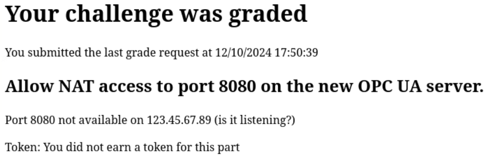

# The ModFather

*Solution Guide*

## Overview

In The ModFather, the competitor repairs and externally exposes an open-source OPC UA server implementation to protect a mission-critical Modbus devices. The OPC UA server acts as a more secure interface for accessing a Modbus device.

The competitor begins by first configuring the pfSense firewall to expose the OPC UA server in the DMZ. The network is configured as shown in the following network diagram.


The competitor then needs to fix the nodejs script running on the OPC UA Server, as one of the required libraries is no longer compatible. This involves running the code, evaluating exceptions, errors, and stack traces, and modifying the code to use the updated API. After fixing the errors, the competitor then needs to enable password authentication on the OPC UA server.

The ModFather uses randomly-generated 12-digit hexadecimal tokens for all questions; there are no variants. The [modbushandler.js](./modbushandler.js) and [server.js](./server.js) files contain the full solution code for Questions 2-4.

## Question 1

*Token 1: Configure NAT rules on the pfSense firewall to allow WAN access to the OPC UA server on port `8080`. As the OPC UA server is not yet running, run `nc -l 8080` on the OPC UA server before grading at `http://challenge.us`.*

*Enter the token retrieved from challenge.us after setting up external NAT access to the OPC UA server.*

The first task requires us to add NAT rules for `10.7.7.2` on port 8080. First, log in to pfSense by visiting `pfsense.merch.codes` and entering `admin`/`tartans` as the credentials. Next, under the Firewall option, select NAT.


Select Add (either bottom or top), and configure the NAT rules as follows:

- Interface: WAN (selected by default)
- Address Family: IPv4
- Protocol: TCP
- Destination: WAN address
- Destination port range: 8080
- Redirect target IP: 10.7.7.2
- Redirect target port: 8080


Select save and pfSense will automatically add the corresponding rule, shown below. **Be sure to hit the green `Apply Changes` button!** 


The 8080 port on the server is not yet open, so visiting `challenge.us` and hitting grade will result in the following error.



The error reminds us that the server needs to be listening. Following the challenge instructions, we need to `ssh` into the OPC UA server and then run netcat. Note we use the internal `10.7.7.2` IP address instead of the public-facing `123.45.67.89` IP address. The username and password in the challenge description are `user` and `tartans`.

```bash
ssh user@10.7.7.2
```

Note you may need to type `yes` and hit enter for the host key check if this is your first time connecting to the server. Now we can start the `netcat` listener; leave it running, and then run the grader by navigating to `challenge.us` in a browser.

```bash
nc -l 8080
```


Now `challenge.us` can confirm that the firewall rules have been correctly established, allowing external access to the OPC UA server. In this case, the token is `17dcf7b56e37`.

## Question 2

*Token 2: Fix the code on the OPC UA server to allow read access to the non-boolean registers available on the Modbus device. The `config.json` file already contains the correct parameters for the modbus device. In the interest of time, the issues to fix are listed below:
In `modbushandler.js`, update `modbus.client.tcp.complete` and `this.modbusclient.on` to use the new `jsmodbus` API.
In `modbushandler.js`, the response when polling the Modbus device has changed; update the file to correctly access the values.*

*Enter the token retrieved from challenge.us after configuring the OPCUA server to allow read access to the non-boolean types.*

For the next token, we need to start fixing the OPC UA server. The challenge instructions inform us we can use VS Code to access the server. To do so, open VS Code and hit the blue remote button in the very bottom left corner. We can then choose to connect to a host, entering the IP address `10.7.7.2` and password `tartans`.


Under the File menu, we can then open the `opcua` folder on the remote server, which reveals the `server.js` and `modbushandler.js` files mentioned in the instructions. Looking over `server.js`, this file is responsible for setting up the OPC UA server using the `node-opcua` module. The `modbushandler.js` handles the backend data processing between the Modbus device and the OPC UA server.

The instructions tell us the first issue we need to fix will be the `jsmodbus` API, but lets run the server first. You can do this with a normal terminal, or one inside VS Code. 


This aligns with what we would expect from the challenge instructions; the complete function is undefined, as the API has changed and the function no longer exists. The error informs us the issue is on line 74. Open `modbushandler.js` in VS Code (or your editor of choice) and navigate to line 74 (shown below) to resolve this issue.

**Note that your line numbers may be different from those seen here as you edit the file (e.g., due to added whitespace).** If that is the case, your error messages will still point you to their new location in the code so you can identify and fix them.

```javascript
    CreateModbusDevice: function (host, port, unit) {
        var mclient = modbus.client.tcp.complete({
            'host': host,
            'port': port,
            'autoReconnect': true,
            'reconnectTimeout': 1000,
            'timeout': 5000,
            'unitId': unit
        });
        mclient.connect();
        console.log("Created a Modbus device on " + host + ":" + port + " " + unit);
        this.modbusclient = mclient;
    }
```

This small snippet of code is being used to setup the socket that connects to the modbus device. At this point, we need to review the documentation for the `jsmodbus` library (note that we can check the version in `package.json` if we want to make sure it's the most recent version).

Visiting the [nodejs homepage](https://www.npmjs.com/package/jsmodbus) for the library is enough to get us what we need. The following example code from the homepage demonstrates how to create a new TCP modbus client. The `net` module is now used, with the options being passed to the socket at connection.

```javascript
// create a tcp modbus client
const Modbus = require('jsmodbus')
const net = require('net')
const socket = new net.Socket()
const client = new Modbus.client.TCP(socket, unitId)
const options = {
'host' : host,
'port' : port
}
```

```javascript
...
socket.connect(options)
...
```

To fix this first error, we can swap the `tcp.complete` function for the new one. Note that we also need to require the `net` module.

```javascript
    const modbus = require('jsmodbus')  // Note that this has a lower case m to match what is already in the file
    const net = require('net')  //Include the net module at the top of the file
    ...
    CreateModbusDevice: function (host, port, unit) {
        const socket = new net.Socket()
        const mclient = new modbus.client.TCP(socket, unit)
        const options = {
            'host': host,
            'port': port,
            'autoReconnect': true,
            'reconnectTimeout': 1000,
            'timeout': 5000,
            'unitId': unit
        }
        socket.connect(options);

        console.log("Created a Modbus device on " + host + ":" + port + " " + unit);
        this.modbusclient = mclient;
    }
```

Now when we run the file, we get the following error message.


From the previous documentation, the error handling event now needs to be added to the socket, not the client. There are a couple ways to resolve this (for example, making the socket a global var), but the socket is actually part of the client. Thus we can change line 32 accordingly:

```javascript
this.modbusclient.on('error', () => {... //Original
<--->
this.modbusclient.socket.on('error', () => {... //New
```

This resolves the issues with the `jsmodbus` API. Now when we run the server, we get the following output.


With that, we are on to the next task, and need to properly parse the response output. We should start by seeing what the response output actually looks like. The error lets us know we should check line 98.

```javascript
    case "holdingregister":
        client.readHoldingRegisters(address, count).then(function (resp) {
            // resp will look like { fc: 3, byteCount: 20, register: [ values 0 - 10 ], payload: <Buffer> }
            // console.log(resp);
            resp.register.forEach(function (value, i) {
                var fulladdress = (address + i).toString();
                ValueMap[rootname + fulladdress] = {
                    v: new opcua.Variant({ dataType: opcua.DataType.Int32, value: value }),
                    q: "good"
                };
            });
        });
            
        break;
```

The code tells us what the expected response looks like, and even has a commented out print statement (`console.log(resp)`). Uncomment that line, and run the code again. We get (in addition to the error) the content of the response.

```javascript
{
  metrics: UserRequestMetrics {
    createdAt: 2024-12-10T23:42:27.616Z,
    startedAt: 2024-12-10T23:42:27.616Z,
    receivedAt: 2024-12-10T23:42:27.619Z
  },
  request: ModbusTCPRequest {
    _id: 1,
    _protocol: 0,
    _length: 6,
    _unitId: 2,
    _body: ReadHoldingRegistersRequestBody { _fc: 3, _start: 0, _count: 1 }
  },
  response: ModbusTCPResponse {
    _id: 1,
    _protocol: 0,
    _bodyLength: 5,
    _unitId: 2,
    _body: ReadHoldingRegistersResponseBody {
      _fc: 3,
      _byteCount: 2,
      _values: [Array],
      _bufferLength: 4,
      _valuesAsArray: [Array],
      _valuesAsBuffer: <Buffer b7 77>
    }
  }
}
```

The error on line 96 was that a property (the `forEach` function, which is a built-in function for iterating arrays) of an undefined value was being read. This means the `resp.register` is undefined. Comparing the commented out expected response to the actual response received, we can see there are a lot more values now. However, part of the response appears to match up with the expected format. 

```javascript
_body: ReadHoldingRegistersResponseBody {
    _fc: 3,
    _byteCount: 2,
    _values: [Array],
    _bufferLength: 4,
    _valuesAsArray: [Array],
    _valuesAsBuffer: <Buffer b7 77>
}
```

This is pretty close, but now we have `valuesAsArray` instead of `register`. We need to change the code to access the actual values. Looking at the response, we need to first access `response`, then `body`, then `valuesAsArray`. The modified code is shown below. Note we use `valuesAsArray` here instead of `values`; while `values` is an array here, it is not for the boolean register types (if values is used, the issue will be discovered when handling coils in the following paragraph).

```javascript
    case "holdingregister":
        client.readHoldingRegisters(address, count).then(function (resp) {
            // resp will look like { fc: 3, byteCount: 20, register: [ values 0 - 10 ], payload: <Buffer> }
            // console.log(resp);
            resp.response.body.valuesAsArray.forEach(function (value, i) {  //Changed and commented out print above
                var fulladdress = (address + i).toString();
                ValueMap[rootname + fulladdress] = {
                    v: new opcua.Variant({ dataType: opcua.DataType.Int32, value: value }),
                    q: "good"
                };
            });
        });
            
        break;
```

When we run the code again, we get the following error.


This is the same error; the above code is repeated (with minor changes) for all Modbus register types. You can repeat the process above, but the solution for the remaining three will be the same. The fixed polling function is shown below.

```javascript
function polldata(client, ValueMap, rootname, type, address, count) {
    switch (type) {
        case "holdingregister":
            client.readHoldingRegisters(address, count).then(function (resp) {
                // resp will look like { fc: 3, byteCount: 20, register: [ values 0 - 10 ], payload: <Buffer> }
                //    console.log(resp);
                resp.response.body.valuesAsArray.forEach(function (value, i) {
                    var fulladdress = (address + i).toString();
                    ValueMap[rootname + fulladdress] = {
                        v: new opcua.Variant({ dataType: opcua.DataType.Int32, value: value }),
                        q: "good"
                    };
                });
            });
              
            break;
        case "inputregisters":
            client.readInputRegisters(address, count).then(function (resp) {
                // resp will look like { fc: 3, byteCount: 20, register: [ values 0 - 10 ], payload: <Buffer> }
                //console.log(resp);
                resp.response.body.valuesAsArray.forEach(function (value, i) {
                    var fulladdress = (address + i).toString();
                     ValueMap[rootname + fulladdress] = {
                        v: new opcua.Variant({ dataType: opcua.DataType.Int32, value: value }),
                        q: "good"
                    };
                });
            });
            break;
        case "coils":
            client.readCoils(address, count).then(function (resp) {
                // resp will look like { fc: 3, byteCount: 20, register: [ values 0 - 10 ], payload: <Buffer> }
                console.log(resp);

                resp.response.body.valuesAsArray.forEach(function (value, i) {
                    var fulladdress = (address + i).toString();
                     ValueMap[rootname + fulladdress] = {
                        v: new opcua.Variant({ dataType: opcua.DataType.Boolean, value: value }),
                        q: "good"
                    };
                });
            });
            break;
        case "discreteinputs":
            client.readDiscreteInputs(address, count).then(function (resp) {
                // resp will look like { fc: 3, byteCount: 20, register: [ values 0 - 10 ], payload: <Buffer> }
                //console.log(resp);
                resp.response.body.valuesAsArray.forEach(function (value, i) {
                    var fulladdress = (address + i).toString();
                      ValueMap[rootname + fulladdress] = {
                        v: new opcua.Variant({ dataType: opcua.DataType.Boolean, value: value }),
                        q: "good"
                    };
                });
            });
            break;
    }
}
```

Now the server is truly fixed, and the server runs quietly when we run it (or, if you left the printing statements, it prints a lot of response output).


If we visit `https://challenge.us` and run the grading, we get the following.


In this case, the token is `281ee1a61da8`.

## Question 3

*Token 3: Fix the issue with boolean registers, allowing read access to all registers on the Modbus device.
When reading values in `modbushandler.js`, the `node-opcua` module now strictly expects a boolean value, not a "truthy/falsy" value.*

*Enter the token retrieved from challenge.us after configuring the OPCUA server to allow read access to all types.*

After retrieving Token 2, it may not be obvious that there is actually a problem with the boolean values as the server seems to be running OK. If we check the server after running the grading check at `challenge.us`, however, we will see that the server has now thrown a new error.


Running a grading check to trigger the error is cumbersome, however. We can trigger it ourselves one of three ways:

1. Use the provided `wan_client.js` script on the Kali box in the home directory
1. Use the provided `uaexpert.AppImage` application on the Kali box in the home directory
1. Use the provided `lan_client.js` script on the OPC UA server

Using any of these three techniques works. Some users may prefer the simplified raw output from using the node scripts, but this solution will use the UAExpert application as it is the best for getting an understanding of how OPC UA actually works in practice (which is the whole point of this exercise).

Following the instructions in the home directory's [readme](../challenge/scripts/readme.txt), we can connect to the OPC UA server:

```none
To use the UAexpert program to monitor the server, run the executable and enter any value for Organization to create a "Application instance certificate". 
Next select Server>Add. Under Advanced, put "opc.tcp://123.45.67.89:8080" as the endpoint URL. 
If using auth, enter the username and password. After clicking ok, the server will be added in the project menu on the left.
Right click on the server and select connect. If the server is accessible, the available data will be listed in the address space.
```

First, enter any value as the Organization and click "OK" to create the "Application instance certificate".


Next, select Server>Add in the top left.


Enter "opc.tcp://123.45.67.89:8080" as the endpoint.


Note that after connecting, you may be prompted with a certificate warning; you can select the "Accept the server certificiate temporarily..." checkbox in the bottom left corner, and the click "Continue" in the bottom right to continue.


Now in the bottom left corner, we can see the available values and read them. Looking at our holding register, everything is good; we can see the value in the top right value pane, and can track the value if we drag-n-drop it into the center. However, the boolean coils cannot be read; they give an internal error.


Every time we try to access the boolean coil, we get that same error above complaining that an assert failed. Unforunately, the stack trace does not go back far enough to determine the exact line number in our code. While we could extend the `Error.stackTraceLimit`, it is not actually necessary for us in this case. We know the error is occurring when a boolean value is read, and the challenge instructions confirm that is what is occurring, so we can instead locate that section in the code. Open the `modbushandler.js` file and search for `ReadValue` to locate the function shown below.

```javascript
    ReadValue: function (name) {
        //console.log("read ", this.ValueMap);
        var val = this.ValueMap[name];
        if (!val) {
            return opcua.StatusCodes.BadDataUnavailable;
        }
        if(val.q!="good"){
            return opcua.StatusCodes.BadConnectionRejected;//Bad;
        }
        return val.v;
    },
```

Just like before, this code conveniently already has a commented out print statement for us, so we can uncomment that and see what values are actually being read. **Note that you will need to restart the server for any changes to take effect.** Remember the error is that `isValidBoolean` is failing and the challenge instructions tell us that the library no longer accepts "truthy/falsey" values. This can be hard to actively read, so I recommend dumping out to a file with `node server.js > output.txt`. The relevant section about coils is shown below.

![A screenshot of the JSON format used to store a coil. The value is stored in a Variant object with the fields dataType ([EnumItem]), arrayType ([EnumItem]), value (0), and dimensions (null).](./imgs/boolean-coil-values.png "Coil JSON Values")

From this image, we can see the coil values are stored as integers, 1/0, not true/false, just like the holding registers. This is what is causing the issue, which we can confirm by reviewing the node module source code. 


To fix this issue, we need to convert all boolean values from integers to booleans. From our dump of the data, we can see each value stores the dataType has an EnumItem under `v.dataType`. If we print that value by adding the following code and then requesting it with UAexpert, we see the following:

```javascript
// console.log("read ", this.ValueMap); //Change the console.log to print the dataType
var val = this.ValueMap[name];
if (val){
    console.log("read ", val.v.dataType);
}
```


We can use this to value then to check the type of the value. If the value is a Boolean value, we need to first convert to true/false depending on if the value is 1/0. The following code snippet does so. 

```javascript
if(val.v.dataType.key == "Boolean"){
    val.v.value = val.v.value == 0 ? false : true;
}
```

Let's add that snipped into the ReadValue function right before the return statement. Note the print code has been commented back out. The modifications have been marked with comments.

```javascript
    ReadValue: function (name) {
        // console.log("read ", this.ValueMap);
        var val = this.ValueMap[name];
        // if (val){
        //     console.log("read ", val.v.dataType);
        // }
        if (!val) {
            return opcua.StatusCodes.BadDataUnavailable;
        }
        if(val.q!="good"){
            return opcua.StatusCodes.BadConnectionRejected;//Bad;
        }
        //--- The new code we are adding to handle booleans
        if(val.v.dataType.key == "Boolean"){
            val.v.value = val.v.value == 0 ? false : true;
        }
        //--- End of new modifications
        return val.v;
    },
```

The code above, after checking the val is good, checks if the value is a boolean type, and finally updates the value to either true or false depending on the value. With that fixed, restarting the server and trying the UAexpert app again gives us a successful read.


We can now run our grading check at `https://challenge.us`.


In this case, the token is `4e80e87ad45b`.

## Question 4

*Token 4: Add a username and password requirement to the fixed OPC UA server. Use `user` and `tartans` as the username and password (password can be stored in plaintext in `server.js`).*

*Enter the token retrieved from challenge.us after adding password protection to the OPCUA server.*

This final task might seem like a lot of programming, but OPC UA is designed to support authentication by default. We simply need to configure the server to use auth instead of anonymous log on. Googling anything like `node-opcua server password` should bring up the following [GitHub issue](https://github.com/node-opcua/node-opcua/issues/319) on the `node-opcua` repo. The issue provides us with the following example code.

```javascript
var userManager = {
    isValidUser: function (userName, password) {
        if (userName === "user1" && password === "password1") {
            return true;
        }
        if (userName === "user2" && password === "password2") {
            return true;
        }
        return false;
    }
};

var server_options = {
	...
	userManager: userManager,
    
	allowAnonymous: false,
};

var server = new OPCUAServer(server_options);
```

We simply need to integrate this code into our server. In `server.js`, we add the following, replacing the current server options and OPCUAServer function call.

```javascript
var userManager = {
    isValidUser: function (userName, password) {
        if (userName === "user" && password === "tartans") {
            return true;
        }
        return false;
    }
};

// WITH USER/PASSWORD
server_options = {
    port: config.port,
    resourcePath: config.url,
    userManager: userManager, //Comment out to remove auth
    allowAnonymous: false,  //Comment out to remove auth
}
//-------

var server = new opcua.OPCUAServer(server_options);
```

The following image shows exactly where the authentication code snippet above should be placed, replacing the current `server` variable declaration. The final solution can be found in [server.js](./server.js).


With auth enabled, you can test it by trying to log in using UAExpert by adding the server again with the username and password as we did for [Question 3](#question-3) or you can right click the server name under the "Project > Servers" listing on the left side of the application, and select `Change User`. You can then provide the username and password there.


Note that after changing your user, you may be prompted once again with a certificate warning; you can select the "Accept the server certificiate temporarily..." checkbox in the bottom left corner, and the click "Continue" in the bottom right to continue.


Once you are finished, we can earn the token by run the grading check at `https://challenge.us`.


In this case, the token is `8e8b9ff55d1d`.