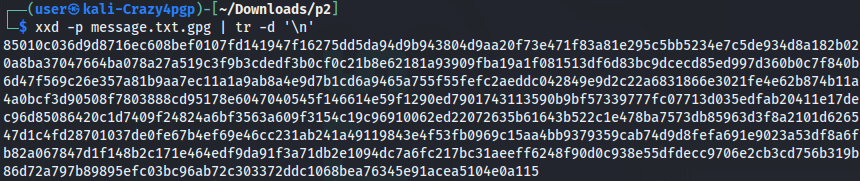
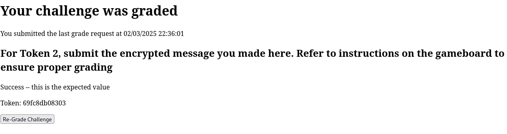

# Crazy for PGP

*Solution Guide*

## Overview

The first task includes a number of emails and a key used to sign them. One of the emails has been tampered with and players will need to find the tampered email.

The second task will involve the players using a private key to decrypt a secret message. Players will need to encrypt a message hidden within the initial message and submit it for grading.

In the last task, players will break an encryption algorithm by performing a known plaintext attack. Players must analyze a code snippet of a poor cryptography implementation and develop a way to recover the encryption key. 

Crazy for PGP uses randomly-generated 12-digit hexadecimal tokens for two questions and 8-digit randomly generated tokens for the last question; there are no variants.

## Question 1

*What is the hex string found in the email that was tampered with?*

1. Download the email files `part1_messages.tar.gz` and the public keys `part1_pub_key.asc` from `challenge.us`. 


2. Unzip the message files using `tar -zxvf part1_messages.tar.gz`


You should see a new folder with all of the email text files and their corresponding signatures.


3. Import the public keys `gpg --import part1_pub_key.asc`


4. Use the `gpg` program to verify all of the signature files in the `messages` folder: `gpg --verify email_*.txt.sig`

You should see a single signature is invalid. Unfortunately, gpg does not explicitly state which one.


5. Write a script to iterate through each file explicitly to identify which one has the bad signature

```bash
for file in *.sig; do
  gpg --verify "$file" 2>&1 | grep -q "BAD signature" && echo "$file"
done
```


Here you can see only 1 email has the bad signature, that is email_33.txt.sig

5. Print out the contents of the corresponding email_33.txt file `cat email_33.txt`


The token for this question is the hex string at the end of the email, which is "cb8d83d80727" in this example. 

## Question 2

*What is the token you received from the grading server for submitting a correctly encrypted secret message?*

1. Download the public/private user keys (`part2_user_keys.asc`), the encrypted message (`part2_encrypted_message.asc`), and the command key (`part2_public_command_key.asc`) from `challenge.us`.

2. Import the user and command keys keys `gpg --import part2_user_keys.asc && gpg --import part2_public_command_key.asc`

3. Now that the user's public and private keys have been imported, use gpg to decrypt the encrypted message to another file. `gpg --decrypt -o decrypted_file.txt part2_encrypted_message.asc`. 


4. View the decrypted file to reveal the next set of instructions `cat decrypted_file.txt`


5. Follow the instructions and encrypt the message. The recipient will be "Wicked@offtoseethe.cipher.wizard" because that was the email address of the user that was imported from `part2_public_command_key.asc` in step 2. This will create a new encrypted file named `message.txt.gpg`

```bash
echo "The only place where success comes before work is in the dictionary." > message.txt
gpg --encrypt -r Wicked@offtoseethe.cipher.wizard message.txt
```


6. Follow the instructions from the challenge prompt to format the message for grading. 

```bash
xxd -p message.txt.gpg | tr -d '\n'`
```

This will create a hex dump of the file contents without any formatting. Copy this output and paste to the server for grading.



7. Visit [`challenge.us`](http://challenge.us) and submit the encrypted text to receive the second token.



## Question 3

*What is the 4-byte key (in hex) that is used by the `cbc-server` to encrypt messages?*

1. Analyze the `part3_cbc_snippet.py` file in the `hosted_files` directory. A few key pieces of information can be gained from this analysis:

- This cbc encryption is utilizing 4-byte blocks. So the IV and Key must also be 4-bytes long
- The server is using the IP address of the connected client as the IV value for the cbc encryption

```py
...

def cbc_encrypt(plaintext, key, iv):
    block_size = len(iv)
    if len(key) != block_size:
        raise ValueError("Key length must match block size (IV length).")

    plaintext = pad(plaintext, block_size)
    ciphertext = b""
    previous_block = iv

    for i in range(0, len(plaintext), block_size):
        block = plaintext[i:i + block_size]
        encrypted_block = xor_bytes(block, previous_block)
        encrypted_block = xor_bytes(encrypted_block, key)
        ciphertext += encrypted_block
        previous_block = encrypted_block

    return ciphertext

def start_udp_server():
  server_socket = socket.socket(socket.AF_INET, socket.SOCK_DGRAM)
  server_socket.bind(('0.0.0.0', PORT))
  print(f"UDP server is listening on port {PORT}")

  while True:
    data, addr = server_socket.recvfrom(1024)
    ip_address = socket.inet_aton(addr[0])
    print(f"Received message from {addr}: {data.hex()}")
    ciphertext = cbc_encrypt(data, KEY, ip_address)
    server_socket.sendto(ciphertext, addr)
```

2. Identify that this CBC encryption is vulnerable to a bit-flipping attack. 

Here C1, C2, C3 refer to the ciphertext for blocks 1, 2, and 3 respectively. P1, P2, P3, refer to the plaintext for blocks 1, 2, and 3 respectively. 

```plain
C1 = P1 ⊕ IV ⊕ Key
C2 = P2 ⊕ C1 ⊕ Key
C3 = P3 ⊕ C2 ⊕ Key
```

Due to the properties of XOR operations, if `P1` is equal to the `IV`, then the value of `C1` will be the `Key`.

- C1 = P1 ⊕ IV ⊕ Key
- C1 = ~~IV ⊕ IV ⊕~~ Key <--- (XORing a value with itself results in 0)
- C1 = ~~0 ⊕~~ Key <--- (Anything XOR 0 is itself)
- C1 = Key

From the code snippet, we can see that the `IV` is set to the 4-byte IP address of the client. Therefore, by requesting that the server encrypt a plaintext message which is the 4-byte IP address of our device, the server will respond with the `Key`. 

3. Write the exploit code.

This code will make a request to the cbc server to encrypt a message that is equal to the local IP address of the device. 

```py
import socket, subprocess

PORT = 1337
SERVER_IP = "10.5.5.101"

local_ip = subprocess.run("ip a | grep 10.5.5 | cut -d '/' -f 1 | awk '{print $2}'", shell=True, capture_output=True).stdout.decode('utf-8').strip()
local_ip_bytes = socket.inet_aton(local_ip)

if __name__ == "__main__":
  print(f"IV: {local_ip_bytes.hex()}")
  with socket.socket(socket.AF_INET, socket.SOCK_DGRAM) as sock:
    plaintext = local_ip_bytes
    sock.sendto(plaintext, (SERVER_IP, PORT))
    ciphertext = sock.recv(1024)
    key = ciphertext[:4]
    print(f"Key: {key.hex()}")
```

In this example, the key is `cd3e85b1`


See [p3.py](./p3.py)
